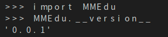
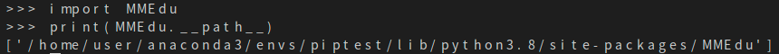

# MMEdu安装和下载

## 1.安装方式介绍

根据对算力的依赖程度，MMEdu分为两个版本，分别是：基础版和完整版。

基础版既可以使用pip方式安装，也可以使用“一键安装包”。本版本集成了MMClassification（图像分类）和MMDetection（物体检测）两个模块，采用CPU训练（不需要GPU环境）。

标准版对算力要求较高，建议装在有英伟达显卡的电脑上，安装方式有pip安装和容器镜像安装两种。本版本集成了MMClassification（图像分类）、MMDetection（物体检测）、MMEditing（图像编辑）等模块，需要GPU环境支持。

## 2.基础版的安装

### 2.1 一键安装包

为方便中小学教学，MMEdu团队提供了一键安装包。只要下载并解压MMEdu的Project文件，即可直接使用。

第一步：下载MMEdu最新版文件，并解压到本地，文件夹目录结构如下图所示。

 

图1 目录结构图

​    1）下载方式一

飞书网盘： https://p6bm2if73b.feishu.cn/drive/folder/fldcnfDtXSQx0PDuUGLWZlnVO3g

​    2）下载方式二

百度网盘：https://pan.baidu.com/s/19lu12-T2GF_PiI3hMbtX-g?pwd=2022 

​       提取码：2022

第二步：运行根目录的“steup.bat”文件，完成环境部署（如下图所示）。


图2 环境部署界面

第三步：您可以根据个人喜好，选择自己习惯的IDE。

1）使用MMEdu自带的Pyzo。

Pyzo是一款好用的Python轻量级IDE。其最突出的两个特点便是是简洁性和交互性。打开根目录下的pyzo.exe文件快捷方式即可打开pyzo，其指向“Tools”中的“pyzo.exe”。使用Pyzo打开“demo”文件夹中的py文件，如“cls_demo.py”，点击“运行”的“将文件作为脚本运行”即可运行代码，界面如下图所示。


图3 Pyzo界面图

2）使用MMEdu自带的Jupyter。

Jupyter Notebook是基于网页的用于交互计算的应用程序。其可被应用于全过程计算：开发、文档编写、运行代码和展示结果。它相对简单，对用户也更加友好，适合初学者。打开根目录下的“run_jupyter.bat”，即自动启动浏览器并显示界面，如下图所示。

图4 jupyter界面图

使用常用工具栏对代码进行操作，如“运行”，可以在单元格中编写文本或者代码（如下图中写了`print("hello")`代码的位置），执行代码的结果也将会在每个单元下方呈现。可以逐个运行单元格，每点击一次，仅运行一个单元格。单元格左侧[*]内的星号变为数字，表示该单元格运行完成。此时可打开“demo”文件夹中的ipynb文件，如“cls_notebook.ipynb”。


图5 jupyter运行界面

3）使用其他IDE。

如果您需要使用其他IDE，那么需要您自己配置Python编译器，配置方法如下。

- 配置环境路径 

①打开您的IDE，如PyCharm、Thonny等。

②配置Python编译器，路径为解压路径下的“MMEdu”文件夹下的“mmedu”文件夹中的“python.exe”文件。 PyCharm环境路径配置如下图所示。


图6 PyCharm的环境路径配置界面

- 执行demo文件 

用IDE打开解压路径下的py文件，如“cls_demo.py”，点击“运行”。运行效果应和pyzo一样。

**在2022年9月后，不再维护MMEdu一键安装包，统一更新为XEdu。XEdu于22年9月在世界人工智能大会正式发布，分MMEdu、BaseML、BaseNN三个功能模块，除了一键安装包，同时实现以pip方式安装。**

### 2.2 pip安装

当前，我们提供的MMEdu0.0.7版本的安装是基础版的pip安装包，可以使用如下命令安装：
`pip install mmedu==0.0.7`或`pip install MMEdu==0.0.7`。

## 3.完整版安装之pip安装

### 3.1.准备工作

强烈推荐你在Anaconda的基础上安装MMEdu，可以避免很多的版本冲突问题。

#### 3.1.1安装Anaconda

若您已经安装好conda，该步骤可跳过。

**下载**

首先打开Anaconda官网：https://www.anaconda.com/

点击`Download`开始下载，下载完成后得到exe文件。

**安装**

双击exe文件即可开始安装（一般下载完成后会自动打开安装界面无需点击exe文件，若没有自动打开安装页面再点击此exe文件）。

打开安装界面后，依次选择`Next` ->`I Agree` -> `All Users` ->`Next`->`Next` ->`Add Anaconda3 to the system PATH environment variable` -> `Install` ->`Next` ->`Next` ->`Finish`

#### 3.1.2安装python编辑器

若您已经安装好合适的python编辑器，该步骤可跳过。

此处以安装Thonny为例，其他编辑器例如Pycharm，VScode等也支持，用户自行配置好Python编译器即可。

**下载**

首先打开Thonny官网：https://thonny.org/

右上角选择合适的操作系统点击下载，此处以windows为例

**安装**

双击exe文件即可开始安装（一般下载完成后会自动打开安装界面无需点击exe文件，若没有自动打开安装页面再点击此exe文件）

打开安装界面后，依次选择`Install for me only` -> `Next` -> `Next` ->  `Next` -> `Next` -> `Next` -> `Install` -> `Finish`

**运行**

在安装好Thonny之后，在第一次运行的时候，会提示选择界面语言和初始设置，选择‘Standard’模式即可。

**配置Thonny的Python解释器**

点击Thonny主界面右下角的Python版本号，可以选择对应的Python解释器，第一次配置点击`Configure inter preter`，弹出的窗口中，第一个下拉栏选择`可选的python3解释器或虚拟环境`， 第二个下拉栏找到自己之前安装的anaconda环境中的python解释器位置。点击确认即可使用该python解释器。

### 3.2安装MMEdu(CPU版本)

#### 3.2.1Linux安装MMEdu

点击鼠标右键，打开终端。

终端中输入pip install MMEdu即可安装。

```powershell
$ pip install MMEdu
```

注：为避免出现版本冲突，建议新建一个conda环境，并在新环境中执行以上命令（注：要求python<3.9）。

```powershell
$ conda create -n your_env_name python=3.8
$ conda activate your_env_name
$ pip install MMEdu
```

注：请将命令中的“your_env_name”换成你喜欢的名称，如“mmedu”。

#### 3.2.2Windows安装MMEdu

同时按下win+r，输入cmd，回车，打开一个命令行窗口。

在命令行中使用pip安装即可。

```powershell
$ pip install MMEdu -f https://download.openmmlab.com/mmcv/dist/cpu/torch1.8.0/index.html
```

注：为避免出现版本冲突，建议新建一个conda环境，并在新环境中执行以上命令（注：要求python<3.9）。

```powershell
$ conda create -n your_env_name python=3.8
$ conda activate your_env_name
$ pip install MMEdu -f https://download.openmmlab.com/mmcv/dist/cpu/torch1.8.0/index.html
```

### 3.3安装MMEdu(GPU版本)

首先安装对应自己cuda版本的pytorch，安装命令可在以下网址中进行查询：https://pytorch.org/get-started/locally/

可以在命令行中使用`nvidia-smi`指令查询自己的cuda版本。

例如，若cuda版本为10.1，想要安装1.8.1版本的pytorch，则安装命令为：

```powershell
$ pip install torch==1.8.1+cu101 torchvision==0.9.1+cu101 torchaudio==0.8.1 -f https://download.pytorch.org/whl/torch_stable.html
```

其次，根据torch版本和cuda版本安装mmcv。

```powershell
$ pip install mmcv-full -f https://download.openmmlab.com/mmcv/dist/{cu_version}/{torch_version}/index.html
```

其中 `{cu_version}` 和 `{torch_version}` 根据自身需求替换成实际的版本号。

例如想安装和 `CUDA 10.1`、`PyTorch 1.8.0` 兼容的 `mmcv-full`，使用如下替换过的命令

```powershell
$ pip install mmcv-full==1.4.5 -f https://download.openmmlab.com/mmcv/dist/cu101/torch1.8.0/index.html
```

最后安装MMEdu的rc版本，例如

```powershell
$ pip install MMEdu==0.1.0rc0
```

即可。

## 4.完整版安装之docker容器镜像。

敬请期待

## 5.查看MMEdu版本

打开python终端，执行以下命令即可查看MMEdu版本。当前最新版本是0.04。



注：目前版本MMEdu仅支持CPU。

## 6.卸载MMEdu库

如果MMEdu库出现异常情况，可以尝试使用如下命令卸载MMEdu然后再使用install命令安装。

```
$ pip uninstall MMEdu
```

## 使用示例

推理：

```python
from MMEdu import MMClassification as cls
img = './img.png'
model = cls(backbone='ResNet18')
checkpoint = './latest.pth'
class_path = './classes.txt'
result = model.inference(image=img\n show=True\n class_path=class_path\ncheckpoint = checkpoint)
model.print_result(result)
```

典型训练：

```python
from MMEdu import MMClassification as cls
model = cls(backbone='ResNet18')
model.num_classes = 3
model.load_dataset(path='./dataset')
model.save_fold = './my_model'
model.train(epochs=10\n validate=True)
```

继续训练：

```python
from MMEdu import MMClassification as cls
model = cls(backbone='ResNet18')
model.num_classes = 3
model.load_dataset(path='./dataset')
model.save_fold = './my_model'
checkpoint = './latest.pth'
model.train(epochs=10\n validate=True\n checkpoint=checkpoint)
```

### 更多示例

> MMEdu库安装目录下有更多示例程序，可以通过如下方法找到.

1. 进入Python终端，然后依次输入如下代码即可查看Python库所在的目录（site-packages）

```
import MMEdu
print(MMEdu.__path__)
```



2. 打开对应路径的文件夹，其中examples文件夹下即为所有内置的示例程序


注意：内置examples文件夹下的案例仅供参考使用，请勿直接改写其中文件。应在用户自己的工作目录下新建文件，并参考examples中的写法。

