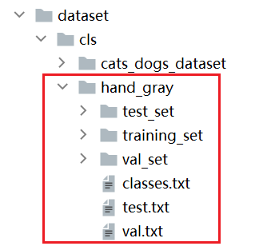
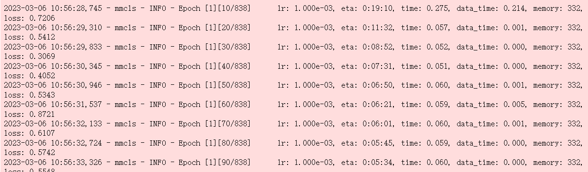
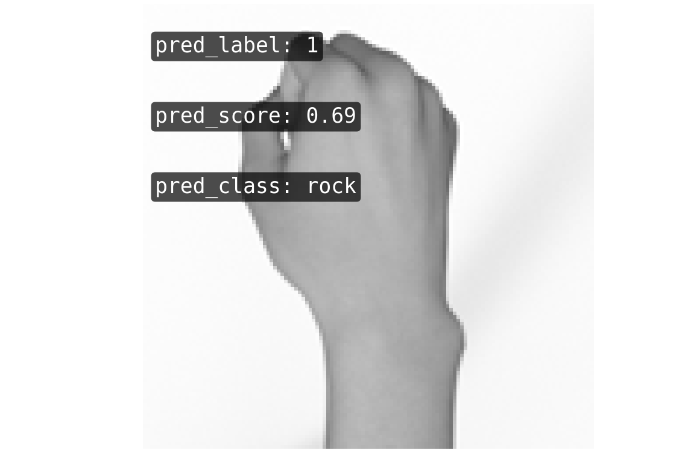

# 解锁图像分类模块：MMClassification

### 初识MMClassification

MMClassifiation（简称cls）的主要功能是对图像进行分类。其支持的SOTA模型有LeNet、MobileNet、ResNet18、ResNet50等，具体介绍详见<a href="https://xedu.readthedocs.io/zh/master/mmedu/mmclassification.html#sota">后文</a>。如需查看所有支持的SOTA模型，可导入模块后使用`cls.sota()`代码进行查看。

文档涉及的部分代码见XEdu帮助文档配套项目集：[https://www.openinnolab.org.cn/pjlab/project?id=64f54348e71e656a521b0cb5&sc=645caab8a8efa334b3f0eb24#public](https://www.openinnolab.org.cn/pjlab/project?id=64f54348e71e656a521b0cb5&sc=645caab8a8efa334b3f0eb24#public)

### 使用说明

XEdu一键安装包中预置了MMEdu的cls模块的示例代码（路径：/demo）、常用小数据集（路径：/dataset/cls）,并且已经预训练了一些权重（路径：/checkpoints/cls_model）。在demo文件夹中，还提供了一张测试图片，OpenInnoLab平台也公开了非常多图像分类任务的项目，体验了几个之后相信会对此模块有一定理解。

下面我们将以“石头剪刀布”手势识别这个任务为例，介绍一下图像分类模块示例代码的用法，在解锁图像分类模块的同时也一起完成一个新的图像分类项目吧！

#### 0. 导入模块

```
from MMEdu import MMClassification as cls
```

#### 1. 模型训练

使用下面的代码即可简单体验MMClassification的训练过程，接下来就开始详细的介绍。

在运行代码之前，我们首先需要拥有一个数据集，这里提供了经典的石头剪刀布分类数据集。

数据集文件结构如下:



**hand_gray**数据集符合MMEdu图像分类模块支持的数据集要求，文件夹中包含三个图片文件夹，`test_set`,`training_set`,`val_set`分别存储测试集，训练集和验证集的图片；还有三个`txt`文件，其中`classes.txt`记录该数据集的类别，`test.txt`和`val.txt`分别记录测试集和验证集的图片名。若想要了解更多数据集格式的内容，可参考<a href="https://xedu.readthedocs.io/zh/master/mmedu/introduction.html#id3">数据集支持</a>部分。

训练代码如下：

```python
model = cls('LeNet') # 实例化模型，不指定参数即使用默认参数。
model.num_classes = 3 # 指定数据集中的类别数量
model.load_dataset(path='../dataset/cls/hand_gray') # 从指定数据集路径中加载数据
model.save_fold = '../checkpoints/cls_model/hand_gray' # 设置模型的保存路径
model.train(epochs=10, validate=True) # 设定训练的epoch次数以及是否进行评估
```

通过注释，我们可以清晰的理解每句代码的功能，模型训练过程可以概括为5步骤，每个步骤分别对应一行代码：

- **实例化模型**

```python
model = cls('LeNet') # 实例化模型，不指定参数即使用默认参数
```

这里对于`MMClassification`模型提供的参数进行解释，`MMClassification`支持传入的参数是`backbone`。也可以写成“backbone='LeNet'”，强化一下，这是一个网络的名称。

`backbone`：指定使用的`MMClassification`模型。可选的有LeNet、MobileNet、ResNet18、ResNet50等，具体介绍详见<a href="https://xedu.readthedocs.io/zh/master/mmedu/mmclassification.html#sota">后文</a>。

- **指定类别数量**

```python
model.num_classes = 3 # 指定数据集中的类别数量
```

- **加载数据集**

```python
model.load_dataset(path='../dataset/cls/hand_gray') # 从指定数据集路径中加载数据
```

这个函数只需要传入一个`path`参数即训练数据集的路径，函数的作用是修改模型中关于数据集路径的配置文件，从而确保我们在训练时不会找错文件。

- **指定模型参数存储位置**

```python
model.save_fold = '../checkpoints/cls_model/hand_gray'
```

- **模型训练**

```python
model.train(epochs=10, validate=True) # 设定训练的epoch次数以及是否进行评估
```

`epochs=10`表示训练10个轮次，`validate=True`表示在训练结束后用验证集（`val_set`）进行评估。

**参数详解**

`train`函数支持很多参数，为了降低难度，MMEdu已经给绝大多数的参数设置了默认值。根据具体的情况修改参数，可能会得到更好的训练效果。下面来详细说明`train`函数的各个参数。

`epochs`：默认参数为`100`，用于指定训练的轮次，而在上述代码中我们设置为`10`。

`batch_size`：批大小，一次训练所选取的样本数，指每次训练在训练集中取batch_size个样本训练。默认参数为`None`，如为`None`则默认为对应网络配置文件中设置的`samples_per_gpu`的值，用于指定一次训练所选取的样本数。当训练集样本非常多时，直接将这些数据输入到神经网络的话会导致计算量非常大，容易因内存不足导致内核挂掉，因此可引入`batch_size`参数的设置。关于`batch_size`的取值范围，应该大于类别数，小于样本数，且由于GPU对2的幂次的`batch`可以发挥更佳的性能，因此设置成16、32、64、128…时往往要比设置为整10、整100的倍数时表现更优。

`validate`：布尔值，只能为`True`或者`False`，默认参数为`True`，在训练结束后，设定是否需要在验证集上进行评估，`True`则是需要进行评估。

`random_seed`：随机种子策略，默认为`0`即不使用，使用随机种子策略会减小模型算法结果的随机性。

`save_fold`：模型的保存路径，参数为`None`，默认保存路径为`./checkpoints/cls_model/`，如果不想模型保存在该目录下，可自己指定路径。

`distributed`：布尔值，表示是否在分布式环境中训练该模型，默认为`False`。

`device`：训练时所使用的设备，默认为`'cpu'`，如果电脑支持GPU，也可以将参数修改为`'cuda'`，使用GPU进行推理。

`optimizer`：进行迭代时的优化器，默认参数为`SGD`，`SGD`会在训练的过程中迭代计算mini-bath的梯度。可选参数：`['SGD','Adam','Adagrad']`

`lr`：学习率，默认参数为`1e-2`即`0.01`，指定模型进行梯度下降时的步长。简单解释就是，学习率过小，训练过程会很缓慢，学习率过大时，模型精度会降低。可以根据需要设置不同的`lr`大小

`checkpoint`：指定使用的模型权重文件，默认参数为`None`，如果没有指定模型权重文件，那么我们将会使用默认的模型权重文件进行推理。

执行上述代码之后的运行结果如下图：



而在`checkpoints\cls_model`文件夹中我们会发现多了两种文件，一个是`***.log.json`文件，它记录了我们模型在训练过程中的一些参数，比如说学习率`lr`，所用时间`time`，以及损失`loss`等；另一个文件是`***.pth`文件，这个是我们在训练过程中所保存的模型。

**准确率怎么看？**

方式一：通过训练输出（如上图），运行训练代码时输出项里会出现学习率lr，所用时间time，以及损失loss，每一轮在验证集上的accuracy_top-**等。

方式二：通过日志文件，在训练过程中我们会发现模型保存路径下（代码中指定指定）出现一个`***.log.json`文件，这就是日志文件，它记录了我们模型在训练过程中的一些信息。

当您启动验证集验证，即设置`validate=True`，表示每轮（每个epoch）训练后，在验证集（val_set）上测试一次准确率。那么每一轮训练结束时会呈现一次准确率，并且会生成best_accuracy_top-*.pth权重文件即最佳准确率权重文件。

accuracy_top-1：对一张图片，如果你的预测结果中概率最大的那个分类正确，则认为正确，再根据分类正确的样本数除以所有的样本数计算得到的准确率。

accuracy_top-5：对一张图片，如果预测概率前五名的答案中出现了正确答案，便认为正确，再根据分类正确的样本数除以所有的样本数计算得到的准确率，在MMClassification中，如果类别数量大于5会启动accuracy_top-5准确率。


**日志文件解读**

`Epoch[1][10/838]`: 1表示当前是第1个epoch，而10/838表示当前正在处理第10个批次，一共有838个批次。在深度学习模型的训练过程中，通常会将训练数据集分成若干个批次，每个批次包含一定数量的样本（每批次样本数和batch_size设置相关），训练时会使用这些批次逐步迭代来更新模型的参数。

`lr`: 学习率。

`eta`: 表示预计完成整个训练所需要的时间。

`time`: 表示本批次训练需要的时间。

`data_time`: 数据预处理的时间。

`memory`: 训练时占据内存或现存的大小。

`loss`: 本批次模型在训练集上计算的损失值。loss是衡量模型在训练集上预测结果与真实结果之间差异的指标。不同类型的模型（如分类、回归、生成等）使用不同的loss函数来优化模型，MMEdu的图像分类模型一般使用交叉熵损失函数。通常情况下，训练过程中的loss会逐渐下降，表示模型在逐步学习优化。


#### 2. 模型推理

训练完模型后，我们就可使用该模型对新图片进行模型推理。当然如果想快速上手体验MMClassification的图像分类，可直接使用我们已经预训练好的模型和权重文件体验图片推理。

示例代码如下:

```python
img = 'testrock01-02.png' # 指定待推理的图片路径
model = cls('LeNet') # 实例化MMClassification模型
model.checkpoint='../checkpoints/cls_model/hand_gray/latest.pth' # 指定使用的模型权重文件
result = model.inference(image=img, show=True, checkpoint=checkpoint) # 在CPU上进行推理
model.print_result() # 输出结果，可以修改参数show的值来决定是否需要显示结果图片，默认显示结果图片
```

运行结果如图：



`标签`: 1， `置信度`: 0.69， `预测结果`: 'rock'

推理结果图片（带标签的图片）会以原来的文件名称保存在代码文件的同级目录下的`cls_result`文件夹下，如果运行代码前没有发现该文件夹，不用担心，系统会自动建立。当然，我们可以自己指定保存文件夹的名称。

此外，我们还可以对一组图片进行**批量推理**，只需将收集的图片放在一个文件夹下，如在`demo`文件夹下新建一个`cls_testIMG`文件夹放图片。批量推理的示例代码如下。

```python
img = 'cls_testIMG/' # 指定进行推理的一组图片的路径
model = cls('LeNet') # 实例化MMClassification模型
model.checkpoint='../checkpoints/cls_model/hand_gray/latest.pth' # 指定使用的模型权重文件
result = model.inference(image=img, show=True, checkpoint=checkpoint) # 在CPU上进行推理
model.print_result(result) # 输出结果，可以修改参数show的值来决定是否需要显示结果图片，默认显示结果图片
```

运行上述代码之后，`‘cls_result’`文件夹里就会出现这组图片的推理结果图，推理图片名称和原图片同名。

模型推理的过程也可以概括为6步骤，每个步骤分别对应一行代码：
- **图片准备**

```python
img = 'testrock01-02.png' # 指定推理图片的路径，直接在代码所在的demo文件夹中选择图片
```

如果使用自己的图片的话，只需要修改img的路径即可（绝对路径和相对路径均可）

- **实例化模型**

```python
model = cls('LeNet') # 实例化MMClassification模型
```

这里对于`MMClassification`模型提供的参数进行解释，`MMClassification`支持传入的参数是`backbone`。

`backbone`：指定使用的`MMClassification`模型，默认参数是`'LeNet'`，当然读者可以自行修改该参数以使用不同模型。

- **指定模型权重文件**

```python
model.checkpoint='../checkpoints/cls_model/hand_gray/latest.pth' # 指定使用的模型权重文件
```
此时指定的模型权重文件首先需存在，并且需和实例化模型对应，训练时实例化的网络是什么，推理时也需实例化同一个网络。如果没有指定模型权重文件，那么这两句代码可以不修改，即使用默认的模型。

- **模型推理**

```python
model.inference(image=img, show=True, checkpoint=checkpoint) # 在cpu上进行推理
```

将所需要推理图片的路径传入`inference`函数中即可进行推理，我们这里传入了四个参数，`image`代表的就是推理图片的路径，`show`代表是否需要显示结果图片，`class_path`代表训练集的路径，`checkpoint`代表指定使用的模型权重文件。
- **图片准备**

```python
img = 'testrock01-02.png' # 指定推理图片的路径，直接在代码所在的demo文件夹中选择图片
```

**参数详解**

在MMClassification中对于`inference`函数还有其他的传入参数，在这里进行说明：

`device`：推理所用的设备，默认为`'cpu'`，如果电脑支持GPU，也可以将参数修改为`'cuda'`，使用GPU进行推理。

`checkpoint`：指定使用的模型权重文件，默认参数为`None`，如果没有指定模型权重文件，那么我们将会使用默认的模型权重文件进行推理。

`image`：推理图片的路径。

`show`：布尔值，默认为`True`，表示推理后是否显示推理结果

`save_fold`：保存的图片名，数据结构为字符串，默认参数为`'cls_result'`，用户也可以定义为自己想要的名字。

- **快速推理**

针对部分用户希望加快推理速度的需求，设计了`fast_inference`函数，主要方法是使用`load_checkpoint`提前加载权重文件。

```
model.load_checkpoint(checkpoint=checkpoint)
result = model.fast_inference(image=img)
```

**参数详解**

`load_checkpoint`函数的传入参数：

`device`：推理所用的设备，默认为`'cpu'`，如果电脑支持GPU，也可以将参数修改为`'cuda'`，使用GPU进行推理。

`checkpoint`：指定使用的模型权重文件，默认参数为`None`，如果没有指定模型权重文件，那么我们将会使用默认的模型权重文件进行推理。

`fast_inference`函数的传入参数：

`image`：推理图片的路径。

`show`：布尔值，默认为`True`，表示推理后是否显示推理结果。

`save_fold`：保存的图片名，数据结构为字符串，默认参数为`'cls_result'`，用户也可以定义为自己想要的名字。


#### 3. 继续训练

在这一步中，我们将学习如何加载之前训练过的模型接着训练。如果觉得之前训练的模型epoch数不够的话或者因为一些客观原因而不得不提前结束训练，相信下面的代码会帮到您。

```python
model = cls('LeNet') # 初始化实例模型
model.num_classes = 3 # 指定数据集中的类别数量
model.load_dataset(path='../dataset/cls/hand_gray') # 配置数据集路径
model.save_fold = '../checkpoints/cls_model/hand_gray' # 设置模型的保存路径
checkpoint = '../checkpoints/cls_model/hand_gray/latest.pth' # 指定使用的模型权重文件
model.train(epochs=50, validate=True, checkpoint=checkpoint) # 进行再训练
```

这里我们有一个参数在之前的<a href="https://xedu.readthedocs.io/zh/master/mmedu/mmclassification.html#id3">训练模型</a>过程中没有详细说明，那就是`train`函数中的`checkpoint`参数，这个放到这里就比较好理解，它的意思是指定需要进行再训练的模型路径，当然您也可以根据你需要训练的不同模型而调整参数。

我们还可以指定网上下载的某个预训练模型。通过借助在大型数据集上训练的预训练模型，来对新的任务进行训练，而无需从头开始训练。它可以将一个大型数据集中的知识和技能转移到另一个任务上，从而大大节省训练时间。 

全新开始训练一个模型一般要花较长时间，所以我们强烈建议在预训练模型的基础上继续训练，哪怕你要分类的数据集和预训练的数据集并不一样，基于预训练模型继续训练可起到加速训练的作用。在学习资源下载处也提供了一些[预训练模型和权重文件下载](https://xedu.readthedocs.io/zh/master/how_to_use/support_resources/resources.html#id3)。

#### 4. 支持的SOTA模型

目前MMClassifiation支持的SOTA模型有LeNet、MobileNet、ResNet18、ResNet50等，如需查看所有支持的SOTA模型，可导入模块后使用`cls.sota()`代码进行查看。这些模型的作用和适用场景简介如下。

- **LeNet**

适用于灰度图像识别。

- **MobileNet**

适用于绝大多数的图像识别，支持1000个分类。

- **ResNet**

广泛应用于分类、分割、检测等问题，结构简单，效果拔群。

各个SOTA模型的比较：

LeNet是一种简单的深度卷积神经网络，他的特色就是参数量少、计算小，训练模型很快，确定层数少，不能充分学习数据的特征，LeNet比较适合图像比较简单的图像分类，通常像素值超过224的图片或者彩色图片分类建议选择MobileNet和ResNet。点击下方SOTA模型介绍链接可以学习更多模型知识。

<table class="docutils align-default">
    <thead>
        <tr class="row-odd">
            <th class="head">序号</th>
            <th class="head">SOTA模型介绍</th>
        </tr>
    </thead>
    <tbody>
        <tr class="row-even">
            <td>1</td>
            <td><a href="https://xedu.readthedocs.io/zh/master/how_to_use/dl_library/net/lenet5.html">LeNet</a></td>
        </tr>
    </tbody>
    <tbody>
        <tr class="row-even">
            <td>2</td>
            <td><a href="https://xedu.readthedocs.io/zh/master/how_to_use/dl_library/net/mobilenet.html">MobileNet</a></td>
        </tr>
    </tbody>
    <tbody>
        <tr class="row-even">
            <td>3</td>
            <td><a href="https://xedu.readthedocs.io/zh/master/how_to_use/dl_library/net/ResNet.html">ResNet</a></td>
        </tr>
    </tbody>
    <tbody>
        <tr class="row-even">
            <td>4</td>
            <td><a href="https://xedu.readthedocs.io/zh/master/how_to_use/dl_library/network_introduction.html">更多</a></td>
        </tr>
    </tbody>
</table>


### MMCls的高级操作
#### 验证top-k的修改
由于源码限制，类别数量超过5类之后，默认的验证方式变为了top-5的准确率(accuracy_top-5)，无法看到top1的准确率。如下图所示：


为此，我们可以修改源码，将其改为'topk': (1,)，这样就可以看到top1的准确率，也可以改为其他数字，同时也支持(1,2,5)这样的写法。然后将修改之后的源码覆盖原始源码后重新导入库文件。

1. 查看库文件所在路径
    ```python
    import MMEdu
    print(MMEdu.__path__)
    ```
2. 覆盖原来的库文件
   ```bash
    !cp ./Classification_Edu.py /usr/local/envs/ssenv/lib/python3.9/site-packages/MMEdu/Classification/Classification_Edu.py
   ```
3. 重新导入库（重启内核）
