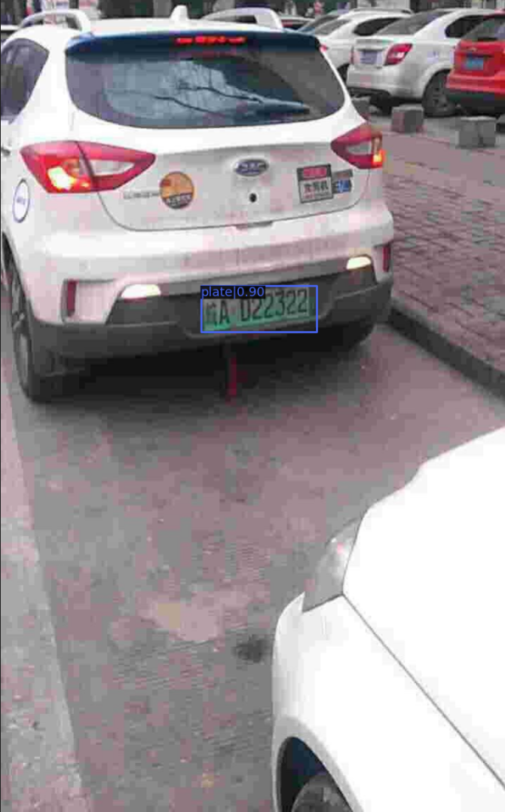
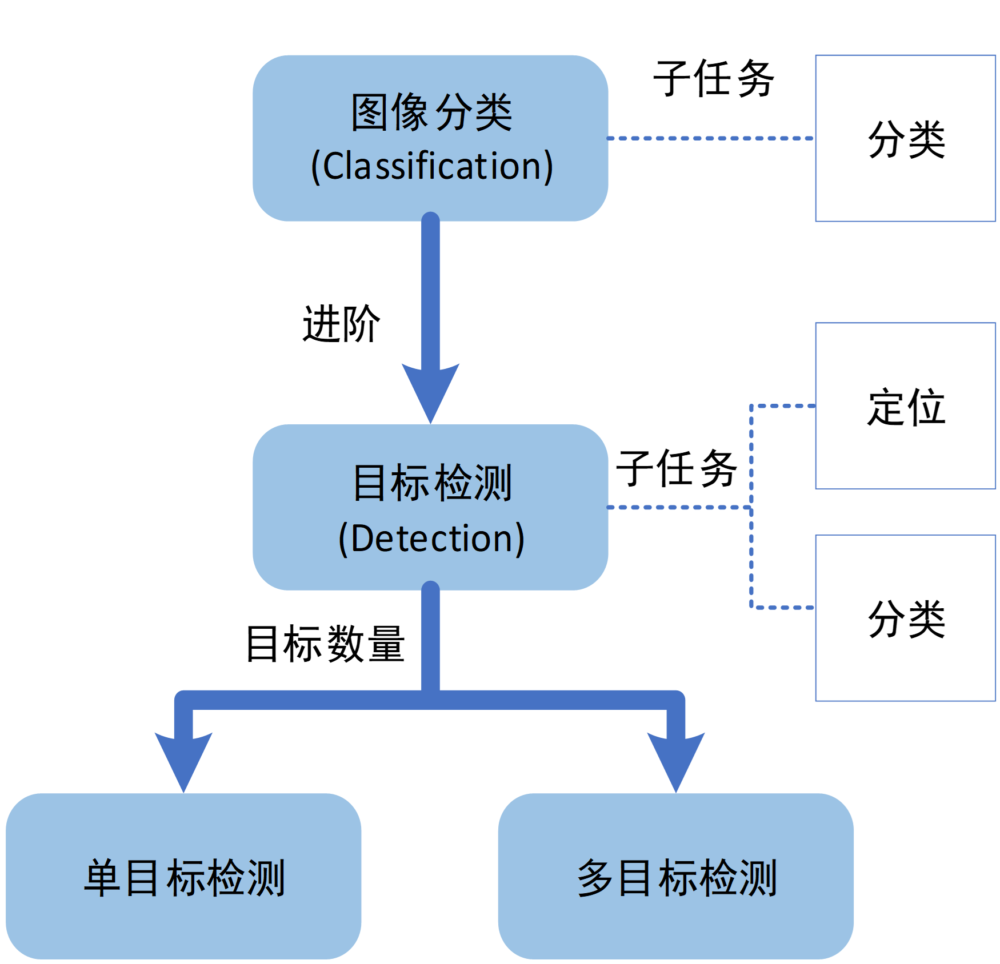
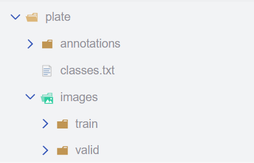
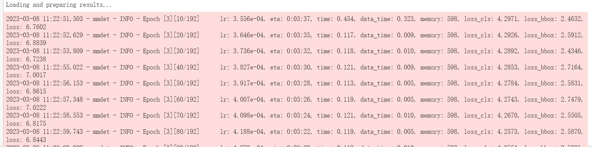
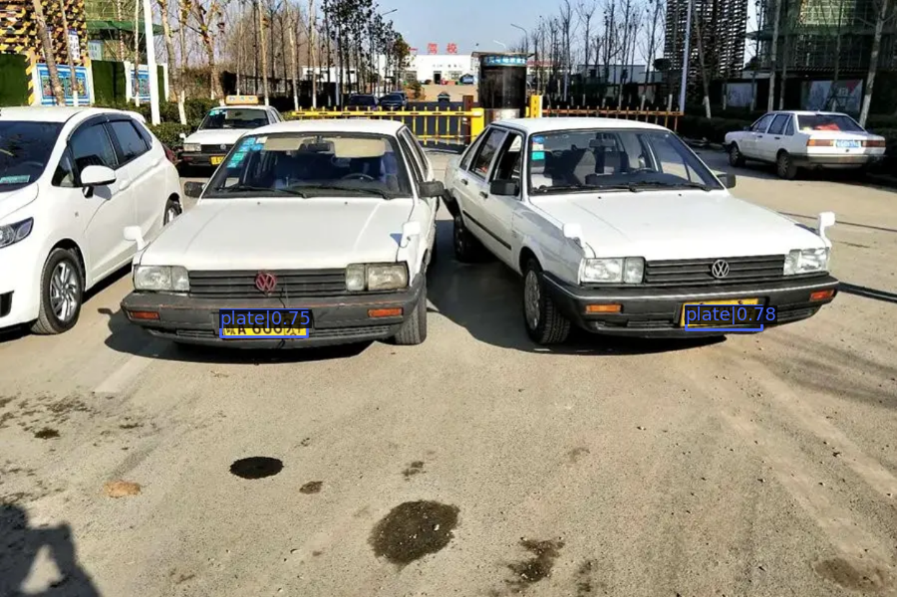
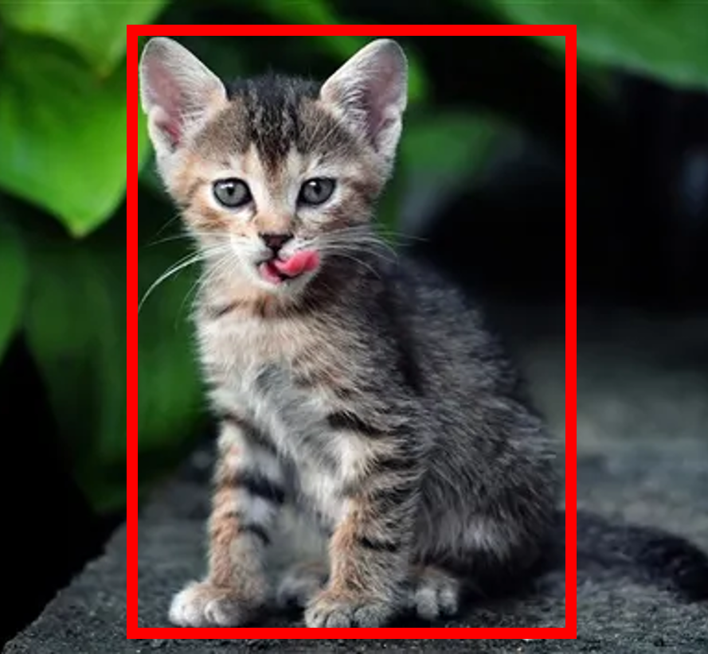
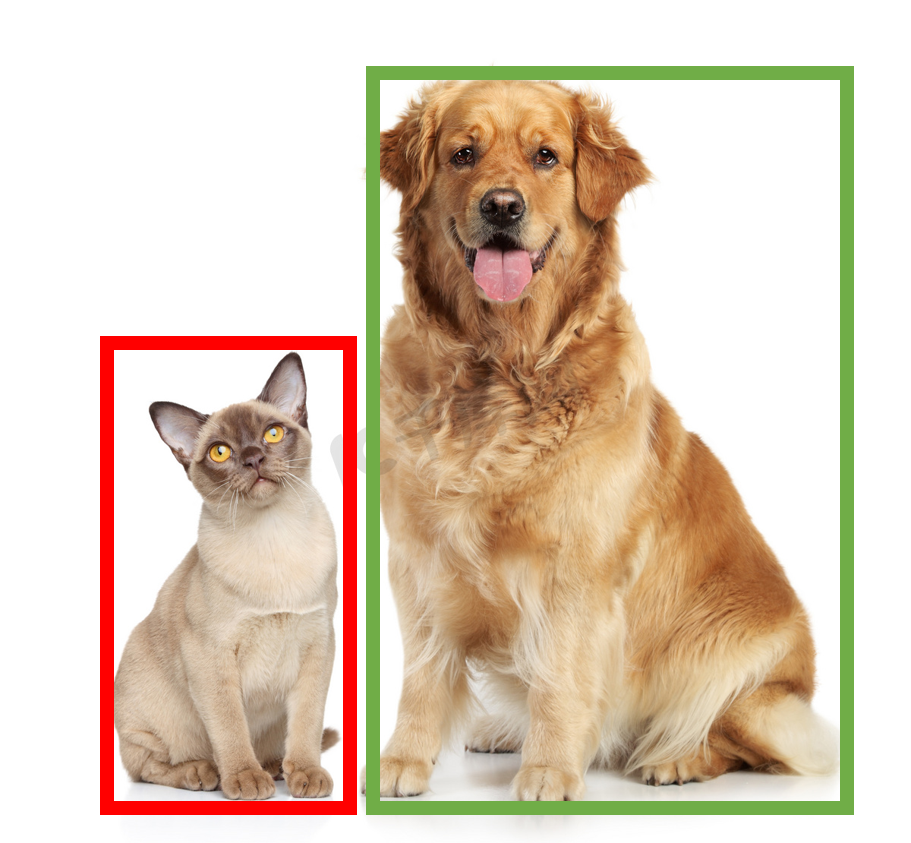

# 揭秘目标检测模块：MMDetection

### 初识目标检测和MMDetection

相信你已经体验并完成了一些图像分类任务，但是图像分类任务在真实的场景中应用中，像只出现一只猫的图片情况较少，如果一张图片里有两只猫，图像分类的模型可能可以识别出是猫。但是如果是这张图又有猫又有狗，那图像分类模型就肯定识别不出来了。为了解决这一种问题，就出现了目标检测算法。对于图像分类任务来讲，AI仅需正确识别图片的类别即可。

对于图像分类任务来讲，目标检测(Detection)任务有两个主要的子任务：*定位和分类*。定位任务是什么呢？ 定位是找到图像主体或者某个物体的位置，然后用一个框将其框起来。这个框可以是矩形的，也可以是多边形或者圆形的，通常用得最多的是矩形（如下图）。



总的来说，目标检测任务是图像分类任务的进阶任务，图像分类任务只有一个子任务：分类，目标检测任务有两个任务：定位和分类，按照**图像中目标的数量**可分为单目标检测和多目标检测。目标检测任务比起分类任务多出来了一个将目标框起来的步骤。




那么MMEdu的目标检测模块MMDetection（简称det）的主要功能便是输出图片或视频中出现的多个对象名称，同时用方框框出对象所在方形区域。

其支持的SOTA模型有FasterRCNN、Yolov3、SSD_Lite等，具体介绍详见<a href="https://xedu.readthedocs.io/zh/master/mmedu/mmdetection.html#sota">后文</a>。如需查看所有支持的SOTA模型，可使用`model.sota()`代码进行查看。

### 使用说明

XEdu一键安装包中预置了MMEdu的det模块的示例代码（路径：/demo）、常用小数据集（路径：/dataset/det）,并且已经预训练了一些权重（路径：/checkpoints/det_model）。在demo文件夹中，还提供了一张测试图片，OpenInnoLab平台也公开了非常多目标检测任务的项目，体验了几个之后相信会对此模块有一定理解。

下面我们将以车牌检测这个任务为例，介绍一下目标检测模块示例代码的用法，一起解锁第一个目标检测项目吧！

#### 1.模型训练

使用下面的代码即可简单体验MMDetection的训练过程，我们以车牌的识别为例，为您进行详细的介绍。


在运行代码之前，您需要先拥有一个数据集，这里我们为您提供车牌检测数据集。

数据集文件结构如下：



车牌数据集符合MMEdu目标检测模块支持的数据集要求，文件夹中包含两个文件夹`annotations`和`images`，分别存储标注信息以及图片数据，每个文件夹下面有`train`和`valid`两个`json`文件。如您想要了解更多数据集格式的内容，可参考<a href="https://xedu.readthedocs.io/zh/master/mmedu/introduction.html#coco">数据集支持</a>部分。

训练代码如下：

~~~python
model = det(backbone='FasterRCNN') # 实例化模型，不指定参数即使用默认参数
model.num_classes = 1 # 进行车牌识别，此时只有一个类别。
model.load_dataset(path='../dataset/det/coco') # 从指定数据集路径中加载数据
model.save_fold = '../checkpoints/det_model/plate' # 设置模型的保存路径
model.train(epochs=3, validate=True) # 设定训练的epoch次数以及是否进行评估
~~~


接下来对为您讲述训练代码规则：

实例化模型的代码在前面说过就不再赘述。

- **指定类别数量**

~~~python
model.num_classes = 1 # 进行车牌识别，此时只有一个类别
~~~

- **加载数据集**

~~~python
model.load_dataset(path='../dataset/det/coco') # 从指定数据集路径中加载数据
~~~

这个函数只需要传入一个`path`参数即训练数据集的路径，函数的作用是修改模型中关于数据集路径的配置文件，从而确保我们在训练时不会找错文件。

- **指定模型参数存储位置**

~~~python
model.save_fold = '../checkpoints/det_model/plate'
~~~


- **模型训练**

~~~python
model.train(epochs=10, validate=True) # 设定训练的epoch次数以及是否进行评估
~~~

表示训练10个轮次，并在训练结束后用检验集进行评估。

**参数详解**

`train`函数支持很多参数，为了降低难度，MMEdu已经给绝大多数的参数设置了默认值。根据具体的情况修改参数，可能会得到更好的训练效果。下面来详细说明`train`函数的各个参数。

`random_seed`：随机种子策略，默认为`0`即不使用，使用随机种子策略会减小模型算法结果的随机性。

`save_fold`：模型的保存路径，默认参数为`./checkpoints/det_model/`，如果不想模型保存在该目录下，可自己指定路径。

`distributed`：布尔值，只能为`True`或者`False`，默认参数为`False`，设为`True`时即使用分布式训练。

`epochs`：默认参数为`100`，用于指定训练的轮次，而在上述代码中我们设置为`10`。

`batch_size`：批大小，一次训练所选取的样本数，指每次训练在训练集中取batch_size个样本训练。默认参数为`None`，如为`None`则默认为对应网络配置文件中设置的`samples_per_gpu`的值，用于指定一次训练所选取的样本数。当训练集样本非常多时，直接将这些数据输入到神经网络的话会导致计算量非常大，容易因内存不足导致内核挂掉，因此可引入`batch_size`参数的设置。关于`batch_size`的取值范围，应该大于类别数，小于样本数，且由于GPU对2的幂次的`batch`可以发挥更佳的性能，因此设置成16、32、64、128…时往往要比设置为整10、整100的倍数时表现更优。

`validate`：布尔值，只能为`True`或者`False`，默认参数为`True`，在训练结束后，设定是否需要在校验集上进行评估，`True`则是需要进行评估。

`metric`：验证指标，默认参数为`'bbox'`，在进行模型评估时会计算预测的检测框和实际检测框相交的多少，数值越高说明模型性能越好，我们在运行完程序之后也会看到这个结果。

`save_best`：验证指标，默认参数为`'bbox_mAP'`，在进行模型评估时会计算分类准确率，数值越高说明模型性能越好，运行完程序之后会将这个结果保存。

`optimizer`：进行迭代时的优化器，默认参数为`SGD`，`SGD`会在训练的过程中迭代计算mini-bath的梯度。

`lr`：学习率，默认参数为`1e-3`即`0.001`，指定模型进行梯度下降时的步长。简单解释就是，学习率过小，训练过程会很缓慢，学习率过大时，模型精度会降低。

`weight_decay`：权值衰减参数，用来调节模型复杂度对损失函数的影响，防止过拟合，默认值为`1e-3`即`0.001`。

`checkpoint`: 默认为'None'，表示在训练过程中使用初始化权重。如果使用训练得到的模型（或预训练模型），此参数传入一个模型路径，我们的训练将基于传入的模型参数继续训练。

执行上述代码之后的运行结果如下图:



此时，打开model.save_fold指定的checkpoints/det_model/plate文件夹，我们会发现多了两种文件，一种是`**.log.json`日志文件，它记录了我们模型在训练过程中的一些参数，比如说学习率`lr`，所用时间`time`，损失`loss`，以及评估指标`bbox_mAP`等；另一种文件是`.pth`文件，这个是我们在训练过程中所保存的模型权重文件，分为按照训练轮次生成的权重文件`epoch_x.pth`和一个`best_bbox_mAP_epoch_**.pth`权重文件，`best_bbox_mAP_epoch_**.pth`权重文件即目前为止准确率最高的权重。

**日志解读：**

`Epoch[1][10/838]`: 1表示当前是第1个epoch，而10/838表示当前正在处理第10个批次，一共有838个批次。在深度学习模型的训练过程中，通常会将训练数据集分成若干个批次，每个批次包含一定数量的样本，训练时会使用这些批次逐步迭代来更新模型的参数。

`eta`: 表示预计完成整个训练所需要的时间。

`time`: 表示本批次训练需要的时间。

`data_time`: 数据预处理的时间。

`memory`: 训练时占据内存或现存的大小。

`loss_bbox`：评估模型预测边界框的精度的指标，通常`loss_bbox`越小表示预测出的边框和标注的越接近。

`loss_cls`：衡量目标检测任务中分类性能的损失函数，一般用于衡量模型预测的类别与真实类别之间的差距。先对每个预测的边界框分别预测一个类别，然后使用 `loss_cls` 计算每个框内分类预测的损失，通常l`oss_cls` 越小，每个框内的分类结果越准确。

`bbox_mAP`：对目标检测任务，`bbox_mAP`可用来衡量检测准确度，指模型预测的边界框和真实边界框之间的重合度。

`loss`: 本批次模型在训练集上计算的损失值。loss是衡量模型在训练集上预测结果与真实结果之间差异的指标。


#### 2.模型推理

当完成模型训练，可使用训练好的模型对新图片进行模型推理。当然如果想快速上手体验MMDetection的目标检测，可直接使用我们已经预训练好的模型和权重文件进行推理，提供一张图片测试推理的准确度。


示例代码如下:

```python
from MMEdu import MMDetection as det # 导入mmdet模块
img = 'car_plate.png' # 指定进行推理的图片路径，我们使用demo文件夹中提供的图片
model = det(backbone="FasterRCNN") # 实例化MMDetection模型
checkpoint = '../checkpoints/det_model/plate/latest.pth' # 指定使用的模型权重文件
result = model.inference(image=img, show=True, checkpoint_path = checkpoint) # 在CPU上进行推理
model.print_result() # 输出结果
# 同时您可以修改show的值来决定是否需要显示结果图片，此处默认显示结果图片
```

运行结果如图：



推理结果图片（带标签的图片）会以原本的文件名称保存在代码文件的同级目录下的`det_result`文件夹下，如果运行前没有发现该文件夹，不用担心，系统会自动建立。当然，您可以自己指定保存文件夹的名称。

您也可以将收集的图片放在一个文件夹下，然后指定文件夹路径进行一组图片的**批量推理**。如在demo文件夹下新建一个det_testIMG文件夹放图片，批量推理的示例代码如下。

~~~python
img = 'det_testIMG/' # 指定进行推理的一组图片的路径
model = det(backbone="FasterRCNN") # 实例化MMDetection模型
checkpoint = '../checkpoints/det_model/plate/latest.pth' # 指定使用的模型权重文件
result = model.inference(image=img, show=True, checkpoint_path = checkpoint) # 在CPU上进行推理
model.print_result() # 输出结果
# 同时您可以修改show的值来决定是否需要显示结果图片，此处默认显示结果图片
~~~

您会发现当前目录下`‘det_result’`文件夹里出现了这组图片的推理结果图，每张图片的结果与您收集的图片同名，您可以到这个文件夹下查看推理结果。

接下来对为您讲述推理代码规则：

- **图片准备**

```python
img = 'car_plate.png' # 指定推理图片的路径，直接在代码所在的demo文件夹中选择图片
```

如果使用自己的图片的话，只需要修改img的路径即可（绝对路径和相对路径均可）。

- **实例化模型**

```python
model = det(backbone='FasterRCNN') # 实例化MMDetection模型
```

这里对于`MMDetection`模型提供的参数进行解释，`MMDetection`支持传入的参数是`backbone`。

`backbone`：指定使用的`MMDetection`模型，默认使用 `'FasterRCNN'`，当然读者可以自行修改该参数以使用不同模型。

- **模型推理**

```python
model.inference(image=img, show=True, checkpoint_path = checkpoint) # 在CPU上进行推理
```

将所需要推理图片的路径传入`inference`函数中即可进行推理，我们这里传入了四个参数，`image`代表的就是推理图片的路径，`show`代表是否需要显示结果图片，`checkpoint`代表指定使用的模型权重文件。

**参数详解**

在Detection_Edu中对于`inference`函数还有其他的传入参数，在这里进行说明：

`device`：推理所用的设备，默认为`'cpu'`，如果电脑支持GPU，也可以将参数修改为`'cuda:0'`，使用GPU进行推理。

`checkpoint`：指定使用的模型权重文件，默认参数为`None`，如果没有指定模型权重文件，那么我们将会使用默认的模型权重文件进行推理。 

`image`：推理图片的路径。

`show`：布尔值，默认为`True`，表示推理后是否显示推理结果。

`rpn_threshold` & `rcnn_threshold`: 0～1之间的数值。由于FasterRCNN为一个两阶段的检测模型，这两个参数分别表示两个阶段对于检测框的保留程度，高于这个数值的框将会被保留（这里如果同学们设置过低，也可能会发现图中出现了多个框）。

`save_fold`：保存的图片名，数据结构为字符串，默认参数为`'det_result'`，用户也可以定义为自己想要的名字。

（最后两个参数的使用，我们将在下一部分进行详细举例解释）。

- **快速推理**

针对部分用户希望加快推理速度的需求，设计了`fast_inference`函数，主要方法是使用`load_checkpoint`提前加载权重文件。

```
model.load_checkpoint(checkpoint=checkpoint)
result = model.fast_inference(image=img)
```

**参数详解**

`load_checkpoint`函数的传入参数：

`device`：推理所用的设备，默认为`'cpu'`，如果电脑支持GPU，也可以将参数修改为`'cuda'`，使用GPU进行推理。

`checkpoint`：指定使用的模型权重文件，默认参数为`None`，如果没有指定模型权重文件，那么我们将会使用默认的模型权重文件进行推理。

`fast_inference`函数的传入参数：

`image`：推理图片的路径。

`show`：布尔值，默认为`True`，表示推理后是否显示推理结果。

`save_fold`：保存的图片名，数据结构为字符串，默认参数为`'det_result'`，用户也可以定义为自己想要的名字。


#### 3.继续训练

在这一步中，我们会教您加载之前训练过的模型接着训练，如果您觉得之前训练的模型epoch数不够的话或者因为一些客观原因而不得不提前结束训练，相信下面的代码会帮到您。

~~~python
model = det(backbone='FasterRCNN') # 初始化实例模型
model.num_classes = 1  # 进行车牌识别，此时只有一个类别。
model.load_dataset(path='../dataset/det/coco') # 配置数据集路径
model.save_fold = '../checkpoints/det_model/plate' # 设置模型的保存路径
checkpoint='../checkpoints/det_model/plate/latest.pth' # 指定使用的模型权重文件
model.train(epochs=3, validate=True, checkpoint=checkpoint) # 进行再训练
~~~

这里我们有一个参数在之前的<a href="https://xedu.readthedocs.io/zh/master/mmedu/mmdetection.html#id3">训练模型</a>过程中没有提及，那就是`train`函数中的`checkpoint`参数，这个放到这里就比较好理解，它的意思是指定需要进行再训练的模型路径，当然你也可以根据你需要训练的不同模型而调整参数。同时您也可以指定网上下载的某个预训练模型。借助在大型数据集上训练的预训练模型可以根据一系列任务的历史数据来对新的任务进行训练，而无需从头开始训练。它可以将一个大型数据集中的知识和技能转移到另一个任务上，从而大大节省训练时间。 

全新开始训练一个模型，一般要花较长时间。我们强烈建议在预训练模型的基础上继续训练，哪怕你要分类的数据集和预训练的数据集并不一样。基于预训练模型继续训练可起到加速训练的作用，通常会使得模型达到更好的效果。在学习资源下载处也提供了一些<a href="https://xedu.readthedocs.io/zh/master/support_resources/resources.html#id3">预训练模型和权重文件下载</a>途径。

#### 4.支持的SOTA模型

目前MMDetection支持的SOTA模型有SSD_Lite、FaterRCNN、Yolov3等，如需查看所有支持的SOTA模型，可使用`model.sota()`代码进行查看。这些模型的作用和适用场景简介如下。

- **SSD_Lite**

相比Faster RCNN有明显的速度优势，相比YOLO又有明显的mAP优势。

- **FasterRCNN**

采用双阶检测方法，可以解决多尺度、小目标问题，通用性强。

- **Yolov3**

只进行一次检测，速度较快，适用于稍微大的目标检测问题。

<table class="docutils align-default">
    <thead>
        <tr class="row-odd">
            <th class="head">序号</th>
            <th class="head">SOTA模型介绍</th>
        </tr>
    </thead>
    <tbody>
        <tr class="row-even">
            <td>1</td>
            <td><a href="https://xedu.readthedocs.io/zh/master/dl_library/net/SSD_Lite.html">SSD_Lite</a></td>
        </tr>
    </tbody>
    <tbody>
        <tr class="row-even">
            <td>2</td>
            <td><a href="https://xedu.readthedocs.io/zh/master/dl_library/net/FasterRCNN.html">	FasterRCNN</a></td>
        </tr>
    </tbody>
    <tbody>
        <tr class="row-even">
            <td>3</td>
            <td><a href="https://xedu.readthedocs.io/zh/master/dl_library/net/Yolov3.html">Yolov3</a></td>
        </tr>
    </tbody>
    <tbody>
        <tr class="row-even">
            <td>4</td>
            <td><a href="https://xedu.readthedocs.io/zh/master/dl_library/network_introduction.html">更多</a></td>
        </tr>
    </tbody>
</table>


#### 补充内容：再了解一下单目标检测和多目标检测

根据图像中目标的数量，目标检测分为单目标检测和多目标检测，单目标检测顾名思义，就是识别图像中的单独的一个目标。如下图，就用红框框出了一只猫。



多目标检测就像下面这张图，识别图中的多个目标，在下图中分别用红色的框框出来了猫和绿色的框框出来了狗。多目标检测通常比单目标检测更难，因为它需要同时处理多个目标。但是，多目标检测在很多场景中都是必要的。



**小问题：单目标检测一定是只有一个类别吗？多目标检测一定是多个类别吗？**

单目标检测和多目标检测的主要区别是图像中目标的数量，而与类别数量是无关的。