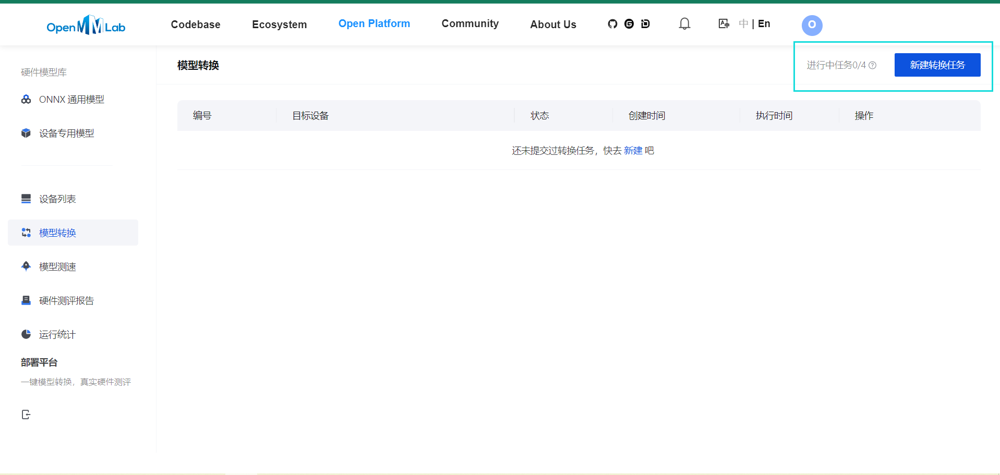
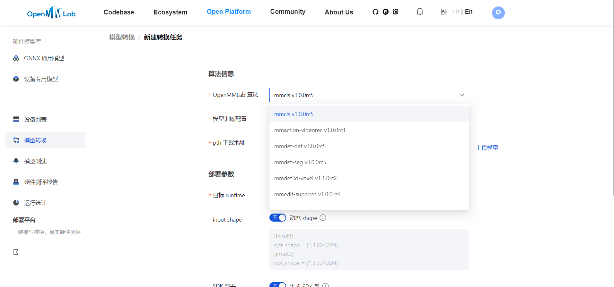
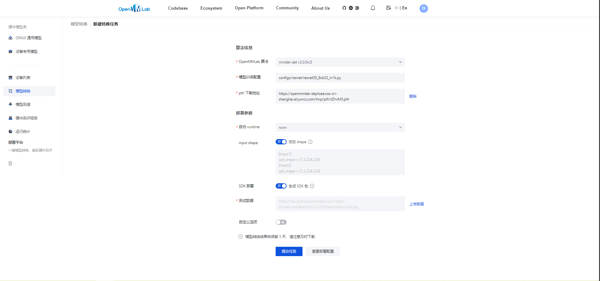
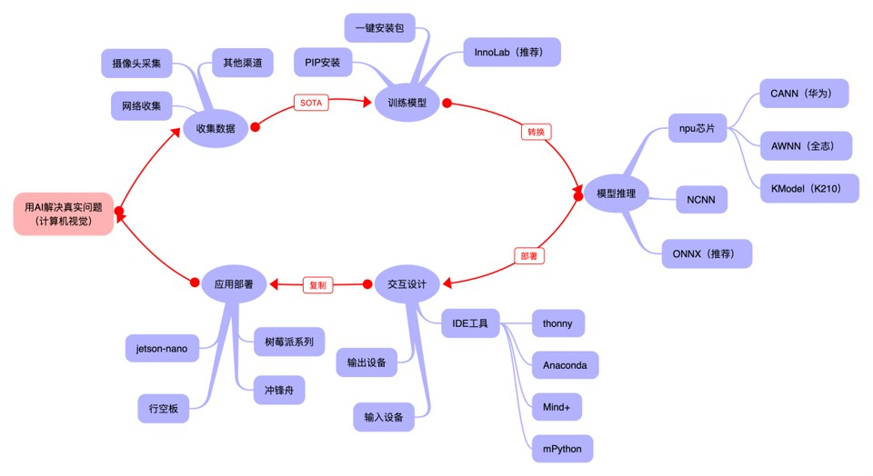

# 最后一步：模型转换


训练好了模型该如何快速应用呢？在别的设备安装MMEdu似乎很麻烦。得益于`OpenMMLab`系列工具的不断进步与发展。MMEdu通过集成OpenMMLab开源的`模型部署工具箱MMDeploy`和`模型压缩工具包MMRazor`，打通了从算法模型到应用程序这 “最后一公里”！ 

我们也希望通过本系列教程，带领大家学会如何把自己使用`MMEdu`训练的计算机视觉任务`SOTA模型`部署到`ONNXRuntime`、`NCNN`等各个推理引擎上。

## 借助MMEdu完成模型转换
MMEdu内置了一个`convert`函数，来实现了一键式模型转换，转换前先了解一下转换要做的事情吧。

- 转换准备：

  待转换的模型权重文件（用MMEdu训练）。

- 需要配置两个信息：

  待转换的模型权重文件（`checkpoint`）和输出的文件（`out_file`）。

- 模型转换的典型代码：

```python
from MMEdu import MMClassification as cls
model = cls(backbone='MobileNet')
checkpoint = 'checkpoints/cls_model/CatsDog/best_accuracy_top-1_epoch_2.pth'
out_file="catdog.onnx"
model.convert(checkpoint=checkpoint, out_file=out_file)
```

`model.convert`函数中有四个参数可以设置：

- `checkpoint`(string) - 必需参数，选择想要进行模型转换的权重文件，以.pth为后缀。
- `out_file`(string) - 必需参数，指定模型转换后的输出文件路径。
- `opset_version`(int) - 可选参数，设置模型算子集的版本，默认为11。
- `ir_version`(int) - 可选参数，设置模型转化中间表示的版本。指定中间表示（Intermediate Representation, 简称 IR）规范的版本，一个整数（int）类型的参数。在计算机编程中，中间表示是一种数据结构或代码，它介于原始代码和机器码之间。它通常用于编译器或类似工具中，作为转换和优化代码的一个步骤。指定中间表示的版本，可方便根据不同的需求和优化目标选择最合适的 IR 规范。当前可选范围为1～12，默认为6。

在Netron（https://netron.app/）中查看模型版本，当`opset_version`设置为10和11的时候，`imports`处显示的信息是不同的。


类似的，目标检测模型转换的示例代码如下：

```python
from MMEdu import MMDetection as det
model = det(backbone='SSD_Lite')
checkpoint = 'checkpoints/COCO-80/ssdlite.pth'
out_file="COCO-80.onnx"
model.convert(checkpoint=checkpoint, out_file=out_file)
```

参考项目：<a href="https://www.openinnolab.org.cn/pjlab/project?id=645110943c0e930cb55e859b&sc=62f34141bf4f550f3e926e0e#public">MMEdu模型转换
</a>

## 全流程体验

现在，让我们从“<a href="https://www.openinnolab.org.cn/pjlab/project?id=63c756ad2cf359369451a617&sc=635638d69ed68060c638f979#public">从零开始训练猫狗识别模型并完成模型转换</a>”项目入手，见识一下使用MMEdu工具完成从模型训练到模型部署的基本流程吧！

**1.准备数据集**

思考自己想要解决的分类问题后，首先要收集数据并整理好数据集。例如想要解决猫狗识别问题，则需准备猫狗数据集。

**2.模型训练**

训练一个全新的模型，一般要花较长时间。因此我们强烈建议在预训练模型的基础上继续训练，哪怕你要分类的数据集和预训练的数据集并不一样。

如下代码是使用基于MobileNet网络训练的猫狗识别预训练模型，模型训练是在预训练模型基础上继续训练。基于预训练模型继续训练可起到加速训练的作用，并且通常会使得模型达到更好的效果。

```python
from MMEdu import MMClassification as cls
model = cls(backbone='MobileNet')
model.load_dataset(path='/data/TC4V0D/CatsDogsSample') 
model.save_fold = 'checkpoints/cls_model/CatsDog1' 
model.train(epochs=5, checkpoint='checkpoints/pretrain_model/mobilenet_v2.pth' ,batch_size=4, lr=0.001, validate=True,device='cuda')
```

**3.推理测试**

使用MMEdu图像分类模块模型推理的示例代码完成模型推理。返回的数据类型是一个字典列表（很多个字典组成的列表）类型的变量，内置的字典表示分类的结果，如“`{'标签': 0, '置信度': 0.9417100548744202, '预测结果': 'cat'}`”，我们可以用字典访问其中的元素。巧用预测结果设置一些输出。如：

```python
from MMEdu import MMClassification as cls
model = cls(backbone='MobileNet')
checkpoint = 'checkpoints/cls_model/CatsDog1/best_accuracy_top-1_epoch_1.pth'
img_path = '/data/TC4V0D/CatsDogsSample/test_set/cat/cat0.jpg'
result = model.inference(image=img_path, show=True, checkpoint = checkpoint,device='cuda')
x = model.print_result(result)
print('标签（序号）为：',x[0]['标签'])
if x[0]['标签'] == 0:
    print('这是小猫，喵喵喵！')
else:
    print('这是小猫，喵喵喵！')
```

**4.模型转换**

```python
from MMEdu import MMClassification as cls
model = cls(backbone='MobileNet')
checkpoint = 'checkpoints/cls_model/CatsDog1/best_accuracy_top-1_epoch_1.pth'
out_file='out_file/cats_dogs.onnx'
model.convert(checkpoint=checkpoint, out_file=out_file)
```

此时项目文件中的out_file文件夹下便生成了模型转换后生成的两个文件，可打开查看。一个是ONNX模型权重，一个是示例代码，示例代码稍作改动即可运行（XEduHub）。

- 硬件上需安装的库：

  XEduHub（`pip install xedu-python`）
  
- 需上传到硬件的文件：

  1）out_file文件夹（内含模型转换生成的两个文件）。
  
  新建一个代码文件，将out_file文件夹中的py文件中的代码稍作修改用于代码运行（当然也可以直接运行）。

生成的示例代码：

```python
from XEdu.hub import Workflow as wf
import numpy as np

# 模型声明
mm = wf(task='mmedu',checkpoint='cats_dogs.onnx')
# 待推理图像，此处仅以随机数组为例
image = 'cat0.jpg'
# 模型推理
res,img = mm.inference(data=image,img_type='cv2')
# 标准化推理结果
result = mm.format_output(lang="zh")
# 可视化结果图像
mm.show(img)
```

**拓展：模型转换在线版**

MMDeploy还推出了模型转换工具网页版本，支持更多后端推理框架，具体使用步骤如下。

- 点击<a href="https://platform.openmmlab.com/deploee">MMDeploy硬件模型库</a>，后选择模型转换


- 点击新建转换任务



- 选择需要转换的模型类型、模型训练配置，并点击`上传模型`上传本地训练好的.pth权重文件，具体的选项如下表所示



<table class="docutils align-default">
<thead>
  <tr>
    <th rowspan="2">MMEdu模型名称</th>
    <th rowspan="2">功能</th>
    <th rowspan="2">OpenMMlab算法</th>
    <th rowspan="10">模型训练配置</th>
  </tr>
</thead>
<tbody align="center">
  <tr>
    <td class="tg-zk71">MobileNet</td>
    <td>图像分类</td>
    <td>mmcls v1.0.0rc5</td>
    <td>configs/mobilenet_v2/mobilenet-v2_8xb32_in1k.py</td>
  </tr>
</tbody>
<tbody align="center">
  <tr>
    <td class="tg-zk71">RegNet</td>
    <td>图像分类</td>
    <td>mmcls v1.0.0rc5</td>
    <td>configs/regnet/regnetx-400mf_8xb128_in1k.py</td>
  </tr>
</tbody>
<tbody align="center">
  <tr>
    <td class="tg-zk71">RepVGG</td>
    <td>图像分类</td>
    <td>mmcls v1.0.0rc5</td>
    <td>configs/repvgg/deploy/repvgg-A0_deploy_4xb64-coslr-120e_in1k.py</td>
  </tr>
</tbody>
<tbody align="center">
  <tr>
    <td class="tg-zk71">ResNeXt</td>
    <td>图像分类</td>
    <td>mmcls v1.0.0rc5</td>
    <td>configs/resnext/resnext50-32x4d_8xb32_in1k.py</td>
  </tr>
</tbody>
<tbody align="center">
  <tr>
    <td class="tg-zk71">ResNet18</td>
    <td>图像分类</td>
    <td>mmcls v1.0.0rc5</td>
    <td>configs/resnet/resnet18_8xb32_in1k.py</td>
  </tr>
</tbody>
<tbody align="center">
  <tr>
    <td class="tg-zk71">ResNet50</td>
    <td>图像分类</td>
    <td>mmcls v1.0.0rc5</td>
    <td>configs/resnet/resnet50_8xb32_in1k.py</td>
  </tr>
</tbody>
<tbody align="center">
  <tr>
    <td class="tg-zk71">ShuffleNet_v2</td>
    <td>图像分类</td>
    <td>mmcls v1.0.0rc5</td>
    <td>configs/shufflenet_v2/shufflenet-v2-1x_16xb64_in1k.py</td>
  </tr>
</tbody>
<tbody align="center">
  <tr>
    <td class="tg-zk71">VGG</td>
    <td>图像分类</td>
    <td>mmcls v1.0.0rc5</td>
    <td>configs/vgg/vgg19_8xb32_in1k.py</td>
  </tr>
</tbody>
<tbody align="center">
  <tr>
    <td class="tg-zk71">FasterRCNN</td>
    <td>目标检测</td>
    <td>mmdet-det v3.0.0rc5</td>
    <td>configs/faster_rcnn/faster_rcnn_r50_fpn_1x_coco.py</td>
  </tr>
</tbody>
<tbody align="center">
  <tr>
    <td class="tg-zk71">Mask_RCNN</td>
    <td>目标检测</td>
    <td>mmdet-det v3.0.0rc5</td>
    <td>configs/mask_rcnn/mask_rcnn_r50_fpn_1x_coco.py</td>
  </tr>
</tbody>
<tbody align="center">
  <tr>
    <td class="tg-zk71">SSD_Lite</td>
    <td>目标检测</td>
    <td>mmdet-det v3.0.0rc5</td>
    <td>configs/ssd/ssdlite_mobilenetv2_scratch_600e_coco.py</td>
  </tr>
</tbody>
<tbody align="center">
  <tr>
    <td class="tg-zk71">Yolov3</td>
    <td>目标检测</td>
    <td>mmdet-det v3.0.0rc5</td>
    <td>configs/yolo/yolov3_d53_320_273e_coco.py</td>
  </tr>
</tbody>
</table>


- 选择需要的目标runtime，可选的有`ncnn`,`ort1.8.1(onnxruntime)`,`openvino`等，点击提交任务




- 点击提交任务后，状态会变为排队中，或处理中，如果转换失败会提示错误日志，根据错误日志提示修改，像下图错误的原因是使用ResNet50（分类）的权重，可对应的OpenMMLab算法误选为了mmdet（检测）的，所以提示的错误是找不到配置文件


- 转换成功后，点击`下载模型`即可使用


## What：什么现象与成果

### 精度测试结果
#### 软硬件环境
- 操作系统：Ubuntu 16.04
- 系统位数：64
- 处理器：Intel i7-11700 @ 2.50GHz * 16
- 显卡：GeForce GTX 1660Ti
- 推理框架：ONNXRuntime == 1.13.1
- 数据处理工具：BaseDT == 0.0.1

#### 配置
- 静态图导出
- `batch`大小为1
- `BaseDT`内置`ImageData`工具进行数据预处理


#### 精度测试结果汇总

- 图像分类

<table class="docutils align-default">
    <thead>
  <tr>
    <th rowspan="2">模型</th>
    <th rowspan="2">数据集</th>
    <th rowspan="1" colspan="2">权重大小</th>
    <th rowspan="1" colspan="2">精度（TOP-1）</th>
    <th rowspan="1" colspan="2">精度（TOP-5）</th>
  </tr>
  <tr>
    <th colspan="1">FP32</th>
    <th colspan="1">INT8</th>
    <th colspan="1">FP32</th>
    <th colspan="1">INT8</th>
    <th colspan="1">FP32</th>
    <th colspan="1">INT8</th>
  </tr>
</thead>
<tbody align="center">
  <tr>
    <td class="tg-zk71">MobileNet</td>
    <td><a href="http://www.image-net.org/challenges/LSVRC/2012/">ImageNet</a></td>
    <td><a href="https://github.com/onnx/models/blob/main/vision/classification/mobilenet/model/mobilenetv2-10.onnx">13.3 MB</a></td>
    <td><a href="https://github.com/onnx/models/blob/main/vision/classification/mobilenet/model/mobilenetv2-12-int8.onnx">3.5 MB</a> </td>
    <td>70.94%</td>
    <td>68.30%</td>
    <td>89.99%</td>
    <td>88.44%</td>
  </tr>
</tbody>
<tbody align="center">
  <tr>
    <td class="tg-zk71">ResNet18</td>
    <td><a href="http://www.image-net.org/challenges/LSVRC/2012/">ImageNet</a></td>
    <td><a href="https://github.com/onnx/models/blob/main/vision/classification/resnet/model/resnet18-v1-7.onnx">44.7 MB</a></td>
    <td></td>
    <td>69.93%</td>
    <td></td>
    <td>89.29%</td>
    <td></td>
  </tr>
</tbody>
<tbody align="center">
  <tr>
    <td class="tg-zk71">ResNet50</td>
    <td><a href="http://www.image-net.org/challenges/LSVRC/2012/">ImageNet</a></td>
    <td><a href="https://github.com/onnx/models/blob/main/vision/classification/resnet/model/resnet50-v1-7.onnx">97.8 MB</a></td>
    <td><a href="https://github.com/onnx/models/blob/main/vision/classification/resnet/model/resnet50-v1-12-int8.onnx">24.6 MB</a></td>
    <td>74.93%</td>
    <td>74.77%</td>
    <td>92.38%</td>
    <td>92.32%</td>
  </tr>
</tbody>
<tbody align="center">
  <tr>
    <td class="tg-zk71">ShuffleNet_v2</td>
    <td><a href="http://www.image-net.org/challenges/LSVRC/2012/">ImageNet</a></td>
    <td><a href="https://github.com/onnx/models/blob/main/vision/classification/shufflenet/model/shufflenet-v2-10.onnx">9.2 MB</a></td>
    <td><a href="https://github.com/onnx/models/blob/main/vision/classification/shufflenet/model/shufflenet-v2-12-int8.onnx">2.28 MB</a></td>
    <td>69.36%</td>
    <td>66.15%</td>
    <td>88.32%</td>
    <td>86.34%</td>
  </tr>
</tbody>
<tbody align="center">
  <tr>
    <td class="tg-zk71">VGG</td>
    <td><a href="http://www.image-net.org/challenges/LSVRC/2012/">ImageNet</a></td>
    <td><a href="https://github.com/onnx/models/blob/main/vision/classification/vgg/model/vgg16-7.onnx">527.8 MB</a></td>
    <td><a href="https://github.com/onnx/models/blob/main/vision/classification/vgg/model/vgg16-12-int8.onnx">101.1 MB</a></td>
    <td>72.62%</td>
    <td>72.32%</td>
    <td>91.14%</td>
    <td>90.97%</td>
  </tr>
</tbody>
</table>

ImageNet 数据集：ImageNet项目是一个用于视觉对象识别软件研究的大型可视化数据库。ImageNet项目每年举办一次软件比赛，即`ImageNet大规模视觉识别挑战赛`（ILSVRC），软件程序竞相正确分类检测物体和场景。 ImageNet挑战使用了一个“修剪”的1000个非重叠类的列表。2012年在解决ImageNet挑战方面取得了巨大的突破

准确度（Top-1）：排名第一的类别与实际结果相符的准确率

准确度（Top-5）：排名前五的类别包含实际结果的准确率


- 目标检测

<table class="docutils align-default">
    <thead>
  <tr>
    <th rowspan="2">模型</th>
    <th rowspan="2">数据集</th>
    <th rowspan="1" colspan="2">权重大小</th>
    <th rowspan="1" colspan="2">精度（mAP）</th>
  </tr>
  <tr>
    <th colspan="1">FP32</th>
    <th colspan="1">INT8</th>
    <th colspan="1">FP32</th>
    <th colspan="1">INT8</th>
  </tr>
</thead>
<tbody align="center">
  <tr>
    <td class="tg-zk71">SSD_Lite</td>
    <td><a href="https://cocodataset.org/#home">COCO</a></td>
    <td><a href="https://github.com/onnx/models/blob/main/vision/object_detection_segmentation/ssd-mobilenetv1/model/ssd_mobilenet_v1_12.onnx">28.1 MB</a></td>
    <td><a href="https://github.com/onnx/models/blob/main/vision/object_detection_segmentation/ssd-mobilenetv1/model/ssd_mobilenet_v1_12-int8.onnx">8.5 MB</a> </td>
    <td>0.2303</td>
    <td>0.2285</td>
  </tr>
</tbody>
<tbody align="center">
  <tr>
    <td class="tg-zk71">FasterRCNN</td>
    <td><a href="https://cocodataset.org/#home">COCO</a></td>
    <td><a href="https://github.com/onnx/models/blob/main/vision/object_detection_segmentation/faster-rcnn/model/FasterRCNN-12.onnx">168.5 MB</a></td>
    <td><a href="https://github.com/onnx/models/blob/main/vision/object_detection_segmentation/faster-rcnn/model/FasterRCNN-12-int8.onnx">42.6 MB</a></td>
    <td>0.3437</td>
    <td>0.3399</td>
  </tr>
</tbody>
<tbody align="center">
  <tr>
    <td class="tg-zk71">Mask_RCNN</td>
    <td><a href="https://cocodataset.org/#home">COCO</a></td>
    <td><a href="https://github.com/onnx/models/blob/main/vision/object_detection_segmentation/mask-rcnn/model/MaskRCNN-12.onnx">169.7 MB</a></td>
    <td><a href="https://github.com/onnx/models/blob/main/vision/object_detection_segmentation/mask-rcnn/model/MaskRCNN-12-int8.onnx">45.9 MB</a></td>
    <td>0.3372</td>
    <td>0.3340</td>
  </tr>
</tbody>
<tbody align="center">
  <tr>
    <td class="tg-zk71">Yolov3</td>
    <td><a href="https://cocodataset.org/#home">COCO</a></td>
    <td><a href="https://github.com/onnx/models/blob/main/vision/object_detection_segmentation/yolov3/model/yolov3-12.onnx">237 MB</a></td>
    <td><a href="https://github.com/onnx/models/blob/main/vision/object_detection_segmentation/yolov3/model/yolov3-12-int8.onnx">61 MB</a></td>
    <td>0.2874</td>
    <td>0.2688</td>
  </tr>
</tbody>
</table>

COCO 数据集: MS COCO的全称是`Microsoft Common Objects in Context`，起源于微软于2014年出资标注的Microsoft COCO数据集，与ImageNet竞赛一样，被视为是计算机视觉领域最受关注和最权威的比赛之一。 COCO数据集是一个大型的、丰富的物体检测，分割和字幕数据集。这个数据集以scene understanding为目标，目前为止有语义分割的最大数据集，提供的类别有80类，有超过33万张图片，其中20万张有标注，整个数据集中个体的数目超过150万个。

AP (average Precision)：平均精度，在不同recall下的最高precision的均值(一般会对各类别分别计算各自的AP)

mAP（mean AP）:平均精度的均值，各类别的AP的均值


### 边、端设备测试结果

#### PC机测试
用于模型训练的机器，性能较优，常见的操作系统有Windows和Linux

#### 软硬件环境
- 操作系统：Ubuntu 16.04
- 系统位数：64
- 处理器：Intel i7-11700 @ 2.50GHz * 16
- 显卡：GeForce GTX 1660Ti
- 推理框架：ONNXRuntime == 1.13.1
- 数据处理工具：BaseDT == 0.0.1

##### 配置
- `静态图`导出
- `batch`大小为1
- `BaseDT`内置`ImageData`工具进行数据预处理 
- 测试时，计算各个数据集中 10 张图片的平均耗时

下面是我们环境中的测试结果：


- 图像分类

<table class="docutils align-default">
    <thead>
  <tr>
    <th rowspan="2">模型</th>
    <th rowspan="2">数据集</th>
    <th rowspan="1" colspan="2">权重大小</th>
    <th rowspan="1" colspan="2">吞吐量 (图片数/每秒) </th>
  </tr>
  <tr>
    <th colspan="1">FP32</th>
    <th colspan="1">INT8</th>
    <th colspan="1">FP32</th>
    <th colspan="1">INT8</th>
  </tr>
</thead>
<tbody align="center">
  <tr>
    <td class="tg-zk71">MobileNet</td>
    <td><a href="http://www.image-net.org/challenges/LSVRC/2012/">ImageNet</a></td>
    <td><a href="https://github.com/onnx/models/blob/main/vision/classification/mobilenet/model/mobilenetv2-10.onnx">13.3 MB</a></td>
    <td><a href="https://github.com/onnx/models/blob/main/vision/classification/mobilenet/model/mobilenetv2-12-int8.onnx">3.5 MB</a> </td>
    <td>201</td>
    <td>217</td>
  </tr>
</tbody>
<tbody align="center">
  <tr>
    <td class="tg-zk71">ResNet18</td>
    <td><a href="http://www.image-net.org/challenges/LSVRC/2012/">ImageNet</a></td>
    <td><a href="https://github.com/onnx/models/blob/main/vision/classification/resnet/model/resnet18-v1-7.onnx">44.7 MB</a></td>
    <td></td>
    <td>62</td>
    <td></td>
  </tr>
</tbody>
<tbody align="center">
  <tr>
    <td class="tg-zk71">ResNet50</td>
    <td><a href="http://www.image-net.org/challenges/LSVRC/2012/">ImageNet</a></td>
    <td><a href="https://github.com/onnx/models/blob/main/vision/classification/resnet/model/resnet50-v1-7.onnx">97.8 MB</a></td>
    <td><a href="https://github.com/onnx/models/blob/main/vision/classification/resnet/model/resnet50-v1-12-int8.onnx">24.6 MB</a></td>
    <td>29</td>
    <td>43</td>
  </tr>
</tbody>
<tbody align="center">
  <tr>
    <td class="tg-zk71">ShuffleNet_v2</td>
    <td><a href="http://www.image-net.org/challenges/LSVRC/2012/">ImageNet</a></td>
    <td><a href="https://github.com/onnx/models/blob/main/vision/classification/shufflenet/model/shufflenet-v2-10.onnx">9.2 MB</a></td>
    <td><a href="https://github.com/onnx/models/blob/main/vision/classification/shufflenet/model/shufflenet-v2-12-int8.onnx">2.28 MB</a></td>
    <td>244</td>
    <td>278</td>
  </tr>
</tbody>
<tbody align="center">
  <tr>
    <td class="tg-zk71">VGG</td>
    <td><a href="http://www.image-net.org/challenges/LSVRC/2012/">ImageNet</a></td>
    <td><a href="https://github.com/onnx/models/blob/main/vision/classification/vgg/model/vgg16-7.onnx">527.8 MB</a></td>
    <td><a href="https://github.com/onnx/models/blob/main/vision/classification/vgg/model/vgg16-12-int8.onnx">101.1 MB</a></td>
    <td>6</td>
    <td>15</td>
  </tr>
</tbody>
</table>

吞吐量 (图片数/每秒)：表示每秒模型能够识别的图片总数，常用来评估模型的表现

*：不建议部署，单张图片推理的时间超过30s

- 目标检测
<table class="docutils align-default">
    <thead>
   <tr>
    <th rowspan="2">模型</th>
    <th rowspan="2">数据集</th>
    <th rowspan="1" colspan="2">权重大小</th>
    <th rowspan="1" colspan="2">吞吐量 (图片数/每秒) </th>
  </tr>
  <tr>
    <th colspan="1">FP32</th>
    <th colspan="1">INT8</th>
    <th colspan="1">FP32</th>
    <th colspan="1">INT8</th>
  </tr>
</thead>
<tbody align="center">
  <tr>
    <td class="tg-zk71">SSD_Lite<sup>*</sup></td>
    <td><a href="https://cocodataset.org/#home">COCO</a></td>
    <td><a href="https://github.com/onnx/models/blob/main/vision/object_detection_segmentation/ssd-mobilenetv1/model/ssd_mobilenet_v1_12.onnx">28.1 MB</a></td>
    <td><a href="https://github.com/onnx/models/blob/main/vision/object_detection_segmentation/ssd-mobilenetv1/model/ssd_mobilenet_v1_12-int8.onnx">8.5 MB</a> </td>
    <td>37</td>
    <td>53</td>
  </tr>
</tbody>
<tbody align="center">
  <tr>
    <td class="tg-zk71">SSD_Lite<sup>**</sup></td>
    <td><a href="https://cocodataset.org/#home">COCO</a></td>
    <td><a href="https://github.com/onnx/models/blob/main/vision/object_detection_segmentation/ssd-mobilenetv1/model/ssd_mobilenet_v1_12.onnx">28.1 MB</a></td>
    <td><a href="https://github.com/onnx/models/blob/main/vision/object_detection_segmentation/ssd-mobilenetv1/model/ssd_mobilenet_v1_12-int8.onnx">8.5 MB</a> </td>
    <td></td>
    <td></td>
  </tr>
</tbody>
<tbody align="center">
  <tr>
    <td class="tg-zk71">FasterRCNN</td>
    <td><a href="https://cocodataset.org/#home">COCO</a></td>
    <td><a href="https://github.com/onnx/models/blob/main/vision/object_detection_segmentation/faster-rcnn/model/FasterRCNN-12.onnx">168.5 MB</a></td>
    <td><a href="https://github.com/onnx/models/blob/main/vision/object_detection_segmentation/faster-rcnn/model/FasterRCNN-12-int8.onnx">42.6 MB</a></td>
    <td></td>
    <td></td>
  </tr>
</tbody>
<tbody align="center">
  <tr>
    <td class="tg-zk71">Mask_RCNN</td>
    <td><a href="https://cocodataset.org/#home">COCO</a></td>
    <td><a href="https://github.com/onnx/models/blob/main/vision/object_detection_segmentation/mask-rcnn/model/MaskRCNN-12.onnx">169.7 MB</a></td>
    <td><a href="https://github.com/onnx/models/blob/main/vision/object_detection_segmentation/mask-rcnn/model/MaskRCNN-12-int8.onnx">45.9 MB</a></td>
    <td></td>
    <td></td>
  </tr>
</tbody>
<tbody align="center">
  <tr>
    <td class="tg-zk71">Yolov3</td>
    <td><a href="https://cocodataset.org/#home">COCO</a></td>
    <td><a href="https://github.com/onnx/models/blob/main/vision/object_detection_segmentation/yolov3/model/yolov3-12.onnx">237 MB</a></td>
    <td><a href="https://github.com/onnx/models/blob/main/vision/object_detection_segmentation/yolov3/model/yolov3-12-int8.onnx">61 MB</a></td>
    <td>3</td>
    <td>6</td>
  </tr>
</tbody>
</table>


*：后端支持网络为MobileNetv1，性能弱于以MobileNetv2为后端推理框架的版本

**：后端支持网络为MobileNetv2，即MMEdu中SSD_Lite选用的版本，可从参数对比中得出其精度、准确度、模型大小均优于以MobileNetv1为后端推理框架的SSD_Lite

#### 行空板测试
行空板, 青少年Python教学用开源硬件，解决Python教学难和使用门槛高的问题，旨在推动Python教学在青少年中的普及。官网：<a href="https://www.dfrobot.com.cn/">https://www.dfrobot.com.cn/</a>
##### 软硬件环境
- 操作系统：Linux
- 系统位数：64
- 处理器：4核单板AArch64 1.20GHz
- 内存：512MB
- 硬盘：16GB
- 推理框架：ONNXRuntime == 1.13.1
- 数据处理工具：BaseDT == 0.0.1
##### 配置
- `静态图`导出
- `batch`大小为1
- `BaseDT`内置`ImageData`工具进行数据预处理 
- 测试时，计算各个数据集中 10 张图片的平均耗时

下面是我们环境中的测试结果：


- 图像分类

<table class="docutils align-default">
    <thead>
  <tr>
    <th rowspan="2">模型</th>
    <th rowspan="2">数据集</th>
    <th rowspan="1" colspan="2">权重大小</th>
    <th rowspan="1" colspan="2">吞吐量 (图片数/每秒) </th>
  </tr>
  <tr>
    <th colspan="1">FP32</th>
    <th colspan="1">INT8</th>
    <th colspan="1">FP32</th>
    <th colspan="1">INT8</th>
  </tr>
</thead>
<tbody align="center">
  <tr>
    <td class="tg-zk71">MobileNet</td>
    <td><a href="http://www.image-net.org/challenges/LSVRC/2012/">ImageNet</a></td>
    <td><a href="https://github.com/onnx/models/blob/main/vision/classification/mobilenet/model/mobilenetv2-10.onnx">13.3 MB</a></td>
    <td><a href="https://github.com/onnx/models/blob/main/vision/classification/mobilenet/model/mobilenetv2-12-int8.onnx">3.5 MB</a> </td>
    <td>1.77</td>
    <td>4.94</td>
  </tr>
</tbody>
<tbody align="center">
  <tr>
    <td class="tg-zk71">ResNet18</td>
    <td><a href="http://www.image-net.org/challenges/LSVRC/2012/">ImageNet</a></td>
    <td><a href="https://github.com/onnx/models/blob/main/vision/classification/resnet/model/resnet18-v1-7.onnx">44.7 MB</a></td>
    <td></td>
    <td>0.46</td>
    <td></td>
  </tr>
</tbody>
<tbody align="center">
  <tr>
    <td class="tg-zk71">ResNet50</td>
    <td><a href="http://www.image-net.org/challenges/LSVRC/2012/">ImageNet</a></td>
    <td><a href="https://github.com/onnx/models/blob/main/vision/classification/resnet/model/resnet50-v1-7.onnx">97.8 MB</a></td>
    <td><a href="https://github.com/onnx/models/blob/main/vision/classification/resnet/model/resnet50-v1-12-int8.onnx">24.6 MB</a></td>
    <td>0.22</td>
    <td>0.58</td>
  </tr>
</tbody>
<tbody align="center">
  <tr>
    <td class="tg-zk71">ShuffleNet_v2</td>
    <td><a href="http://www.image-net.org/challenges/LSVRC/2012/">ImageNet</a></td>
    <td><a href="https://github.com/onnx/models/blob/main/vision/classification/shufflenet/model/shufflenet-v2-10.onnx">9.2 MB</a></td>
    <td><a href="https://github.com/onnx/models/blob/main/vision/classification/shufflenet/model/shufflenet-v2-12-int8.onnx">2.28 MB</a></td>
    <td>3.97</td>
    <td>8.51</td>
  </tr>
</tbody>
<tbody align="center">
  <tr>
    <td class="tg-zk71">VGG</td>
    <td><a href="http://www.image-net.org/challenges/LSVRC/2012/">ImageNet</a></td>
    <td><a href="https://github.com/onnx/models/blob/main/vision/classification/vgg/model/vgg16-7.onnx">527.8 MB</a></td>
    <td><a href="https://github.com/onnx/models/blob/main/vision/classification/vgg/model/vgg16-12-int8.onnx">101.1 MB</a></td>
    <td>*</td>
    <td>*</td>
  </tr>
</tbody>
</table>

吞吐量 (图片数/每秒)：表示每秒模型能够识别的图片总数，常用来评估模型的表现

*：不建议部署，单张图片推理的时间超过30s

- 目标检测
<table class="docutils align-default">
    <thead>
   <tr>
    <th rowspan="2">模型</th>
    <th rowspan="2">数据集</th>
    <th rowspan="1" colspan="2">权重大小</th>
    <th rowspan="1" colspan="2">吞吐量 (图片数/每秒) </th>
  </tr>
  <tr>
    <th colspan="1">FP32</th>
    <th colspan="1">INT8</th>
    <th colspan="1">FP32</th>
    <th colspan="1">INT8</th>
  </tr>
</thead>
<tbody align="center">
  <tr>
    <td class="tg-zk71">SSD_Lite<sup>*</sup></td>
    <td><a href="https://cocodataset.org/#home">COCO</a></td>
    <td><a href="https://github.com/onnx/models/blob/main/vision/object_detection_segmentation/ssd-mobilenetv1/model/ssd_mobilenet_v1_12.onnx">28.1 MB</a></td>
    <td><a href="https://github.com/onnx/models/blob/main/vision/object_detection_segmentation/ssd-mobilenetv1/model/ssd_mobilenet_v1_12-int8.onnx">8.5 MB</a> </td>
    <td>0.55</td>
    <td>1.30</td>
  </tr>
</tbody>
<tbody align="center">
  <tr>
    <td class="tg-zk71">SSD_Lite<sup>**</sup></td>
    <td><a href="https://cocodataset.org/#home">COCO</a></td>
    <td><a href="https://github.com/onnx/models/blob/main/vision/object_detection_segmentation/ssd-mobilenetv1/model/ssd_mobilenet_v1_12.onnx">28.1 MB</a></td>
    <td><a href="https://github.com/onnx/models/blob/main/vision/object_detection_segmentation/ssd-mobilenetv1/model/ssd_mobilenet_v1_12-int8.onnx">8.5 MB</a> </td>
    <td></td>
    <td></td>
  </tr>
</tbody>
<tbody align="center">
  <tr>
    <td class="tg-zk71">FasterRCNN</td>
    <td><a href="https://cocodataset.org/#home">COCO</a></td>
    <td><a href="https://github.com/onnx/models/blob/main/vision/object_detection_segmentation/faster-rcnn/model/FasterRCNN-12.onnx">168.5 MB</a></td>
    <td><a href="https://github.com/onnx/models/blob/main/vision/object_detection_segmentation/faster-rcnn/model/FasterRCNN-12-int8.onnx">42.6 MB</a></td>
    <td></td>
    <td></td>
  </tr>
</tbody>
<tbody align="center">
  <tr>
    <td class="tg-zk71">Mask_RCNN</td>
    <td><a href="https://cocodataset.org/#home">COCO</a></td>
    <td><a href="https://github.com/onnx/models/blob/main/vision/object_detection_segmentation/mask-rcnn/model/MaskRCNN-12.onnx">169.7 MB</a></td>
    <td><a href="https://github.com/onnx/models/blob/main/vision/object_detection_segmentation/mask-rcnn/model/MaskRCNN-12-int8.onnx">45.9 MB</a></td>
    <td></td>
    <td></td>
  </tr>
</tbody>
<tbody align="center">
  <tr>
    <td class="tg-zk71">Yolov3</td>
    <td><a href="https://cocodataset.org/#home">COCO</a></td>
    <td><a href="https://github.com/onnx/models/blob/main/vision/object_detection_segmentation/yolov3/model/yolov3-12.onnx">237 MB</a></td>
    <td><a href="https://github.com/onnx/models/blob/main/vision/object_detection_segmentation/yolov3/model/yolov3-12-int8.onnx">61 MB</a></td>
    <td>0.026</td>
    <td>0.066</td>
  </tr>
</tbody>
</table>


*：后端支持网络为MobileNetv1，性能弱于以MobileNetv2为后端推理框架的版本

**：后端支持网络为MobileNetv2，即MMEdu中SSD_Lite选用的版本，可从参数对比中得出其精度、准确度、模型大小均优于以MobileNetv1为后端推理框架的SSD_Lite

#### 树莓派（4b）测试
Raspberry Pi。中文名为“树莓派”,简写为RPi，或者RasPi（RPi）是为学生计算机编程教育而设计，卡片式电脑，其系统基于Linux。
##### 软硬件环境
- 操作系统：Linux
- 系统位数：32
- 处理器：BCM2711 四核 Cortex-A72(ARM v8) @1.5GHz
- 内存：4G
- 硬盘：16G
- 推理框架：ONNXRuntime == 1.13.1
- 数据处理工具：BaseDT == 0.0.1
##### 配置
- `静态图`导出
- `batch`大小为1
- `BaseDT`内置`ImageData`工具进行数据预处理 
- 测试时，计算各个数据集中 10 张图片的平均耗时

下面是我们环境中的测试结果：


- 图像分类

<table class="docutils align-default">
    <thead>
  <tr>
    <th rowspan="2">模型</th>
    <th rowspan="2">数据集</th>
    <th rowspan="1" colspan="2">权重大小</th>
    <th rowspan="1" colspan="2">吞吐量 (图片数/每秒) </th>
  </tr>
  <tr>
    <th colspan="1">FP32</th>
    <th colspan="1">INT8</th>
    <th colspan="1">FP32</th>
    <th colspan="1">INT8</th>
  </tr>
</thead>
<tbody align="center">
  <tr>
    <td class="tg-zk71">MobileNet</td>
    <td><a href="http://www.image-net.org/challenges/LSVRC/2012/">ImageNet</a></td>
    <td><a href="https://github.com/onnx/models/blob/main/vision/classification/mobilenet/model/mobilenetv2-10.onnx">13.3 MB</a></td>
    <td><a href="https://github.com/onnx/models/blob/main/vision/classification/mobilenet/model/mobilenetv2-12-int8.onnx">3.5 MB</a> </td>
    <td>6.45</td>
    <td></td>
  </tr>
</tbody>
<tbody align="center">
  <tr>
    <td class="tg-zk71">ResNet18</td>
    <td><a href="http://www.image-net.org/challenges/LSVRC/2012/">ImageNet</a></td>
    <td><a href="https://github.com/onnx/models/blob/main/vision/classification/resnet/model/resnet18-v1-7.onnx">44.7 MB</a></td>
    <td></td>
    <td>3.20</td>
    <td></td>
  </tr>
</tbody>
<tbody align="center">
  <tr>
    <td class="tg-zk71">ResNet50</td>
    <td><a href="http://www.image-net.org/challenges/LSVRC/2012/">ImageNet</a></td>
    <td><a href="https://github.com/onnx/models/blob/main/vision/classification/resnet/model/resnet50-v1-7.onnx">97.8 MB</a></td>
    <td><a href="https://github.com/onnx/models/blob/main/vision/classification/resnet/model/resnet50-v1-12-int8.onnx">24.6 MB</a></td>
    <td>1.48</td>
    <td>2.91</td>
  </tr>
</tbody>
<tbody align="center">
  <tr>
    <td class="tg-zk71">ShuffleNet_v2</td>
    <td><a href="http://www.image-net.org/challenges/LSVRC/2012/">ImageNet</a></td>
    <td><a href="https://github.com/onnx/models/blob/main/vision/classification/shufflenet/model/shufflenet-v2-10.onnx">9.2 MB</a></td>
    <td><a href="https://github.com/onnx/models/blob/main/vision/classification/shufflenet/model/shufflenet-v2-12-int8.onnx">2.28 MB</a></td>
    <td>19.11</td>
    <td>10.85<cup>*</cup></td>
  </tr>
</tbody>
<tbody align="center">
  <tr>
    <td class="tg-zk71">VGG</td>
    <td><a href="http://www.image-net.org/challenges/LSVRC/2012/">ImageNet</a></td>
    <td><a href="https://github.com/onnx/models/blob/main/vision/classification/vgg/model/vgg16-7.onnx">527.8 MB</a></td>
    <td><a href="https://github.com/onnx/models/blob/main/vision/classification/vgg/model/vgg16-12-int8.onnx">101.1 MB</a></td>
    <td>0.43</td>
    <td>0.44</td>
  </tr>
</tbody>
</table>


吞吐量 (图片数/每秒)：表示每秒模型能够识别的图片总数，常用来评估模型的表现

*：量化后在树莓派上推理速度变慢

- 目标检测

<table class="docutils align-default">
    <thead>
   <tr>
    <th rowspan="2">模型</th>
    <th rowspan="2">数据集</th>
    <th rowspan="1" colspan="2">权重大小</th>
    <th rowspan="1" colspan="2">吞吐量 (图片数/每秒) </th>
  </tr>
  <tr>
    <th colspan="1">FP32</th>
    <th colspan="1">INT8</th>
    <th colspan="1">FP32</th>
    <th colspan="1">INT8</th>
  </tr>
</thead>
<tbody align="center">
  <tr>
    <td class="tg-zk71">SSD_Lite<sup>*</sup></td>
    <td><a href="https://cocodataset.org/#home">COCO</a></td>
    <td><a href="https://github.com/onnx/models/blob/main/vision/object_detection_segmentation/ssd-mobilenetv1/model/ssd_mobilenet_v1_12.onnx">28.1 MB</a></td>
    <td><a href="https://github.com/onnx/models/blob/main/vision/object_detection_segmentation/ssd-mobilenetv1/model/ssd_mobilenet_v1_12-int8.onnx">8.5 MB</a> </td>
    <td>2.55</td>
    <td></td>
  </tr>
</tbody>
<tbody align="center">
  <tr>
    <td class="tg-zk71">SSD_Lite<sup>**</sup></td>
    <td><a href="https://cocodataset.org/#home">COCO</a></td>
    <td><a href="https://github.com/onnx/models/blob/main/vision/object_detection_segmentation/ssd-mobilenetv1/model/ssd_mobilenet_v1_12.onnx"></a></td>
    <td><a href="https://github.com/onnx/models/blob/main/vision/object_detection_segmentation/ssd-mobilenetv1/model/ssd_mobilenet_v1_12-int8.onnx"></a></td>
    <td></td>
    <td></td>
  </tr>
</tbody>
<tbody align="center">
  <tr>
    <td class="tg-zk71">FasterRCNN</td>
    <td><a href="https://cocodataset.org/#home">COCO</a></td>
    <td><a href="https://github.com/onnx/models/blob/main/vision/object_detection_segmentation/faster-rcnn/model/FasterRCNN-12.onnx">168.5 MB</a></td>
    <td><a href="https://github.com/onnx/models/blob/main/vision/object_detection_segmentation/faster-rcnn/model/FasterRCNN-12-int8.onnx">42.6 MB</a></td>
    <td></td>
    <td></td>
  </tr>
</tbody>
<tbody align="center">
  <tr>
    <td class="tg-zk71">Mask_RCNN</td>
    <td><a href="https://cocodataset.org/#home">COCO</a></td>
    <td><a href="https://github.com/onnx/models/blob/main/vision/object_detection_segmentation/mask-rcnn/model/MaskRCNN-12.onnx">169.7 MB</a></td>
    <td><a href="https://github.com/onnx/models/blob/main/vision/object_detection_segmentation/mask-rcnn/model/MaskRCNN-12-int8.onnx">45.9 MB</a></td>
    <td></td>
    <td></td>
  </tr>
</tbody>
<tbody align="center">
  <tr>
    <td class="tg-zk71">Yolov3</td>
    <td><a href="https://cocodataset.org/#home">COCO</a></td>
    <td><a href="https://github.com/onnx/models/blob/main/vision/object_detection_segmentation/yolov3/model/yolov3-12.onnx">237 MB</a></td>
    <td><a href="https://github.com/onnx/models/blob/main/vision/object_detection_segmentation/yolov3/model/yolov3-12-int8.onnx">61 MB</a></td>
    <td>0.21</td>
    <td>0.34</td>
  </tr>
</tbody>
</table>


*：后端支持网络为MobileNetv1，性能弱于以MobileNetv2为后端推理框架的版本

**：后端支持网络为MobileNetv2，即MMEdu中SSD_Lite选用的版本，可从参数对比中得出其精度、准确度、模型大小均优于以MobileNetv1为后端推理框架的SSD_Lite

__注：硬件测试模块持续更新中，如有更多硬件测试需求，请<a href="https://github.com/OpenXLab-Edu/XEdu-docs/issues">联系我们</a>__

## 多模态交互
回顾用AI解决真实问题的流程图，我们已经介绍了收集数据、训练模型、模型推理和应用部署。结合项目设计，我们还会去思考如何通过摄像头获得图像，如何控制灯光发亮，如何操纵舵机，如何设计显示界面UI等需要使用输入设备和输出设备等来实现的交互设计，即对`多模态交互`的考量。




更多传感器、执行器使用教程参见：<a href="https://wiki.dfrobot.com.cn/">DFRobot</a>

更多模型转换和应用的教程详见[后文](https://xedu.readthedocs.io/zh/master/how_to_use/support_resources/model_convert.html)。
