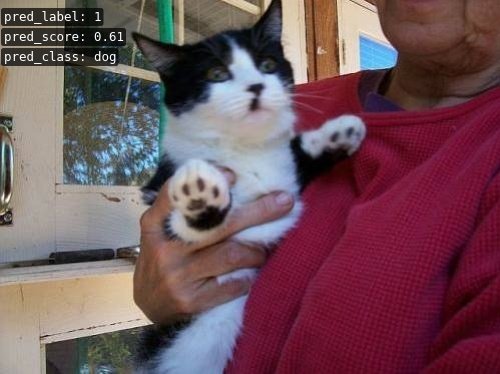
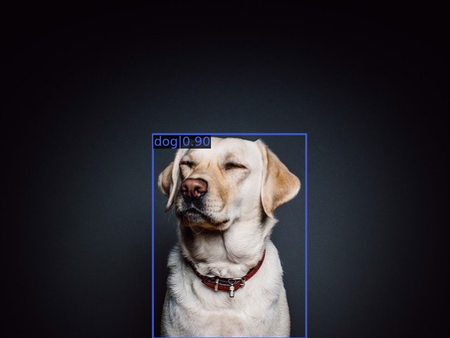

# MMEdu项目案例集

## 解决图像分类问题——以猫狗识别为例

项目地址：[https://openinnolab.org.cn/pjlab/project?id=64055263cb63f03054eca2df&sc=62f34141bf4f550f3e926e0e#public](https://openinnolab.org.cn/pjlab/project?id=64055263cb63f03054eca2df&sc=62f34141bf4f550f3e926e0e#public)

### 实现效果：



### 实施步骤：

##### 1）数据准备

首先需要根据要解决的问题收集数据并整理好数据集，如想要解决猫狗识别问题需准备猫狗数据集。

MMEdu图像分类模块要求的数据集格式为ImageNet格式，包含三个文件夹和三个文本文件，文件夹内，不同类别图片按照文件夹分门别类排好，通过trainning_set、val_set、test_set区分训练集、验证集和测试集。文本文件classes.txt说明类别名称与序号的对应关系，val.txt说明验证集图片路径与类别序号的对应关系，test.txt说明测试集图片路径与类别序号的对应关系。如何从零开始制作符合要求的数据集详见[后文](https://xedu.readthedocs.io/zh/master/how_to_use/dl_library/howtomake_imagenet.html)。

为了能够在平台完成训练，还需完成引用数据集的操作，可在左侧工具栏选择模型与数据集，上传并创建自己的数据集，再引用，如本项目已经引用我在平台上传并公开的经典版猫狗二分类数据集。

猫狗分类数据集地址：[https://openinnolab.org.cn/pjlab/dataset/63ac17c7c9fa8b6b82070697](https://openinnolab.org.cn/pjlab/dataset/63ac17c7c9fa8b6b82070697)

##### 2）建立模型并模型训练

示例项目使用的LeNet网络比较适合一些简单图像的分类，不适合彩色图，因此我们现在训练猫狗分类模型可以换个网络，例如ResNet18、MobileNet。另外如果你的数据集图片比较多，又是全新训练的，一般都需要100多轮才会有较好的表现，你要有心理准备哦。如需启动GPU训练，在参数中加入`device='cuda'`即可，若无，则去掉【浦育平台可启动GPU服务器，可上传数据集到浦育平台进行模型训练】。

```python
from MMEdu import MMClassification as cls
model = cls(backbone='MobileNet')
model.num_classes = 2 # 猫和狗共2类
model.load_dataset(path='/data/6P6SGH/CatsDogs') 
model.save_fold = 'checkpoints/cls_model/catsdogs' 
model.train(epochs=10 ,lr=0.001,batch_size=4, validate=True,device='cuda')
```

##### 3）基于预训练模型继续训练

全新开始训练一个模型，一般要花较长时间。因此我们强烈建议在预训练模型的基础上继续训练，哪怕你要分类的数据集和预训练的数据集并不一样。

```python
from MMEdu import MMClassification as cls
model = cls(backbone='MobileNet')
model.num_classes = 2
model.load_dataset(path='/data/6P6SGH/CatsDogs') 
model.save_fold = 'checkpoints/cls_model/CatsDog1' 
model.train(epochs=5, checkpoint='checkpoints/Pre-trained_mobilenet_v2.pth' ,batch_size=4, lr=0.001, validate=True,device='cuda')
```

预训练模型下载地址：[https://p6bm2if73b.feishu.cn/drive/folder/fldcnxios44vrIOV9Je3wPLmExf](https://p6bm2if73b.feishu.cn/drive/folder/fldcnxios44vrIOV9Je3wPLmExf)

##### 4）模型测试

可用一些新的图片进行测试。

```python
img = '/data/6P6SGH/CatsDogs/test_set/cat/cat100.jpg'
model = cls(backbone='MobileNet')
checkpoint = 'checkpoints/cls_model/catsdogs/best_accuracy_top-1_epoch_8.pth'
result = model.inference(image=img, show=True, checkpoint = checkpoint, device='cuda')
model.print_result(result)
```

##### 5）模型转换和应用

参考项目：[https://openinnolab.org.cn/pjlab/project?id=641039b99c0eb14f2235e3d5&backpath=/pjlab/projects/list#public](https://openinnolab.org.cn/pjlab/project?id=641039b99c0eb14f2235e3d5&backpath=/pjlab/projects/list#public)

模型转换：

模型转换所需要的文件：待转换的模型权重文件。本项目以猫狗分类为例，我们使用在猫狗分类模型训练过程中生成的最佳权重文件（已传入项目文件），您也可以上传您的图像分类模型。实例化模型时选择自己准备的模型权重文件在训练时选择的网络。我使用的是MobileNet，因此我指定MobileNet。

```python
from MMEdu import MMClassification as cls
model = cls(backbone='MobileNet')
checkpoint = 'checkpoints/best_accuracy_top-1_epoch_5.pth'
out_file='cats_dogs.onnx' # 指定输出的文件即转换后的文件
model.convert(checkpoint=checkpoint, backend="ONNX", out_file=out_file)
```

模型应用的基础代码：

```python
from XEdu.hub import Workflow as wf
mmcls = wf(task='mmedu',checkpoint='cats_dogs.onnx')# 指定使用的onnx模型
result, result_img =  mmcls.inference(data='/data/6P6SGH/CatsDogs/test_set/cat/cat0.jpg',img_type='cv2')# 进行模型推理
format_result = mmcls.format_output(lang="zh")# 推理结果格式化输出
mmcls.show(result_img)# 展示推理结果图片
mmcls.save(result_img,'new.jpg')# 保存推理结果图片
```

##### 6）部署到硬件

此时您可以挑选自己熟悉的硬件，去做自己训练并完成转换的模型部署啦，只需要下载转换的ONNX模型，在硬件上安装库即可。更多模型应用与部署的介绍详见[后文](https://xedu.readthedocs.io/zh/master/how_to_use/support_resources/model_convert.html#id9)。

## 解决目标检测问题——以猫狗检测为例

项目地址：[https://openinnolab.org.cn/pjlab/project?id=64055f119c0eb14f22db647c&sc=62f34141bf4f550f3e926e0e#public](https://openinnolab.org.cn/pjlab/project?id=64055f119c0eb14f22db647c&sc=62f34141bf4f550f3e926e0e#public)

### 实现效果：



### 实施步骤：

##### 1）数据准备

首先需要根据要解决的问题收集数据并整理好数据集，如想要解决猫狗目标检测问题需准备猫狗目标检测数据集。

XEdu中MMEdu的MMDetection模块支持的数据集类型是COCO，如需训练自己创建的数据集，数据集需转换成COCO格式。如何从零开始制作符合要求的数据集详见[后文](https://xedu.readthedocs.io/zh/master/how_to_use/dl_library/howtomake_coco.html)。

浦育平台的猫狗检测数据集：[https://openinnolab.org.cn/pjlab/dataset/6407fdcd9c0eb14f2297218d](https://openinnolab.org.cn/pjlab/dataset/6407fdcd9c0eb14f2297218d)

##### 2）建立模型并模型训练

```python
# 导入库、实例化模型
from MMEdu import MMDetection as det 
model = det(backbone='SSD_Lite')
model.num_classes = 2 # 猫和狗共2类
model.load_dataset(path='/data/H47U12/cat_dog_det') 
model.save_fold = 'checkpoints/det_model/catdogs' 
model.train(epochs=10 ,lr=0.001,batch_size=4, validate=True,device='cuda')
```

##### 3）基于预训练模型继续训练

全新开始训练一个模型，一般要花较长时间。因此我们强烈建议在预训练模型的基础上继续训练，哪怕你要分类的数据集和预训练的数据集并不一样。

```python
model.num_classes = 2 # 猫和狗共2类
model.load_dataset(path='/data/H47U12/cat_dog_det') 
# 预训练模型权重路线
checkpoint = 'checkpoints/pretrain_ssdlite_mobilenetv2.pth'
model.save_fold = 'checkpoints/det_model/catdogs_pretrain' 
#启动cpu容器将device='cpu'，启动GPU容器将device='cuda'
model.train(epochs=10, lr=0.001, validate=True, batch_size = 4, device='cuda', checkpoint=checkpoint)
```

预训练模型下载地址：[https://p6bm2if73b.feishu.cn/drive/folder/fldcnxios44vrIOV9Je3wPLmExf](https://p6bm2if73b.feishu.cn/drive/folder/fldcnxios44vrIOV9Je3wPLmExf)

注：浦育平台可启动GPU服务器，可上传数据集到浦育平台进行模型训练。

##### 4）模型测试

可用一些新的图片进行测试。

```python
img = "/data/H47U12/cat_dog_det/images/valid/001.jpg"
checkpoint = "checkpoints/det_model/catdogs_pretrain/best_bbox_mAP_epoch_7.pth"
# 推理，“show=True”表示弹出识别结果窗口
result = model.inference(image=img, show=True, checkpoint = checkpoint,device='cuda')#启动cpu容器将device='cpu'，启动GPU容器将device='cuda'
# 输出结果，将inference函数输出的结果修饰后输出具体信息
r=model.print_result(result)
```

##### 5）模型转换和应用

参考项目：[https://openinnolab.org.cn/pjlab/project?id=64128fd87c99492cf1bd579e&sc=62f34141bf4f550f3e926e0e#public](https://openinnolab.org.cn/pjlab/project?id=64128fd87c99492cf1bd579e&sc=62f34141bf4f550f3e926e0e#public)

模型转换：

模型转换所需要的文件：待转换的模型权重文件。本项目以猫狗检测为例，我们使用在猫狗检测模型训练过程中生成的最佳权重文件（已传入项目文件），您也可以上传您的目标检测模型。

实例化模型时选择自己准备的模型权重文件在训练时选择的网络。我使用的是SSD_Lite，因此我指定SSD_Lite。

```python
from MMEdu import MMDetection as det
model = det(backbone='SSD_Lite')
checkpoint = 'checkpoints/best_bbox_mAP_epoch_7.pth'
out_file='cats_dogs_det.onnx' # 指定输出的文件即转换后的文件
model.convert(checkpoint=checkpoint, backend="ONNX", out_file=out_file)
```

模型应用的基础代码：

```python
from XEdu.hub import Workflow as wf
mmdet = wf(task='mmedu',checkpoint='cats_dogs_det.onnx')# 指定使用的onnx模型
result, result_img =  mmdet.inference(data='/data/H47U12/cat_dog_det/images/valid/001.jpg',img_type='cv2')# 进行模型推理
format_result = mmdet.format_output(lang="zh")# 推理结果格式化输出
mmdet.show(result_img)# 展示推理结果图片
mmdet.save(result_img,'new.jpg')# 保存推理结果图片
```

##### 6）部署到硬件

此时您可以挑选自己熟悉的硬件，去做自己训练并完成转换的模型部署啦，只需要下载转换的ONNX模型，在硬件上安装库即可。更多模型应用与部署的介绍详见[后文](https://xedu.readthedocs.io/zh/master/how_to_use/support_resources/model_convert.html#id9)。

