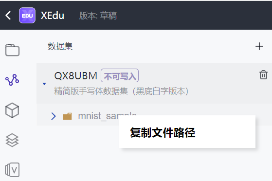

# MMEdu快速入门

## 1.MMEdu是什么？

MMEdu源于国产人工智能视觉（CV）算法集成框架OpenMMLab，是一个“开箱即用”的深度学习开发工具。在继承OpenMMLab强大功能的同时，MMEdu简化了神经网络模型搭建和训练的参数，降低了编程的难度，并实现一键部署编程环境，让初学者通过简洁的代码完成各种SOTA模型（state-of-the-art，指在该项研究任务中目前最好/最先进的模型）的训练，并能够快速搭建出AI应用系统。 

官方地址：[OpenInnoLab](https://www.openinnolab.org.cn/pjEdu/xedu)

GitHub：https://github.com/OpenXLab-Edu/OpenMMLab-Edu 

国内镜像：https://gitee.com/openxlab-edu/OpenMMLab-Edu

## 2.体验MMEdu

MMEdu有多种安装方式，可以通过Pip方式安装，也可以使用一键安装包。体验MMEdu的最快速方式是通过InnoLab平台。

### 2.1访问InnoLab

InnoLab为上海人工智能实验室推出的青少年AI学习平台。在“AI项目工坊 - 人工智能工坊”中，查找”MMEdu“，即可找到所有与MMEdu相关的体验项目。

AI项目工坊：https://www.openinnolab.org.cn/pjLab/projects/channel


下面以“手写体识别”为例来介绍从零开始训练一个AI模型的过程。

### 2.2 克隆项目

点击项目即可查看，但是强烈建议你先“克隆”。

### 2.3 加载数据集

 默认情况下，“克隆”的项目中已经引用了数据集。你也可以重新“引用”一次。步骤如下：

- 点击“+”，输入“mnist“，找到“mnist_sample”数据集，然后选择“☑️”；

- 在数据集上方点击“右键”，选择“复制文件路径”。接下来，你就可以通过这个路径来访问你的数据集。比如，我得到的文件路径是：`/data/QX8UBM/mnist_sample`。




**新手提问1：** 我要使用自己的数据集怎么办？为什么会这么麻烦？

解答：因为项目的空间容量是有限的，同时数据集是公用的，经常在多个项目中使用。因而OpenInnoLab将数据集放在一个公用区域，和项目的文件分离。如果要使用自己的数据集，请在“我的数据集”中增加一个新的数据集，OpenInnoLab支持上传压缩包的方式来建立数据集。数据集加好后，同样需要“引用”后才能访问。

如果你的数据集很小（比如100M内），那么也可以像使用正常的项目文件一下，通过浏览器上传即可。

### 2.4 训练模型

一个典型的模型训练代码：

```python
from MMEdu import MMClassification as cls
model = cls(backbone='LeNet')
model.num_classes = 3
model.load_dataset(path='./dataset')
model.save_fold = './my_model'
model.train(epochs=10, validate=True)
```


### 2.5 模型推理

模型训练好后，就可以测试效果了。代码中img的路径就是用于测试的新图片。

```python
from MMEdu import MMClassification as cls
img = './img.png'
model = cls(backbone='LeNet')
checkpoint = './latest.pth'
class_path = './classes.txt'
result = model.inference(image=img, show=True, class_path=class_path,checkpoint = checkpoint)
model.print_result(result)
```

## 2.6 继续训练

如果觉得效果不够好，请继续训练（实际上就是“迁移学习”）：

```python
from MMEdu import MMClassification as cls
model = cls(backbone='LeNet')
model.num_classes = 3
model.load_dataset(path='./dataset')
model.save_fold = './my_model'
checkpoint = './latest.pth'
model.train(epochs=10, validate=True, checkpoint=checkpoint)
```

**注意**：“继续训练”和“普通训练”的区别就在于model.train()函数中多了一个参数，即`checkpoint=checkpoint`。checkpoint的路径就来自之前训练的权重文件。

 

# 3.MMEdu的简要总结

MMEdu是针对青少年学习AI技术而设计的，其前身就是大名鼎鼎的OpenMMLab。MMEdu的语法非常简单，几句话就能完成训练和推理。如果你下载了一键安装包，还可以使用easytrain的辅助工具。有了MMEdu，你会发现AI模型训练原来这么简单。
