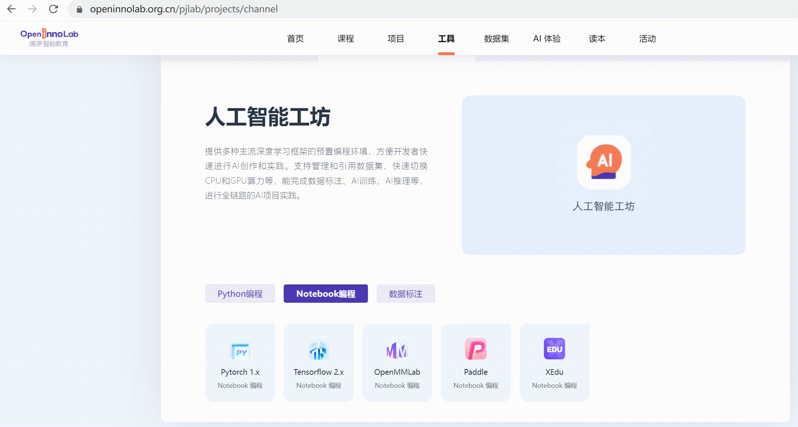
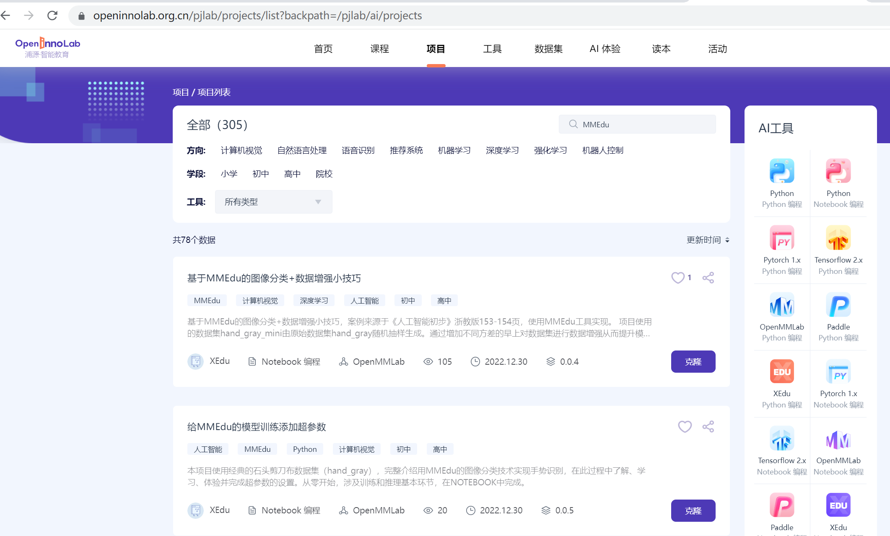
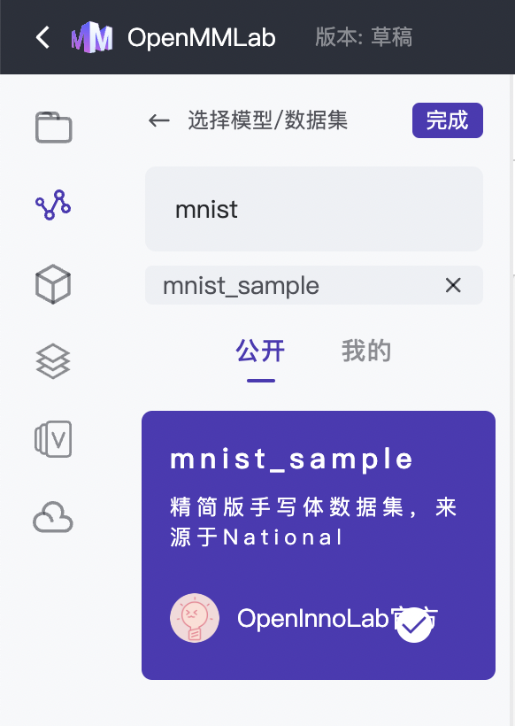
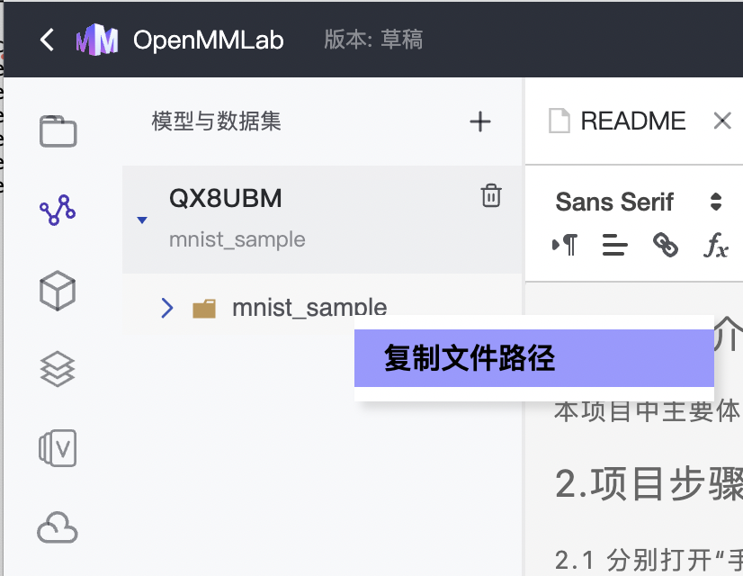
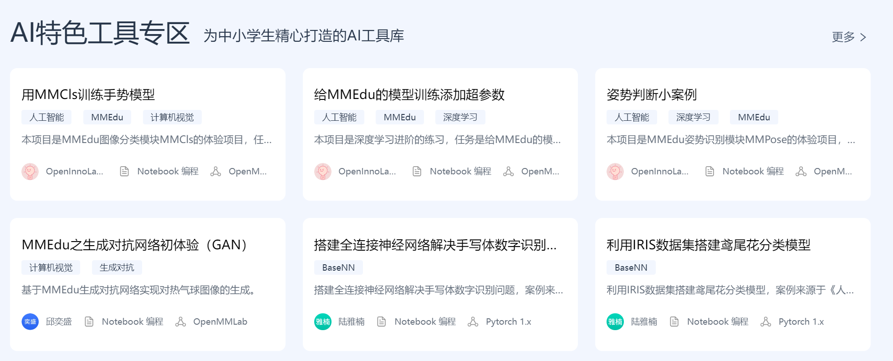

快速体验MMEdu，开始！
=====================

MMEdu是什么？
-------------

MMEdu源于国产人工智能视觉（CV）算法集成框架OpenMMLab，是一个“开箱即用”的深度学习开发工具。在继承OpenMMLab强大功能的同时，MMEdu简化了神经网络模型搭建和训练的参数，降低了编程的难度，并实现一键部署编程环境，让初学者通过简洁的代码完成各种SOTA模型（state-of-the-art，指在该项研究任务中目前最好/最先进的模型）的训练，并能够快速搭建出AI应用系统。

官方地址：\ `OpenInnoLab <https://www.openinnolab.org.cn/pjEdu/xedu>`__

GitHub：https://github.com/OpenXLab-Edu/OpenMMLab-Edu

国内镜像：https://gitee.com/openxlab-edu/OpenMMLab-Edu

小目标：使用MMEdu训练一个手写体数字识别模型！
---------------------------------------------

MMEdu有多种\ `安装方式 <https://xedu.readthedocs.io/zh/latest/mmedu/installation.html#mmedu>`__\ ，可以通过pip方式安装，也可以使用一键安装包。体验MMEdu的最快速方式是通过OpenInnoLab平台在线体验MMEdu。

1. 在OpenInnoLab创建MMEdu项目
~~~~~~~~~~~~~~~~~~~~~~~~~~~~~

OpenInnoLab平台为上海人工智能实验室推出的青少年AI学习平台，满足青少年的AI学习和创作需求，支持在线编程。在“工具
- 在线工具-
人工智能工坊”中，可直接创建XEdu项目。OpenInnoLab平台网址：https://www.openinnolab.org.cn/（用Chorm浏览器打开效果最佳）。

在“项目-更多”中，搜索”MMEdu“，可找到所有与MMEdu相关的项目直接克隆，项目所有人为XEdu的项目是XEdu研发团队原创并公开的项目，其他项目是MMEdu使用者公开的项目，如初次使用MMEdu，建议直接克隆XEdu名下的MMEdu相关项目。

下面以“手写体识别”为例来介绍从零开始训练一个AI模型的过程。

2. 克隆项目
~~~~~~~~~~~

强烈建议直接“克隆”《用MMEdu实现MNIST手写体数字识别（NOTEBOOK）》项目。

项目链接：https://www.openinnolab.org.cn/pjlab/project?id=63801c0701df4535876b6a4e&sc=635638d69ed68060c638f979#public

（用Chorm浏览器打开效果最佳）

3. 加载数据集
~~~~~~~~~~~~~

默认情况下，“克隆”的项目中已经引用了数据集。你也可以重新“引用”一次。步骤如下：

-  点击“+”，输入“mnist“，找到“mnist_sample”数据集，然后选择“☑️”；

-  在数据集上方点击“右键”，选择“复制文件路径”。接下来，你就可以通过这个路径来访问你的数据集。比如，我得到的文件路径是：\ ``/data/QX8UBM/mnist_sample``\ 。

**新手提问1：** 我要使用自己的数据集怎么办？为什么会这么麻烦？

解答：因为项目的空间容量是有限的，同时数据集是公用的，经常在多个项目中使用。因而OpenInnoLab将数据集放在一个公用区域，和项目的文件分离。如果要使用自己的数据集，请在“我的数据集”中增加一个新的数据集，OpenInnoLab支持上传压缩包的方式来建立数据集。数据集加好后，同样需要“引用”后才能访问。

如果你的数据集很小（比如100M内），那么也可以像使用正常的项目文件一下，通过浏览器上传即可。

4. 训练模型
~~~~~~~~~~~

一个典型的模型训练代码：

.. code:: python

   from MMEdu import MMClassification as cls
   model = cls(backbone='LeNet')
   model.num_classes = 3
   model.load_dataset(path='./dataset')
   model.save_fold = './my_model'
   model.train(epochs=10, validate=True)

打开\ `《用MMEdu实现MNIST手写体数字识别（NOTEBOOK）》项目 <https://www.openinnolab.org.cn/pjlab/project?id=63801c0701df4535876b6a4e&sc=635638d69ed68060c638f979#public>`__\ 中的“1.mnist手写体数字识别-训练.ipynb”文件跟随说明完成训练代码运行。示例代码中共6行代码，完成了导入库、实例化模型、配置基本信息（图片分类的类别数量（\ ``model.num_classes``\ ），模型保存的路径（\ ``model.save_fold``\ ）和数据集的路径（\ ``model.load_dataset``\ ）），开始训练模型。

5. 继续训练
~~~~~~~~~~~

如果觉得效果不够好，请继续训练（实际上就是“迁移学习”）：

.. code:: python

   from MMEdu import MMClassification as cls
   model = cls(backbone='LeNet')
   model.num_classes = 3
   model.load_dataset(path='./dataset')
   model.save_fold = './my_model'
   checkpoint = './latest.pth'
   model.train(epochs=10, validate=True, checkpoint=checkpoint)

**注意**\ ：“继续训练”和“普通训练”的区别就在于\ ``model.train()``\ 函数中多了一个参数，即\ ``checkpoint=checkpoint``\ 。checkpoint的路径就来自之前训练的权重文件。

推荐使用“继续训练”的方式，因为全新开始训练一个模型，一般要花较长时间。如果使用CPU训练，需要的时间就更长了。因此我们强烈建议在预训练模型的基础上继续训练。

6. 模型推理
~~~~~~~~~~~

模型训练好后，就可以测试效果了。代码中img的路径就是用于测试的新图片。

.. code:: python

   from MMEdu import MMClassification as cls
   img = './img.png'
   model = cls(backbone='LeNet')
   checkpoint = './latest.pth'
   class_path = './classes.txt'
   result = model.inference(image=img, show=True, class_path=class_path,checkpoint = checkpoint)
   model.print_result(result)

打开\ `《用MMEdu实现MNIST手写体数字识别（NOTEBOOK）》项目 <https://www.openinnolab.org.cn/pjlab/project?id=63801c0701df4535876b6a4e&sc=635638d69ed68060c638f979#public>`__\ 中的“2.mnist手写体数字识别-推理.ipynb”文件跟随说明完成推理代码运行。示例代码中共7行代码，完成了导入库、指定图片、实例化模型、指定模型保存的路径、开始推理、输出推理结果。根据推理结果可以完成各种其他输出。

下一个目标：使用MMEdu训练各种模型
---------------------------------

我们的小目标就达成了！一个手写体数字识别模型就训练好了，此时你肯定还不过瘾，还想使用MMEdu基于各种数据集来训练模型去解决各种分类问题也很方便！只需要对手写体识别训练的代码稍作改动即可。首先思考自己想要解决的分类问题，收集数据并整理好数据集，如想要解决猫狗识别问题需准备猫狗数据集。

那么可以打开\ `《用MMEdu实现MNIST手写体数字识别（NOTEBOOK）》项目 <https://www.openinnolab.org.cn/pjlab/project?id=63801c0701df4535876b6a4e&sc=635638d69ed68060c638f979#public>`__\ 中的“3.从mnist手写体数字识别到猫狗分类.ipynb”文件。而且还有更多案例可以参考，详见项目集区域，这里的AI特色工具专区展示了一些有助于深度学习和机器学习入门和进阶的案例。
当然你也可以在AI项目工坊创建自己的项目，做自己的人工智能案例。MMEdu工具有\ `图像分类模块 <https://xedu.readthedocs.io/zh/latest/mmedu/mmclassification.html#mmclassification>`__\ 、\ `目标检测模块 <https://xedu.readthedocs.io/zh/latest/mmedu/mmdetection.html>`__\ 等模块，请继续阅读文档，了解并掌握MMEdu的各个模块。

MMEdu的简要总结
---------------

MMEdu是针对青少年学习AI技术而设计的，其前身就是大名鼎鼎的OpenMMLab。MMEdu的语法非常简单，几句话就能完成训练和推理。如果你下载了一键安装包，还可以使用Easytrain等可视化辅助工具。有了MMEdu，你会发现AI模型训练原来这么简单。
