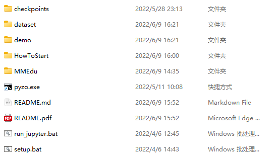

# MMEdu快速入门

## 1.MMEdu是什么？

MMEdu源于国产人工智能视觉（CV）算法集成框架OpenMMLab，是一个“开箱即用”的深度学习开发工具。在继承OpenMMLab强大功能的同时，MMEdu简化了神经网络模型搭建和训练的参数，降低了编程的难度，并实现一键部署编程环境，让初学者通过简洁的代码完成各种SOTA模型（state-of-the-art，指在该项研究任务中目前最好/最先进的模型）的训练，并能够快速搭建出AI应用系统。 

官方地址：[OpenInnoLab](https://www.openinnolab.org.cn/pjEdu/xedu)

GitHub：https://github.com/OpenXLab-Edu/OpenMMLab-Edu 

国内镜像：https://gitee.com/openxlab-edu/OpenMMLab-Edu

## 2.MMEdu安装

MMEdu有多种安装方式，可以通过Pip方式安装，也可以使用一键安装包。

### 2.1 一键安装包

为方便中小学教学，MMEdu团队提供了一键安装包。只要下载并解压MMEdu的Project文件，即可直接使用。

第一步：下载MMEdu最新版文件，并解压到本地，文件夹目录结构如下图所示。

 

图1 目录结构图

​    1）下载方式一

飞书网盘： https://p6bm2if73b.feishu.cn/drive/folder/fldcnfDtXSQx0PDuUGLWZlnVO3g

​    2）下载方式二

百度网盘：https://pan.baidu.com/s/19lu12-T2GF_PiI3hMbtX-g?pwd=2022 

​       提取码：2022

第二步：运行根目录的“steup.bat”文件，完成环境部署（如下图所示）。


图2 环境部署界面

第三步：您可以根据个人喜好，选择自己习惯的IDE。一键安装包内置了pyzo和jupyter，您也可以使用其他您习惯使用的编辑器。

## 3.体验demo代码

1）使用默认IDE

双击pyzo.exe，打开demo文件夹中的cls_demo.py，运行并体验相关功能，也可以查看其他的Demo文件。详细说明可以在HowToStart文件夹看到。

2）使用第三方IDE

环境支持任意的Python编辑器，如：Thonny、PyCharm、Sublime等。
只要配置其Python解释器地址为`{你的安装目录}+{\MMEdu\mmedu\python.exe}`。

体验入门Demo后，我们还准备了一系列的入门课程供您参考。将在稍晚发布。

## 4.模型训练

典型训练：

```python
from MMEdu import MMClassification as cls
model = cls(backbone='LeNet')
model.num_classes = 3
model.load_dataset(path='./dataset')
model.save_fold = './my_model'
model.train(epochs=10, validate=True)
```

继续训练：

```python
from MMEdu import MMClassification as cls
model = cls(backbone='LeNet')
model.num_classes = 3
model.load_dataset(path='./dataset')
model.save_fold = './my_model'
checkpoint = './latest.pth'
model.train(epochs=10, validate=True, checkpoint=checkpoint)
```

## 5.模型推理

```python
from MMEdu import MMClassification as cls
img = './img.png'
model = cls(backbone='LeNet')
checkpoint = './latest.pth'
class_path = './classes.txt'
result = model.inference(image=img, show=True, class_path=class_path,checkpoint = checkpoint)
model.print_result(result)
```

## 6.部署AI应用

### 1.准备工作

所谓准备工作就是先训练好一个效果不错的模型。

### 2.借助OpenCV识别摄像头画面

1）代码编写

```python
import cv2
from time import sleep
cap = cv2.VideoCapture(0)
print("一秒钟后开始拍照......")
sleep(1)
ret, frame = cap.read()
cv2.imshow("my_hand.jpg", frame)
cv2.waitKey(1000) # 显示1秒（这里单位是毫秒）
cv2.destroyAllWindows()
cv2.imwrite("my_hand.jpg", frame)
print("成功保存 my_hand.jpg")
cap.release()
```

2）运行效果


### 3.借助PyWebIO部署Web应用

1）编写代码

```python
from base import *
from MMEdu import MMBase
import numpy as np
from pywebio.input import input, FLOAT,input_group
from pywebio.output import put_text

# 鸢尾花的分类
flower = ['iris-setosa','iris-versicolor','iris-virginica']

# 声明模型
model = MMBase()
# 导入模型
model.load('./checkpoints/mmbase_net.pkl')
info=input_group('请输入要预测的数据', [
    input('Sepal.Length：', name='x1', type=FLOAT),
    input('Sepal.Width：', name='x2', type=FLOAT),
    input('Petal.Length：', name='x3', type=FLOAT),
    input('Petal.Width：', name='x4', type=FLOAT)
])
print(info)
x = list(info.values())
put_text('你输入的数据是：%s' % (x))
model.inference([x])
r=model.print_result()
put_text('模型预测的结果是：' + flower[r[0]['预测值']])
print('模型预测的结果是：' +flower[r[0]['预测值']])
```

2）运行效果


### 4.连接开源硬件开发智能作品

1）
