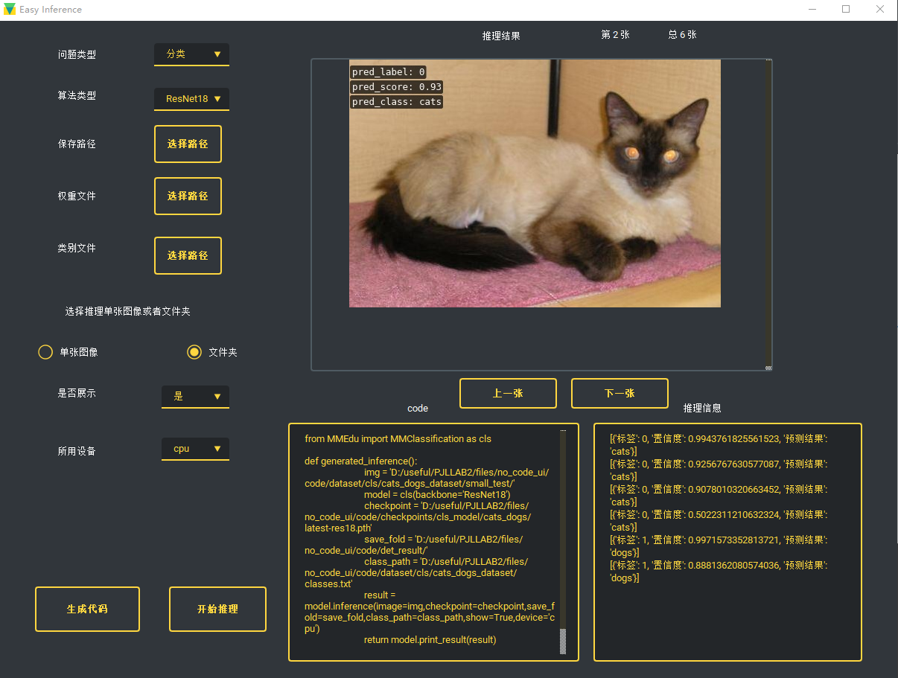
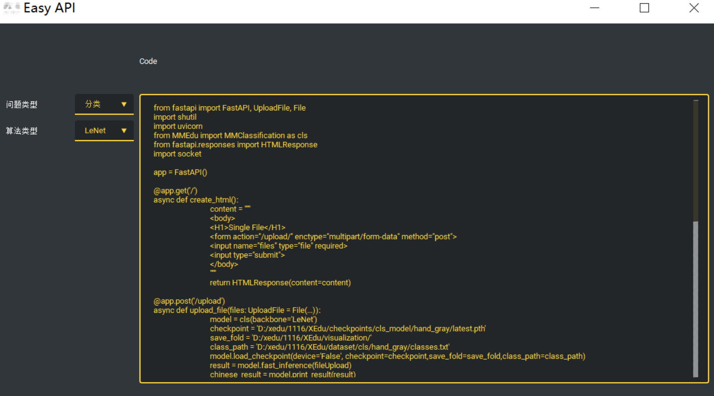

# EasyDL系列工具

## 1.简介

EasyDL系列工具是由上海人工智能实验室智能教育中心打造的面向0基础或者较低基础的中小学生的无代码可视化工具。一个step-by-step的无代码（傻瓜化）模型训练和推理辅助工具，基于MMEdu开发。既可以独立下载（安装时提示需要XEdu环境），又内置在XEdu的一键安装包中。旨在让代码能力不强的初学者也能体验到人工智能的训练与学习，并且可以看到基于XEdu编写格式的训练、推理及部署的代码。

## 2.核心功能

### 2.1EasyTrain

①实现了无代码训练可视化界面

②支持以下训练选项：

* 分类问题和检测问题
* LeNet，ResNet18，yolov3等不同算法选择
* 自选数据集，保存路径，是否使用预训练模型等
* 轮数，学习率，优化器等训练参数的自定义

③训练代码生成与查看

④集成开始训练与结束训练按钮，并实时显示loss曲线

### 2.2EasyInference

①实现了无代码推理可视化界面

②支持以下推理选项：

* 数据和权重文件选择
* 单张图像或者文件夹选择

③在界面中预览推理结果和图片

④推理代码生成与查看

### 2.3EasyAPI

①实现了无代码服务部署可视化界面

②支持以下选项：

* 问题类型
* 算法类型
* 权重文件和类别文件的选择
* 结果保存路径

③生成代码

④在界面中跳转到Web服务的网页

## 3.运行方法

### 3.1EasyTrain

EasyTrain界面打开之后在下拉框中选择问题类型为分类或者检测。

在选择了问题类型之后，下面的“算法类型”也会对应的更改。

在训练中要指定训练结果的保存路径和数据集路径，在选择了路径后，按钮文本会变成“选择路径”。如果训练新的模型，请尽量把结果保存在新的空文件夹中，否则不同训练问题的自动保存模型会冲突。

训练的轮数，学习率，类别数量，使用设备等参数也可以调节，点击“更多参数”按钮可以修改更多的参数。一部分参数有范围，限定数字等要求。并且请选择合理的数值。如果是用不到的参数，建议不要修改，采用默认值。特别地，类别默认为-1是允许的，表示默认读取`class.txt`中的类别，修改之后需要填成正确的类数量。

在更多参数中做出修改后，请点击“保存修改”将其保存。

在修改好自己的参数后，点击左下角的“代码生成”，可以生成训练代码，生成代码之后才可以训练。
生成的代码会显示在上方的代码框，并且保存到`train_code.py`中，请不要随意修改。

代码生成之后点击“开始训练”按钮即可开始训练，训练过程中主界面依旧可以正常运行，但是为了程序的稳定性和速度，不建议进行额外操作。
在开始训练后，停止训练会短暂地

在训练过程中，loss曲线会实时显示在右下方的loss框中，以轮数表示的训练进度也会表现在“结束训练”按钮下的进度条中。

### 3.2EasyInference

EasyInference页面的左侧还是基本的参数选择，包括问题类型，算法类型，权重文件，类别文件，推理结果的保存路径。 如果推理结果的保存路径不选择，会默认保存到当前文件夹下的`det_result`中。
但是请选择一个空文件夹作为保存路径，否则预览界面会出现问题。

在一个单选按钮中选择要推理的文件夹或者单张图片，无论选择哪个都会弹出选择框。

如果选择推理单张图片，请选择一张图片，格式支持jpg，jpeg，png。请注意，即使多选，也只会推理第一张。

如果是选择文件夹，选择该文件夹即可。

如果问题类型为检测，则会多出两个参数选择，分别是rpn阈值和rcnn阈值，请选择0-1之内的数字。

点击“生成代码”后，代码会保存在`inference_code.py`中，并且在界面中显示。

点击“开始推理”后，会弹出提示框并且进行推理。请注意，运行过程中主界面会卡住，请耐心等待推理完成，推理完成后会在右下角显示推理信息，也会在上方显示结果图片。

点击“上一张”，“下一张”可以进行切换。如果保存路径还有其他图片，程序会将那些图片全都展示，所以建议在推理之前清空保存路径。

### 3.3EasyAPI

EasyAPI界面打开之后在下拉框中选择问题类型为分类或者检测。

在选择了问题类型之后，下面的“算法类型”也会对应的更改。

选择权重文件和类别文件。

点击生成代码会在上方Code呈现代码，有需要的用户也可以复制到本地运行。

运行代码会看到EasyTrain界面打开的同时运行的cmd.exe框内会有呈现运行后台，此时点击打开网页。

网页界面如下图所示。用户可指定类别的图片进行识别。

## 注意事项

* 一部分参数有范围，例如学习率只能为正值，轮数只能为正整数，请选择合理范围的参数。
* 关于设备类型，如果没有安装GPU版本的XEdu各模块，则不能以cuda设备运行，只能选择cpu。
* 请选择空文件夹进行结果的保存，原因已经解释过。
* 请确认推理时选择的网络是否与权重文件匹配，如果不匹配会报错。
