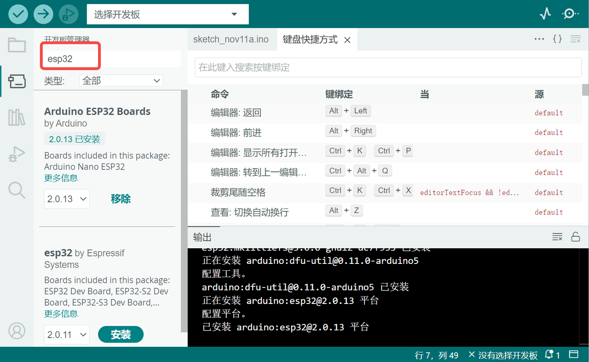
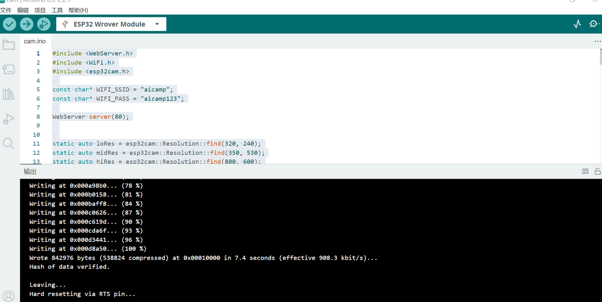

# 科创神器ESP32-CAM小型摄像头模块

## 1.简介

ESP32-CAM是一个小巧但功能强大的摄像头模块，非常适合DIY爱好者和科创项目。它可以连接Wi-Fi和蓝牙，让你轻松地进行图像捕获和视频流处理。无论你是想做一个智能小车，还是想在家里安装一个简易的监控系统，ESP32-CAM都是一个很好的选择。

下文简单介绍一下如何配置ESP32-CAM以及简单应用。

## 2.简单使用教程

### 第一步：购买ESP32-CAM

a.在淘宝、京东查找ESP32-CAM，购买一款合适的产品。

b.核对规格：确保购买的是ESP32-CAM模块，它通常包括一个小型摄像头模块（摄像头模块可能需要自行安装）。

c.USB接口的线，配合ESP32-CAM连接。

### 第二步：准备编程环境

a.下载并安装arduino IDE

这是一个编程软件，可以让你给ESP32-CAM编写和上传代码。

下载地址：[https://www.arduino.cc/en/Main/Software?setlang=cn](https://www.arduino.cc/en/Main/Software?setlang=cn)

b.下载完成后打开arduino IDE选择首选项


打开配置后，添加附加开发板管理器网址（可直接复制下面的网址）

```
https://dl.espressif.com/dl/package_esp32_index.json
http://arduino.esp8266.com/stable/package_esp8266com_index.json
```


c.打开工具-开发板管理器，然后搜索esp32


选第二个esp32 by Espressif点击安装，等待安装完毕



### 第三步：连接ESP32-CAM至电脑

将ESP32-CAM模块通过转换器连接到电脑，并在arduino ide中选择连接，工具-开发板-ESP32-esp32 Wrover Module


工具-端口选择COM5


### 第四步：编写配置WIFI的代码

a.获取编程示例

ESP32 CAM Live Video Streaming in Python OpenCV的示例代码是：

```
#include <WebServer.h>
#include <WiFi.h>
#include <esp32cam.h>
 
const char* WIFI_SSID = "aicamp"; # wifi账号
const char* WIFI_PASS = "aicamp123";# wifi密码
 
WebServer server(80);
 
 
static auto loRes = esp32cam::Resolution::find(320, 240);
static auto midRes = esp32cam::Resolution::find(350, 530);
static auto hiRes = esp32cam::Resolution::find(800, 600);
void serveJpg()
{
  auto frame = esp32cam::capture();
  if (frame == nullptr) {
    Serial.println("CAPTURE FAIL");
    server.send(503, "", "");
    return;
  }
  Serial.printf("CAPTURE OK %dx%d %db\n", frame->getWidth(), frame->getHeight(),
                static_cast<int>(frame->size()));
 
  server.setContentLength(frame->size());
  server.send(200, "image/jpeg");
  WiFiClient client = server.client();
  frame->writeTo(client);
}
 
void handleJpgLo()
{
  if (!esp32cam::Camera.changeResolution(loRes)) {
    Serial.println("SET-LO-RES FAIL");
  }
  serveJpg();
}
 
void handleJpgHi()
{
  if (!esp32cam::Camera.changeResolution(hiRes)) {
    Serial.println("SET-HI-RES FAIL");
  }
  serveJpg();
}
 
void handleJpgMid()
{
  if (!esp32cam::Camera.changeResolution(midRes)) {
    Serial.println("SET-MID-RES FAIL");
  }
  serveJpg();
}
 
 
void  setup(){
  Serial.begin(115200);
  Serial.println();
  {
    using namespace esp32cam;
    Config cfg;
    cfg.setPins(pins::AiThinker);
    cfg.setResolution(hiRes);
    cfg.setBufferCount(2);
    cfg.setJpeg(80);
 
    bool ok = Camera.begin(cfg);
    Serial.println(ok ? "CAMERA OK" : "CAMERA FAIL");
  }
  WiFi.persistent(false);
  WiFi.mode(WIFI_STA);
  WiFi.begin(WIFI_SSID, WIFI_PASS);
  while (WiFi.status() != WL_CONNECTED) {
    delay(500);
  }
  Serial.print("http://");
  Serial.println(WiFi.localIP());
  Serial.println("  /cam-lo.jpg");
  Serial.println("  /cam-hi.jpg");
  Serial.println("  /cam-mid.jpg");
 
  server.on("/cam-lo.jpg", handleJpgLo);
  server.on("/cam-hi.jpg", handleJpgHi);
  server.on("/cam-mid.jpg", handleJpgMid);
 
  server.begin();
}
 
void loop()
{
  server.handleClient();
}
```

b.新建文件，将上述代码复制到新文件中，编写Wi-Fi代码，包括指定Wi-Fi账号和密码，其他不变。

### 第五步：安装esp32cam库

a.下载esp32cam库

下载地址：[https://github.com/yoursunny/esp32cam](https://github.com/yoursunny/esp32cam)


b.导入库

项目-导入库-添加.ZIP库


### 第六步：上传代码并获取IP地址

单击上传按钮上传代码



上传代码后点击esp32cam的reset键，重启esp32cam，可打开串口监视器，查看上传代码的运行情况(示例代码会输出相关ip和路径)


下图中是串口监视器里输出的结果（如没有输出可增大默认的波特率）


可以发现在串行监视器的IP地址下，会看到三种不同的图像分辨率 lo、hi 和 mid，根据需求使用一个。

例如我们可以使用http://192.168.31.75/cam-hi.jpg，使用浏览器打开即可看到摄像头拍摄的照片，手动刷新可以看到拍摄到的一张张照片。

注：同一个WIFI下IP地址不会发生变化。

## 3.简单应用：在Python中测试实时视频流

可以编写python代码连接esp32cam摄像头，获取视频流（需要将代码中的ip改为上述串口监视器中输出的ip）,下面是最简代码。

```
import cv2
import urllib.request
import numpy as np

url = 'http://192.168.31.75/cam-hi.jpg' # 填写串口监视器中输出的ip地址
cv2.namedWindow("live Cam Testing", cv2.WINDOW_AUTOSIZE)

# 创建VideoCapture对象
cap = cv2.VideoCapture(url)

# 检查是否成功打开摄像头
if not cap.isOpened():
    print("Failed to open the IP camera stream")
    exit()

# 读取并显示视频帧
while True:
    img_resp=urllib.request.urlopen(url) #通过URL请求获取一帧图像
    imgnp=np.array(bytearray(img_resp.read()),dtype=np.uint8) # 将获取的图像转换为numpy数组
    im = cv2.imdecode(imgnp,-1) # 解码图像
    im = cv2.flip(im, 1) # 将图像水平翻转，1代表水平翻转
    
    # 在窗口中显示图像
    cv2.imshow('live Cam Testing',im)
    key=cv2.waitKey(5)
    if key==ord('q'): # 按q键退出循环
        break
    
cap.release() # 释放VideoCapture对象
cv2.destroyAllWindows() # 关闭所有OpenCV创建的窗口
```

在此基础上，可继续编写更复杂的python代码，例如对接收的照片进行各种模型推理的操作，甚至还可以连接小车做一个无人行驶小车（例如我们的[识行小车案例](https://xedu.readthedocs.io/zh/master/xedu_hub/projects.html#id5)）。

本文参考：[https://www.electroniclinic.com/esp32-cam-with-python-opencv-yolo-v3-for-object-detection-and-identification/](https://www.electroniclinic.com/esp32-cam-with-python-opencv-yolo-v3-for-object-detection-and-identification/)
