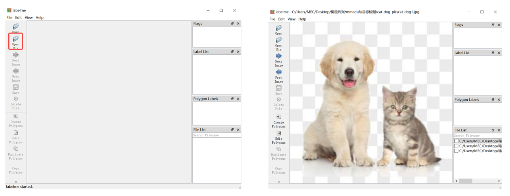

# 数据集标注工具

### labelme

官网：https://github.com/wkentaro/labelme

1.安装：打开本地Python IDE终端或命令提示符，输入pip安装命令`pip install labelme`（建议python版本选择python3.8）

2.操作步骤：

a.在终端重新输入labelme即可启动labelme，此时会自动出现labelme界面。

b.使用Open Dir或左上角File打开图片文件夹。

c.右键选择Create Rectangle创建矩形框进行标注。点击鼠标左键，确认起始位置，注意设置类别。

d.左侧功能栏的save保存也亮了，点击保存即保存至文件夹，会自动保存为以图片名命名的labelme格式的json文件中。比较便捷的方式可以开启自动保存后再开始标注，便不再需要每标注一张图片都点一次保存。

**快速标注小技巧：使用快捷键**

设置自动保存的方式：左上角点击File文件，选择Save Automatically。

标注快捷键：按快捷键“ctrl”+“r”使用矩形框标注，鼠标左键并点击后框出物体，并输入类别，并点击ok完成标注，若标注框和类别不正确，按快捷键“ctrl”+“j”；若标注框和类别不正确，按快捷键“ctrl”+“j”对框的大小位置修改，“ctrl”+“j”的编辑模式下左键点击框按“ctrl”+“e”修改类别。

### labelbee

1.下载链接：https://github.com/open-mmlab/labelbee-client

2.操作步骤：

a.双击运行labelbee-client.exe，可以直接切换至中文。

b.新建单步骤项目即可开始标注，填写项目名称，选择图片文件夹、结果文件夹后到最下方，需要完成属性标注的设置，设置为要标注的类别，如plate。

c.点击鼠标左键，确认起始位置，拖拽鼠标开始标注，注意选择我们设置的类别。

d.标注完成后点击左上角的返回按钮返回至项目列表导出标注结果。可选多种格式，默认是labelbee格式，我们选择COCO并选择导出路径即可。

**labelbee也有网页版本哦~**

网页版数据标注：https://www.openinnolab.org.cn/pjLab/projects/channel