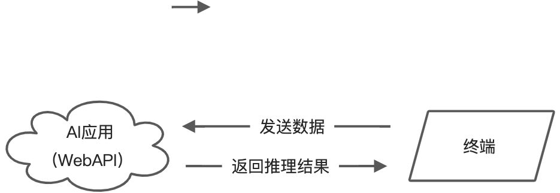

# Web库Flask

## 1. 简介

Flask是一个轻量级的可定制框架，使用Python语言编写，较其他同类型框架更为灵活、轻便、安全且容易上手，其强大的插件库可以让用户实现个性化的网站定制，开发出功能强大的网站。

文档地址：[https://dormousehole.readthedocs.io/en/latest/quickstart.html](https://dormousehole.readthedocs.io/en/latest/quickstart.html)

本文涉及的部分代码见XEdu帮助文档配套项目集：[https://www.openinnolab.org.cn/pjlab/project?id=64f54348e71e656a521b0cb5&sc=645caab8a8efa334b3f0eb24#public](https://www.openinnolab.org.cn/pjlab/project?id=64f54348e71e656a521b0cb5&sc=645caab8a8efa334b3f0eb24#public)

## 2. 安装

可以使用使用pip命令安装Flask库。

```
pip install flask
```

注：XEdu一键安装包中已经内置了Flask库。

## 3. 代码示例

### 3.1 最简Web服务器

几行代码就能建一个Web服务器。

```python
from flask import Flask

app = Flask(__name__)

@app.route("/")
def hello_world():
    return "<p>Hello, World!</p>"
```

代码是什么意思呢？

- 首先我们导入了 Flask 类。该类的实例将会成为我们的 WSGI 应用。
- 接着我们创建一个该类的实例。第一个参数是应用模块或者包的名称。 __name__ 是一个适用于大多数情况的快捷方式。有了这个参数， Flask 才能知道在哪里可以找到模板和静态文件等东西。
- 然后我们使用 route() 装饰器来告诉 Flask 触发函数 的 URL 。
- 函数返回需要在用户浏览器中显示的信息。默认的内容类型是 HTML ，因此字符串中的 HTML 会被浏览器渲染。


### 3.2 上传一个文件
```python
from flask import Flask, request
import os
app = Flask(__name__)
UPLOAD_FOLDER = 'uploads'

@app.route('/upload', methods=['POST'])
def upload_file():
    if 'file' not in request.files:
        return '没有文件上传', 400

    file = request.files['file']
    if file.filename == '':
        return '没有选择文件', 400

    if file:
        file.save(os.path.join(UPLOAD_FOLDER, file.filename))
        return '文件上传成功', 200

if __name__ == '__main__':
    if not os.path.exists(UPLOAD_FOLDER):
        os.makedirs(UPLOAD_FOLDER)
    app.run(debug=True)
```


### 3.3 一个简单的WebAPI
```python
from flask import Flask, jsonify, request

app = Flask(__name__)

@app.route('/api', methods=['GET'])
def api():
    name = request.args.get('name', 'World')
    return jsonify({'message': f'Hello, {name}!'})

if __name__ == '__main__':
    app.run(debug=True)
```


## 4. 借助Flask部署智能应用

因为算力的限制，在很多应用场景中，负责采集数据的终端往往没有办法直接部署MMEdu或者其他的人工智能应用框架，也就是说没有办法在终端上直接推理。那么，先在服务器（或者一台算力较好的PC机）部署一个AI应用，提供WebAPI接口，让终端发送数据到这个服务器，服务器推理后返回推理结果。

这种做法和很多智能终端的工作原理是一样的。如小度、天猫精灵和小爱音箱等，自己都没有处理数据的能力，都要靠网络传送数据到服务器，然后才能正确和用户交流。目前中小学的很多AI应用，都是借助百度AI开放平台的。

