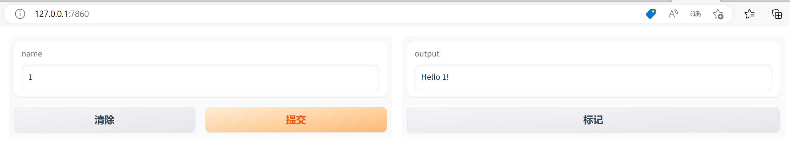
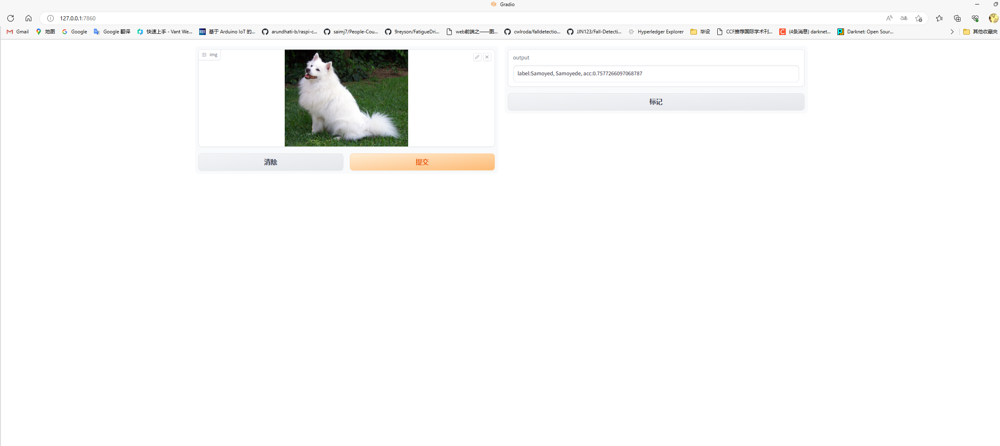

Web库Gradio
===========

1. 简介
-------

Gradio是一个开源库，用于快速原型设计和部署机器学习模型的交互式界面。它提供了简单易用的接口，让用户能够轻松创建和展示机器学习模型，以及与其交互。

gitee地址：https://gitee.com/mirrors/gradio

官方文档：https://gradio.app/docs/

2. 安装
-------

Gradio可以采用pip命令安装，具体如下：

::

   pip install gradio

3. 代码示例
-----------

下面是一个使用Gradio创建一个简单交互式界面的示例代码：

.. code:: python

   import gradio as gr

   def greet(name):
       return f"Hello {name}!"

   iface = gr.Interface(fn=greet, inputs="text", outputs="text")
   iface.launch()

上面的示例中，定义了一个名为“greet”的函数，它接受一个名字作为输入，并返回一个带有问候语的字符串。然后使用\ ``gr.Interface``\ 创建一个接口，指定输入类型为文本，输出类型也为文本。最后，使用\ ``launch``\ 方法来启动界面。运行效果如下：

   image

4. 借助Gradio部署简易AI应用
---------------------------

Gradio提供了多种部署选项，使您能够将您的智能应用部署到各种环境中。您可以将您的智能应用程序共享给其他人使用，无论是作为演示、原型验证还是实际应用。Gradio使部署变得简单而高效，让您能够专注于构建优秀的机器学习模型和交互式界面。

借助Gradio部署MMEdu模型
~~~~~~~~~~~~~~~~~~~~~~~

下面是一段Gradio调用MMEdu训练的图像分类模型的代码，运行这段代码，Gradio将启动一个交互式界面，您可以在其中上传图像并查看模型的预测结果。您需确保可以导入MMEdu库，且有MMEdu训练的模型，如何安装MMEdu和使用MMEdu训练模型，可参照\ `前文 <https://xedu.readthedocs.io/zh/master/mmedu.html>`__\ 。

::

   import gradio as gr
   from MMEdu import MMClassification as cls
   model = cls(backbone = 'LeNet')
   checkpoint='checkpoints/cls_model/hand_gray/latest.pth'
   def predict(img):
       result = model.inference(image=img, show=False, checkpoint=checkpoint)
       return str(result)
   image = gr.inputs.Image(type="filepath")
   gr.Interface(fn=predict, inputs=image, outputs=gr.outputs.Textbox()).launch()

运行效果如下：

   image

您可以根据您的模型进行相应的修改和调整，以适应您的需求。例如对输出结果做一些修饰，参考代码如下：

::

   import gradio as gr
   from MMEdu import MMClassification as cls
   model = cls(backbone = 'LeNet')
   checkpoint='checkpoints/cls_model/hand_gray/latest.pth'
   def predict(img):
       result = model.inference(image=img, show=False, checkpoint=checkpoint)
       texts = []
       texts.append('Pred_label: {}'.format(result['pred_label']))
       texts.append('Pred_score: {:.2f}'.format(result['pred_score']))
       texts.append('Pred_label: {}'.format(result['pred_class']))
       text = '\n'.join(texts)
       return text

   image = gr.inputs.Image(type="filepath")
   gr.Interface(fn=predict, inputs=image, outputs=gr.outputs.Textbox()).launch()

借助Gradio部署ONNX模型
~~~~~~~~~~~~~~~~~~~~~~

使用Gradio部署ONNX模型也是非常简单的，示例代码如下：

补充：ONNX（Open Neural Network
Exchange）是一个开放的、跨平台的深度学习模型表示和转换框架。它的目标是解决不同深度学习框架之间的模型兼容性问题，此处使用的ONNX模型推理的代码是借助XEdu团队推出的\ ``模型部署工具``\ `BaseDeploy <https://xedu.readthedocs.io/zh/master/basedeploy/introduction.html>`__\ ，代码较为简洁。关于基于MMEdu训练的模型转换为ONNX的说明可见\ `最后一步：AI模型转换与部署 <https://xedu.readthedocs.io/zh/master/mmedu/model_convert.html#ai>`__\ 。

::

   import gradio as gr
   import BaseDeploy as bd
   model_path = 'cls.onnx'
   def predict(img):
       model = bd(model_path)
       result = model.inference(img)
       return result
   image = gr.inputs.Image(type="filepath")
   gr.Interface(fn=predict, inputs=image, outputs=gr.outputs.Textbox()).launch()

运行效果如下：

   image
