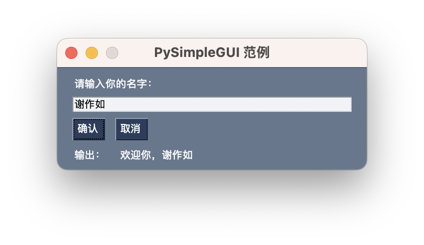

#  GUI库PySimpleGUI

## 1. 简介

图形用户界面（Graphical User Interface，简称 GUI，又称图形用户接口）是指采用图形方式显示的计算机操作用户界面。图形用户界面是一种人与计算机通信的界面显示格式，允许用户使用鼠标等输入设备操纵屏幕上的图标或菜单选项，以选择命令、调用文件、启动程序或执行其它一些日常任务。用户界面通常包括许多视觉元素，如图标、按钮、图形、显示文本和多种输入控件，如复选框、文本输入框等。如何给AI应用程序编写一个图形用户界面？那么就需要选择一个简单好用的GUI开发工具。

Python作为一个容易上手，简单方便的开源编程语言，第三方的开发工具数不胜数，在GUI这个方向同样有很多的工具可以选择。比较常用的GUI开发工具有Tkinter、PyQt、wxPython、Gtk+、Kivy、FLTK和OpenGL等，其中最常用是Tkinter。Tkinter的优点在于是Python内置标准库，无需额外安装，兼容性好，但缺点在于实现效果较为普通，开发体验不好。比较受程序员推崇的是PyQt和wxPython，功能强大，界面优美，相关教程也很多，可惜学习曲线有些陡峭。在比较了多款GUI开发工具之后，我们最终推荐使用`PySimpleGUI`。

`PySimpleGUI`的优势还在于其内置了多个GUI框架。目前已经集成了tkinter、PyQt、wxPython和 Remi等四种。其中Remi是一个Web界面开发库。如果想要将普通的GUI界面更换为Web界面，只要将前面的导入库“import PySimpleGUI as sg”一句改为“import PySimpleGUIWeb as sg”，其他代码都不需要改变，体现了“一次编写、处处运行”的理念。

本文涉及的部分代码见XEdu帮助文档配套项目集：[https://www.openinnolab.org.cn/pjlab/project?id=64f54348e71e656a521b0cb5&sc=645caab8a8efa334b3f0eb24#public](https://www.openinnolab.org.cn/pjlab/project?id=64f54348e71e656a521b0cb5&sc=645caab8a8efa334b3f0eb24#public)

### PySimpleGUI

- **底层框架**: 使用的是 Python 的标准 GUI 库 `tkinter` 作为其底层实现。
- **目标平台**: 桌面环境。通过它，你可以轻松地为 Windows、Mac 和 Linux 创建原生应用程序。
- 特点：
  - 简单的 API，允许快速构建应用程序。
  - 提供了大量的小部件，如按钮、文本框、列表框等。
  - 可以轻松地与其他 Python 库集成。

官方GitHub仓库地址：[https://github.com/PySimpleGUI/PySimpleGUI](https://github.com/PySimpleGUI/PySimpleGUI)

### PySimpleGUIWeb

- **底层框架**: 使用 `Remi` 作为其底层实现，它是一个 Python GUI 库，允许你创建的 GUI 在 web 浏览器中运行。
- **目标平台**: Web 浏览器。它旨在为那些想要一个简单的方法来创建 web 应用程序的开发者提供解决方案。
- 特点：
  - 不需要深入了解 web 开发或 HTML/CSS/JavaScript 的知识。
  - 可以在任何支持的浏览器中运行，无需客户端安装。
  - API 与其他 `PySimpleGUI` 版本相似，使得从桌面应用迁移到 web 应用变得简单。

官方GitHub仓库地址：[https://github.com/PySimpleGUI/PySimpleGUI/tree/master/PySimpleGUIWeb](https://github.com/PySimpleGUI/PySimpleGUI/tree/master/PySimpleGUIWeb)


### 选择PySimpleGUI还是PySimpleGUIWeb？

在选择使用哪个版本之前，你应该首先确定你的应用程序的需求。如果你需要一个轻量级的桌面应用程序，`PySimpleGUI` 可能是更好的选择。如果你希望你的应用程序可以在浏览器中运行，那么 `PySimpleGUIWeb` 更适合。


## 2. 安装

均可以采用pip命令安装，具体如下：

```
pip install PySimpleGUI
pip install PySimpleGUIWeb

```


## 3.示例代码

以下是一个基本的 `PySimpleGUI` 示例：

```python
# 导入库
import PySimpleGUI as sg
# 设计窗体布局，用列表来定义每一个元素。
layout = [
    [sg.Text('请输入你的名字：')],
    [sg.Input(key='in')],
    [sg.Button('确认'), sg.Button('取消')],
    [sg.Text('输出：'), sg.Text(key='out')]
]
# 创建窗体
window = sg.Window('PySimpleGUI 范例', layout)
# 监视窗体的事件，并响应。
while True:
    # event为按钮的名称，values为一个字典
    event, values = window.read()
    print(event,values)
    if event in (None, '取消'):
        window['in'].update('')
        window['out'].update('')
    else:
        if values:
            s = '欢迎你，' + values['in']
        window['out'].update(s)
# 关闭窗体
window.close()
```

上面这段代码一个简单的PySimpleGUI应用程序，它创建了一个包含文本和按钮的窗口。当用户点击"确定"按钮或关闭窗口时，程序将结束。这段代码中最核心的部分在于窗体设计和窗体事件控制部分。其中“window.read()”返回的信息中，event为按钮的名称，values则为一个字典，键名是控件的名称。仔细观察PySimpleGUI代码，会发现和Arduino、掌控板之类开源硬件程序的运行逻辑非常类似——用一个无限循环来处理输入和输出窗体事件。该代码的运行效果如下，界面样式中规中矩，看起来并不丑。




## 4. 借助PySimpleGUI部署简易AI应用

只需准备好模型后，使用`PySimpleGUI`创建一个带GUI的简单AI应用。考虑到计算机视觉（CV）方向的模型都需要结合摄像头，界面中得显示实时画面，那就需要借助Image类型的对象，然后在窗体事件控制部分中实时更新画面。

### 示例1：带窗体的摄像头实时推理的程序（图像分类）

下面是一段使用PySimpleGUIWeb与OpenCV来显示实时的摄像头图像并对其进行实时推理。在推理过程中，使用的是ONNX模型，推理的代码是借助XEdu团队推出的模型部署工具[BaseDeploy](https://xedu.readthedocs.io/zh/master/basedeploy/introduction.html)，代码较为简洁。关于基于MMEdu训练的模型转换为ONNX的说明可见[最后一步：AI模型转换与部署](https://xedu.readthedocs.io/zh/master/mmedu/model_convert.html#ai)。

```
# 带窗体的摄像头程序，自动推理
# 模型为1000分类预训练模型（MobielNet）
import PySimpleGUIWeb as sg
import BaseDeploy as bd
import cv2  #pip install opencv-python

model_path = 'cls_imagenet.onnx'
model = bd(model_path)

def my_inf(frame):
    result1 = model.inference(frame)
    result2 = model.print_result(result1)
    return result2

#背景色
sg.theme('LightGreen')
#定义窗口布局
layout = [
  [sg.Image(filename='', key='image',size=(600, 400))],
  [sg.Button('关闭', size=(20, 1))],
  [sg.Text('推理结果：',key='res')]
]

#窗口设计
window = sg.Window('OpenCV实时图像处理',layout,size=(600, 500))
#打开内置摄像头
cap = cv2.VideoCapture(1)
while True:
    event, values = window.read(timeout=0, timeout_key='timeout')
    #实时读取图像，重设画面大小
    ret, frame = cap.read()
    imgSrc = cv2.resize(frame, (600,400))
    res = my_inf(frame) 
    if res:
        print('推理结果为：',res)
        window['res'].update('推理结果：'+res['预测结果'])

    #画面实时更新
    imgbytes = cv2.imencode('.png', imgSrc)[1].tobytes()
    window['image'].update(data=imgbytes)
    if event in (None, '关闭'):
        break
# 退出窗体
cap.release()
window.close()
```

### 示例2：带窗体的摄像头实时推理的程序（目标检测）

一般来说，目标检测的代码会在推理画面上显示检测出来的目标，并且绘制一个矩形。因而，BaseDeploy的推理函数会返回识别后的画面。


```
# 带窗体的摄像头程序，自动推理
# 模型为80类目标检测预训练模型（SSD_Lite）
import PySimpleGUIWeb as sg
import BaseDeploy as bd
import cv2  #pip install opencv-python

model_path = 'det.onnx'
model = bd(model_path)

def my_inf(frame):
    global model
    res1, img = model.inference(frame,get_img='cv2')
    # 转换推理结果
    res2 = model.print_result(res1)
    if len(res2) == 0:
        return None,None
    classes = []
    print(res2)
    # 提取预测结果
    for res in res2:
        classes.append(res['预测结果'])
    return str(classes),img

#背景色
sg.theme('LightGreen')
#定义窗口布局
layout = [
  [sg.Image(filename='', key='image',size=(600, 400))],
  [sg.Button('关闭', size=(20, 1))],
  [sg.Text('推理结果：',key='res')]
]

# 建立窗体
window = sg.Window('OpenCV实时图像处理',layout,size=(600, 500))
#打开摄像头
cap = cv2.VideoCapture(0)
while True:
    event, values = window.read(timeout=0, timeout_key='timeout')
    if event in (None, '关闭'):
        break
    # 实时读取图像
    ret, frame = cap.read()
    res, img = my_inf(frame)
    if res:
        window['res'].update('推理结果：'+res)
        newimg = img
    else:
        newimg = frame
    # 实时更新画面
    newimg = cv2.resize(newimg, (600,400))
    imgbytes = cv2.imencode('.png', newimg)[1].tobytes()
    window['image'].update(data=imgbytes)
# 退出窗体
cap.release()
window.close()
```
