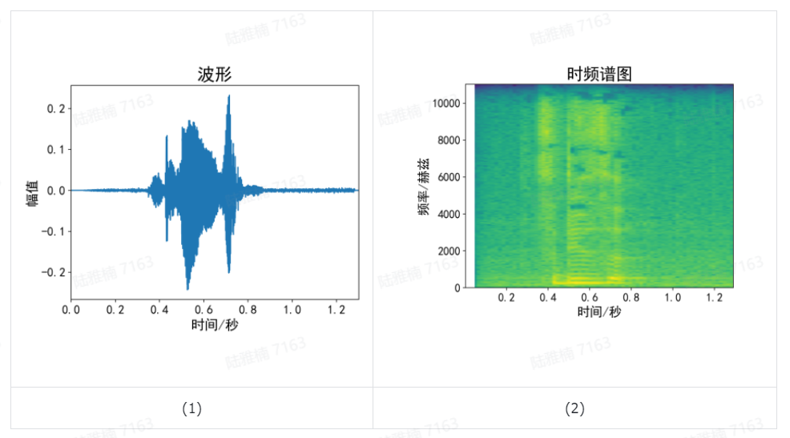
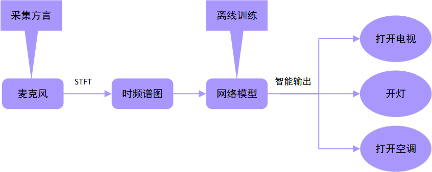
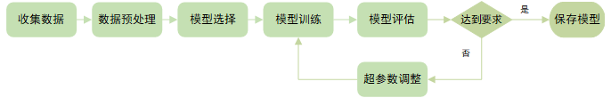
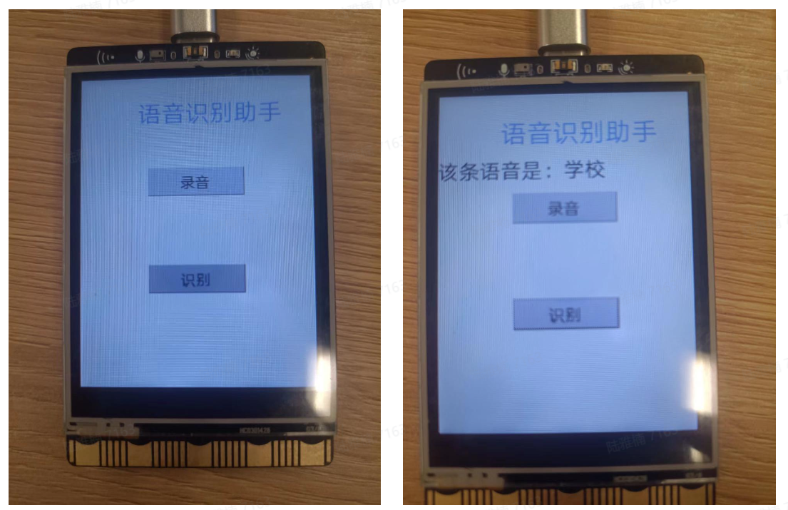

# 项目：让行空板变身为智能音箱

## 一、问题的提出

随着人工智能AI技术的发展，我们可以在很多科创项目中看见使用AI视觉技术实现物体的识别。例如我们之前的文章中就设计了一个“智能稻草人”的科创项目。同时AI技术也可以应用在语音方面，例如家用智能音箱就是通过AI技术对普通话进行识别。但是，目前智能音箱对还不支持方言的识别，因此我们准备设计一个支持方言识别的智能音箱，让不会说普通话的弱势群体也能享受AI的便利。

首先，我们需要一个本地方言的一个数据集，可以在当地图书馆语音库中寻找，同时也能自己录音补充数据集，对原始音频处理后，再通过训练模型，并调整超参数，最终得到一个性能优异的模型。

最后我们需要部署该AI模型，综合考虑开源硬件的性能与价格，我们选择行空板作为开源硬件，行空板自带麦克风看，可采集音频，在由部署在行空板上的AI模型完成音频信号的推理，最终采取相应智能操作。

## 二、可行性分析

1 语音数据集

针对深度学习，数据集是无法避开的话题。首先可以先查找当地图书馆查找本地方言语音库；其次可以自己录音当地方言作为数据集；最后我们使用预训练的模型来迁移学习，仅用少量数据集实现高性能的语音识别。我们最使用的数据集分为训练集和测试集两部分，训练集原本220句音频文件，通过SpecAugment的方法进行数据集增强，得到1520个训练数据。测试集增强后共有520个测试数据。

2 网络模型的输入

语音的原始音频信号是一维信号，若使用其原始音频信号作为网络输入，信号长度较长，同时使用该输入对应的网络模型大小也会很大。若可以将一维信号变成类似于图像的二维信号，那么不仅可以使用各种轻量型卷积神经网络，也可以使用各种预训练ImageNet大规模数据集的模型。短时傅里叶变换(short-time Fourier transform, STFT)就是这样一种方法，STFT可以将一维信号变为二维信号，该二维信号叫做时频谱图，横坐标为时间，纵坐标为频率，颜色深度为对应时间和对应频率的大小，变换前后的信号如下图所示。最终此基础上使用图像分类的方法完成语音识别。



**图1** 变换前后信号

3 AI模型的部署

在离线状态下利用MMEdu训练一个高性能的轻量级模型，再使用行空板，完成一个智能方言小助手的项目，并对不同的方言语音任务做出智能输出。其工作流程图如图2：



**图2** 智能方言小助手工作流程图

## 三、网络搭建和模型训练

**1 网络搭建**

目前网络上的模型十分之多，在Resnet18，shufflenetv2，mobilenetv3中做测试，最终选择Resnet18作为最终模型，使用Resnet18有以下原因：

- 高精度：ResNet18 以其在图像分类任务上的高精度而著称，对于时频谱图的分类ResNet18同样适用。
- 模型大小合适：与其他卷积神经网络CNN 相比，ResNet18 模型适中，推理速度较快，这使得它的训练和部署效率更高。
- 可迁移学习：由于 ResNet18 已经在大型图像数据集上进行了训练，因此可以将其用作迁移学习的起点。 我们仅仅需要在自己的数据集上对其进行微调，以提高其在特定任务上的性能
- 易用性：ResNet18 在许多流行的深度学习框架中实现，MMEdu中同样也有ResNet18，便于我们集成到自己的项目中。

**2 模型训练**

完成完整的网络模型训练包括如下步骤（图3）：

1. 收集与数据集。 数据集包含大量打上标签的数据。
2. 预处理数据集中的数据。 包括将大小调整为一致大小和对数据进行归一化等步骤。
3. 下载预训练模型，使用预训练的ResNet18模型作为迁移学习模型的起点。
4. 使用训练集数训练，迁移学习ResNet18模型。
5. 在测试集中评估迁移学习模型的性能，确定模型对以前未见过的数据进行分类的能力。
6. 如有必要，可通过调整其超参数、添加或删除网络层来进一步提高模型性能。



**图3** 模型训练流程图

使用MMEdu可简化模型训练的步骤，仅需几行代码即可完成预训练的ResNet18网络的迁移学习。代码如下：

```Python
# https://download.pytorch.org/models/resnet18-5c106cde.pth   本地址下载预训练的ResNet18模型 下载好的文件应该叫做 resnet18-5c106cde.pth 的pth文件
# 导入MMEdu
from MMEdu import MMClassification as cls
# 模型实例化
model = cls(backbone='ResNet18')
# 指定输出类别数量，假设是6类
model.num_classes = 6
# 指定数据集的路径 path ='...'改为自己数据集的路径
model.load_dataset(path='...')
# 指定保存模型配置文件和权重文件的路径 ='...' 改为自己想保存的路径
model.save_fold = '...'
# 模型训练，训练完自动保存，checkpoint后面接上resnet18-5c106cde.pth的路径
model.train(epochs=5, validate=True, checkpoint='...')
```

完成训练后，我们导出为onnx格式模型，便于后续行空板上模型的部署。

参考代码如下：

```Python
# 首先安装模型转换必要库
!pip install onnx
!pip install onnxruntime
!pip install onnxsim
# MMEdu支持模型转换为onnx
from MMEdu import MMClassification as cls
# 模型实例化
model = cls('ResNet18')
# 类别确定
model.num_classes = 2
# 将torch模型转换为ONNX
model.convert(checkpoint = "ResNet18.pth",out_file="ResNet18.onnx")
```

## 四、在行空板上部署AI模型

**1 推理环境的安装**

我们通常在计算能力较强的电脑上对模型进行训练，但是行空板上的计算能力是不及电脑的，因此在行空板上部署AI模型，需要运行转换后的onnx模型，并且我们针对的是语音任务，因此我们需要安装一些额外的python库：librosa，pyaudio，onnxruntime。前两个针对音频信号处理，最后一个用于运作转换后的模型。

可使用pip安装：

```Python
!pip install librosa
!pip install pyaudio
!pip install onnxruntime
```

**2 代码范例**

安装相应库后，我们就可以用行空板做一个”方言识别助手“的小程序，主要代码如下：

暂时无法在飞书文档外展示此内容

项目相关文件可在以下网址找到：https://www.openinnolab.org.cn/pjlab/project?id=63b7c66e5e089d71e61d19a0&sc=635638d69ed68060c638f979#public

其结果如下图所示：



## 五、总结

我们使用行空板开发出了一个方言识别的小助手。首先针对数据集，我们上网查找本地方言语音库，并自己手动录制本地方言；其次对于语音信号，我们采用了STFT的方法将一维的时序信号变为了二维的图像信号；再其次，我们选择了预训练的ResNet18的模型，并在方言语音数据集中进行微调，得到高性能模型，并导出为ONNX格式；最后将ONNX格式模型部署在行空板上，并安装对应python库，最终实现离线的方言语音识别小助手。更多模型转换和部署的内容详见[AI模型部署部分](https://xedu.readthedocs.io/zh/master/mmedu/model_convert.html)。

本项目文档已发表于《中国信息技术教育》2023年第一期。

## 参考文献：

[1]谢作如,胡君豪.让行空板变身为能识别方言的智能音箱[J].中国信息技术教育,2023(01):93-95.