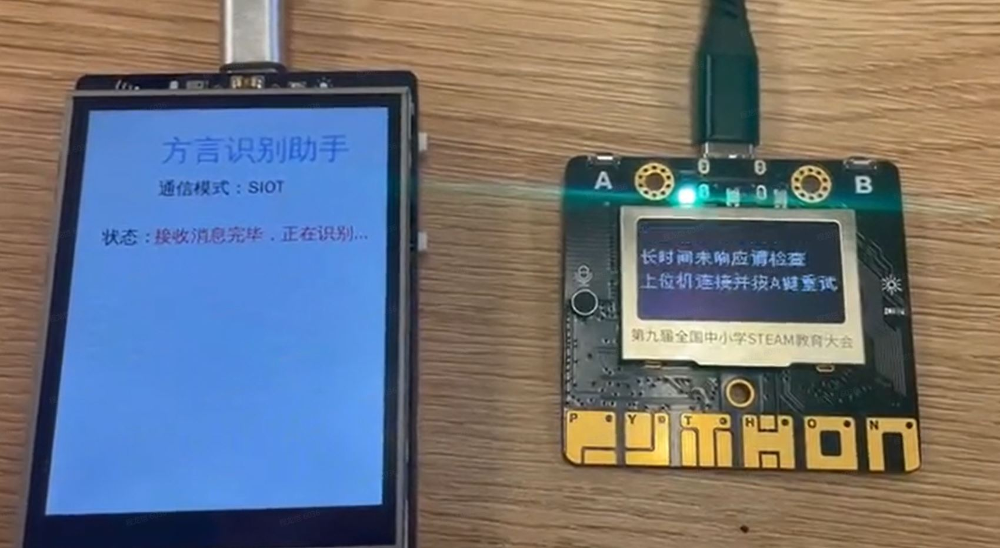
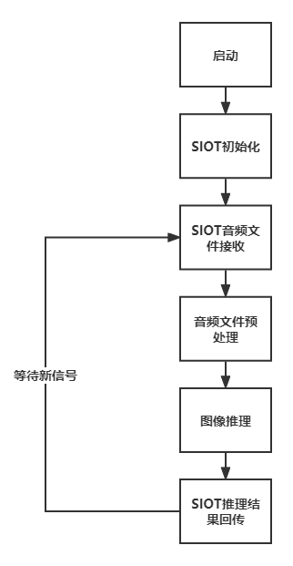
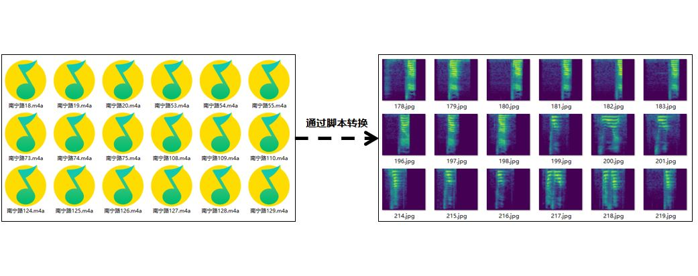

项目：结合SIoT的智能语音识别——让掌控板也能识别语音
==================================================

一、项目概述
------------

将音频文件转化为图片再进行识别，是中小学创客活动中常见的语音识别方式。
掌控板因为不能直接部署AI模型，在智能系统中往往用来担任执行设备，即执行命令、显示信息的终端设备。本项目是一个结合掌控板与行空板的项目。对\ `蘑菇云社区发表的“AI助听器”项目 <https://mp.weixin.qq.com/s/LT0M-d4BmgW36BCF-PahiA>`__\ 进行深度分析，挖掘
了掌控板内置麦克风的功能，设计了利用掌控板录音、行空板推理的工作方式，并给出了标准化的参考代码，为中小学AI科创项目的开发提供了新方案。

实现的功能是掌控板监听现实环境，当其分贝超过某一阈值时，掌控板开始进行录音，将掌控板收集到的语音信息通过SIoT传输至行空板，并在行空板上执行推理后将结果返回，掌控板监听SIoT消息后，将结果回显。

.. figure:: ../../images/support_resources/功能.png

二、项目设计
------------

将掌控板作为下位机，获取语音，通过\ `siot <https://xedu.readthedocs.io/zh/latest/scitech_tools/siot.html>`__\ 协议（mqtt教育版）发送至行空板，行空板作为上位机，执行监听siot，语音转图像，onnx后端推理，发送执行命令等功能，结合传统物联网教学设计，形成一个完整的物联网语音读取，传输，识别和反馈的设计流程。

三、背景知识
------------

**音频信号：**\ 声音以音频信号的形式表示，音频信号具有频率、带宽、分贝等参数，音频信号一般可表示为振幅和时间的函数。这些声音有多种格式，因此计算机可以对其进行读取和分析。例如：mp3
格式、WMA (Windows Media Audio) 格式、wav (Waveform Audio File) 格式。

**时频谱图：**\ 时频谱图是一种用于分析信号在时间和频率上的变化的工具。它将信号在时间和频率上的特征展示在一个二维图上，可以帮助我们更好地理解信号的性质。时频谱图的横坐标是时间，纵坐标是频率，坐标点值为语音数据能量。由于是采用二维平面表达三维信息，所以能量值的大小是通过颜色来表示的，颜色深，表示该点的语音能量越强。语音的时域分析和频域分析是语音分析的两种重要方法，但是都存在着局限性。时域分析对语音信号的频率特性没有直观的了解，频域特性中又没有语音信号随时间的变化关系。而语谱图综合了时域和频域的优点，明显地显示出了语音频谱随时间的变化情况、语谱图的横轴为时间，纵轴为频率，任意给定频率成分在给定时刻的强弱用颜色深浅来表示。颜色深的，频谱值大，颜色浅的，频谱值小。语谱图上不同的黑白程度形成不同的纹路，称之为声纹，不同讲话者的声纹是不一样的，可用作声纹识别。

**SIoT实现报文分片传输：**\ SIoT分片传输报文是其提出的一种通信方案，旨在解决物联网设备通信中数据量过大、丢包率高等问题。在物联网中，设备之间需要进行数据传输，但是由于物联网设备的局限性，比如内存和带宽等方面的限制，导致数据传输时可能会遇到很多问题。比如，数据量太大可能无法一次性传输完毕，而且网络不稳定，有可能导致数据包丢失或损坏。为了解决这些问题，用SIOT实现了分片传输报文的概念，将一个数据包分成多个较小的数据块进行传输，同时利用校验和和序列号等机制保证数据的完整性和正确性，以提高数据传输的可靠性。

::

   import binascii
   for index in range(0, len(audio_bytes), step_size):
       b = binascii.b2a_base64(audio_bytes[index:min(index+step_size,len(audio_bytes))])
       siot.publish(IOT_pubTopic, b)

其中，\ **import binascii**
是Python内置模块之一，提供了二进制数据和ASCII字符串之间转换的函数。在上述代码中，它被用于将音频字节码转换为base64编码的ASCII字符串。这段代码的作用是将大型的音频文件分成若干个较小的块，每个块大小为
**step_size**\ ，然后通过\ **SIOT**\ 协议发布到指定的主题
**IOT_pubTopic**\ 。在每次循环迭代时，使用 **binascii.b2a_base64()**
函数将当前块转换为base64编码的ASCII字符串，并将其发布到指定主题。其中，
**min(index+step_size,len(audio_bytes))** 用于确保最后一个块小于等于
**step_size** 大小，以避免在分块时发生错误。

**录制音频：**\ 使用掌控板中内置的\ **audio**\ 模块进行音频的录制，其中
**duration** 为想要录制的时间长度，一般设为1-2秒。

::

   audio.recorder_init(i2c)
   audio.record(audio_file, duration)
   audio.recorder_deinit()

其中，\ **audio.recorder_init(i2c)**\ 会初始化音频传感器并进行必要的设置。参数i2c指定了使用的
I2C
总线。该函数必须在使用录音功能之前调用一次，通常只需要调用一次。\ **audio.record(audio_file,
duration)**\ 用于开始录音，并将录制的音频写入到指定的文件中（例如wav格式的文件）。参数audio_file指定了输出的音频文件路径和名称，参数duration指定了录制音频的时长，单位为秒。\ **audio.recorder_deinit()**\ 则是关闭并释放音频传感器所占用的资源。通常应该在完成录音后调用该函数来释放资源，避免资源浪费和程序崩溃。

**音频监听：**\ 掌控板需要持续发送声音数据，行空板进行实时检测，如果检测到环境中的声音高于设定的阈值，就需要开始记录音频数据并在录制结束后，将其送进行音频预处理后送入推理机进行推理。如下图所示，当音频的能量进入阈值区域内中才开始录音。

**批量生成时频谱图：**\ 详情见
`行空板上温州话识别 <https://www.openinnolab.org.cn/pjlab/project?id=63b7c66e5e089d71e61d19a0&backpath=/pjlab/projects/list#public>`__
和
`用卷积神经网络实现温州话语音分类 <https://www.openinnolab.org.cn/pjlab/project?id=6379b63262c7304e16ed6d82&backpath=/pjlab/projects/list#public>`__\ 。

通过上述两个项目中的内置脚本，可将音频文件，批量转换为时频谱图。具体来说即是将以音频格式为结尾的文件转换为以图像格式为结尾的文件，以期可用分类模型进行推理。

|image|\ **wav音频预处理**\ ：要想将接收到的wav文件送入ONNXRruntime推理机进行推理，还需对得到的wav音频文件进行图像预处理，具体的函数参考如下：

::

   def wav2tensor(file_path, backbone):
       """
       对wav音频文件进行数据预处理，返回推理机需要的数据类型
       :param file_path: wav音频文件地址
       :param backbone: 推理机网络模型选择
       :return:推理机需要的数据类型
       """
       viridis_cmap = plt.get_cmap('viridis')
       color_map = viridis_cmap.colors
       color_map = (np.array(color_map) * 255).astype(np.uint8)
       fs = 16000
       if isinstance(file_path, str):
           fs0, wave = wav.read(file_path)  # 读取原始采样频率和数据
           if fs0 != fs:  # 如果采样频率不是16000则重采样
               num = int(len(wave) * fs / fs0)  # 计算目标采样点数
               wave = signal.resample(wave, num)  # 对数据进行重采样
       spec = librosa.feature.melspectrogram(wave, sr=fs, n_fft=512)
       spec = librosa.power_to_db(spec, ref=np.max)

       spec_new = (((spec + 80) / 80) * 255).astype(np.uint8)
       h, w = spec_new.shape
       rgb_matrix = np.array([color_map[i] for i in spec_new.flatten()]).reshape(h, w, 3)
    
       image = Image.fromarray(rgb_matrix.astype(np.uint8))
       image = np.array(image)
       dt = ImageData(image, backbone=backbone)
       return dt.to_tensor()

这是一个用于对音频文件进行预处理的函数。它的作用是将音频信号转换为可以被深度学习模型使用的张量类型。函数接受两个参数：file_path（音频文件路径）和
backbone（推理机网络模型选择），并返回推理机所需的数据类型。具体步骤如下：

1. 从 matplotlib 库中获取 viridis 颜色映射，并转换为 numpy 数组类型。
2. 读取音频文件，如果采样频率不是16000则进行重采样。
3. 使用 librosa
   库提取音频信号的梅尔频谱图特征，并将其转换为以分贝为单位的特征矩阵。
4. 对梅尔频谱图进行归一化处理，并将其转换为 RGB 图像。
5. 将 RGB 图像转换为 ImageData 类型，并传入 backbone
   参数，得到最终的张量数据类型。

四、项目实现
------------

第一步：使用MMEdu进行模型训练和模型转换
~~~~~~~~~~~~~~~~~~~~~~~~~~~~~~~~~~~~~~~

使用平台提供的
`行空板上温州话识别 <https://www.openinnolab.org.cn/pjlab/project?id=63b7c66e5e089d71e61d19a0&backpath=/pjlab/projects/list#public>`__
和
`用卷积神经网络实现温州话语音分类 <https://www.openinnolab.org.cn/pjlab/project?id=6379b63262c7304e16ed6d82&backpath=/pjlab/projects/list#public>`__\ 的项目案例，进行数据收集，模型训练和转换的步骤，得到转换好的onnx模型下载保存至本地。

第二步：上位机（行空板端）程序制作
~~~~~~~~~~~~~~~~~~~~~~~~~~~~~~~~~~

在这个系统中，行空板作为服务器（也称上位机）实时监听MQTT消息，将有效的语音转为图像后进行推理，再发送识别后的结果或者相应的命令。行空板除了能执行模型推理的工作外，其优势在于内置了SIoT服务器软件。SIoT是一款使用非常方便的MQTT服务器，不用设置就能直接使用。

首先连接行空板并打开jupyter进行编程：

通过USB串口连接行空板后，通过浏览器访问本地地址
10.1.2.3，进入行空板编程的界面。如有问题可自行查找行空板说明教程。

设计程序逻辑：

根据项目整体设计，通过流程图描述想要在上运行的程序逻辑，以进一步的清晰自己的程序想要实现的功能。

程序实现：

::

   #实例化GUI类
   gui=GUI()
   gui.draw_text(x=60, y=20,color="#4169E1", font_size=18,text="方言识别助手")
   gui.draw_text(x=60, y=60,color="#000000", font_size=10,text="通信模式：SIOT")
   gui.draw_text(x=20, y=100,color="#000000", font_size=10,text="状态：")
   info_text = gui.draw_text(x=60, y=100, color="red",font_size=10,text="")
   info_text_1 = gui.draw_text(x=60, y=140, color="red",font_size=10,text="")

   # ONNX模型导入
   sess = rt.InferenceSession("mobilenetv2.onnx")

   # SIOT参数设置
   SERVER = "192.168.31.29"
   CLIENT_ID = "XEdu"
   IOT_recTopic  = 'ailab/sensor1'
   IOT_pubTopic = 'ailab/sensor2'
   IOT_UserName ='siot'
   IOT_PassWord ='dfrobot'

   # SIOT接收步长与消息内容
   step_size = 4096
   message_tol = b''

   # 音频参数
   viridis_cmap = plt.get_cmap('viridis')                   
   color_map = viridis_cmap.colors
   color_map = (np.array(color_map) * 255).astype(np.uint8)

   label = ["吃饭", "回家", "学校", "看电视", "睡觉"]

   def wav2tensor(file_name):
       wave = file_name
       fs = 16000
       if type(wave) == str :
           fs0, wave = wav.read(wave) # 读取原始采样频率和数据
           if fs0 != fs:        #如果采样频率不是16000则重采样
               num = int(len(wave) * fs/ fs0) # 计算目标采样点数
               wave = signal.resample(wave, num) # 对数据进行重采样
       spec = librosa.feature.melspectrogram(wave, sr=fs, n_fft=512)
       spec = librosa.power_to_db(spec, ref=np.max)
       
       spec_new = (((spec+80)/80)*255).astype(np.uint8)
       h,w = spec_new.shape
       rgb_matrix = np.array([color_map[i] for i in spec_new.flatten()]).reshape(h, w, 3)
       
       image = Image.fromarray(rgb_matrix.astype(np.uint8))
       image = np.array(image)
       dt = ImageData(image,backbone = 'MobileNet')
       return dt.to_tensor()

   def onnx_infer(file_name):
       input_name = sess.get_inputs()[0].name
       out_name = sess.get_outputs()[0].name
       input_data = wav2tensor(file_name)
       pred_onx = sess.run([out_name], {input_name:input_data})
       ort_output = pred_onx[0]
       idx = np.argmax(ort_output, axis=1)[0]
       info_text.config(x=60, y=100, text='结果：'+ label[idx])
       info_text_1.config(x=60, y=140, text='置信度：' + str(round(ort_output[0][idx], 2)))
       str_pub = '结果：'+ label[idx] + ' 置信度：' + str(round(ort_output[0][idx], 2))
       print(str_pub)
       siot.publish(IOT_pubTopic, str_pub)
       

   def file_save(message_tol):
       file_name = "output.wav"
       sample_width = 2  # 2字节的采样宽度
       sample_rate = 8000  # 采样率为44100Hz
       channels = 1  # 双声道
       with wave.open(file_name, "wb") as wav_file:
           wav_file.setnchannels(channels)
           wav_file.setsampwidth(sample_width)
           wav_file.setframerate(sample_rate)
           wav_file.writeframes(message_tol)
       wav_file.close()
       onnx_infer(file_name)
       
   def EasyAIoT(client, userdata, msg):
       info_text.config(x=60, y=100, text='SIOT正在接收消息...')
       info_text_1.config(x=60, y=140, text='')
       global message_tol
       topic = msg.topic
       payload = msg.payload.decode()
       receive_msg = binascii.a2b_base64(payload)
       if isinstance(receive_msg,bytes) and len(receive_msg) > 0:
           message_tol += receive_msg
           if len(receive_msg)!= step_size:
               info_text.config(x=60, y=100, text='接收消息完毕，正在识别...')
               info_text_1.config(x=60, y=140, text='')
               tmp_message = message_tol
               message_tol = b''
               # 将接收到的结果保存至本地
               file_save(tmp_message)
       else:
           message_tol = b''

   if __name__ == '__main__':
       siot.init(CLIENT_ID, SERVER, user=IOT_UserName, password=IOT_PassWord)
       siot.connect()
       info_text.config(x=60, y=100, text='SIOT已启动，等待消息接收')
       siot.loop()
       siot.subscribe(IOT_recTopic, EasyAIoT)

第三步：下位机（掌控板）程序制作
~~~~~~~~~~~~~~~~~~~~~~~~~~~~~~~~

掌控板作为终端（也可以称为下位机），主要任务是实时检测音频，并通过MQTT协议发送至行空板，并且实时监视服务器传送的消息，根据不同的指令执行相应的工作。我们设计返回的消息是一个列表，如“[‘sms’,‘敲门’]”表示有人敲门，“[‘sms’,‘哭声’]”表示有孩子在哭。然后根据不同的消息内容执行不同的工作。

首先打开mPython连接掌控板进行编程：

进入掌控板，通过USB串口进行设备的连接，成功连接后，mPython的中心会出现绿色圆圈，并显示已连接。如有问题可自行查找mPython和掌控板相关说明文档。

设计程序逻辑：

根据项目整体设计，通过流程图描述想要在掌控板上运行的程序逻辑，以进一步的清晰自己的程序想要实现的功能。

下面编写代码，将程序逻辑中描述的内容通过代码编程的形式实现出来。

启动并配置网络：

这段代码导入network模块，进行wifi配置，目的是为了掌控板和行空板保持在同一局域网中，可以通过私网地址进行SIOT消息通信。

::

   import network
   my_wifi = wifi()
   my_wifi.connectWiFi("wifi名称", "wifi密码")

SIoT初始化：

这段代码导入了一个名为“siot”的模块，该模块提供连接到物联网平台的功能。代码定义了几个变量，包括服务器的IP地址、客户端ID、发布和接收主题以及登录物联网平台的凭据。随后，创建了一个“iot”类的实例，其中传递了已定义的客户端ID和服务器IP地址，以及作为参数传递的登录凭据。调用此实例上的“connect()”方法，以建立与物联网平台的连接，然后调用“loop()”方法启动一个循环，监听来自订阅主题的传入消息。这段代码可以使用SIOT协议连接并与物联网平台通信。

::

   from siot import iot
   SERVER = "192.168.31.29"
   CLIENT_ID = "XEdu"
   IOT_pubTopic  = 'ailab/sensor1'
   IOT_recTopic  = 'ailab/sensor2'
   IOT_UserName ='siot'
   IOT_PassWord ='dfrobot'

界面UI：

掌控板内置传统的OLED屏幕，可通过mPython内置的oled实例对掌控板的界面UI进行绘制，绘制的理念是简单化，传递程序流运行的整个流程，部分代码如下所示：

::

   oled.fill(0)
   oled.DispChar(str('语音识别：SIOT模式'), 0, 0, 1)
   oled.DispChar(str('按下 A键 开始监听音频'), 0, 16, 1)
   oled.show()

oled.fill(0)：将屏幕背景填充为黑色，数字0代表黑色。

oled.DispChar(str(‘语音识别：SIOT模式’), 0, 0,
1)：在坐标为(0,0)的位置上显示字符串“语音识别：SIOT模式”，数字1代表字体大小。

oled.DispChar(str(‘按下 A键 开始监听音频’), 0, 16,
1)：在坐标为(0,16)的位置上显示字符串“按下 A键
开始监听音频”，数字1代表字体大小。

oled.show()：将以上修改后的内容显示在OLED屏幕上。

按键触发：

掌控板内置了A和B键以供用户触发，下面给的示例主要是对Micro:bit上的A按钮进行操作的。参考代码如下所示：

::

   def on_button_a_pressed(_):
       pass
   button_a.event_pressed = on_button_a_pressed

def
on_button_a_pressed(\ *)：定义了一个名为on_button_a_pressed的函数，当A按钮被按下时会执行其中的代码。这个函数接收一个参数"*\ “，但实际上并没有用到这个参数，所以在函数体内部使用了关键词”pass"表示什么也不做（因为这段代码只是个示例~）。

button_a.event_pressed =
on_button_a_pressed：将on_button_a_pressed函数赋值给button_a的event_pressed属性，意味着当A按钮被按下时会触发该属性中存储的函数（即on_button_a_pressed函数）。

效果演示
~~~~~~~~

.. figure:: ../../images/support_resources/掌控板siot.gif

