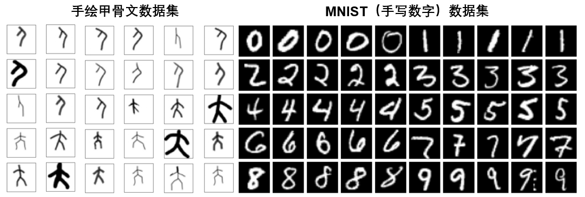
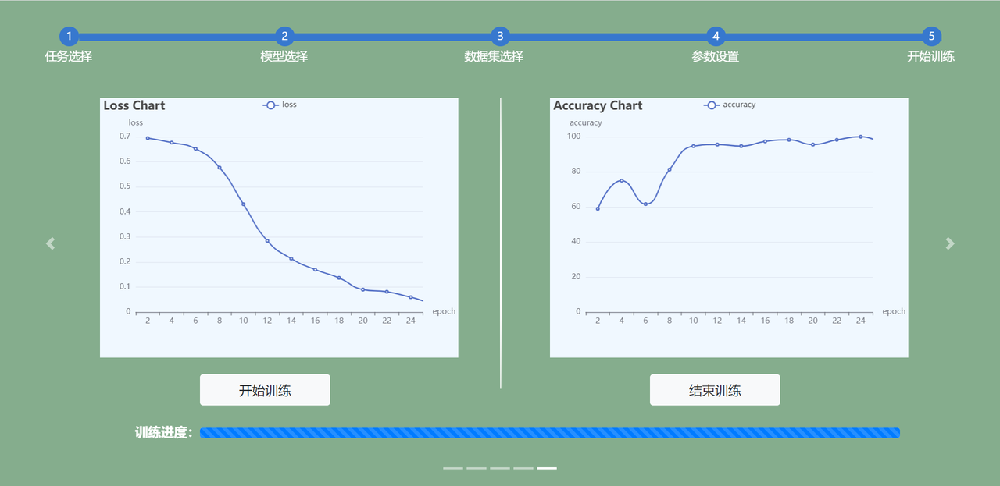
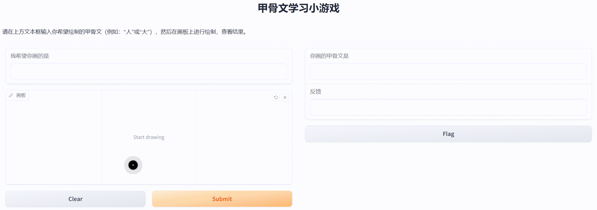

# 项目：用XEdu做一个趣味甲骨文学习系统
## 项目背景

XEdu工具推出一年多来已逐渐获得中小学师生的认可，越来越多老师开始尝试用AI解决一些真实问题。作为XEdu工具团队的研究员，我常常跟老师们交流各种有趣的想法。近日有位老师提出“学完XEdu‘MNIST手写体数字’识别，能不能做点创新，试着做甲骨文识别？”给我们一个新的思路。因为现代科技的快速发展容易导致传统文化被边缘化。而甲骨文作为古老的汉字书写形式，其独特魅力和文化价值不应被遗忘。如果能够用AI技术对传统文化进行再创作，肯定很有意义，也能吸引青少年学习并欣赏甲骨文。

经调研，近年甲骨文相关的小视频也一度非常火爆，这类视频大多是将甲骨文做成动画或表情包，创意比较单一。我们决定另辟蹊径，做个凸显互动性的学习小游戏。让学生在网页上以“涂鸦”的形式书写甲骨文，系统则给出评价，这样一来，能给学生提供更加直观、生动的学习体验，在感受甲骨文的独特魅力的同时，也体验了AI的图像分类技术的神奇。

## 一、趣味甲骨文学习系统的开发技术分析

从技术角度看，系统的核心是实现甲骨文识别。按照深度学习的一般流程，首先是收集很多甲骨文的图片，形成数据集，然后训练一个图像分类的AI模型。在XEdu工具的图像分类模块的帮助下，训练AI模型用几行代码就能完成，已经不再是难题。相对而言，难度较高的是数据集的制作。因为我们在互联网上暂时没有找到能够直接使用的甲骨文字符数据，只能自己以手绘的形式来制作这个数据集。考虑到工作量，我们仅仅选择了“人”和“大”这两个文字。

采集数据需确保数据的质量和多样性，我们参照深度学习领域著名的手写数字数据集MNIST，进行了手绘甲骨文字符数据集的采集与整理。手绘主要使用电脑自带的画图软件进行字符手绘并保存为图片，特意使用了多种类型的，不同粗细的画笔工具绘制。每个类别的图片达到500张后，便开始整理数据集为ImageNet格式，即XEdu的图像分类模型支持的数据集格式，合理划分训练集、验证集和测试集。

我做的数据集和MNIST对照图：



## 二、趣味甲骨文学习系统的实现

图像分类模型的方面，我们选择LeNet网络。因为对于白底黑色字符的甲骨文字符数据集来说，LeNet是非常适合的，速度快且效果好。如果不想写代码，那就用XEdu内置的EasyTrain工具。以下是EasyTrain训练的图示，“loss”表示模型在训练集上的损失值，用以衡量模型预测结果与真实值之间的差异。而“accuracy”代表每轮训练结束后，模型在验证集上的预测准确率。

EasyTrain训练界面：



趣味甲骨文学习系统的交互设计部分，是借助Gradio来实现的。Gradio其核心是Interface类，参考代码如图所示，通过关联的处理函数“predict”，以及定义“inputs”输入组件类型，“ouputs”输出组件类型，运行代码便可启动一个直观的、用户友好的模型交互界面。

```
import gradio as gr
from MMEdu import MMClassification as cls
model = cls(backbone = 'LeNet')
checkpoint='best_accuracy_top-1_epoch_14.pth'

def predict(input_img):
    result = model.inference(image=input_img, show=False, checkpoint=checkpoint) 
    result = model.print_result(result)
    return input_img,result

demo = gr.Interface(fn=predict,  inputs=gr.Image(shape=(128, 128),source="canvas"), outputs=["image","text"])
demo.launch(share=True)
```

## 三、系统测试与完善

当完成了简易的学习系统实现后，我们开始思考真实环境中可能遇到的挑战，调研更多丰富的模型展示系统或学习系统。归纳出两个方向的完善思路：1）从软件开发入手，尝试增加一些创新和个性化功能，如加入游戏说明、展示正确的答案并给出反馈等；2）从AI识别入手，尝试改进模型准确度和识别速度，如增加数据、调整模型结构等。

1.设计并完善模型功能展示界面

优化处理函数和输入输出组件来提高可玩性，比如加入学习游戏的逻辑设置，先自己输入甲骨文绘制目标文字，再进行绘图，提交后由AI判断是否准确；还可以给自己的学习系统的界面加入使用说明，计时积分等功能。

逻辑设计的代码：

首先需输入一个预期的指令或描述“instruction”，例如“画甲骨文字符人”。设置一个检查预测的结果是否与输入的“instruction”相匹配的反馈函数，如果匹配，返回一条鼓励的反馈：“恭喜！你画得很好！”。如果不匹配，返回一条指出错误的反馈，例如：“不太对哦，我期望的是：人，但你画的像：大。”最终反馈反馈信息和结果文本。

```
def instruct_and_predict(instruction, input_img=None):
    result = model.inference(image=input_img, show=False, checkpoint=checkpoint)
    result_text = model.print_result(result)
    feedback = ""
    if instruction == result_text[0]['预测结果']:
        feedback = "恭喜！你画得很好！"
    else:
        feedback = f"不太对哦，我期望的是：{instruction}，但你画的像：{result_text[0]['预测结果']}。"

    return result_text, feedback
```

深入思考会让我们意识到当前的逻辑可能并未考虑得尽善尽美，比如“instruction”是空的，会判断吗？如果画了完全不是甲骨文字符的图案，会输出什么？也就是全文提到的真实环境中可能遇到的挑战都是我们需要考虑的细节，考虑到的同时还应积极寻找解决方案。例如，我们可以引入更多的条件判断，如检查输入是否为空，或增加置信度评估。置信度能够反映模型对其预测结果的信心程度。在图像分类任务中，置信度表示模型预测某个类别的概率大小。如果一张图片与模型可识别的任何类别都不接近，其置信度自然不会高。

甲骨文学习小游戏运行效果：



2.加入模型转换与应用

模型转换为ONNX模型后，借助XEduHub可完成模型推理，代码变得更加精简，且推理速度更快，更便于学习系统的开发。

模型转换的代码：

```
from MMEdu import MMClassification as cls
model = cls(backbone='LeNet')
checkpoint = 'best_accuracy_top-1_epoch_11.pth'
out_file='Oracle.onnx'
```

转换后模型部署的代码：

```
import gradio as gr
from XEdu.hub import Workflow as wf
my_cls = wf(task='MMEdu',checkpoint='Oracle.onnx')
def predict(input_img):
    result,image = my_cls.inference(data=input_img,img_type='cv2') 
    re = my_cls.format_output(lang="zh")
    return image,re
demo = gr.Interface(fn=predict,  inputs=gr.Image(shape=(128, 128),source="canvas"), outputs=["image","text"])
demo.launch(share=True)
```

完整的项目相关文件可在以下网址找到：

[https://www.openinnolab.org.cn/pjlab/project?id=64faba48929a840fc49ced33&sc=62f34141bf4f550f3e926e0e#public](https://www.openinnolab.org.cn/pjlab/project?id=64faba48929a840fc49ced33&sc=62f34141bf4f550f3e926e0e#public)

## 四、从项目设计到课程开发

当我们借助XEdu工具，成功搭建了这个趣味甲骨文学习系统后，才意识到这一做法为学生提供了一个有趣的学习途径。在制作数据集的时候，我们找了好多资料，也学到了很多关于中国古代文字的知识。而这一过程完全可以让学生来参与，也就是让学生来制作数据集。学生可以选择自己感兴趣的文字，通过研究和手绘制作出不同的数据集来。还可以通过测试，找出数据集的“瑕疵”，促使学生要研究更多的甲骨文写法，让数据集更加丰富。

因而我们准备以这一项目为基础，开发一个完整的项目式学习课程，引导学生亲身参与从数据收集、模型训练到模型部署的完整过程。项目计划6课时，配合课程设计可将此项目分成大任务和子任务，大任务是完成一个趣味甲骨文学习小游戏，小任务则围绕项目创作的流程进行拆分，包括主题选择、创意构思、数据准备、模型训练、游戏开发、测试优化等。虽然本项目起因是为一位老师解决问题，但希望能举一反三，吸引更多的师生参与其中，让更多的人能够深入了解和掌握AI技术的强大能力，并促进对传统文化的创造性转化。

配套课程设计：

[https://www.openinnolab.org.cn/pjedu/teach?mode=learn&courseId=646caecf32f2ea160081ff42&scheduleId=65390a43d36e4272c1dbbdc6&documentId=6530ddc0f6aa31374a401ad1&from=courseCenter](https://www.openinnolab.org.cn/pjedu/teach?mode=learn&courseId=646caecf32f2ea160081ff42&scheduleId=65390a43d36e4272c1dbbdc6&documentId=6530ddc0f6aa31374a401ad1&from=courseCenter)