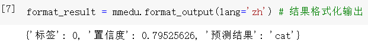
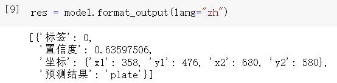
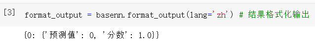

# XEduHub通用任务

XEduHub的通用任务也称外部模型任务，指预置模型之外的第三方模型实现的AI任务。通用任务分为两种情况，一是用XEdu系列工具训练的模型，如MMEdu（计算机视觉）、BaseNN（自定义神经网络）和BaseML（传统机器学习）；二是用其他工具训练的模型。考虑到兼容性，大部分模型以ONNX为主。XEduHub的通用任务分类和task名称如图所示。


不管使用哪类任务，XEduHub都使用Workflow工具进行推理，核心代码仅4行，语法非常简洁。

**强烈推荐项目<a href="https://www.openinnolab.org.cn/pjlab/project?id=65518e1ae79a38197e449843&backpath=/pjlab/projects/list#public">XEduHub实例代码-入门完整版</a>**

<a href="https://www.openinnolab.org.cn/pjlab/project?id=65518e1ae79a38197e449843&backpath=/pjlab/projects/list#public">https://www.openinnolab.org.cn/pjlab/project?id=65518e1ae79a38197e449843&backpath=/pjlab/projects/list#public</a>

通过学习“XEduHub实例代码-入门完整版”，可以在项目实践中探索XEduHub的魅力，项目中通俗易懂的讲解和实例代码也能帮助初学者快速入门XEduHub。

## 1. XEdu系列工具模型

### MMEdu模型

XEduHub现在可以支持使用MMEdu导出的onnx模型进行推理啦！如果你想了解如何使用MMEdu训练模型，可以看这里：[解锁图像分类模块：MMEduCls](https://xedu.readthedocs.io/zh-cn/master/mmedu/mmeducls.html)、[揭秘目标检测模块：MMEduDet](https://xedu.readthedocs.io/zh-cn/master/mmedu/mmedudet.html#mmedudet)。

如果你想了解如何将使用[MMEdu](https://xedu.readthedocs.io/zh-cn/master/mmedu.html)训练好的模型转换成ONNX格式，可以前往[最后一步：模型转换](https://xedu.readthedocs.io/zh-cn/master/mmedu/mmedumodel_convert.html)。OK，准备好了ONNX模型，那么就开始使用XEduHub吧！

#### （1）MMEdu图像分类模型

##### 代码样例

```python
from XEdu.hub import Workflow as wf
mmcls = wf(task='mmedu',checkpoint='cats_dogs.onnx')# 指定使用的onnx模型
result, result_img =  mmcls.inference(data='data/cat.png',img_type='pil')# 进行模型推理
format_result = mmcls.format_output(lang='zh') # 推理结果格式化输出
mmcls.show(result_img) # 展示推理结果图片
mmcls.save(result_img,'new_cat.jpg')# 保存推理结果图片
```

##### 代码解释

###### 1. 模型声明

```python
from XEdu.hub import Workflow as wf
mmcls = wf(task='mmedu',checkpoint='cats_dogs.onnx') # 指定使用的onnx模型
```

`wf()`中共有两个参数可以设置：

- `task`：只需要设置task为`mmedu` ，而不需要指定是哪种任务。
- `checkpoint`：指定你的模型的路径，该参数不能为空，如`checkpoint='cats_dogs.onnx'`。

这里我们以猫狗分类模型为例，项目指路：[猫狗分类](https://www.openinnolab.org.cn/pjlab/project?id=63c756ad2cf359369451a617&sc=647b3880aac6f67c822a04f5#public)。

###### 2. 模型推理

```python
result, result_img =  mmcls.inference(data='data/cat101.jpg',img_type='pil') # 进行模型推理
```

模型推理`inference()`可传入参数：

- `data`(str)：指定待检测的图片。
- `show`(bool): 可取值：`[True,False]` 默认为`False`。如果取值为`True`，在推理完成后会直接输出目标检测完成后的图片。
- `img_type`(str)：分类完成后会返回含有分类标签的图片，该参数指定了返回图片的格式，可选有:`['cv2','pil']`，默认值为`None`，如果不传入值，则不会返回图。
- `thr`(float): 设置推理阈值，取值范围为`[0,1]`，预测结果的置信度高于这个阈值时，这些结果才会被认为是有效的。

`result`是一个字典，包含三个键：`标签`、`置信度`和`预测结果`。

`result_img`以img_type设置的格式保存了模型推理完成后的图片（原图+推理结果）。

###### 3. 结果输出

```python
format_result = mmcls.format_output(lang='zh') # 推理结果格式化输出
```

`format_output()`能够将模型推理结果以标准美观的方式进行输出。输出结果与`format_result`保存的内容一致。

`format_output()`中共有两个参数可以设置：

- `lang`(str) - 可选参数，设置了输出结果的语言，可选取值为：[`'zh'`,`'en'`,`'ru'`,`'de'`,`'fr'`]，分别为中文、英文、俄语、德语、法语，默认为中文。
- `isprint`(bool) - 可选参数，设置了是否格式化输出，可选取值为：[`True`,`False`]，默认为True。

```
# 输出结果
{'标签': 0, '置信度': 0.79525626, '预测结果': 'cat'}
```



`format_result`以字典形式保存了模型的推理结果，包括所属`标签`、`置信度`、以及`预测结果`。

```python
mmcls.show(result_img) # 展示推理结果图片
```

`show()`能够推理后的结果图像。与原图相比，结果图片在左上角多了`pred_label`, `pred_socre`和`pred_class`三个数据，对应着标签、置信度和预测结果。


###### 4. 结果保存

```python
mmcls.save(img,'new_cat.jpg') # 保存推理结果图片
```

`save()`方法能够保存推理后的结果图像

该方法接收两个参数，一个是图像数据，另一个是图像的保存路径。

#### （2）MMEdu目标检测模型

##### 代码样例

```python
from XEdu.hub import Workflow as wf
mmdet = wf(task='mmedu',checkpoint='plate.onnx') # 指定使用的onnx模型
result, result_img =  mmdet.inference(data='data/plate0.png',img_type='pil') # 进行模型推理
format_result = mmdet.format_output(lang='zh') # 推理结果格式化输出
mmdet.show(result_img) # 展示推理结果图片
mmdet.save(result_img,'new_plate.jpg') # 保存推理结果图片
```

##### 代码解释

###### 1. 模型声明

```python
from XEdu.hub import Workflow as wf
mmdet = wf(task='mmedu',checkpoint='plate.onnx') # 指定使用的onnx模型
```

`wf()`中共有两个参数可以设置：

- `task`：只需要设置task为`mmedu` ，而不需要指定是哪种任务。
- `checkpoint`：指定你的模型的路径，该参数不能为空，如`checkpoint='plate.onnx'`。

这里以车牌识别为例进行说明。项目指路：[使用MMEdu实现车牌检测](https://www.openinnolab.org.cn/pjlab/project?id=641426fdcb63f030544017a2&backpath=/pjlab/projects/list#public)

###### 2. 模型推理

```python
result, result_img =  mmdet.inference(data='data/plate0.png',img_type='pil') # 进行模型推理
```

模型推理`inference()`可传入参数：

- `data`(str)：指定待检测的图片。
- `show`(bool): 可取值：`[True,False]` 默认为`False`。如果取值为`True`，在推理完成后会直接输出目标检测完成后的图片。
- `img_type`(str)：目标检测完成后会返回含有检测框的图片，该参数指定了返回图片的格式，可选有:`['cv2','pil']`，默认值为`None`，如果不传入值，则不会返回图。
- `thr`(float): 设置检测框阈值，取值范围为`[0,1]`，预测结果的置信度高于这个阈值时，这些结果才会被认为是有效的。

`result`的结果是一个数组，里面保存了结果字典。该字典有四个键：`标签`、`置信度`、`坐标`以及`预测结果`。其中坐标表示了检测框的两个顶点：左上(x1,y1)和右下(x2,y2)。

`result_img`以img_type设置的格式保存了模型推理完成后的图片（原图+推理结果）。

###### 3. 结果输出

```python
format_result = mmdet.format_output(lang='zh') # 推理结果格式化输出
```

`format_output()`能够将模型推理结果以标准美观的方式进行输出。输出结果与`format_result`保存的内容一致。

`format_output()`中共有两个参数可以设置：

- `lang`(str) - 可选参数，设置了输出结果的语言，可选取值为：[`'zh'`,`'en'`,`'ru'`,`'de'`,`'fr'`]，分别为中文、英文、俄语、德语、法语，默认为中文。
- `isprint`(bool) - 可选参数，设置了是否格式化输出，可选取值为：[`True`,`False`]，默认为True。

```
# 输出结果
[{'标签': 0,
  '置信度': 0.63597506,
  '坐标': {'x1': 358, 'y1': 476, 'x2': 680, 'y2': 580},
  '预测结果': 'plate'}]
```



`format_output`的结果是一个数组，里面保存了结果字典。该字典有四个键：`标签`、`置信度`、`坐标`以及`预测结果`。其中坐标表示了检测框的两个顶点：左上(x1,y1)和右下(x2,y2)。

```python
mmdet.show(result_img) # 展示推理结果图片
```

`show()`能够推理后的结果图像。与原图相比，结果图片还包含车牌周围的检测框以及结果信息。


###### 4. 结果保存

```python
mmdet.save(img,'new_plate.jpg') # 保存推理结果图片
```

`save()`方法能够保存推理后的结果图像

该方法接收两个参数，一个是图像数据，另一个是图像的保存路径。

#### BaseNN模型推理

XEduHub现在可以支持使用BaseNN导出的onnx模型进行推理啦！如果你想了解如何将使用[BaseNN](https://xedu.readthedocs.io/zh-cn/master/basenn.html)训练好的模型转换成ONNX格式，可以看这里：[BaseNN模型文件格式转换](https://xedu.readthedocs.io/zh-cn/master/basenn/introduction.html#id24)。OK，准备好了ONNX模型，那么就开始使用XEduHub吧！

##### 代码样例

```python
# 使用BaseNN训练的手写数字识别模型进行推理
from XEdu.hub import Workflow as wf
basenn = wf(task='basenn',checkpoint='basenn.onnx') # 指定使用的onnx模型
result = basenn.inference(data='data/6.jpg') # 进行模型推理
format_result = basenn.format_output()
```

##### 代码解释

###### 1. 模型声明

```python
from XEdu.hub import Workflow as wf
basenn = wf(task='basenn',checkpoint='basenn.onnx') # 指定使用的onnx模型
```

`wf()`中共有两个参数可以设置：

- `task`：只需要设置task为`basenn` ，而不需要指定是哪种任务。
- `checkpoint`：指定你的模型的路径，该参数不能为空，如`checkpoint='basenn.onnx'`。

###### 2. 模型推理

```python
result = basenn.inference(data='data/6.jpg') # 进行模型推理
```

模型推理`inference()`可传入参数：

- `data`(str)：指定待检测的图片。

`result`的结果是一个二维数组，第一个元素表示这张图属于0-9的数字类别的概率，可以看到当为0时，概率接近，因此该手写数字是0。

```
# 输出结果
[array([[1.0000000e+00, 1.2138132e-24, 1.7666091e-10, 1.8000461e-19,
         1.5096989e-24, 1.4399931e-17, 1.0446696e-16, 3.8026964e-19,
         2.8802003e-18, 1.3136030e-15]], dtype=float32)]
```


**注意！**基于BaseNN模型推理结果不包含图片！不需要指定`img_type`参数并返回图片，因为大部分使用BaseNN解决的任务只需要输出分类标签、文本或者数组数据等。

###### 3. 结果输出

```python
format_result = basenn.format_output()
```

`format_output()`能够将模型推理结果以标准美观的方式进行输出。输出结果与`format_result`保存的内容一致。

`format_output()`中共有两个参数可以设置：

- `lang`(str) - 可选参数，设置了输出结果的语言，可选取值为：[`'zh'`,`'en'`,`'ru'`,`'de'`,`'fr'`]，分别为中文、英文、俄语、德语、法语，默认为中文。
- `isprint`(bool) - 可选参数，设置了是否格式化输出，可选取值为：[`True`,`False`]，默认为True。

```
# 输出结果
{0: {'预测值': 0, '分数': 1.0}}
```



`format_output`的结果是一个结果字典，这个字典的第一个元素有两个键，`预测值`、`分数`，代表着该手写数字的分类标签以及属于该分类标签的概率。

#### BaseML模型推理

XEduHub现在可以支持使用BaseML导出的pkl模型文件进行推理啦！如果你想了解如何将使用[BaseML](https://xedu.readthedocs.io/zh-cn/master/baseml.html)训练模型并保存成.pkl模型文件，可以看这里：[BaseML模型保存](https://xedu.readthedocs.io/zh-cn/master/baseml/introduction.html#id16)。OK，准备好了pkl模型，那么就开始使用XEduHub吧！

##### 代码样例

```python
# 使用BaseML训练的鸢尾花聚类模型推理
from XEdu.hub import Workflow as wf
baseml = wf(task='baseml',checkpoint='baseml.pkl') # 指定使用的pkl模型
data = [[5.1,1.5],[7,4.7]] # 该项目中训练数据只有两维，因此推理时给出两维数据
result= baseml.inference(data=data) # 进行模型推理
format_output = baseml.format_output(lang='zh') # 推理结果格式化输出
```

##### 代码解释

###### 1. 模型声明

```python
from XEdu.hub import Workflow as wf
baseml = wf(task='baseml',checkpoint='baseml.pkl') # 指定使用的pkl模型
```

`wf()`中共有两个参数可以设置：

- `task`：只需要设置task为`baseml` ，而不需要指定是哪种任务。
- `checkpoint`：指定你的模型的路径，该参数不能为空，如`checkpoint='baseml.pkl'`。

###### 2. 模型推理

```python
data = [[5.1,1.5],[7,4.7]] # 该项目中训练数据只有两维，因此推理时给出两维数据
result= baseml.inference(data=data) # 进行模型推理
```

`mmdet.inference`可传入参数：

- `data`(str)：指定待推理数据（数据类型和格式跟模型训练有关）。

**注意！**基于BaseML模型推理结果不包含图片，不需要指定`img_type`参数并返回图片，因为大部分使用BaseML解决的任务只需要输出分类标签、文本或者数组数据等。

`result`的结果是一个一维数组，里面保存了模型推理结果。

```
# result
array([1，0])
```

###### 3. 结果输出

```python
format_output = baseml.format_output(lang='zh')# 推理结果格式化输出
```

`format_output()`能够将模型推理结果以标准美观的方式进行输出。输出结果与`format_result`保存的内容一致。

`format_output()`中共有两个参数可以设置：

- `lang`(str) - 可选参数，设置了输出结果的语言，可选取值为：[`'zh'`,`'en'`,`'ru'`,`'de'`,`'fr'`]，分别为中文、英文、俄语、德语、法语，默认为中文。
- `isprint`(bool) - 可选参数，设置了是否格式化输出，可选取值为：[`True`,`False`]，默认为True。

```
# 输出结果
{'预测值': array([1，0])}
```

`format_result`以字典形式保存了模型的推理结果，由于使用的是聚类模型，输出结果为这两个特征数据所对应的聚类标签。

如果此时你有冲动去使用BaseML完成模型训练到推理，再到转换与应用，快去下文学习[BaseML的相关使用](https://xedu.readthedocs.io/zh-cn/master/baseml.html)吧！

## 2.其他ONNX模型推理

XEduHub现在可以支持使用用户自定义的ONNX模型文件进行推理啦！这意味着你可以不仅仅使用MMEdu或者BaseNN训练模型并转换而成的ONNX模型文件进行推理，还可以使用其他各个地方的ONNX模型文件，但是有个**重要的前提：你需要会使用这个模型，了解模型输入的训练数据以及模型的输出结果**。OK，如果你已经做好了充足的准备，那么就开始使用XEduHub吧！

### 代码样例

```python
from XEdu.hub import Workflow as wf
import cv2
import numpy as np

custom = wf(task="custom",checkpoint="custom.onnx")

def pre(path): # 输入数据（此处为文件路径）前处理的输入参数就是模型推理时的输入参数，这里是图片的路径
    """
    这个前处理方法实现了将待推理的图片读入并进行数字化，调整数据类型、增加维度、调整各维度的顺序。
    """
    img = cv2.imread(path) # 读取图像
    img = img.astype(np.float32) # 调整数据类型
    img = np.expand_dims(img,0) # 增加batch维
    img = np.transpose(img, (0,3,1,2)) # [batch,channel,width,height]
    return img # 输出前处理过的数据（此处为四维numpy数组）

def post(res,data): # 输入推理结果和前处理后的数据
    """
    这个后处理方法实现了获取并返回推理结果中置信度最大的类别标签。
    """
    res = np.argmax(res[0]) # 返回类别索引
    return res # 输出结果

result = custom.inference(data='det.jpg',preprocess=pre,postprocess=post)
print(result)
```

### 代码解释

#### 1. 模型声明

```python
from XEdu.hub import Workflow as wf
custom = wf(task="custom",checkpoint="custom.onnx")
```

`wf()`中共有两个参数可以设置：

- `task`：只需要设置task为`custom` ，而不需要指定是哪种任务。
- `checkpoint`：指定你的模型的路径，如`checkpoint='custom.onnx'`。

#### 2. 模型推理

```python
import cv2
import numpy as np

custom = wf(task="custom",checkpoint="custom.onnx")

def pre(path): # 输入数据（此处为文件路径）前处理的输入参数就是模型推理时的输入参数，这里是图片的路径
    """
    这个前处理方法实现了将待推理的图片读入并进行数字化，调整数据类型、增加维度、调整各维度的顺序。
    """
    img = cv2.imread(path) # 读取图像
    img = img.astype(np.float32) # 调整数据类型
    img = np.expand_dims(img,0) # 增加batch维
    img = np.transpose(img, (0,3,1,2)) # [batch,channel,width,height]
    return img # 输出前处理过的数据（此处为四维numpy数组）

def post(res,data): # 输入推理结果和前处理后的数据
    """
    这个后处理方法实现了获取并返回推理结果中置信度最大的类别标签。
    """
    res = np.argmax(res[0]) # 返回类别索引
    return res # 输出结果
```

在这里，使用自定义的ONNX模型进行推理的时候，你需要自己的需求实现模型输入数据的前处理以及输出数据的后处理方法，确保在进行模型推理的正常运行。

举一个例子，如果你手中有一个onnx模型文件，这个模型是一个**目标检测模型**，在训练时的训练数据是将图片读入后进行数字化处理得到的**numpy数组**，那么你在使用XEduHub时，基于该模型进行推理之前，**需要设计对应的前处理方法**将图片进行数字化。

同样地，如果你的模型的输出结果是一个一维数组，里面包含了所有类别标签对应的置信度，那么如果你想要输出检测出来的最有可能的类别标签，你就**需要设计后处理方法**，使得输出的推理结果满足你的需要。

以上是前处理和后处理方法的代码示例，以前文提到的目标检测为例。

在定义好了前处理和后处理函数之后，就可以进行模型推理了！记得要传入前后处理函数的名称到模型参数中。

```python
result = custom.inference(data='det.jpg',preprocess=pre,postprocess=post)
print(result
# 812
```


模型推理`inference()`可传入参数：

- `data`(str)：指定待检测的图片
- `preprocess`: 指定前处理函数
- `postprocess`：指定后处理函数 
