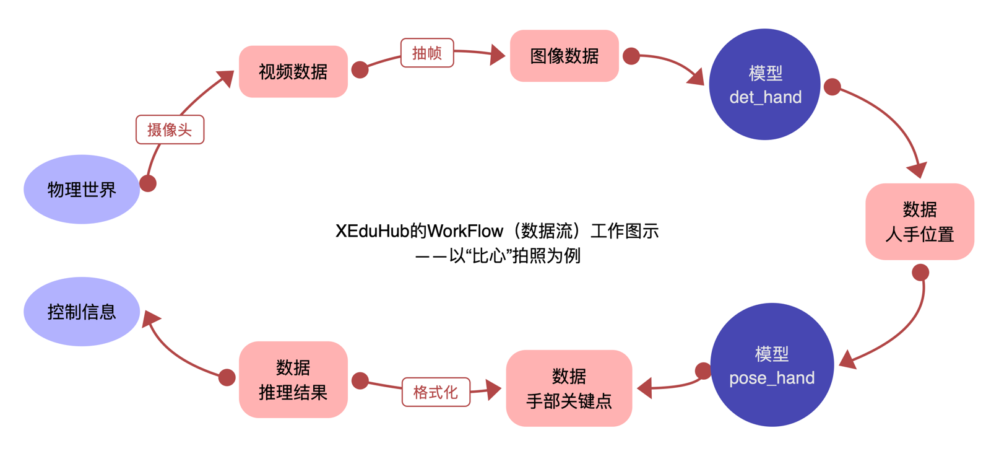
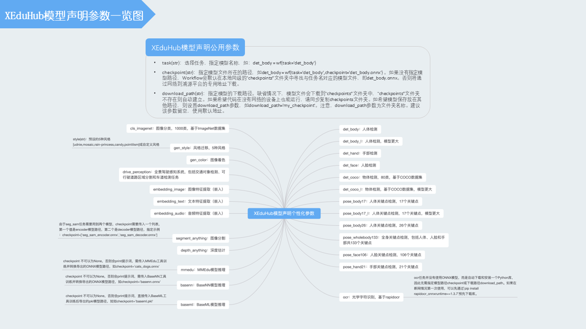
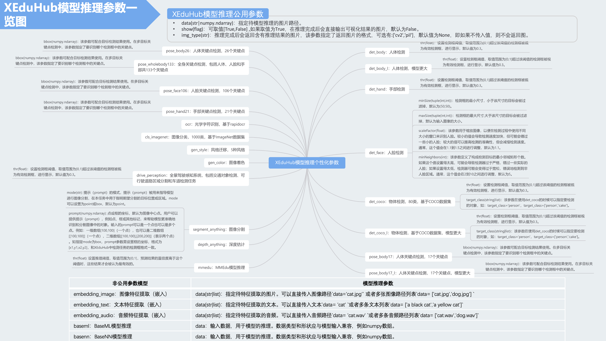
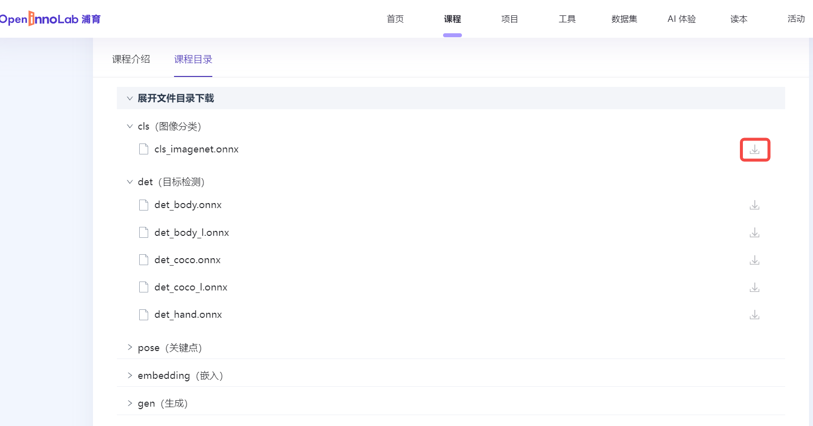

# XEduHub功能详解

XEduHub作为一个深度学习工具库，集成了许多深度学习领域优质的SOTA模型，能够帮助用户在不进模型训练的前提下，用少量的代码，快速实现计算机视觉、自然语言处理等多个深度学习领域的任务。

XEduHub支持两类任务（task），分为预置任务和通用任务两种。顾名思义，预置任务指预置的各种优质开源AI模型，包含了图像分类、目标检测、关键点检测、OCR等。通用任务指用XEdu系列工具训练的模型，如MMEdu（计算机视觉）、BaseNN（自定义神经网络）和BaseML（传统机器学习），还支持用其他工具训练的模型。考虑到兼容性，大部分模型以ONNX为主。不管使用哪类任务，XEduHub都使用Workflow工具进行推理，核心代码仅4行，语法非常简洁。

## 通用模型推理工具Workflow

使用XEduHub推理模型，首先需要导入核心推理模块“Workflow”。

```python
from XEdu.hub import Workflow as wf
```

XEduHub将模型推理的过程看成工作流（`Workflow`）。从获取数据到输入模型，再到推理结果输出，不过是数据从这个形式转化为另一种形式。当多个模型进行联动推理时，`Workflow`可以看做不同模型之间的数据流动，例如首先进行多人的目标检测，将检测到的数据传入关键点识别模型从而对每个人体进行关键点识别。

### 单一模型推理

Workflow的示例代码如下。本代码声明了一个叫做`pose_body17`（表示人体姿势）的推理任务，传入一张数据，输出推理结果。

```python
# 步骤一：导入库
from XEdu.hub import Workflow as wf
# 步骤二：选择你的AI工具
body = wf(task='pose_body17') # 声明pose模型
# 步骤三：使用你的AI工具
img = 'body.jpg'
# 进行推理，同时返回结果和带标注的图片
result,new_img = body.inference(data=img,img_type='cv2')
print(result) # 输出推理结果
body.show(new_img) # 显示带标注图片
```

### 多模型联合推理

很多AI任务需要借助多个模型完成。比如人体关键点（手部、脸部等）往往要先定位具体位置，再进行检测，可以提高检测的精度。这个过程能体现出WorkFlow的数据流思想。

```python
from XEdu.hub import Workflow as wf # 导入库
det  = wf(task='det_hand') # 实例化模型
model = wf(task='pose_hand') # 实例化模型
img_path = 'demo/hand.jpg' # 指定进行推理的图片路径
bboxs,new_img = det.inference(data=img_path,img_type='cv2',show=True) # 进行推理
for i in bboxs:
    keypoints,new_img =model.inference(data=img_path,img_type='cv2',show=True,bbox=i) # 进行推理
```

以一个检测“比心”动作，然后执行拍照任务的作品为例。这个案例需要多个模型，数据先经过第一个模型检测人手，得到手部的位置后，再经过第二个模型执行手部关键点检测，最后输出控制信息。



需要强调的是，如果要判断出是否做“比心”动作，还需要借助另一个模型，这个模型可能需要自主训练。加入训练了一个BaseNN全连接神经网络来实现这一任务，则数据流可以进一步向后流动，可以参考下面代码中箭头所示方向，即为数据流动方向：
```python
from XEdu.hub import Workflow as wf
det_hand = wf(task='det_hand')
pose_hand = wf(task='pose_hand')
basenn = wf(task='basenn',checkpoint='hand_class.onnx')
# 开始数据流传递
img = 'demo/hand.jpg'
# img -> bboxs
bboxs,det_img = det_hand.inference(data=img,img_type='cv2',show=True)
# bboxs -> keypoints
keypoints,pose_img = pose_hand.inference(data=img,bbox=bboxs[0])
# keypoints -> bixin_res
bixin_res = basenn.inference(data = [keypoints])
basenn.format_output()
```

## 任务声明和模型推理

`Workflow`根据task的名称来区分任务的类别，图示如下。


## task名称和参数总览





若要查看大图可前往[https://aicarrier.feishu.cn/file/K0oTbWW9mosOGCxIClvcTfpSnDd](https://aicarrier.feishu.cn/file/K0oTbWW9mosOGCxIClvcTfpSnDd)

下文将结合具体任务和项目进行介绍。

**点击这里在浦育平台体验：<a href="https://www.openinnolab.org.cn/pjlab/project?id=65518e1ae79a38197e449843&backpath=/pjlab/projects/list#public">XEduHub实例代码-入门完整版</a>**

<a href="https://www.openinnolab.org.cn/pjlab/project?id=65518e1ae79a38197e449843&backpath=/pjlab/projects/list#public">https://www.openinnolab.org.cn/pjlab/project?id=65518e1ae79a38197e449843&backpath=/pjlab/projects/list#public</a>

## 预置任务模型文件的获取

XEduHub提供了大量优秀的任务模型，我们不仅可以通过推理模块`Workflow`实现模型的自动下载，还可以自主通过浦源平台（上海AI实验室的另一个平台）下载。

只要进入<a href="https://openxlab.org.cn/models/detail/xedu/hub-model">模型仓库</a>，在`Model File`里就可以看到各种任务模型。网址：<a href="https://openxlab.org.cn/models/detail/xedu/hub-model">https://openxlab.org.cn/models/detail/xedu/hub-model</a>



没有网络，如何让`Workflow`运行时找到找到模型文件呢？从已下载好的电脑上拷贝ONNX文件，在推理的时候使用`download_path`来指定下载模型所在的文件夹位置。

## `Workflow`的预置任务模型检查机制

在没有指定模型路径`checkpoint`参数的情况下，推理模块`Workflow`运行时会先检查是否已下载了对应任务的模型，检查的顺序如下：

1. 本地的同级目录的`checkpoint`文件夹中，与任务同名的模型文件。
2. 本地缓存中（新版本不再支持）。

如果都没有，就会到网络上下载。

因此，无论是网络下载还是自己训练的模型使用，有三种解决思路：

- 在本地同级目录中新建`checkpoint`文件夹，将模型存放在该文件夹中。

- 使用参数`checkpoint`，指定模型路径，如`model=wf(task='pose_body17',checkpoint='my_path/pose_body17.onnx')`

- 使用参数`download_path，指定模型文件夹路径，如`model=wf(task='pose_body17',download_path='my_path/')`

最后提醒一下，自己到网络下载或自己训练的模型需要是ONNX格式。ONNX是由微软、亚马逊 、Facebook 和 IBM 等公司共同开发的开放神经网络交换格式，即`Open Neural Network Exchange`，兼容性比较好。
