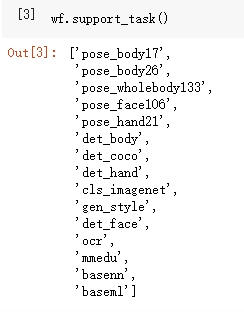
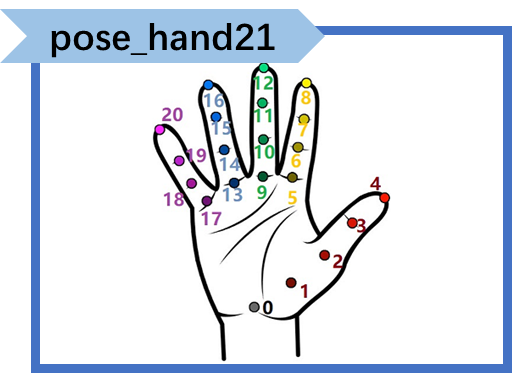
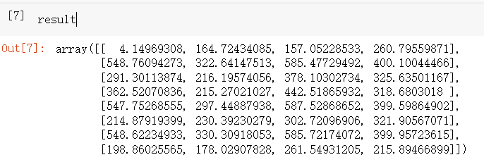
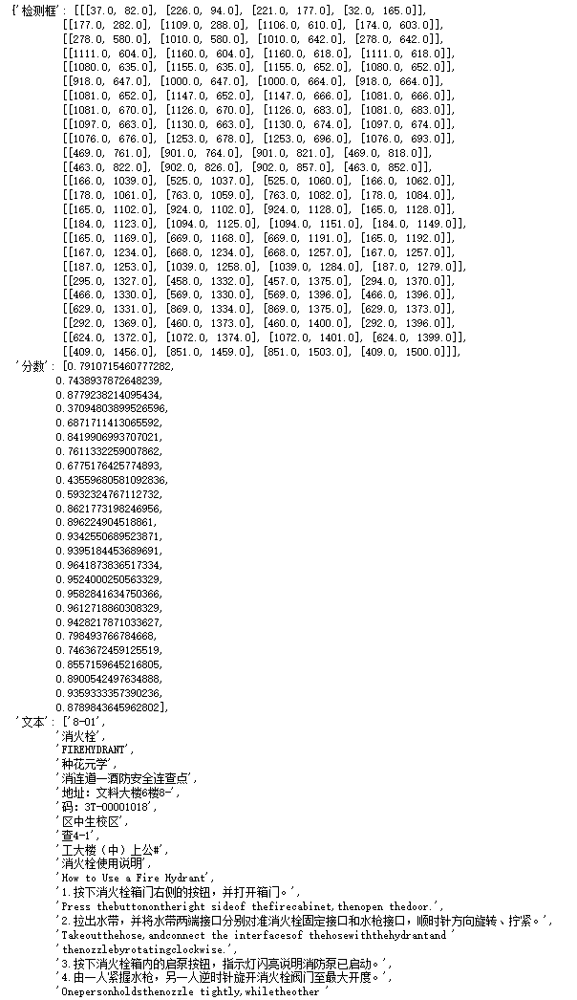
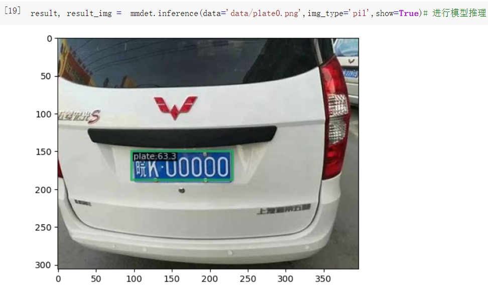
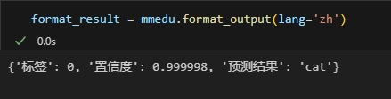
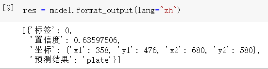
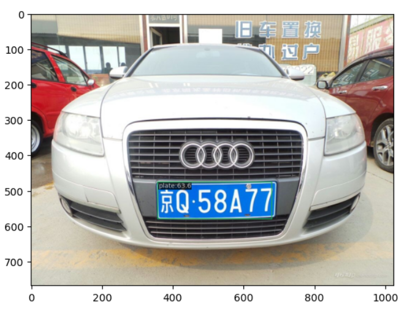

# XEduHub功能详解

## XEduHub是什么？

XEduHub是一个专为快速、便捷地利用最先进的深度学习模型完成任务而设计的工具库。其设计灵感源自PyTorchHub，旨在以工作流的方式，高效地完成深度学习任务。XEduHub的独特之处在于它内置了大量优质的深度学习SOTA模型，无需用户自行进行繁琐的模型训练。用户只需将这些现成的模型应用于特定任务，便能轻松进行AI应用实践。


## XEduHub有多棒？

- **简单易用**：就像玩玩具一样，不需要专业知识，只要按照指导，你就可以使用这些AI模型。
- **无需训练**：你不需要自己制作玩具，里面的AI模型都已经为你准备好了。
- **节省时间**：不需要等待，使用XEduHub，选取你需要的模型，然后就可以开始你的AI之旅。

## 解锁XEduHub的使用方法

XEduHub作为一个深度学习工具库，集成了许多深度学习领域优质的SOTA模型，能够帮助用户在不进模型训练的前提下，用少量的代码，快速实现计算机视觉、自然语言处理等多个深度学习领域的任务。

一般使用步骤是：

步骤1：[安装](https://xedu.readthedocs.io/zh/master/xedu_hub/installation.html)并导入XEduHub库

步骤2：选择你的AI玩具

步骤3：使用AI玩具

有了模型，你就可以使用它来完成你的任务啦！

```python
# 步骤一：导入库
from XEdu.hub import Workflow as wf
# 步骤二：选择你的AI玩具
face = wf(task="face") # 实例化模型
# 步骤三：使用你的AI玩具
img = 'face.jpg'
# 进行推理，同时返回结果和带标注的图片
result,new_img = face.inference(data=img,img_type='cv2')
print(result) # 输出推理结果
face.show(new_img) # 显示带标注图片
```

一旦你安装好XEduHub并导入到代码中后，你就可以查看里面所有的AI模型。看看哪一个是你想要的，然后选择它！下文会为你分任务解读。示例代码如下：

```python
from XEdu.hub import Workflow as wf
# 目前支持的任务
wf.support_task()
```



## 内置任务

XEduHub内置多个深度学习领域优质的SOTA模型，支持多种类型的内置任务。

**写在前面：为了更好地兼容每个版本的任务名称，我们建立了一个任务写法的映射表**。

下表每一行列出的写法都是等价的，例如你要声明一个检测人体17个关键点的模型，你可以给`task`参数传入`body`, `body17`或者`pose_body17`，当然推荐规范写法是`pose_body17`。

<table class="docutils align-default">
    <thead>
        <tr class="row-odd">
            <th class="head">可用写法</th>
            <th class="head">推荐规范写法</th>
        </tr>
    </thead>
    <tbody>
        <tr class="row-even">
            <td>body</td>
            <td>pose_body17</td>
        </tr>
        <tr class="row-even">
            <td>body17</td>
            <td>pose_body17</td>
        </tr>
        <tr class="row-even">
            <td>body26</td>
            <td>pose_body26</td>
        </tr>
        <tr class="row-even">
            <td>pose_hand</td>
            <td>pose_hand21</td>
        </tr>
        <tr class="row-even">
            <td>pose_body</td>
            <td>pose_body17</td>
        </tr>
        <tr class="row-even">
            <td>pose_wholebody</td>
            <td>pose_wholebody133</td>
        </tr>
        <tr class="row-even">
            <td>pose_face</td>
            <td>pose_face106</td>
        </tr>
    </tbody>
</table>

### 方向一：关键点识别

关键点识别是深度学习中的一项关键任务，旨在检测图像或视频中的关键位置，通常代表物体或人体的重要部位。

#### 1. 模型声明

在第一次声明模型时代码运行用时较长，是因为要将预训练模型从云端下载到本地中，从而便于用户进行使用。

你可以在当前项目中找到名为**checkpoints**的文件夹，里面保存的就是下载下来的预训练模型。当代码运行时，会先在本地的同级目录中寻找是否有已下载的预训练模型，如果没有，到本地缓存中寻找，如果本地缓存没有，查看是不是指定了模型的路径，如果都没有，到网络下载。

#### **人体关键点**

人体关键点识别是一项计算机视觉任务，旨在检测和定位图像或视频中人体的关键位置，通常是关节、身体部位或特定的解剖结构。

这些关键点的检测可以用于人体姿态估计和分类、动作分析、手势识别等多种应用。

XEduHub提供了两个识别人体关键点的优质模型，能够在使用cpu推理的情况下，快速识别出身体的关键点。

`body17`和`body26` 数字表示了识别出人体关键点的数量。

声明代码如下：

```python
from XEdu.hub import Workflow as wf
body = wf(task='body') # 数字可省略，当省略时，默认为body17
```

`body17`模型能识别出17个人体骨骼关键点，示意图如下，你可以根据自己的需要选择其中的特定的关键点进行后续的处理。


`body26`模型能识别出26个人体骨骼关键点，与`body17`相比，示意图如下，你可以根据自己的需要选择其中的特定的关键点进行后续的处理。


#### **人脸关键点**

人脸关键点识别是计算机视觉领域中的一项任务，它的目标是检测和定位人脸图像中代表面部特征的重要点，例如眼睛、鼻子、嘴巴、眉毛等。这些关键点的准确定位对于许多应用非常重要，包括人脸识别、表情分析、虚拟化妆、人机交互等。

XEduHub提供了识别人脸关键点的模型：`face106`，这意味着该模型能够识别人脸上的106个关键点。如下图所示是106个关键点在脸部的分布情况，我们可以利用这些关键点的分布特征进行人脸识别，或者对人的表情进行分析和分类等。


声明代码如下：

```python
from XEdu.hub import Workflow as wf
face = wf(task='face') # 数字可省略，默认为face106
```

#### **人手关键点**

人手关键点识别是一项计算机视觉任务，其目标是检测和定位图像或视频中人手的关键位置，通常包括手指、手掌、手腕等关键部位的位置。这些关键点的识别对于手势识别、手部姿态估计、手部追踪、手势控制设备等应用具有重要意义。

XEduHub提供了能够快速识别人手关键点的模型：`hand21`，该模型能够识别人手上的21个关键点，如下图所示。你可以根据自身需要对关键点进行进一步处理。例如：手势的不同会体现在关键点位置的分布上，这样就可以利用这些关键点进行手势的分类和识别。



声明代码如下：

```python
from XEdu.hub import Workflow as wf
hand = wf(task='hand') # 数字可省略，默认为hand21
```

#### **人体所有关键点**

XEduHub提供了识别人体所有关键点，包括人手、人脸和人体躯干部分关键点的模型：`wholebody133`。具体关键点的序号及其分布如下图所示：


声明代码如下：

```python
from XEdu.hub import Workflow as wf
wholebody = wf(task='wholebody') # 数字可省略，默认为wholebody133
```

#### 2. 模型推理

由于已经从云端下载好了预训练的SOTA模型，因此只需要传入相应图片即可进行模型推理任务，识别相应的关键点，以人体关键点识别为例，模型推理代码如下：

```python
img = "data/body.jpg" # 指定待识别关键点的图片的路径
keypoints,img_with_keypoints = body.inference(data=img,img_type='pil') # 进行模型推理
```

`keypoints`以三维数组的形式保存了所有关键点的坐标，每个关键点(x,y)被表示为`[x,y]`根据前面的图示，要获取到某个特定序号`i`的关键点，只需要访问`keypoints[0][i]`即可。


`img_with_keypoints`是个三维数组，以pil格式保存了关键点识别完成后的图片。


`inference()`可传入参数：

- `data`: 指定待识别关键点的图片。

- `show`: 可取值：`[true,false]` 默认为`false`。如果取值为`true`，在推理完成后会直接输出关键点识别完成后的图片。

- `img_type`: 关键点识别完成后会返回含有关键点的图片，该参数指定了返回图片的格式，可选有:`['cv2','pil']`，默认值为`None`，如果不传入值，则不会返回图。
- `bbox`：该参数可配合目标检测使用。在多人关键点检测中，该参数指定了要识别哪个检测框中的关键点。

#### 3. 结果输出

XEduHub提供了一种便捷的方式，能够以标准美观的格式查看关键点坐标以及分数（可以理解为置信度），代码如下：

```python
format_result = body.format_output(lang='zh')# 参数language设置了输出结果的语言
```

`format_result`以字典形式存储了推理结果，共有两个键：关键点坐标和分数。关键点坐标以二维数组形式保存了每个关键点的[x,y]坐标，而分数则是对应下标的关键点的置信度，以一维数组形式保存。

置信度是机器学习中常用的概念，描述的是模型对于单个预测的确定程度，反映了模型对该预测的信心强度。


显示带有关键点和关键点连线的结果图像

```python
body.show(img_with_keypoints)
```


####    4. 结果保存

XEduHub提供了保存带有关键点和关键点连线结果图像的方法，代码如下：

```python
body.save(img_with_keypoints,'img_with_keypoints.jpg')
```

#### 5.完整代码

```python
from XEdu.hub import Workflow as wf
body = wf(task='body') # 数字可省略，当省略时，默认为body17
img = "data/body.jpg" # 指定待识别关键点的图片的路径
keypoints,img_with_keypoints = body.inference(data=img,img_type='pil') # 进行模型推理
format_result = body.format_output(lang='zh')# 参数language设置了输出结果的语言
body.show(img_with_keypoints)
body.save(img_with_keypoints,'img_with_keypoints.jpg')
```

### 方向二：目标检测

目标检测是一种计算机视觉任务，其目标是在图像或视频中检测并定位物体的位置，并为每个物体分配类别标签。

实现目标检测通常包括特征提取、物体位置定位、物体类别分类等步骤。这一技术广泛应用于自动驾驶、安全监控、医学影像分析、图像搜索等各种领域，为实现自动化和智能化应用提供了关键支持。


#### 1. 模型声明

在第一次声明模型时代码运行用时较长，是因为要将预训练模型从云端下载到本地中，从而便于用户进行使用。

你可以在当前项目中找到名为**checkpoints**的文件夹，里面保存的就是下载下来的预训练模型。

#### **人体目标检测**

人体目标检测的任务是在图像或视频中检测和定位人体的位置，并为每个检测到的人体分配一个相应的类别标签。

XEduHub提供了进行人体目标检测的模型：`bodydetect`，该模型能够进行单人的人体目标检测。

声明代码如下：

```python
from XEdu.hub import Workflow as wf
body_det = wf(task='bodydetect')
```

#### **coco目标检测**

COCO（Common Objects in Context）是一个用于目标检测和图像分割任务的广泛使用的数据集和评估基准。它是计算机视觉领域中最重要的数据集之一，在XEduHub中的该模型能够检测出80类coco数据集中的物体：`cocodetect`，声明代码如下:

```python
from XEdu.hub import Workflow as wf
coco_det = wf(task='cocodetect')
```

若要查看coco目标检测中的所有类别可运行以下代码：

```python
wf.coco_class()
```

#### **人脸检测**

人脸检测指的是检测和定位一张图片中的人脸。XEduHub使用的是opencv的人脸检测模型，能够快速准确地检测出一张图片中所有的人脸。

需要注意的是由于使用的为opencv的人脸检测模型，因此在`format_output`时缺少了分数这一指标。

声明代码如下：

```python
from XEdu.hub import Workflow as wf
face_det = wf(task='facedetect')
```

#### 手部检测

手部检测指的是检测和定位一张图片中的人手。XEduHub采用的是MMPose框架中rtmpose中的手部检测模型，能够快速准确地检测出图片中的所有人手

声明代码如下：

```python
from XEdu.hub import Workflow as wf
hand_det = wf(task="handdetect")
```

#### 2. 模型推理

由于已经从云端下载好了预训练的SOTA模型，因此只需要传入相应图片即可进行模型推理任务，实现目标检测。以人体目标检测为例，模型推理代码如下：

```python
img = 'data/body.jpg'
result,img_with_box = body_det.inference(data=img,img_type='cv2')
```

`result`以二维数组的形式保存了检测框左上角顶点的(x,y)坐标以及检测框的宽度w和高度h（之所以是二维数组，是因为该模型能够检测多个人体，因此当检测到多个人体时，就会有多个[x,y,w,h]的一维数组，所以需要以二维数组形式保存），我们可以利用这四个数据计算出其他三个顶点的坐标。

`img_with_box`是个三维数组，以cv2格式保存了包含了检测框的图片。


`body_det.inference()`可传入参数：

- `data`：指定待检测的图片。
- `show`: 可取值：`[true,false]` 默认为`false`。如果取值为`true`，在推理完成后会直接输出目标检测完成后的图片。
- `img_type`：目标检测完成后会返回含有检测框的图片，该参数指定了返回图片的格式，可选有:`['cv2','pil']`，默认值为`None`，如果不传入值，则不会返回图。
- `target_class`：该参数在使用`cocodetect`的时候可以指定要检测的对象，如：`person`，`cake`等等。
- `thr`: 设置检测框阈值，超过该阈值的检测框被视为有效检测框，进行显示。

#### 3. 结果输出

XEduHub提供了一种便捷的方式，能够以标准美观的格式查看检测框位置信息、检测分数以及目标的分类类别。

`format_result`以字典形式存储了推理结果，共有三个键：检测框、分数和类别。检测框以二维数组形式保存了每个检测框的坐标信息[x,y,w,h]，而分数则是对应下标的检测框的置信度，以一维数组形式保存，类别则是检测框中对象所属的类别，以一维数组形式保存。

代码如下：

```python
format_result =body_det.format_output(lang='zh')# 参数language设置了输出结果的语言
```


 显示带有检测框的图片

```python
body_det.show(img_with_box)
```


####    4. 结果保存

XEduHub提供了保存带有检测框图片的方法，代码如下：

```python
body_det.save(img_with_box,'img_with_box.jpg')
```

#### 5. 完整代码

```python
from XEdu.Hub import Workflow as wf
body_det = wf(task='bodydetect')
img = 'data/body.jpg'
result,img_with_box = body_det.inference(data=img,img_type='cv2')
format_result =body_det.format_output(lang='zh')# 参数language设置了输出结果的语言
body_det.show(img_with_box)
body_det.save(img_with_box,'img_with_box.jpg')
```

### 方向三：光学字符识别（OCR）

光学字符识别（Optical Character Recognition, OCR）是一项用于将图像或扫描的文档转换为可编辑的文本格式的技术。

OCR技术能够自动识别和提取图像或扫描文档中的文本，并将其转化为计算机可处理的文本格式。

OCR技术在车牌识别、证件识别、文档扫描、拍照搜题等多个场景有着广泛应用。

#### 1. 模型声明

XEduHub使用的OCR模型是来自百度的开源免费的OCR模型：rapidocr，这个模型运行速度快，性能优越，小巧灵活，并且能支持超过6000种字符的识别，如简体中文、繁体中文、英文、数字和其他艺术字等等。

注意：你可以在当前项目中找到名为**font**的文件夹，里面的FZVTK.TTF文件是一种字体文件，为了显示识别出的文字而使用。

声明代码如下：

```python
from XEdu.hub import Workflow as wf
ocr = wf(task="ocr")
```

#### 2. 模型推理

只需要传入相应图片即可进行字符识别。模型推理代码如下：

```python
img = 'data/ocr.jpg'
result,ocr_img = ocr.inference(data=img,img_type='cv2')
```

`result`以一维数组的形式保存了识别出的文本及其检测框的四个顶点(x,y)坐标.

如图所示，数组中每个元素的形式为元组：（识别文本，检测框顶点坐标）。四个顶点坐标顺序分别为[左上，右上，左下，右下]。


`ocr_img`的格式为cv2，如下图所示


`ocr.inference()`可传入参数：

- `data`：指定待识别的图片。
- `show`: 可取值：`[true,false]` 默认为`false`。如果取值为`true`，在推理完成后会直接输出OCR完成后的图片。
- `img_type`：目标检测完成后会返回含有检测框的图片，该参数指定了返回图片的格式，可选有:`['cv2','pil']`

#### 3. 结果输出

XEduHub提供了一种便捷的方式，能够以标准美观的格式查看检测框位置信息、分数以及识别出的文本。

`format_output`的结果以字典形式存储了推理结果，共有三个键：检测框坐标、分数和文本。检测框坐标以三维数组形式保存了每个检测框的四个顶点的[x,y]坐标，而分数则是对应下标的检测框的置信度，以一维数组形式保存。文本则是每个检测框中识别出的文本，以一维数组形式保存。

代码如下：

```python
ocr_format_result = ocr.format_output(lang="zh")
```



显示结果图片：由两部分组成，左侧为原图片，右侧为经过ocr识别出的文本，并且该文本的位置与原图片中文本的位置保持对应。

```python
ocr.show(ocr_img)
```


#### 4. 结果保存

XEduHub提供了保存OCR识别后的图片的方法，代码如下：

```python
ocr.save(ocr_img,"ocr_img.jpg")
```

#### 5. 完整代码

```python
from XEdu.Hub import Workflow as wf
ocr = wf(task="ocr")
img = 'data/ocr.jpg'
result,ocr_img = ocr.inference(data=img,img_type='cv2')
ocr_format_result = ocr.format_output(lang="zh")
ocr.show(ocr_img)
ocr.save(ocr_img)
```

## 外置任务

XEduHub除了内置多个深度学习领域优质的SOTA模型，支持多种类型的内置任务，同时也支持指定外置任务，如MMEdu、BaseNN。

### 基于MMEdu导出模型推理

XEduHub现在可以支持使用MMEdu导出的onnx模型进行推理啦！如果你想了解如何使用MMEdu训练模型，可以看这里：[解锁图像分类模块：MMClassification](https://xedu.readthedocs.io/zh/master/mmedu/mmclassification.html)、[揭秘目标检测模块：MMDetection](https://xedu.readthedocs.io/zh/master/mmedu/mmdetection.html)。

如果你想了解如何将使用[MMEdu](https://xedu.readthedocs.io/zh/master/mmedu.html)训练好的模型转换成ONNX格式，可以看这里[最后一步：AI模型转换](https://xedu.readthedocs.io/zh/master/mmedu/model_convert.html)。OK，准备好了ONNX模型，那么就开始使用XEduHub吧！

#### 1. 模型声明

与外置任务的模型声明不同之处在于：`task`和`checkpoint`的设置。首先，你只需要设置task为"mmedu"，而不需要指定是哪种任务；其次，你需要指定你的模型的路径，并传入到`checkpoint`参数。

这里我们以猫狗分类模型为例，项目指路：[猫狗分类](https://www.openinnolab.org.cn/pjlab/project?id=63c756ad2cf359369451a617&sc=647b3880aac6f67c822a04f5#public)。

```python
from XEdu.hub import Workflow as wf
mmedu = wf(task="mmedu",checkpoint="cat_dogs.onnx")
```

如果要使用MMDetection，这里以车牌识别为例进行说明。项目指路：[使用MMEdu实现车牌检测](https://www.openinnolab.org.cn/pjlab/project?id=641426fdcb63f030544017a2&backpath=/pjlab/projects/list#public)

```python
from XEdu.hub import Workflow as wf
mmdet = wf(task='mmedu',checkpoint='plate.onnx')
```

#### 2. 模型推理

在完成模型声明后，传入待推理的数据即可完成推理。

**以下是使用MMEdu分类模型的推理代码和结果。**

```python
img = 'cat.jpg'
result, new_img =  mmedu.inference(data=img,img_type="pil",show=True)
```


**以下是使用MMEdu检测模型的推理代码和结果。**

```python
result = mmdet.inference(data='plate0.png',show=True,img_type='cv2')
```


`mmedu.inference`可传入参数：

- `data`：指定待检测的图片。
- `show`: 可取值：`[true,false]` 默认为`false`。如果取值为`true`，在推理完成后会直接输出目标检测完成后的图片。
- `img_type`：目标检测完成后会返回含有检测框的图片，该参数指定了返回图片的格式，可选有:`['cv2','pil']`，默认值为`None`，如果不传入值，则不会返回图。

`result`和`img`是模型推理后返回的推理结果。

`result`结果如下图所示:

**对于分类模型而言**，`result`的结果是一个一维数组，这代表着每个分类标签的置信度，第一个元素是这张图片为猫的置信度，第二个元素是这张图片为狗的置信度，显然，这张图片为猫的置信度接近100%，自然这张图片被分类为猫。


`img`结果是打上分类标签和分数的原图片，在这里以数字化的方式（三维数组）呈现。


**对于检测模型而言**，`result`的结果是一个三维数组，如下图所示，其中第一个元素[103.20052, 148.52896, 227.04301, 189.76846, 0.58629453]代表着第一个有效检测框的信息。前四个数字，分别对应着左上角(x1,y1)和右下角(x2,y2)检测框的坐标值，最后一个数字代表着这个检测框的置信度。



`img`结果是打上检测框的原图片，在这里以数字化的方式（三维数组）呈现。


#### 3. 结果输出

XEduHub提供了一种便捷的方式，能够以标准美观的格式查看输出结果。

**以下是MMEdu分类模型的输出结果。**

```python
format_result = mmedu.format_output(lang="zh")
```



`format_result`以字典形式保存了模型的推理结果，包括所属标签、置信度、以及预测结果。

显示结果图片：与原图相比，结果图片在左上角多了`pred_label`, `pred_socre`和`pred_class`三个数据，对应着标签、置信度和预测结果。

```python
mmedu.show(new_img)
```


**以下是MMEdu检测模型的输出结果。**

```python
format_result = mmdet.format_output(lang='zh')
```



`format_result`以字典形式保存了模型的推理结果，包括所属标签、置信度、检测框的坐标信息以及预测结果。

显示结果图片：与原图相比，结果图片还包含车牌周围的检测框以及结果信息。



#### 4. 结果保存

XEduHub提供了保存MMEdu模型推理后的图片的方法，代码如下：

```python
mmedu.save(img,'new_cat.jpg')
mmdet.save(img,'new_plate.jpg')
```

#### 5. 完整代码

```python
# 基于MMClassification训练出的模型进行推理
from XEdu.hub import Workflow as wf
mmedu = wf(task="mmedu",checkpoint="cat_dogs.onnx")
img = 'cat.jpg'
result, new_img =  mmedu.inference(data=img,img_type="pil",show=True)
format_result = mmedu.format_output(lang="zh")
mmedu.show(new_img)
mmedu.save(new_img,"mmedu_img")
```

### 基于BaseNN导出模型推理

XEduHub现在可以支持使用BaseNN导出的onnx模型进行推理啦！如果你想了解如何将使用[BaseNN](https://xedu.readthedocs.io/zh/master/basenn.html)训练好的模型转换成ONNX格式，可以看这里：[BaseNN模型文件格式转换](https://xedu.readthedocs.io/zh/master/basenn/introduction.html#id29)。OK，准备好了ONNX模型，那么就开始使用XEduHub吧！

#### 1. 模型声明

与MMEdu一样，在模型声明时你只需要设置task为"basenn"，而不需要指定是哪种任务；其次，你需要指定你的模型的路径，并传入到`checkpoint`参数。

```python
from XEdu.hub import Workflow as wf
basenn = wf(task="basenn",checkpoint="basenn.pth")
```

#### 2. 模型推理

```python
img = '6.jpg'
result = base.inference(data=img)
```

`result`结果如下图所示，是一个一维数组，这代表着每个分类标签的概率。显然可以看到数字为6的标签的置信度最高，是1.0。


`mmedu.inference`可传入参数：

- `data`：指定待推理数据（数据类型和格式跟模型训练有关）。

**注意！**基于BaseNN模型推理结果不包含图片！因为大部分使用BaseNN解决的任务只需要输出分类标签、文本或者数组数据等。

#### 3. 结果输出

XEduHub提供了一种便捷的方式，能够以标准美观的格式查看输出结果。

```python
format_output = basenn.format_output(lang='zh')
```

`format_result`以字典形式保存了模型的推理结果，包括预测结果，分数（置信度）。


如果此时你有冲动去使用BaseNN完成模型训练到推理，再到转换与应用，快去下文学习[BaseNN的相关使用](https://xedu.readthedocs.io/zh/master/basenn.html)吧！

#### 4. 完整代码

```python
# 使用BaseNN训练的手写数字识别模型进行推理
from XEdu.hub import Workflow as wf
basenn = wf(task="basenn",checkpoint="basenn.pth")
img = '6.jpg'
result = base.inference(data=img)
format_output = basenn.format_output(lang='zh')
print(format_output)
```

### 基于BaseML模型推理

XEduHub现在可以支持使用BaseML导出的pkl模型文件进行推理啦！如果你想了解如何将使用[BaseML](https://xedu.readthedocs.io/zh/master/baseml.html)训练模型并保存成.pkl模型文件，可以看这里：[BaseML模型保存](https://xedu.readthedocs.io/zh/master/baseml/introduction.html#id10)。OK，准备好了pkl模型，那么就开始使用XEduHub吧！

#### 1. 模型声明

与MMEdu和BaseNN一样，在模型声明时你只需要设置task为"baseml"，而不需要指定是哪种任务；其次，你需要指定你的模型路径，并传入到`checkpoint`参数。这里我们以[鸢尾花聚类项目](https://www.openinnolab.org.cn/pjlab/project?id=6440db053c0e930cb5d7f297&backpath=/pjlab/projects/list#public)为例。

```python
from XEdu.hub import Workflow as wf
baseml = wf(task='baseml',checkpoint='baseml.pkl')
```

#### 2. 模型推理

```python
data = [[5.1,1.5],[7,4.7]] # 该项目中训练数据只有两维，因此推理时给出两维数据
result= baseml.inference(data=data)
```


`mmdet.inference`可传入参数：

- `data`：指定待推理数据（数据类型和格式跟模型训练有关）。

**注意！**基于BaseML模型推理结果不包含图片！因为大部分使用BaseML解决的任务只需要输出分类标签、文本或者数组数据等。

#### 3. 结果输出

XEduHub提供了一种便捷的方式，能够以标准美观的格式查看输出结果。

```python
format_output = baseml.format_output(lang='zh')
```

`format_result`以字典形式保存了模型的推理结果，由于使用的是聚类模型，输出结果为这两个特征数据所对应的聚类标签。


如果此时你有冲动去使用BaseML完成模型训练到推理，再到转换与应用，快去下文学习[BaseML的相关使用](https://xedu.readthedocs.io/zh/master/baseml.html)吧！

#### 4. 完整代码

```python
# 使用BaseML训练的鸢尾花聚类模型推理
from XEdu.hub import Workflow as wf
baseml = wf(task='baseml',checkpoint='baseml.pkl')
data = [[5.1,1.5],[7,4.7]] # 该项目中训练数据只有两维，因此推理时给出两维数据
result= baseml.inference(data=data)
format_output = baseml.format_output(lang='zh')
print(format_output)
```

### 基于用户自定义ONNX模型推理

XEduHub现在可以支持使用用户自定义的ONNX模型文件进行推理啦！这意味着你可以不仅仅使用MMEdu或者BaseNN训练模型并转换而成的ONNX模型文件进行推理，还可以使用其他各个地方的ONNX模型文件，但是有个**重要的前提：你需要会使用这个模型，了解模型输入的训练数据以及模型的输出结果**。OK，如果你已经做好了充足的准备，那么就开始使用XEduHub吧！

#### 1. 模型声明

与其他的外置任务一样，在模型声明时你只需要设置task为"custom"，而不需要指定是哪种任务；其次，你需要指定你的模型路径，并传入到`checkpoint`参数。这里以一个目标检测为例。

```python
from XEdu.hub import Workflow as wf
custom = wf(task="custom",checkpoint="custom.onnx")
```

#### 2. 模型推理

在这里，使用自定义的ONNX模型进行推理的时候，你需要自己的需求实现模型输入数据的前处理以及输出数据的后处理方法，确保在进行模型推理的正常运行。

举一个例子，如果你手中有一个onnx模型文件，这个模型是一个**目标检测模型**，在训练时的训练数据是将图片读入后进行数字化处理得到的**numpy数组**，那么你在使用XEduHub时，基于该模型进行推理之前，**需要设计对应的前处理方法**将图片进行数字化。

同样地，如果你的模型的输出结果是一个一维数组，里面包含了所有类别标签对应的置信度，那么如果你想要输出检测出来的最有可能的类别标签，你就**需要设计后处理方法**，使得输出的推理结果满足你的需要。

以下是前处理和后处理方法的代码示例，以前文提到的目标检测为例。

```python
import cv2
import numpy as np

def pre(path): # 输入数据（此处为文件路径）前处理的输入参数就是模型推理时的输入参数，这里是图片的路径
    """
    这个前处理方法实现了将待推理的图片读入并进行数字化，调整数据类型、增加维度、调整各维度的顺序。
    """
    img = cv2.imread(path) # 读取图像
    img = img.astype(np.float32) # 调整数据类型
    img = np.expand_dims(img,0) # 增加batch维
    img = np.transpose(img, (0,3,1,2)) # [batch,channel,width,height]
    return img # 输出前处理过的数据（此处为四维numpy数组）

def post(res,data): # 输入推理结果和前处理后的数据
    """
    这个后处理方法实现了获取并返回推理结果中置信度最大的类别标签。
    """
    res = np.argmax(res[0]) # 返回类别索引
    return res # 输出结果
```

在定义好了前处理和后处理函数之后，就可以进行模型推理了！记得要传入前后处理函数的名称到模型参数中。

```python
result = custom.inference(data='det.jpg',preprocess=pre,postprocess=post)
print(result)
```


#### 3. 完整代码

```python
from XEdu.hub import Workflow as wf
import cv2
import numpy as np

custom = wf(task="custom",checkpoint="custom.onnx")

def pre(path): # 输入数据（此处为文件路径）前处理的输入参数就是模型推理时的输入参数，这里是图片的路径
    """
    这个前处理方法实现了将待推理的图片读入并进行数字化，调整数据类型、增加维度、调整各维度的顺序。
    """
    img = cv2.imread(path) # 读取图像
    img = img.astype(np.float32) # 调整数据类型
    img = np.expand_dims(img,0) # 增加batch维
    img = np.transpose(img, (0,3,1,2)) # [batch,channel,width,height]
    return img # 输出前处理过的数据（此处为四维numpy数组）

def post(res,data): # 输入推理结果和前处理后的数据
    """
    这个后处理方法实现了获取并返回推理结果中置信度最大的类别标签。
    """
    res = np.argmax(res[0]) # 返回类别索引
    return res # 输出结果

result = custom.inference(data='det.jpg',preprocess=pre,postprocess=post)
print(result)
```

## 报错专栏

你是否在使用XEduHub时遇到过报错？是否遇到ERROR时感到无所适从，甚至有点慌张？
没有关系！报错专栏将为你可能在使用过程中出现的错误提供解决方案！
这里收录着使用XEduHub中的常见报错并呈现对应的解决方案，如果你遇到了问题，查看这个专栏，找到类似报错，并且解决它！

正在努力收录中……敬请期待！
