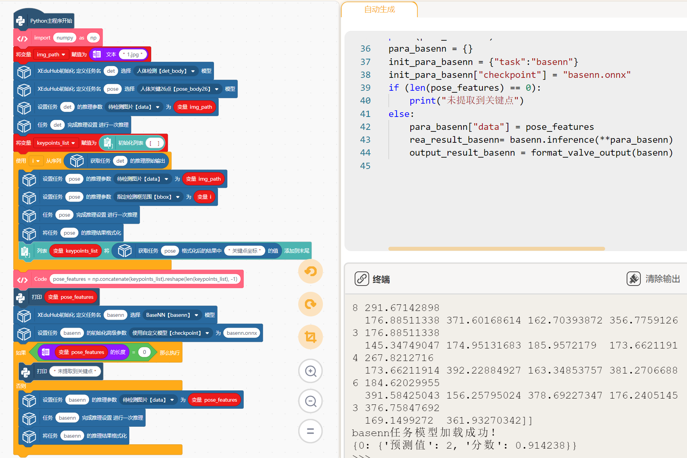

# 在Mind+中使用XEduHub

Mind+中也上线了XEduHub积木块，使用积木也可以玩XEduHub。使用Mind+V1.7.2及以上版本，在python模式用户库中加载此扩展。

Gitee链接：[https://gitee.com/liliang9693/ext-xedu-hub](https://gitee.com/liliang9693/ext-xedu-hub)

[Mind+结合XEduHub开发AI交互作品](https://mp.weixin.qq.com/s/Hyt3npIttAwmOBhN1bayxw)

## 使用说明

### 第一步：加载积木库

- 如果联网情况下，打开Mind+用户库粘贴本仓库的链接即可加载：


- 如果电脑未联网，则可以下载本仓库的文件，然后打开Mind+用户库选择导入用户库，选择`.mpext`文件即可。

### 第二步：安装python库

打开库管理，输入xedu-python运行，提示successfully即可。

注：WARNING是提醒，可以忽略；请及时更新xedu-python用户库，以获得更稳定、更强大的模型部署使用体验。


### 第三步：开始编程！

至此，即可拖动积木块开始快乐编程啦，根据任务类别，可以分为两类：预置任务和通用任务。其中，预置任务指各种内置模型的常见任务，通用任务包含“XEdu”的MMEdu、BaseNN和BaseML等各种工具训练的模型。通用任务也支持其他的ONNX，但前提是需要知道输入的数据格式，需要做前处理。在Mind+中编写预制任务的程序非常简单，例如pose_body任务的运行示例如下：


大家可以举一反三尝试编写各种预制任务的代码，我们知道XEduHub也支持XEdu系列工具训练的模型，如MMEdu、BaseNN和 BaseML。针对MMEdu、BaseNN、BaseML等工具训练及转换并导出的模型，额外将模型文件上传再指定即可。如使用XEduHub完成MMEdu工具训练并转换的模型的推理的积木块如下，此代码也支持浦育前端化工具训练的图像分类模型转换得到的ONNX模型的推理。


用这套积木块基本可以完成XEduHub的所有任务，可以做各种小任务，也可以做复杂任务。使用积木完成对一张图片借助XEduHub的相关模型进行人体画面提取、关键点识别，再用BaseNN训练并转换的ONNX模型完成分类模型推理的示例如下。



## 安装常见问题及排查方案

1.系统原因

强烈建议win10及以上，不建议win7。

2.依赖库问题

常见出问题的是onnxruntime库，建议手动pip安装，再切换到代码进行库测试。

最简测试代码：

```python
# 导入 onnxruntime 库
import onnxruntime

# 打印版本信息
print(f"onnxruntime version: {onnxruntime.__version__}")
```

如果安装正确，您将看到类似以下的输出：

```
onnxruntime version: 1.13.1
```

3.行空板基础库问题
如果出现“段错误”或者“Segmentation Error”，一般是onnx和onnxruntime的版本不匹配。可以通过下面的命令修改版本：
```
pip install xedu-python==0.2.0 onnx==1.13.0 onnxruntime==1.13.1
```