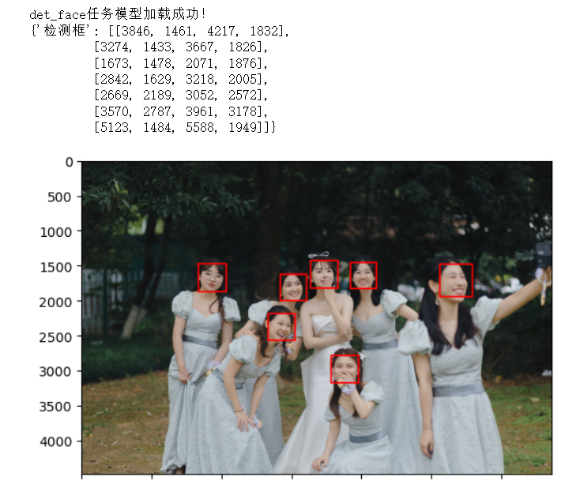
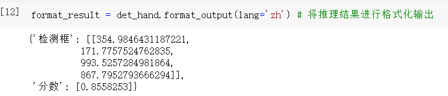
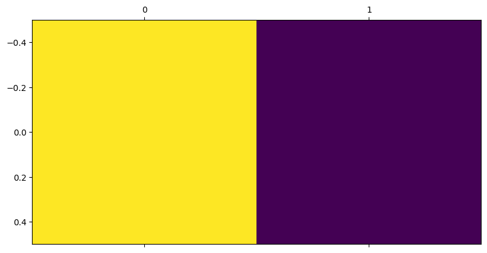
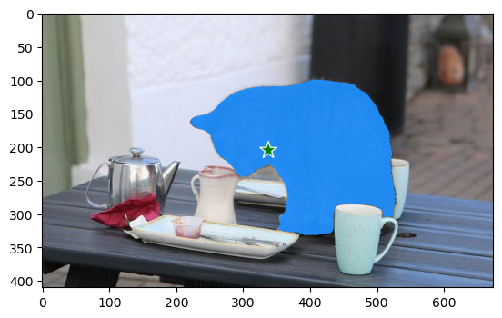
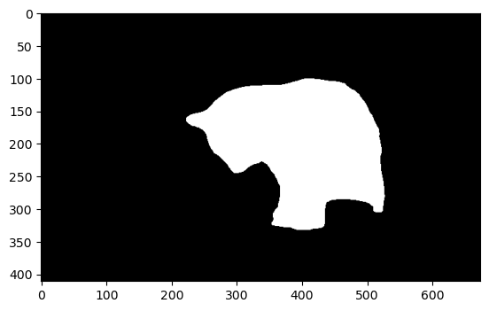
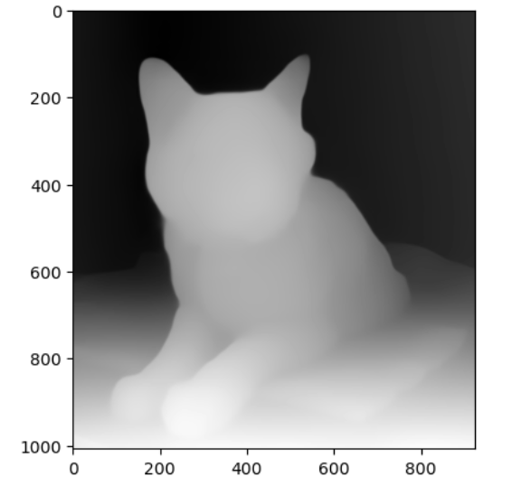

# XEduHub预置任务

XEduHub的预置任务也称内置模型，指预置的各种优质开源AI模型，包含了图像分类、目标检测、关键点检测、OCR等常见的任务。内置模型来自各种开源社区，旨在降低初学者的入门门槛。

**点击这里在浦育平台体验项目<a href="https://www.openinnolab.org.cn/pjlab/project?id=65518e1ae79a38197e449843&backpath=/pjlab/projects/list#public">XEduHub实例代码-入门完整版</a>**

<a href="https://www.openinnolab.org.cn/pjlab/project?id=65518e1ae79a38197e449843&backpath=/pjlab/projects/list#public">https://www.openinnolab.org.cn/pjlab/project?id=65518e1ae79a38197e449843&backpath=/pjlab/projects/list#public</a>

通过学习“XEduHub实例代码-入门完整版”，可以在项目实践中探索XEduHub的魅力，项目中通俗易懂的讲解和实例代码也能帮助初学者快速入门XEduHub。

## 1. 目标检测

目标检测是一种计算机视觉任务，其目标是在图像或视频中检测并定位物体的位置，并为每个物体分配类别标签。

实现目标检测通常包括特征提取、物体位置定位、物体类别分类等步骤。这一技术广泛应用于自动驾驶、安全监控、医学影像分析、图像搜索等各种领域，为实现自动化和智能化应用提供了关键支持。

XEduHub目标支持目标检测任务有：人体目标检测`det_body`、人脸目标检测`det_face`、人手目标检测`det_hand`和coco目标检测`det_coco`。

### 人体目标检测

人体目标检测的任务是在图像或视频中检测和定位人体的位置，并为每个检测到的人体分配一个相应的类别标签。借助此任务，一般可以实现人体画面的识别与提取，为后续的图像处理和分析提供基础。

XEduHub提供了进行人体目标检测的模型：`det_body`，`det_body_l`，这两个模型能够进行人体目标检测，后者为large增强版模型。


#### 代码样例

```python
from XEdu.hub import Workflow as wf # 导入库
det_body = wf(task='det_body') # 实例化模型
result,img_with_box = det_body.inference(data='data/det_body.jpg',img_type='pil') # 进行模型推理
format_result = det_body.format_output(lang='zh') # 将推理结果进行格式化输出
det_body.show(img_with_box)# 展示推理图像
det_body.save(img_with_box,'img_with_box.jpg') # 保存推理图像
```

#### 代码解释

##### 1. 模型声明

```python
from XEdu.hub import Workflow as wf
det_body = wf(task='det_body')
```

`wf()`中共有三个参数可以设置：

- `task`(str)：选择任务。人体目标检测模型为`det_body`, `det_body_l`。`det_body_l`相比`det_body`模型规模较大，性能较强，但是推理的速度较慢。
- `checkpoint`(str)：指定模型文件所在的路径，如`det_body = wf(task='det_body',checkpoint='det_body.onnx') `。如果没有指定模型路径，Workflow会默认在本地同级的“checkpoint”文件夹中寻找与任务名对应的模型文件，即`det_body.onnx`。否则将通过网络到浦源平台的专用地址下载。
- `download_path`(str)：指定模型的下载路径。缺省情况下，模型文件会下载到“checkpoint”文件夹中，“checkpoint”文件夹不存在则自动建立。如果希望代码在没有网络的设备上也能运行，请同步复制`checkpoint`文件夹。如希望模型保存放在其他路径，则设置`download_path`参数，如`download_path='my_checkpoint'`。注意，`download_path`参数为文件夹名称。

任务模型文件获取与存放请查看[前文](https://xedu.readthedocs.io/zh-cn/master/xedu_hub/introduction.html#id4)。

##### 2. 模型推理

推理方式1：

```python
result = det_body.inference(data='data/det_body.jpg') # 进行模型推理
```

推理方式2：

```python
result,img_with_box = det_body.inference(data='data/det_body.jpg',img_type='pil') # 进行模型推理
```

模型推理`inference()`可传入参数：

- `data`(str|numpy.ndarray)：指定待目标检测的图像，可以是以图像路径形式传入，也可直接传入cv2或pil格式的图像。
- `show`(flag)：可取值`[True,False]` ,如果取值为`True`，在推理完成后会直接输出目标检测完成后的图像，默认为`False`。
- `img_type`(str)：目标检测完成后会返回含有目标检测框的图像，该参数指定了返回图像的格式，可选有:`['cv2','pil']`，默认值为`None`，即如果不传入值，则不会返回图。
- `thr`(float)：设置检测框阈值，取值范围为`[0,1]`超过该阈值的检测框被视为有效检测框，进行显示，默认值为0.3。

模型推理返回结果：

- `result`(numpy.ndarray)：以二维数组的形式保存了检测框左上角顶点的坐标(x1,y1)和右下角顶点的坐标(x2,y2)（之所以是二维数组，是因为该模型能够检测多个人体，因此当检测到多个人体时，就会有多个[x1,y1,x2,y2]的一维数组，所以需要以二维数组形式保存），我们可以利用这四个数据计算出其他两个顶点的坐标，以及检测框的宽度和高度。

- `img_with_box`(numpy.ndarray)：是个三维数组，以img_type所设置的格式保存了包含了检测框的图像。

##### 3. 结果输出

```python
format_result = det_body.format_output(lang='zh')# 将推理结果进行格式化输出
```

`format_output()`能够将模型推理结果以标准美观的方式进行输出。输出结果与`format_result`保存的内容一致。

`format_output()`中共有两个参数可以设置：

- `lang`(str)：设置了输出结果的语言，可选取值为：[`'zh'`,`'en'`,`'ru'`,`'de'`,`'fr'`]，分别为中文、英文、俄语、德语、法语，默认为中文。
- `isprint`(bool)：设置了是否格式化输出，可选取值为：[`True`,`False`]，默认为True。

`format_result`以字典形式存储了推理结果，共有两个键：`检测框`、`分数`。检测框以二维数组形式保存了每个检测框的坐标信息[x1,y1,x2,y2]，而分数则是对应下标的检测框的置信度，以一维数组形式保存。

```
# 输出结果
{'检测框': [[323.2777170453753,
          72.95395088195801,
          917.5945354189192,
          1130.7357228142876]],
 '分数': [0.8851305]}
```

```python
det_body.show(img_with_box)# 展示推理图像
```

`show()`能够输出带有检测框的结果图像。


##### 4. 结果保存

```python
det_body.save(img_with_box,'img_with_box.jpg')# 保存推理图像
```

`save()`方法能够保存带有检测框的图像

该方法接收两个参数，第一个参数是图像数据，另一个是图像的保存路径。

### 人脸目标检测

人脸目标检测指的是检测和定位一张图像中的人脸。XEduHub使用的是opencv的人脸检测模型，能够快速准确地检测出一张图像中所有的人脸。XEduHub提供了进行人脸目标检测的模型：`det_face`，能够快速准确地检测出图像中的所有人脸。

#### 代码样例

```python
from XEdu.hub import Workflow as wf
det_face = wf(task='det_face')
result,img_with_box = det_face.inference(data='data/det_face.jpg',img_type='pil') # 进行模型推理
format_result = det_face.format_output(lang='zh') # 将推理结果进行格式化输出
det_face.show(img_with_box) # 展示推理图像
det_face.save(img_with_box,'img_with_box.jpg') # 保存推理图像
```

#### 代码解释

##### 1. 模型声明

```python
from XEdu.hub import Workflow as wf
det_face = wf(task='det_face')
```

`wf()`中共有三个参数可以设置：

- `task`(str)：选择任务。人脸目标检测模型为`det_face`。
- `checkpoint`(str)：指定模型文件所在的路径，如`det_face = wf(task='det_face',checkpoint='det_face.onnx') `。如果没有指定模型路径，Workflow会默认在本地同级的“checkpoint”文件夹中寻找与任务名对应的模型文件，即`det_face.onnx`。否则将通过网络到浦源平台的专用地址下载。
- `download_path`(str)：指定模型的下载路径。缺省情况下，模型文件会下载到“checkpoint”文件夹中，“checkpoint”文件夹不存在则自动建立。如果希望代码在没有网络的设备上也能运行，请同步复制`checkpoint`文件夹。如希望模型保存放在其他路径，则设置`download_path`参数，如`download_path='my_checkpoint'`。注意，`download_path`参数为文件夹名称。

任务模型文件获取与存放请查看[前文](https://xedu.readthedocs.io/zh-cn/master/xedu_hub/introduction.html#id4)。

##### 2. 模型推理

推理方式1：

```python
result = det_face.inference(data='data/det_face.jpg') # 进行模型推理
```

推理方式2：

```python
result,img_with_box = det_face.inference(data='data/det_face.jpg',img_type='pil') # 进行模型推理
```

模型推理`inference()`可传入参数：

- `data`(str|numpy.ndarray)：指定待目标检测的图像，可以是以图像路径形式传入，也可直接传入cv2或pil格式的图像。
- `show`(flag)：可取值`[True,False]` ,如果取值为`True`，在推理完成后会直接输出目标检测完成后的图像，默认为`False`。
- `img_type`(str)：目标检测完成后会返回含有目标检测框的图像，该参数指定了返回图像的格式，可选有：`['cv2','pil']`，默认值为`None`，即如果不传入值，则不会返回图。
- `minSize`(tuple(int,int))：检测框的最小尺寸，小于该尺寸的目标会被过滤掉，默认为(50,50)。
- `maxSize`(tuple(int,int))：检测框的最大尺寸,大于该尺寸的目标会被过滤掉，默认为输入图像的大小。
- `scaleFactor`(float)：该参数用于缩放图像，以便在检测过程中使用不同大小的窗口来识别人脸。较小的值会导致检测速度加快，但可能会错过一些小的人脸；较大的值可以提高检测的准确性，但会减慢检测速度。通常，这个值会在1.1到1.5之间进行调整，默认为1.1。
- `minNeighbors`(int)：该参数定义了构成检测目标的最小邻域矩形个数。如果这个值设置得太高，可能会导致检测器过于严格，错过一些实际的人脸；如果设置得太低，检测器可能会变得过于宽松，错误地检测到非人脸区域。通常，这个值会在2到10之间进行调整，默认为5。

模型推理返回结果：

- `result`(numpy.ndarray)：：以二维数组的形式保存了检测框左上角顶点的坐标(x1,y1)和右下角顶点的坐标(x2,y2)（之所以是二维数组，是因为该模型能够检测多个人脸，因此当检测到多个人脸时，就会有多个[x1,y1,x2,y2]的一维数组，所以需要以二维数组形式保存），我们可以利用这四个数据计算出其他两个顶点的坐标，以及检测框的宽度和高度。
- `img_with_box`(numpy.ndarray)：是个三维数组，以img_type所设置的格式保存了包含了检测框的图像。

##### 3. 结果输出

```python
format_result = det_face.format_output(lang='zh')# 将推理结果进行格式化输出
```

`format_output()`能够将模型推理结果以标准美观的方式进行输出。输出结果与`format_result`保存的内容一致。

`format_output()`中共有两个参数可以设置：

- `lang`(str)：设置了输出结果的语言，可选取值为：[`'zh'`,`'en'`,`'ru'`,`'de'`,`'fr'`]，分别为中文、英文、俄语、德语、法语，默认为中文。
- `isprint`(bool)：设置了是否格式化输出，可选取值为：[`True`,`False`]，默认为True。

`format_result`以字典形式存储了推理结果，只有一个键：`检测框`。检测框以二维数组形式保存了每个检测框的坐标信息[x1,y1,x2,y2]。需要注意的是由于使用的为opencv的人脸检测模型，因此在`format_output`时缺少了分数这一指标。

```
# 输出结果
{'检测框': [[202, 237, 940, 975]]}
```


结果可视化：

```python
det_face.show(img_with_box) # 展示推理图像
```

`show()`能够输出带有检测框的结果图像。


多人脸检测结果如下：（如果看到很多不该识别为人脸的地方出现了检测框，我们可以在推理是增加`minSize`参数来设置检测框的最小尺寸，将小于该尺寸的目标过滤掉，默认为(50,50)，同时也可以增加`maxSize`参数来设置检测框的最大尺寸，大于该尺寸的目标会被过滤掉，默认为输入图像的大小）



##### 4. 结果保存

```python
det_face.save(img_with_box,'img_with_box.jpg')# 保存推理图像
```

`save()`方法能够保存带有检测框的图像

该方法接收两个参数，第一个参数是图像数据，另一个是图像的保存路径。

### 手部目标检测

手部目标检测指的是检测和定位一张图像中的人手。XEduHub提供了进行手部目标检测的模型：`det_hand`，能够快速准确地检测出图像中的所有人手。

#### 代码样例

```python
from XEdu.hub import Workflow as wf
det_hand = wf(task='det_hand')
result,img_with_box = det_hand.inference(data='data/det_hand.jpg',img_type='pil') # 进行模型推理
format_result = det_hand.format_output(lang='zh') # 将推理结果进行格式化输出
det_hand.show(img_with_box) # 展示推理图像
det_hand.save(img_with_box,'img_with_box.jpg') # 保存推理图像
```

#### 代码解释

##### 1. 模型声明

```python
from XEdu.hub import Workflow as wf
det_hand = wf(task='det_hand')
```

`wf()`中共有三个参数可以设置：

- `task`(str)：选择任务。手部关键点提取模型为`det_hand`。
- `checkpoint`(str)：指定模型文件所在的路径，如`det_hand = wf(task='det_hand',checkpoint='det_hand.onnx') `。如果没有指定模型路径，Workflow会默认在本地同级的“checkpoint”文件夹中寻找与任务名对应的模型文件，即`det_hand.onnx`。否则将通过网络到浦源平台的专用地址下载。
- `download_path`(str)：指定模型的下载路径。缺省情况下，模型文件会下载到“checkpoint”文件夹中，“checkpoint”文件夹不存在则自动建立。如果希望代码在没有网络的设备上也能运行，请同步复制`checkpoint`文件夹。如希望模型保存放在其他路径，则设置`download_path`参数，如`download_path='my_checkpoint'`。注意，`download_path`参数为文件夹名称。

任务模型文件获取与存放请查看[前文](https://xedu.readthedocs.io/zh-cn/master/xedu_hub/introduction.html#id4)。

##### 2. 模型推理

推理方式1：

```python
result = det_hand.inference(data='data/det_hand.jpg') # 进行模型推理
```

推理方式2：

```python
result,img_with_box = det_hand.inference(data='data/det_hand.jpg',img_type='pil') # 进行模型推理
```

模型推理`inference()`可传入参数：

- `data`(str|numpy.ndarray)：指定待目标检测的图像，可以是以图像路径形式传入，也可直接传入cv2或pil格式的图像。
- `show`(flag): 可取值：`[True,False]` 默认为`False`。如果取值为`True`，在推理完成后会直接输出目标检测完成后的图像。
- `img_type`(str)：目标检测完成后会返回含有检测框的图像，该参数指定了返回图像的格式，可选有:`['cv2','pil']`，默认值为`None`，如果不传入值，则不会返回图。
- `thr`(float): 设置检测框阈值，取值范围为`[0,1]`超过该阈值的检测框被视为有效检测框，进行显示，默认值为0.3。

模型推理返回结果：

- `result`(numpy.ndarray)：以二维数组的形式保存了检测框左上角顶点的坐标(x1,y1)和右下角顶点的坐标(x2,y2)（之所以是二维数组，是因为该模型能够检测多个人手，因此当检测到多个人手时，就会有多个[x1,y1,x2,y2]的一维数组，所以需要以二维数组形式保存），我们可以利用这四个数据计算出其他两个顶点的坐标，以及检测框的宽度和高度。
- `img_with_box`(numpy.ndarray)：是个三维数组，以img_type所设置的格式保存了包含了检测框的图像。

##### 3. 结果输出

```python
format_result = det_hand.format_output(lang='zh') # 将推理结果进行格式化输出
```

`format_output()`能够将模型推理结果以标准美观的方式进行输出。输出结果与`format_result`保存的内容一致。

`format_output()`中共有两个参数可以设置：

- `lang`(str)：设置了输出结果的语言，可选取值为：[`'zh'`,`'en'`,`'ru'`,`'de'`,`'fr'`]，分别为中文、英文、俄语、德语、法语，默认为中文。
- `isprint`(bool)：设置了是否格式化输出，可选取值为：[`True`,`False`]，默认为True。

```
# 输出结果
{'检测框': [[354.9846431187221,
          171.7757524762835,
          993.5257284981864,
          867.7952793666294]],
 '分数': [0.8558253]}
```



`format_result`以字典形式存储了推理结果，共有两个键：`检测框`、`分数`。检测框以二维数组形式保存了每个检测框的坐标信息[x1,y1,x2,y2]，而分数则是对应下标的检测框的置信度，以一维数组形式保存。

结果可视化：

```python
det_hand.show(img_with_box) # 展示推理图像
```

`show()`能够输出带有检测框的结果图像。


##### 4. 结果保存

```python
det_hand.save(img_with_box,'img_with_box.jpg') # 保存推理图像
```

`save()`方法能够保存带有检测框的图像

该方法接收两个参数，一个是图像数据，另一个是图像的保存路径。

### coco目标检测

COCO（Common Objects in Context）是一个用于目标检测和图像分割任务的广泛使用的数据集和评估基准。它是计算机视觉领域中最重要的数据集之一，在XEduHub中的该模型能够检测出80类coco数据集中的物体：`det_coco`，以及加强版`det_coco_l`。


#### 代码样例

```python
from XEdu.hub import Workflow as wf
det_coco = wf(task='det_coco')
result,img_with_box = det_coco.inference(data='data/det_coco.jpg',img_type='pil') # 进行模型推理
format_result = det_coco.format_output(lang='zh') # 将推理结果进行格式化输出
det_coco.show(img_with_box) # 展示推理图像
det_coco.save(img_with_box,'img_with_box.jpg')# 保存推理图像
```

#### 代码解释

##### 1. 模型声明

```python
from XEdu.hub import Workflow as wf
det_coco = wf(task='det_coco')
```

`wf()`中共有三个参数可以设置：

- `task`(str)：选择任务。coco目标检测的模型为`det_coco`, `det_coco_l`。`det_coco_l`相比`det_coco`模型规模较大，性能较强，但是推理的速度较慢。
- `checkpoint`(str)：指定模型文件所在的路径，如`det_coco = wf(task='det_coco',checkpoint='det_coco.onnx') `。如果没有指定模型路径，Workflow会默认在本地同级的“checkpoint”文件夹中寻找与任务名对应的模型文件，即`det_coco.onnx`。否则将通过网络到浦源平台的专用地址下载。
- `download_path`(str)：指定模型的下载路径。缺省情况下，模型文件会下载到“checkpoint”文件夹中，“checkpoint”文件夹不存在则自动建立。如果希望代码在没有网络的设备上也能运行，请同步复制`checkpoint`文件夹。如希望模型保存放在其他路径，则设置`download_path`参数，如`download_path='my_checkpoint'`。注意，`download_path`参数为文件夹名称。

任务模型文件获取与存放请查看[前文](https://xedu.readthedocs.io/zh-cn/master/xedu_hub/introduction.html#id4)。

##### 2. 模型推理

推理方式1：

```python
result = det_coco.inference(data='data/det_coco.jpg')
```

推理方式2：

```python
result,img_with_box = det_coco.inference(data='data/det_coco.jpg',img_type='pil')
```

模型推理`inference()`可传入参数：

- `data`(str|numpy.ndarray)：指定待目标检测的图像，可以是以图像路径形式传入，也可直接传入cv2或pil格式的图像。
- `show`(flag)：可取值`[True,False]` ,如果取值为`True`，在推理完成后会直接输出目标检测完成后的图像，默认为`False`。
- `img_type`(str)：目标检测完成后会返回含有目标检测框的图像，该参数指定了返回图像的格式，可选有:`['cv2','pil']`，默认值为`None`，即如果不传入值，则不会返回图。
- `thr`(float)：设置检测框阈值，取值范围为`[0,1]`超过该阈值的检测框被视为有效检测框，进行显示，默认值为0.3。
- `target_class`(str|list)：该参数在使用`det_coco`的时候可以指定要检测的对象，如：`target_class`='person'，`target_class`=['person','cake']。

若要查看coco目标检测中的所有类别可运行以下代码：

```python
wf.coco_class()
```

```
# 输出结果
{1: 'person', 2: 'bicycle', 3: 'car', 4: 'motorbike', 5: 'aeroplane', 6: 'bus', 7: 'train', 8: 'truck', 9: 'boat', 10: 'traffic light', 11: 'fire hydrant', 12: 'stop sign', 13: 'parking meter', 14: 'bench', 15: 'bird', 16: 'cat', 17: 'dog', 18: 'horse', 19: 'sheep', 20: 'cow', 21: 'elephant', 22: 'bear', 23: 'zebra', 24: 'giraffe', 25: 'backpack', 26: 'umbrella', 27: 'handbag', 28: 'tie', 29: 'suitcase', 30: 'frisbee', 31: 'skis', 32: 'snowboard', 33: 'sports ball', 34: 'kite', 35: 'baseball bat', 36: 'baseball glove', 37: 'skateboard', 38: 'surfboard', 39: 'tennis racket', 40: 'bottle', 41: 'wine glass', 42: 'cup', 43: 'fork', 44: 'knife', 45: 'spoon', 46: 'bowl', 47: 'banana', 48: 'apple', 49: 'sandwich', 50: 'orange', 51: 'broccoli', 52: 'carrot', 53: 'hot dog', 54: 'pizza', 55: 'donut', 56: 'cake', 57: 'chair', 58: 'sofa', 59: 'pottedplant', 60: 'bed', 61: 'diningtable', 62: 'toilet', 63: 'tvmonitor', 64: 'laptop', 65: 'mouse', 66: 'remote', 67: 'keyboard', 68: 'cell phone', 69: 'microwave', 70: 'oven', 71: 'toaster', 72: 'sink', 73: 'refrigerator', 74: 'book', 75: 'clock', 76: 'vase', 77: 'scissors', 78: 'teddy bear', 79: 'hair drier', 80: 'toothbrush'}
```

模型推理返回结果：

- `result`(numpy.ndarray)：以二维数组的形式保存了检测框左上角顶点的坐标(x1,y1)和右下角顶点的坐标(x2,y2)（之所以是二维数组，是因为该模型能够检测多个对象，因此当检测到多个对象时，就会有多个[x1,y1,x2,y2]的一维数组，所以需要以二维数组形式保存），我们可以利用这四个数据计算出其他两个顶点的坐标，以及检测框的宽度和高度。
  
  ```
  # reslut
  array([[  4.14969308, 164.72434085, 157.05228533, 260.79559871],
         [548.76094273, 322.64147513, 585.47729492, 400.10044466],
         [291.30113874, 216.19574056, 378.10302734, 325.63501167],
         [362.52070836, 215.27021027, 442.51865932, 318.6803018 ],
         [547.75268555, 297.44887938, 587.52868652, 399.59864902],
         [214.87919399, 230.39230279, 302.72096906, 321.90567071],
         [548.62234933, 330.30918053, 585.72174072, 399.95723615],
         [198.86025565, 178.02907828, 261.54931205, 215.89466899]])
  ```


- `img_with_box`(numpy.ndarray)：是个三维数组，以img_type所设置的格式保存了包含了检测框的图像。

##### 3. 结果输出

```python
format_result = det_coco.format_output(lang='zh') # 将推理结果进行格式化输出
```

`format_output()`能够将模型推理结果以标准美观的方式进行输出。输出结果与`format_result`保存的内容一致。

`format_output()`中共有两个参数可以设置：

- `lang`(str)：设置了输出结果的语言，可选取值为：[`'zh'`,`'en'`,`'ru'`,`'de'`,`'fr'`]，分别为中文、英文、俄语、德语、法语，默认为中文。
- `isprint`(bool)：设置了是否格式化输出，可选取值为：[`True`,`False`]，默认为True。

```
# 输出结果
{'检测框': [[4.149693080357143,
          164.72434084756034,
          157.05228533063615,
          260.79559871128623],
         [548.7609427315848,
          322.64147513253346,
          585.477294921875,
          400.100444657462],
         [291.3011387416295,
          216.19574056352886,
          378.10302734375,
          325.63501167297363],
         [362.5207083565848,
          215.27021026611328,
          442.51865931919644,
          318.68030180249895],
         [547.752685546875,
          297.44887937818254,
          587.5286865234375,
          399.5986490249634],
         [214.8791939871652,
          230.39230278560092,
          302.7209690638951,
          321.90567071097234],
         [548.6223493303571,
          330.30918053218295,
          585.7217407226562,
          399.95723615373885],
         [198.8602556501116,
          178.02907827922274,
          261.549312046596,
          215.8946689878191]],
 '分数': [0.74398744,
        0.49514472,
        0.4024352,
        0.3905959,
        0.3684283,
        0.34017423,
        0.33570302,
        0.3242398],
 '类别': ['tvmonitor',
        'vase',
        'chair',
        'chair',
        'bottle',
        'chair',
        'bottle',
        'pottedplant']}
```

`format_result`以字典形式存储了推理结果，共有三个键：`检测框`、`分数`和`类别`。检测框以二维数组形式保存了每个检测框的坐标信息[x1,y1,x2,y2]，而分数则是对应下标的检测框的置信度，以一维数组形式保存，类别则是检测框中对象所属的类别，以一维数组形式保存。

```python
det_coco.show(img_with_box) # 展示推理图像
```

`show()`能够输出带有检测框以及对应类别的结果图像。


##### 4. 结果保存

```python
det_coco.save(img_with_box,'img_with_box.jpg') # 保存推理图像
```

`save()`方法能够保存带有检测框以及对应类别的图像

该方法接收两个参数，一个是图像数据，另一个是图像的保存路径。

## 2. 关键点识别

关键点识别是深度学习中的一项关键任务，旨在检测图像或视频中的关键位置，通常代表物体或人体的重要部位。XEduHub支持的关键点识别任务有：人体关键点`pose_body`、人脸关键点`pose_face`、人手关键点`pose_hand`和所有人体关键点识别`pose_wholebody`。

**注意事项**：这里我们强烈建议提取关键点之前应**先进行目标检测**。既可实现效果更好的单目标的关键点识别，且可以实现多目标的关键点识别。

例如进行人体关键点检测`pose_body`之前，先使用`det_body`在图像中检测中人体目标，提取人体画面，再对每个人体目标进行更加精准的关键点检测，而且当画面有多个人时，也能将画面中每个人的关键点均检测出来。可参考项目<a href="https://www.openinnolab.org.cn/pjlab/project?id=65518e1ae79a38197e449843&backpath=/pjlab/projects/list#public">XEduHub实例代码-入门完整版</a>中的 **“3-1 综合项目：目标检测+关键点检测”**。

当然关键点识别也可以单独用，但是效果并不保证。


### 人体关键点识别

人体关键点识别是一项计算机视觉任务，旨在检测和定位图像或视频中人体的关键位置，通常是关节、身体部位或特定的解剖结构。

这些关键点的检测可以用于人体姿态估计和分类、动作分析、手势识别等多种应用。

XEduHub提供了三个识别人体关键点的优质模型:`pose_body17`,`pose_body17_l`和`pose_body26`，能够在使用cpu推理的情况下，快速识别出身体的关键点。

 模型的数字表示识别出人体关键点的数量，l代表了large，表示规模较大的，性能较强的模型，但是缺点在于推理速度较慢。

`pose_body17`与`pose_body17_l`模型能识别出17个人体骨骼关键点，`pose_body26`模型能识别出26个人体骨骼关键点。


#### 代码样例

```python
from XEdu.hub import Workflow as wf
body = wf(task='pose_body') # 数字可省略，当省略时，默认为pose_body17
keypoints,img_with_keypoints = body.inference(data='data/body.jpg',img_type='pil') # 进行模型推理
format_result = body.format_output(lang='zh') # 将推理结果进行格式化输出
body.show(img_with_keypoints) # 展示推理图像
body.save(img_with_keypoints,'img_with_keypoints.jpg')  # 保存推理图像
```

#### 代码解释

##### 1. 模型声明

```python
from XEdu.hub import Workflow as wf
body = wf(task='pose_body') # 数字可省略，当省略时，默认为pose_body17
```

`wf()`中共有三个参数可以设置：

- `task`(str)：选择任务。在人体关键点识别模型中，`task`可选取值为：`[pose_body17,pose_body17_l,pose_body26]`，默认为`pose_body17`。
- `checkpoint`(str)：指定模型文件所在的路径，如`pose_body = wf(task='pose_body',checkpoint='pose_body.onnx') `。如果没有指定模型路径，Workflow会默认在本地同级的“checkpoint”文件夹中寻找与任务名对应的模型文件，即`pose_body17.onnx`。否则将通过网络到浦源平台的专用地址下载。
- `download_path`(str)：指定模型的下载路径。缺省情况下，模型文件会下载到“checkpoint”文件夹中，“checkpoint”文件夹不存在则自动建立。如果希望代码在没有网络的设备上也能运行，请同步复制`checkpoint`文件夹。如希望模型保存放在其他路径，则设置`download_path`参数，如`download_path='my_checkpoint'`。注意，`download_path`参数为文件夹名称。

任务模型文件获取与存放请查看[前文](https://xedu.readthedocs.io/zh-cn/master/xedu_hub/introduction.html#id4)。

##### 2. 模型推理

推理方式1：

```python
keypoints = body.inference(data='data/body.jpg') # 进行模型推理
```

推理方式2：

```python
keypoints,img_with_keypoints = body.inference(data='data/body.jpg',img_type='pil') # 进行模型推理
```

模型推理`inference()`可传入参数：

- `data`(str)：指定待识别关键点的图像，可以是以图像路径形式传入，也可直接传入cv2或pil格式的图像。

- `show`(flag)：可取值：`[True,False]` 默认为`False`。如果取值为`True`，在推理完成后会直接输出关键点识别完成后的图像。

- `img_type`(str)：关键点识别完成后会返回含有关键点的图像，该参数指定了返回图像的格式，可选有:`['cv2','pil']`，默认值为`None`，如果不传入值，则不会返回图。

- `bbox`(numpy.ndarray)：该参数可配合目标检测结果使用。例如在多人体关键点检测任务中，我们先识别人体位置，再检测人体关键点，该参数指定了要识别哪个目标检测框中的关键点。

模型推理返回结果：

- `keypoints`(numpy.ndarray)：以二维数组的形式保存了所有关键点的坐标，每个关键点(x,y)被表示为`[x,y]`根据前面的图示，要获取到某个特定序号`i`的关键点，只需要访问`keypoints[i]`即可。

- `img_with_keypoints`(numpy.ndarray)：是个三维数组，以对应img_type格式保存了关键点识别完成后图像的像素点信息。

##### 3. 结果输出

```python
format_result = body.format_output(lang='zh') # 参数lang设置了输出结果的语言，默认为中文
```

`format_output()`能够将模型推理结果以标准美观的方式进行输出。输出结果与`format_result`保存的内容一致。

`format_output()`中共有两个参数可以设置：

- `lang`(str)：设置了输出结果的语言，可选取值为：[`'zh'`,`'en'`,`'ru'`,`'de'`,`'fr'`]，分别为中文、英文、俄语、德语、法语，默认为中文。
- `isprint`(bool)：设置了是否格式化输出，可选取值为：[`True`,`False`]，默认为True。

`format_result`以字典形式存储了推理结果，共有两个键：`关键点坐标`和`分数`。关键点坐标以二维数组形式保存了每个关键点的[x,y]坐标，而分数则是对应下标的关键点的分数，以一维数组形式保存。

```
# 输出结果
{'关键点坐标': [[596.3159722222222, 163.53819444444457],
           [624.6579861111111, 140.86458333333326],
           [576.4765625, 149.3671875],
           [658.6684027777778, 166.37239583333326],
           [553.8029513888889, 177.7092013888889],
           [735.1918402777778, 288.24305555555543],
           [511.28993055555566, 322.2534722222222],
           [871.2335069444446, 387.44010416666674],
           [406.4244791666665, 407.2795138888889],
           [789.0416666666667, 347.7612847222222],
           [369.5798611111111, 381.7717013888889],
           [735.1918402777778, 642.5182291666667],
           [590.6475694444443, 656.6892361111111],
           [831.5546875, 832.4097222222224],
           [516.9583333333335, 855.0833333333333],
           [825.8862847222222, 1013.7986111111111],
           [488.61631944444434, 1039.306423611111]],
 '分数': [0.9026135802268982,
        0.9218268990516663,
        0.9566612243652344,
        0.9752001762390137,
        0.9569406509399414,
        0.9008727669715881,
        0.8631673455238342,
        0.9160149693489075,
        0.7716920375823975,
        0.7274723649024963,
        0.7813198566436768,
        0.8071638941764832,
        0.8179947733879089,
        0.8660239577293396,
        0.8697924613952637,
        0.9618276953697205,
        0.9472517371177673]}
```


结果可视化：

```python
body.show(img_with_keypoints)
```

`show()`能够输出带有关键点和关键点连线的结果图像。


**若此时发现关键点识别效果不佳**，关键点乱飞，我们可以果断采用在提取关键点之前**先进行目标检测**的方式。如当前任务`'pose_body'`，就可以在之前先进行`'det_body'`。详情可参考项目<a href="https://www.openinnolab.org.cn/pjlab/project?id=65518e1ae79a38197e449843&backpath=/pjlab/projects/list#public">XEduHub实例代码-入门完整版</a>中的 **“3-1 综合项目：目标检测+关键点检测”**。

##### 4. 结果保存

```python
body.save(img_with_keypoints,'img_with_keypoints.jpg')
```

`save()`方法能够保存保存带有关键点和关键点连线结果图像

该方法接收两个参数，一个是图像数据，另一个是图像的保存路径。

### **人脸关键点**

人脸关键点识别是计算机视觉领域中的一项任务，它的目标是检测和定位人脸图像中代表面部特征的重要点，例如眼睛、鼻子、嘴巴、眉毛等。这些关键点的准确定位对于许多应用非常重要，包括人脸识别、表情分析、虚拟化妆、人机交互等。

XEduHub提供了识别人脸关键点的模型：`pose_face106`，这意味着该模型能够识别人脸上的106个关键点。如下图所示是106个关键点在脸部的分布情况，我们可以利用这些关键点的分布特征进行人脸识别，或者对人的表情进行分析和分类等。


#### 代码样例

```python
from XEdu.hub import Workflow as wf
face = wf(task='pose_face') # 数字可省略，当省略时，默认为pose_face106
keypoints,img_with_keypoints = face.inference(data='data/face.jpg',img_type='pil') # 进行模型推理
format_result = face.format_output(lang='zh') # 将推理结果进行格式化输出
face.show(img_with_keypoints) # 展示推理图像
face.save(img_with_keypoints,'img_with_keypoints.jpg') # 保存推理图像
```

#### 代码解释

##### 1. 模型声明

```python
from XEdu.hub import Workflow as wf
face = wf(task='pose_face') # 数字可省略，默认为face106
```

`wf()`中共有三个参数可以设置：

- `task`(str)：选择任务。人脸关键点识别模型为`pose_face106`（数字可省略，默认为pose_face）。
- `checkpoint`(str)：指定模型文件所在的路径，如`pose_face = wf(task='pose_face',checkpoint='pose_face.onnx') `。如果没有指定模型路径，Workflow会默认在本地同级的“checkpoint”文件夹中寻找与任务名对应的模型文件，即`pose_face106.onnx`。否则将通过网络到浦源平台的专用地址下载。
- `download_path`(str)：指定模型的下载路径。缺省情况下，模型文件会下载到“checkpoint”文件夹中，“checkpoint”文件夹不存在则自动建立。如果希望代码在没有网络的设备上也能运行，请同步复制`checkpoint`文件夹。如希望模型保存放在其他路径，则设置`download_path`参数，如`download_path='my_checkpoint'`。注意，`download_path`参数为文件夹名称。

任务模型文件获取与存放请查看[前文](https://xedu.readthedocs.io/zh-cn/master/xedu_hub/introduction.html#id4)。

##### 2. 模型推理

推理方式1：

```python
keypoints = face.inference(data='data/face.jpg') # 进行模型推理
```

推理方式2：

```python
keypoints,img_with_keypoints = face.inference(data='data/face.jpg',img_type='pil') # 进行模型推理
```

模型推理`inference()`可传入参数：

- `data`(string|numpy.ndarray): 指定待识别关键点的图像，可以是以图像路径形式传入，也可直接传入cv2或pil格式的图像。

- `show`(bool): 可取值：`[True,False]` 默认为`False`。如果取值为`True`，在推理完成后会直接输出关键点识别完成后的图像。

- `img_type`: 关键点识别完成后会返回含有关键点的图像，该参数指定了返回图像的格式，可选有:`['cv2','pil']`，默认值为`None`，如果不传入值，则不会返回图。

- `bbox`：该参数可配合目标检测使用。在多目标关键点检测中，该参数指定了要识别哪个检测框中的关键点。

模型推理返回结果：

- `keypoints`以二维数组的形式保存了所有关键点的坐标，每个关键点(x,y)被表示为`[x,y]`根据前面的图示，要获取到某个特定序号`i`的关键点，只需要访问`keypoints[i]`即可。

- `img_with_keypoints`是个三维数组，以对应img_type格式保存了关键点识别完成后图像的像素点信息。

##### 3. 结果输出

```python
format_result = face.format_output(lang='zh') # 将推理结果进行格式化输出
```

`format_output()`能够将模型推理结果以标准美观的方式进行输出。输出结果与`format_result`保存的内容一致。

`format_output()`中共有两个参数可以设置：

- `lang`(str) - 可选参数，设置了输出结果的语言，可选取值为：[`'zh'`,`'en'`,`'ru'`,`'de'`,`'fr'`]，分别为中文、英文、俄语、德语、法语，默认为中文。
- `isprint`(bool) - 可选参数，设置了是否格式化输出，可选取值为：[`True`,`False`]，默认为True。

`format_result`以字典形式存储了推理结果，共有两个键：`关键点坐标`和`分数`。关键点坐标以二维数组形式保存了每个关键点的[x,y]坐标（face106模型共检测出106个关键点），而分数则是对应下标的关键点的分数，以一维数组形式保存。

结果可视化

```python
face.show(img_with_keypoints) # 展示推理图像
```

`show()`能够输出带有关键点的结果图像。


**若此时发现关键点识别效果不佳**，关键点乱飞，我们可以果断采用在提取关键点之前**先进行目标检测**的方式。如当前任务`'pose_face'`，就可以在之前先进行`'det_face'`。详情可参考项目<a href="https://www.openinnolab.org.cn/pjlab/project?id=65518e1ae79a38197e449843&backpath=/pjlab/projects/list#public">XEduHub实例代码-入门完整版</a>中的 **“3-1 综合项目：目标检测+关键点检测”**。

##### 4. 结果保存

```python
face.save(img_with_keypoints,'img_with_keypoints.jpg') # 保存推理图像
```

`save()`方法能够保存带有关键点的图像

该方法接收两个参数，一个是图像数据，另一个是图像的保存路径。

### **人手关键点**

人手关键点识别是一项计算机视觉任务，其目标是检测和定位图像或视频中人手的关键位置，通常包括手指、手掌、手腕等关键部位的位置。这些关键点的识别对于手势识别、手部姿态估计、手部追踪、手势控制设备等应用具有重要意义。

XEduHub提供了能够快速识别人手关键点的模型：`pose_hand21`，该模型能够识别人手上的21个关键点，如下图所示。你可以根据自身需要对关键点进行进一步处理。例如：手势的不同会体现在关键点位置的分布上，这样就可以利用这些关键点进行手势的分类和识别。


#### 代码样例

```python
from XEdu.hub import Workflow as wf
hand = wf(task='pose_hand') # 数字可省略，当省略时，默认为pose_hand21
keypoints,img_with_keypoints = hand.inference(data='data/hand.jpg',img_type='pil') # 进行模型推理
format_result = hand.format_output(lang='zh') # 将推理结果进行格式化输出
hand.show(img_with_keypoints) # 展示推理图像
hand.save(img_with_keypoints,'img_with_keypoints.jpg') # 保存推理图像
```

#### 代码解释

##### 1. 模型声明

```python
from XEdu.hub import Workflow as wf
hand = wf(task='pose_hand') # 数字可省略，当省略时，默认为pose_hand21
```

`wf()`中共有三个参数可以设置：

- `task`选择任务。人手关键点识别模型为`pose_hand`。
- `checkpoint`指定模型文件所在的路径，如`pose_hand = wf(task='pose_hand',checkpoint='pose_hand.onnx') `。如果没有指定模型路径，Workflow会默认在本地同级的“checkpoint”文件夹中寻找与任务名对应的模型文件，即`pose_hand.onnx`。否则将通过网络到浦源平台的专用地址下载。
- `download_path`指定模型的下载路径。缺省情况下，模型文件会下载到“checkpoint”文件夹中，“checkpoint”文件夹不存在则自动建立。如果希望代码在没有网络的设备上也能运行，请同步复制`checkpoint`文件夹。如希望模型保存放在其他路径，则设置`download_path`参数，如`download_path='my_checkpoint'`。注意，`download_path`参数为文件夹名称。

任务模型文件获取与存放请查看[前文](https://xedu.readthedocs.io/zh-cn/master/xedu_hub/introduction.html#id4)。

##### 2. 模型推理

推理方式1：

```python
keypoints = hand.inference(data='data/hand.jpg') # 进行模型推理
```

推理方式2：

```python
keypoints,img_with_keypoints = hand.inference(data='data/hand.jpg',img_type='pil') # 进行模型推理
```

模型推理`inference()`可传入参数：

- `data`: 指定待识别关键点的图像，可以是以图像路径形式传入，也可直接传入cv2或pil格式的图像。

- `show`(bool): 可取值：`[True,False]` 默认为`False`。如果取值为`True`，在推理完成后会直接输出关键点识别完成后的图像。

- `img_type`: 关键点识别完成后会返回含有关键点的图像，该参数指定了返回图像的格式，可选有:`['cv2','pil']`，默认值为`None`，如果不传入值，则不会返回图。

- `bbox`：该参数可配合目标检测使用。在多人手关键点检测中，该参数指定了要识别哪个检测框中的关键点。

模型推理返回结果：

- `keypoints`以二维数组的形式保存了所有关键点的坐标，每个关键点(x,y)被表示为`[x,y]`根据前面的图示，要获取到某个特定序号`i`的关键点，只需要访问`keypoints[i]`即可。

- `img_with_keypoints`是个三维数组，以img_type设置的保存了关键点识别完成后的图像。

##### 3. 结果输出

```python
format_result = hand.format_output(lang='zh')# 将推理结果进行格式化输出
```

`format_output()`能够将模型推理结果以标准美观的方式进行输出。输出结果与`format_result`保存的内容一致。

`format_output()`中共有两个参数可以设置：

- `lang`(str) - 可选参数，设置了输出结果的语言，可选取值为：[`'zh'`,`'en'`,`'ru'`,`'de'`,`'fr'`]，分别为中文、英文、俄语、德语、法语，默认为中文。
- `isprint`(bool) - 可选参数，设置了是否格式化输出，可选取值为：[`True`,`False`]，默认为True。
  `format_result`以字典形式存储了推理结果，共有两个键：`关键点坐标`和`分数`。关键点坐标以二维数组形式保存了每个关键点的[x,y]坐标，而分数则是对应下标的关键点的分数，以一维数组形式保存。

```python
hand.show(img_with_keypoints) # 展示推理图像
```

`show()`能够输出带有关键点的结果图像。


**若此时发现关键点识别效果不佳**，关键点乱飞，我们可以果断采用在提取关键点之前**先进行目标检测**的方式。如当前任务`'pose_hand'`，就可以在之前先进行`'det_hand'`。详情可参考项目<a href="https://www.openinnolab.org.cn/pjlab/project?id=65518e1ae79a38197e449843&backpath=/pjlab/projects/list#public">XEduHub实例代码-入门完整版</a>中的 **“3-1 综合项目：目标检测+关键点检测”**。

##### 4. 结果保存

```python
hand.save(img_with_keypoints,'img_with_keypoints.jpg') # 保存推理图像
```

`save()`方法能够保存带有关键点的图像

该方法接收两个参数，一个是图像数据，另一个是图像的保存路径。

### **人体所有关键点**

XEduHub提供了识别人体所有关键点，包括人手、人脸和人体躯干部分关键点的模型：`pose_wholebody133`。具体关键点的序号及其分布如下图所示：


#### 代码样例

```python
from XEdu.hub import Workflow as wf
wholebody = wf(task='pose_wholebody') # 数字可省略，当省略时，默认为pose_wholebody133
keypoints,img_with_keypoints = wholebody.inference(data='data/wholebody.jpg',img_type='pil') # 进行模型推理
format_result = wholebody.format_output(lang='zh') # 将推理结果进行格式化输出
wholebody.show(img_with_keypoints) # 展示推理图像
wholebody.save(img_with_keypoints,'img_with_keypoints.jpg') # 保存推理图像
```

#### 代码解释

##### 1. 模型声明

```python
from XEdu.hub import Workflow as wf
wholebody = wf(task='pose_wholebody') # 数字可省略，当省略时，默认为pose_wholebody133
```

`wf()`中共有三个参数可以设置：

- `task`选择任务。全身关键点提取模型为`pose_wholebody`。
- `checkpoint`指定模型文件所在的路径，如`wholebody = wf(task='pose_wholebody',checkpoint='pose_wholebody.onnx') `。如果没有指定模型路径，Workflow会默认在本地同级的“checkpoint”文件夹中寻找与任务名对应的模型文件，即`pose_wholebody.onnx`。否则将通过网络到浦源平台的专用地址下载。
- `download_path`指定模型的下载路径。缺省情况下，模型文件会下载到“checkpoint”文件夹中，“checkpoint”文件夹不存在则自动建立。如果希望代码在没有网络的设备上也能运行，请同步复制`checkpoint`文件夹。如希望模型保存放在其他路径，则设置`download_path`参数，如`download_path='my_checkpoint'`。注意，`download_path`参数为文件夹名称。

任务模型文件获取与存放请查看[前文](https://xedu.readthedocs.io/zh-cn/master/xedu_hub/introduction.html#id4)。

##### 2. 模型推理

推理方式1：

```python
keypoints = wholebody.inference(data='data/wholebody.jpg') # 进行模型推理
```

推理方式2：

```python
keypoints,img_with_keypoints = wholebody.inference(data='data/wholebody.jpg',img_type='pil') # 进行模型推理
```

模型推理`inference()`可传入参数：

- `data`: 指定待识别关键点的图像，可以是以图像路径形式传入，也可直接传入cv2或pil格式的图像。

- `show`(bool): 可取值：`[True,False]` 默认为`False`。如果取值为`True`，在推理完成后会直接输出关键点识别完成后的图像。

- `img_type`: 关键点识别完成后会返回含有关键点的图像，该参数指定了返回图像的格式，可选有:`['cv2','pil']`，默认值为`None`，如果不传入值，则不会返回图。

- `bbox`：该参数可配合目标检测使用。在多人体关键点检测中，该参数指定了要识别哪个检测框中的关键点。

模型推理返回结果：

- `keypoints`以二维数组的形式保存了所有关键点的坐标，每个关键点(x,y)被表示为`[x,y]`根据前面的图示，要获取到某个特定序号`i`的关键点，只需要访问`keypoints[i]`即可。

- `img_with_keypoints`是个三维数组，以img_type设置的格式保存了关键点识别完成后的图像。

##### 3. 结果输出

```python
format_result = wholebody.format_output(lang='zh') # 将推理结果进行格式化输出
```

`format_output()`能够将模型推理结果以标准美观的方式进行输出。输出结果与`format_result`保存的内容一致。

`format_output()`中共有两个参数可以设置：

- `lang`(str) - 可选参数，设置了输出结果的语言，可选取值为：[`'zh'`,`'en'`,`'ru'`,`'de'`,`'fr'`]，分别为中文、英文、俄语、德语、法语，默认为中文。
- `isprint`(bool) - 可选参数，设置了是否格式化输出，可选取值为：[`True`,`False`]，默认为True。

`format_result`以字典形式存储了推理结果，共有两个键：`关键点坐标`和`分数`。关键点坐标以二维数组形式保存了每个关键点的[x,y]坐标，而分数则是对应下标的关键点的分数，以一维数组形式保存。

```python
wholebody.show(img_with_keypoints) # 展示推理图像
```

`show()`能够输出带有关键点的结果图像。


**若此时发现关键点识别效果不佳**，关键点乱飞，请在提取关键点之前**先进行目标检测**。如当前任务`'pose_wholebody'`，就可以在之前先进行`'det_body'`。详情可参考项目<a href="https://www.openinnolab.org.cn/pjlab/project?id=65518e1ae79a38197e449843&backpath=/pjlab/projects/list#public">XEduHub实例代码-入门完整版</a>中的 **“3-1 综合项目：目标检测+关键点检测”**。

##### 4. 结果保存

```python
wholebody.save(img_with_keypoints,'img_with_keypoints.jpg') # 保存推理图像
```

`save()`方法能够保存带有关键点的图像

该方法接收两个参数，一个是图像数据，另一个是图像的保存路径。

## 3. 光学字符识别（OCR）

光学字符识别（Optical Character Recognition, OCR）是一项用于将图像或扫描的文档转换为可编辑的文本格式的技术。OCR技术能够自动识别和提取图像或扫描文档中的文本，并将其转化为计算机可处理的文本格式。OCR技术在车牌识别、证件识别、文档扫描、拍照搜题等多个场景有着广泛应用。

XEduHub使用的OCR模型是来自百度的开源免费的OCR模型：rapidocr，这个模型运行速度快，性能优越，小巧灵活，并且能支持超过6000种字符的识别，如简体中文、繁体中文、英文、数字和其他艺术字等等。

注意：你可以在当前项目中找到名为**font**的文件夹，里面的FZVTK.TTF文件是一种字体文件，为了显示识别出的文字而使用。

### 代码样例

```python
from XEdu.hub import Workflow as wf
ocr = wf(task='ocr')
result,ocr_img = ocr.inference(data='data/ocr_img.png',img_type='cv2') # 进行模型推理
ocr_format_result = ocr.format_output(lang="zh") # 推理结果格式化输出
ocr.show(ocr_img) # 展示推理结果图像
ocr.save(ocr_img,'ocr_result.jpg') # 保存推理结果图像
```

### 代码解释

#### 1. 模型声明

```python
from XEdu.hub import Workflow as wf
ocr = wf(task='ocr')
```

`wf()`中只有一个参数可以设置：

- `task`选择任务类型，光学字符识别（OCR）的模型为`ocr`。

**注意**：ocr任务并没有使用ONNX模型，也不会以onnx方式下载模型文件，而是自动下载和安装一个Python库，因此不同于之前任务的下载方式，无需指定下载路径。如果在断网情况第一次使用，可以先通过`pip install rapidocr_onnxruntime==1.3.7`预先下载库。

#### 2. 模型推理

```python
# result = ocr.inference(data='data/ocr_img.png') # 模型推理方式1
result,ocr_img = ocr.inference(data='data/ocr_img.png',img_type='cv2') # 模型推理方式2
```

模型推理`inference()`可传入参数：

- `data`: 指定待进行OCR识别的图像，可以是以图像路径形式传入，也可直接传入cv2或pil格式的图像。
- `show`(bool): 可取值：`[True,False]` 默认为`False`。如果取值为`True`，在推理完成后会直接输出OCR识别完成后的图像。
- `img_type`(str)：OCR识别完成后会返回含有识别结果的图像，该参数指定了返回图像的格式，可选有:`['cv2','pil']`。

`result`以一维数组的形式保存了识别出的文本及其检测框的四个顶点(x,y)坐标。

```
# result
[('8-01', [[37.0, 82.0], [226.0, 94.0], [221.0, 177.0], [32.0, 165.0]]),
 ('消火栓', [[177.0, 282.0], [1109.0, 288.0], [1106.0, 610.0], [174.0, 603.0]]),
 ('FIREHYDRANT',
  [[278.0, 580.0], [1010.0, 580.0], [1010.0, 642.0], [278.0, 642.0]]),
 ('种花元学',
  [[1111.0, 604.0], [1160.0, 604.0], [1160.0, 618.0], [1111.0, 618.0]]),
 ('消连道一酒防安全连查点',
  [[1080.0, 635.0], [1155.0, 635.0], [1155.0, 652.0], [1080.0, 652.0]]),
 ('地址：文料大楼6楼8-',
  [[918.0, 647.0], [1000.0, 647.0], [1000.0, 664.0], [918.0, 664.0]]),
 ('码：3T-00001018',
  [[1081.0, 652.0], [1147.0, 652.0], [1147.0, 666.0], [1081.0, 666.0]]),
 ('区中生校区',
  [[1081.0, 670.0], [1126.0, 670.0], [1126.0, 683.0], [1081.0, 683.0]]),
 ('查4-1',
  [[1097.0, 663.0], [1130.0, 663.0], [1130.0, 674.0], [1097.0, 674.0]]),
 ('工大楼（中）上公#',
  [[1076.0, 676.0], [1253.0, 678.0], [1253.0, 696.0], [1076.0, 693.0]]),
 ('消火栓使用说明', [[469.0, 761.0], [901.0, 764.0], [901.0, 821.0], [469.0, 818.0]]),
 ('How to Use a Fire Hydrant',
  [[463.0, 822.0], [902.0, 826.0], [902.0, 857.0], [463.0, 852.0]]),
 ('1.按下消火栓箱门右侧的按钮，并打开箱门。',
  [[166.0, 1039.0], [525.0, 1037.0], [525.0, 1060.0], [166.0, 1062.0]]),
 ('Press thebuttonontheright sideof thefirecabinet,thenopen thedoor.',
  [[178.0, 1061.0], [763.0, 1059.0], [763.0, 1082.0], [178.0, 1084.0]]),
 ('2.拉出水带，并将水带两端接口分别对准消火栓固定接口和水枪接口，顺时针方向旋转、拧紧。',
  [[165.0, 1102.0], [924.0, 1102.0], [924.0, 1128.0], [165.0, 1128.0]]),
 ('Takeoutthehose,andconnect the interfacesof thehosewiththehydrantand thenozzlebyrotatingclockwise.',
  [[184.0, 1123.0], [1094.0, 1125.0], [1094.0, 1151.0], [184.0, 1149.0]]),
 ('3.按下消火栓箱内的启泵按钮，指示灯闪亮说明消防泵已启动。',
  [[165.0, 1169.0], [669.0, 1168.0], [669.0, 1191.0], [165.0, 1192.0]]),
 ('4.由一人紧握水枪，另一人逆时针旋开消火栓阀门至最大开度。',
  [[167.0, 1234.0], [668.0, 1234.0], [668.0, 1257.0], [167.0, 1257.0]]),
 ('Onepersonholdsthenozzle tightly,whiletheother turnsonthevalveanticlockwise tomaximumopening',
  [[187.0, 1253.0], [1039.0, 1258.0], [1039.0, 1284.0], [187.0, 1279.0]]),
 ('火警电话',
  [[295.0, 1327.0], [458.0, 1332.0], [457.0, 1375.0], [294.0, 1370.0]]),
 ('119', [[466.0, 1330.0], [569.0, 1330.0], [569.0, 1396.0], [466.0, 1396.0]]),
 ('内部应急电话',
  [[629.0, 1331.0], [869.0, 1334.0], [869.0, 1375.0], [629.0, 1373.0]]),
 ('Fire Telephone',
  [[292.0, 1369.0], [460.0, 1373.0], [460.0, 1400.0], [292.0, 1396.0]]),
 ('Emergency24/7Hotline(021)62238110',
  [[624.0, 1372.0], [1072.0, 1374.0], [1072.0, 1401.0], [624.0, 1399.0]]),
 ('消防设施 请保持完好',
  [[409.0, 1456.0], [851.0, 1459.0], [851.0, 1503.0], [409.0, 1500.0]])]
```

如呈现的输出结果所示，数组中每个元素的形式为元组：（识别文本，检测框顶点坐标）。四个顶点坐标顺序分别为[左上，右上，左下，右下]。

`ocr_img`的格式为cv2，保存了ocr识别后的结果图像。

#### 3. 结果输出

```python
ocr_format_result = ocr.format_output(lang="zh")
```

`format_output()`能够将模型推理结果以标准美观的方式进行输出。输出结果与`format_result`保存的内容一致。

`format_output()`中共有两个参数可以设置：

- `lang`(str) - 可选参数，设置了输出结果的语言，可选取值为：[`'zh'`,`'en'`,`'ru'`,`'de'`,`'fr'`]，分别为中文、英文、俄语、德语、法语，默认为中文。
- `isprint`(bool) - 可选参数，设置了是否格式化输出，可选取值为：[`True`,`False`]，默认为True。

```
# 输出结果
{'检测框': [[[37.0, 82.0], [226.0, 94.0], [221.0, 177.0], [32.0, 165.0]],
         [[177.0, 282.0], [1109.0, 288.0], [1106.0, 610.0], [174.0, 603.0]],
         [[278.0, 580.0], [1010.0, 580.0], [1010.0, 642.0], [278.0, 642.0]],
         [[1111.0, 604.0], [1160.0, 604.0], [1160.0, 618.0], [1111.0, 618.0]],
         [[1080.0, 635.0], [1155.0, 635.0], [1155.0, 652.0], [1080.0, 652.0]],
         [[918.0, 647.0], [1000.0, 647.0], [1000.0, 664.0], [918.0, 664.0]],
         [[1081.0, 652.0], [1147.0, 652.0], [1147.0, 666.0], [1081.0, 666.0]],
         [[1081.0, 670.0], [1126.0, 670.0], [1126.0, 683.0], [1081.0, 683.0]],
         [[1097.0, 663.0], [1130.0, 663.0], [1130.0, 674.0], [1097.0, 674.0]],
         [[1076.0, 676.0], [1253.0, 678.0], [1253.0, 696.0], [1076.0, 693.0]],
         [[469.0, 761.0], [901.0, 764.0], [901.0, 821.0], [469.0, 818.0]],
         [[463.0, 822.0], [902.0, 826.0], [902.0, 857.0], [463.0, 852.0]],
         [[166.0, 1039.0], [525.0, 1037.0], [525.0, 1060.0], [166.0, 1062.0]],
         [[178.0, 1061.0], [763.0, 1059.0], [763.0, 1082.0], [178.0, 1084.0]],
         [[165.0, 1102.0], [924.0, 1102.0], [924.0, 1128.0], [165.0, 1128.0]],
         [[184.0, 1123.0], [1094.0, 1125.0], [1094.0, 1151.0], [184.0, 1149.0]],
         [[165.0, 1169.0], [669.0, 1168.0], [669.0, 1191.0], [165.0, 1192.0]],
         [[167.0, 1234.0], [668.0, 1234.0], [668.0, 1257.0], [167.0, 1257.0]],
         [[187.0, 1253.0], [1039.0, 1258.0], [1039.0, 1284.0], [187.0, 1279.0]],
         [[295.0, 1327.0], [458.0, 1332.0], [457.0, 1375.0], [294.0, 1370.0]],
         [[466.0, 1330.0], [569.0, 1330.0], [569.0, 1396.0], [466.0, 1396.0]],
         [[629.0, 1331.0], [869.0, 1334.0], [869.0, 1375.0], [629.0, 1373.0]],
         [[292.0, 1369.0], [460.0, 1373.0], [460.0, 1400.0], [292.0, 1396.0]],
         [[624.0, 1372.0], [1072.0, 1374.0], [1072.0, 1401.0], [624.0, 1399.0]],
         [[409.0, 1456.0], [851.0, 1459.0], [851.0, 1503.0], [409.0, 1500.0]]],
 '分数': [0.7910715460777282,
        0.7438937872648239,
        0.8779238214095434,
        0.37094803899526596,
        0.6871711413065592,
        0.8419906993707021,
        0.7611332259007862,
        0.6775176425774893,
        0.43559680581092836,
        0.5932324767112732,
        0.8621773198246956,
        0.896224904518861,
        0.9342550689523871,
        0.9395184453689691,
        0.9641873836517334,
        0.9524000250563329,
        0.9582841634750366,
        0.9612718860308329,
        0.9428217871033627,
        0.798493766784668,
        0.7463672459125519,
        0.8557159645216805,
        0.8900542497634888,
        0.9359333357390236,
        0.8789843645962802],
 '文本': ['8-01',
        '消火栓',
        'FIREHYDRANT',
        '种花元学',
        '消连道一酒防安全连查点',
        '地址：文料大楼6楼8-',
        '码：3T-00001018',
        '区中生校区',
        '查4-1',
        '工大楼（中）上公#',
        '消火栓使用说明',
        'How to Use a Fire Hydrant',
        '1.按下消火栓箱门右侧的按钮，并打开箱门。',
        'Press thebuttonontheright sideof thefirecabinet,thenopen thedoor.',
        '2.拉出水带，并将水带两端接口分别对准消火栓固定接口和水枪接口，顺时针方向旋转、拧紧。',
        'Takeoutthehose,andconnect the interfacesof thehosewiththehydrantand '
        'thenozzlebyrotatingclockwise.',
        '3.按下消火栓箱内的启泵按钮，指示灯闪亮说明消防泵已启动。',
        '4.由一人紧握水枪，另一人逆时针旋开消火栓阀门至最大开度。',
        'Onepersonholdsthenozzle tightly,whiletheother '
        'turnsonthevalveanticlockwise tomaximumopening',
        '火警电话',
        '119',
        '内部应急电话',
        'Fire Telephone',
        'Emergency24/7Hotline(021)62238110',
        '消防设施 请保持完好']}
```

`format_output`的结果以字典形式存储了推理结果，共有三个键：`检测框`、`分数`和`文本`。检测框以三维数组形式保存了每个检测框的四个顶点的[x,y]坐标，而分数则是对应下标的检测框分数，以一维数组形式保存。文本则是每个检测框中识别出的文本，以一维数组形式保存。

结果可视化：

```python
ocr.show(ocr_img) # 展示推理结果图像
```

显示结果图像：由两部分组成，左侧为原图像，右侧为经过ocr识别出的文本，并且该文本的位置与原图像中文本的位置保持对应。


#### 4. 结果保存

```python
ocr.save(ocr_img,'ocr_result.jpg') # 保存推理结果图像
```

`save()`方法能够保存ocr识别后的结果图像

该方法接收两个参数，一个是图像数据，另一个是图像的保存路径。

## 4. 图像分类

图像分类是一个分类任务，它能够将不同的图像划分到指定的类别中，实现最小的分类误差和最高精度。XEduHub提供了进行图像分类的模型：`cls_imagenet`，该模型的分类类别取自ImageNet的一千个分类，这意味着该模型能够将输入的图像划分到这一千个分类中的类别上。

### 代码样例

```python
from XEdu.hub import Workflow as wf
cls = wf(task='cls_imagenet') # 模型声明
img_path = 'demo/cat.png' # 指定进行推理的图像路径
result,cls_img = cls.inference(data=img_path,img_type='cv2') # 进行推理
cls_format_result = cls.format_output(lang='zh')  # 结果格式化输出
cls.show(cls_img) # 展示原图
cls.save(cls_img,'cls_result.jpg')# 保存图像
```

### 代码解释

#### 1. 模型声明

```python
from XEdu.hub import Workflow as wf
cls = wf(task="cls_imagenet") # 模型声明
```

`wf()`中共有三个参数可以设置：

- `task`选择任务。图像分类的模型为`cls_imagenet`。
- `checkpoint`指定模型文件所在的路径，如`cls = wf(task='cls_imagenet',checkpoint='cls_imagenet.onnx') `。如果没有指定模型路径，Workflow会默认在本地同级的“checkpoint”文件夹中寻找与任务名对应的模型文件，即`cls_imagenet.onnx`。否则将通过网络到浦源平台的专用地址下载。
- `download_path`指定模型的下载路径。缺省情况下，模型文件会下载到“checkpoint”文件夹中，“checkpoint”文件夹不存在则自动建立。如果希望代码在没有网络的设备上也能运行，请同步复制`checkpoint`文件夹。如希望模型保存放在其他路径，则设置`download_path`参数，如`download_path='my_checkpoint'`。注意，`download_path`参数为文件夹名称。

任务模型文件获取与存放请查看[前文](https://xedu.readthedocs.io/zh-cn/master/xedu_hub/introduction.html#id4)。

#### 2. 模型推理

```python
# result = cls.inference(data='data/cat101.jpg') # 模型推理方式1
result,cls_img = cls.inference(data='data/cat101.jpg', img_type='pil') # 进行模型推理方式2
```

模型推理`inference()`可传入参数：

- `data`: 指定待分类的图像，可以是以图像路径形式传入，也可直接传入cv2或pil格式的图像。
- `show`(bool): 可取值：`[True,False]` 默认为`False`。如果取值为`True`，在推理完成后会直接输出原图。
- `img_type`(str)：返回原图，该参数指定了返回图像的格式，可选有:`['cv2','pil']`。

推理结果`result`是一个二维数组，表示这个图像在ImageNet的一千个分类中，属于每个分类的概率。


`cls_img`的格式为cv2，呈现的就是一张原图，并非带模型推理结果的图。

#### 3. 结果输出

```python
format_result = cls.format_output(lang='zh') #推理结果格式化输出
```

`format_output()`能够将模型推理结果以标准美观的方式进行输出。输出结果与`format_result`保存的内容一致。

`format_output()`中共有两个参数可以设置：

- `lang`(str) - 可选参数，设置了输出结果的语言，可选取值为：[`'zh'`,`'en'`,`'ru'`,`'de'`,`'fr'`]，分别为中文、英文、俄语、德语、法语，默认为中文。
- `isprint`(bool) - 可选参数，设置了是否格式化输出，可选取值为：[`True`,`False`]，默认为True。

`format_result`是一个字典，以格式化的方式展示了这张图像最有可能的分类结果。预测值表示图像分类标签在所有一千个分类中的索引，分数是属于这个分类的概率，预测类别是分类标签的内容。

```
# 输出结果
{'预测值': 281, '分数': 0.5337719, '预测类别': 'tabby, tabby cat'}
```


配合展示原图：

```
cls.show(cls_img) # 展示原图
```


## 5. 内容生成

内容生成模型是一种人工智能模型，它能够根据输入的提示或指令生成新的内容，如文本、图像、音频或视频。

XEduHub提供了两个图像内容生成任务：图像风格迁移`gen_style`和图像着色`gen_color`。
风格迁移

### 1）图像风格迁移模型的使用

图像风格迁移就是根据一幅风格图像(style image)，将任意一张其他图像转化成这个风格，并尽量保留原图的内容(content image)。

XEduHub中的风格迁移使用有两类：

1. 预设风格迁移：预设好五种风格，用户只传入一张内容图像，迁移至该风格。
2. 自定义风格迁移：用户传入一张内容图像和一张风格图像，迁移至风格图像的风格。

#### 实例讲解1：预设风格迁移模型的使用（以马赛克（mosaic）风格为例）

每个风格使用的代码风格是类似的，接下来通过学习一个完整示范，可以达到举一反三的效果。

#### 代码样例

```python
from XEdu.hub import Workflow as wf
style = wf(task='gen_style',style='mosaic')
result, img = style.inference(data='data/cat101.jpg',img_type='cv2') # 进行模型推理
style.show(img) # 展示推理图像
style.save(img,'style_cat.jpg') # 保存推理图像
```

#### 代码解释

##### 1. 模型声明

```python
from XEdu.hub import Workflow as wf
style = wf(task='gen_style',style='mosaic')
```

`wf()`中共有四个参数可以设置：

- `task`选择任务。风格迁移的模型为`gen_style `。
- `style`选择风格迁移所使用的风格。可选的风格有`udnie`、`mosaic`、`rain-princess`、`candy`和`pointilism`，也可以用一张图像作为风格源。
- `checkpoint`指定模型文件所在的路径，如`style = wf(task='gen_style',style='mosaic',checkpoint='gen_style_mosaic.onnx') `。如果没有指定模型路径，Workflow会默认在本地同级的“checkpoint”文件夹中寻找与任务名对应的模型文件，即`gen_style_mosaic.onnx`（任务名加下划线加风格名）。否则将通过网络到浦源平台的专用地址下载。
- `download_path`指定模型的下载路径。缺省情况下，模型文件会下载到“checkpoint”文件夹中，“checkpoint”文件夹不存在则自动建立。如果希望代码在没有网络的设备上也能运行，请同步复制`checkpoint`文件夹。如希望模型保存放在其他路径，则设置`download_path`参数，如`download_path='my_checkpoint'`。注意，`download_path`参数为文件夹名称。

任务模型文件获取与存放请查看[下文](https://xedu.readthedocs.io/zh-cn/master/xedu_hub/introduction.html#id132)。

运行代码`wf.support_style()`可查看当前预设的风格。当前预设风格共有五种，如下图所示。


- udnie: 该幅作品是法国艺术家弗朗西斯·毕卡比亚 （Francis Picabia） 于 1913 年创作的一幅布面油画。这幅抽象画抽象的形式和金属色的反射让人想起机器的世界。

- mosaic: 马赛克是由有色石头、玻璃或陶瓷制成的规则或不规则的小块图案或图像，由石膏/砂浆固定到位并覆盖表面。

- rain-princess：该幅作品的作者是李奥尼德·阿夫列莫夫，他继梵高之后，当代最著名的现代印象派艺术家。风景、城市和人物在他的画笔下（更确切的可以说是刮刀），具有一种独特的风格，用色大胆、明亮，传达他的乐观。

- candy: 该风格通过糖果般绚丽的色块以及象征棒棒糖的圆圈图案，传递出甜蜜童真。

- pointilism： 点彩画是一种绘画技术，其中将小而独特的色点应用于图案以形成图像。

`style`可选参数为：`['mosaic','candy','rain-princess','udnie','pointilism']`，也可以输入一张其他图像的路径来自定义风格，如`style='fangao.jpg'`。为了方便用户使用预设风格，还可以通过输入预设风格对应的标签值来进行设定，如`style=0`。

<table class="docutils align-default">
    <thead>
        <tr class="row-odd">
            <th class="head">预设风格</th>
            <th class="head">对应标签值</th>
        </tr>
    </thead>
    <tbody>
        <tr class="row-even">
            <td>mosaic</td>
            <td>0</td>
        </tr>
        <tr class="row-even">
            <td>candy</td>
            <td>1</td>
        </tr>
        <tr class="row-even">
            <td>rain-princess</td>
            <td>2</td>
        </tr>
        <tr class="row-even">
            <td>udnie</td>
            <td>3</td>
        </tr>
        <tr class="row-even">
            <td>pointilism</td></td>
            <td>4</td>
        </tr>
    </tbody>
</table>

##### 2. 模型推理

```python
result, img = style.inference(data='data/cat101.jpg',img_type='cv2') # 进行模型推理
```

模型推理`inference()`可传入参数：

- `data`: 待进行风格迁移的图像，可以是以图像路径形式传入，也可直接传入cv2或pil格式的图像。
- `show`(bool): 可取值：`[true,false]` 默认为`false`。如果取值为`true`，在推理完成后会直接输出风格迁移完成后的图像。
- `img_type`: 推理完成后会直接输出风格迁移完成后的图像。该参数指定了返回图像的格式，可选有:`['cv2','pil']`，默认值为`None`，如果不传入值，则不会返回图。

模型推理返回结果：

- `result`和`img`都是三维数组，以img_type设置的格式保存了风格迁移完成后的图像。

##### 3. 结果输出

```python
style.show(img) # 展示推理后的图像
```

`show()`能够输出风格迁移后的结果图像。


##### 4. 结果保存

```python
style.save(img,'style_cat.jpg') # 保存推理图像
```

`save()`方法能够保存风格迁移后的图像

该方法接收两个参数，一个是图像数据，另一个是图像的保存路径。

#### 实例讲解2：自定义风格迁移模型的使用

当我们看到喜欢的风格的图像，并想要迁移到其他图像上时，我们就可以使用XEduHub中的自定义风格迁移模型。

例如我喜欢“my_style”这张图像，我想要将其风格迁移到我的风景照上，生成新的图像

**将图像的路径来自定义风格，style='demo/my_style.jpg'**

下面是实例自定义风格迁移模型的完整代码：

```python
from XEdu.hub import Workflow as wf # 导入库
style = wf(task='gen_style',style='demo/my_style.jpg') # 实例化模型
img_path = 'demo/ShangHai.jpg'  # 指定进行推理的图像路径
result, new_img = style.inference(data=img_path,img_type='cv2') # 进行模型推理
style.show(new_img) # 可视化结果
style.save(new_img, 'demo/style_my_style_ShangHai.jpg') # 保存可视化结果
```

### 2） 图像着色模型的使用

图像着色模型是将灰度图像转换为彩色图像的模型，它根据图像的内容、场景和上下文等信息来推断合理的颜色分布，实现从灰度到彩色的映射。

当我们有一张黑白图像想要为它上色时，可以使用XEduHub提供的gen_color图像着色任务。通过调用基于卷积神经网络 (CNN)训练的模型进行推理，自动地为黑白图像添加颜色，实现了快速生成逼真的着色效果。

#### 代码样例

```python
from XEdu.hub import Workflow as wf # 导入库
color = wf(task='gen_color') # 实例化模型
result, img = color.inference(data='demo/gray_img1.jpg',img_type='cv2') # 进行模型推
color.show(img) # 可视化结果
color.save(img,'demo/color_img.jpg') # 保存可视化结果
```

#### 代码解释

##### 1. 模型声明

```python
from XEdu.hub import Workflow as wf # 导入库
color = wf(task='gen_color') # 实例化模型
```

`wf()`中共有三个参数可以设置：

- `task`选择任务。图像分类的模型为`gen_color`。
- `checkpoint`指定模型文件所在的路径，如`color = wf(task='gen_color',checkpoint='gen_color.onnx') `。如果没有指定模型路径，Workflow会默认在本地同级的“checkpoint”文件夹中寻找与任务名对应的模型文件，即`gen_color.onnx`。否则将通过网络到浦源平台的专用地址下载。
- `download_path`指定模型的下载路径。缺省情况下，模型文件会下载到“checkpoint”文件夹中，“checkpoint”文件夹不存在则自动建立。如果希望代码在没有网络的设备上也能运行，请同步复制`checkpoint`文件夹。如希望模型保存放在其他路径，则设置`download_path`参数，如`download_path='my_checkpoint'`。注意，`download_path`参数为文件夹名称。

任务模型文件获取与存放请查看[前文](https://xedu.readthedocs.io/zh-cn/master/xedu_hub/introduction.html#id4)。

##### 2. 模型推理

```python
result, img = color.inference(data='demo/gray_img1.jpg',img_type='cv2') # 进行模型推理
```

模型推理`inference()`可传入参数：

- `data`: 待进行风格迁移的图像，可以是以图像路径形式传入，也可直接传入cv2或pil格式的图像。
- `show`(bool): 可取值：`[true,false]` 默认为`false`。如果取值为`true`，在推理完成后会直接输出风格迁移完成后的图像。
- `img_type`: 推理完成后会直接输出图像着色完成后的图像。该参数指定了返回图像的格式，可选有:`['cv2','pil']`，默认值为`None`，如果不传入值，则不会返回图。

模型推理返回结果：

- `result`和`img`都是三维数组，以cv2格式保存了风格迁移完成后的图像。

##### 3. 结果输出

```python
color.show(img) # 展示推理后的图像
```

`show()`能够输出着色后的结果图像。


##### 4. 结果保存

```python
color.save(img,'color_img.jpg') # 保存推理图像
```

`save()`方法能够保存着色后的图像

该方法接收两个参数，一个是图像数据，另一个是图像的保存路径。

## 6. 全景驾驶感知系统

全景驾驶感知系统是一种高效的多任务学习网络，“多任务”表示该模型可同时执行交通对象检测、可行驶道路区域分割和车道检测任务，能很好地帮助自动驾驶汽车通过摄像头全面了解周围环境。我们可以在实时自动驾驶的项目中组合运用不同的检测任务，来控制车辆的动作，以达到更好的效果。XEduHub提供了进行全景驾驶感知的任务：`drive_perception`。

### 代码样例

```python
from XEdu.hub import Workflow as wf
drive = wf(task='drive_perception') # 实例化模型
result,img = drive.inference(data='demo/drive.png',img_type='cv2') # 模型推理
drive.format_output(lang='zh') # 将推理结果进行格式化输出
drive.show(img) # 展示推理图像
drive.save(img,'img_perception.jpg') # 保存推理图像
```

### 代码解释

#### 1. 模型声明

```python
from XEdu.hub import Workflow as wf
drive = wf(task='drive_perception') # 实例化模型
```

`wf()`中共有三个参数可以设置：

- `task`选择任务。全景驾驶感知系统的模型为`drive_perception`。
- `checkpoint`指定模型文件所在的路径，如`drive = wf(task='drive_perception',checkpoint='drive_perception.onnx') `。如果没有指定模型路径，Workflow会默认在本地同级的“checkpoint”文件夹中寻找与任务名对应的模型文件，即`drive_perception.onnx`。否则将通过网络到浦源平台的专用地址下载。
- `download_path`指定模型的下载路径。缺省情况下，模型文件会下载到“checkpoint”文件夹中，“checkpoint”文件夹不存在则自动建立。如果希望代码在没有网络的设备上也能运行，请同步复制`checkpoint`文件夹。如希望模型保存放在其他路径，则设置`download_path`参数，如`download_path='my_checkpoint'`。注意，`download_path`参数为文件夹名称。

任务模型文件获取与存放请查看[前文](https://xedu.readthedocs.io/zh-cn/master/xedu_hub/introduction.html#id4)。

#### 2. 模型推理

```python
result,img = drive.inference(data='demo/drive.png',img_type='cv2') # 模型推理
```


模型推理`inference()`可传入参数：

- `data`(str)：指定待检测的图像。
- `show`(bool): 可取值：`[True,False]` 默认为`False`。如果取值为`True`，在推理完成后会直接输出目标检测完成后的图像。
- `img_type`(str)：目标检测完成后会返回含有检测框的图像，该参数指定了返回图像的格式，可选有:`['cv2','pil']`，默认值为`None`，如果不传入值，则不会返回图。
- `thr`: 设置检测框阈值，取值范围为`[0,1]`超过该阈值的检测框被视为有效检测框，进行显示，默认值为0.3。

模型推理返回结果：

- `result`：以三维数组的形式保存了车辆检测（红色框），车道线分割（蓝色色块），可行驶区域（绿色色块）。
- `车辆检测result[0]`：以二维数组保存了车辆目标检测框左上角顶点的坐标(x1,y1)和右下角顶点的坐标(x2,y2)（之所以是二维数组，是因为该模型能够检测多辆车，因此当检测到多辆车时，就会有多个[x1,y1,x2,y2]的一维数组，所以需要以二维数组形式保存），我们可以利用这四个数据计算出其他两个顶点的坐标，以及检测框的宽度和高度。
- `车道线分割result[1]`：以由0，1组成二维数组（w*h），保存图像中每个像素的mask，mask为1表示该像素为车道线分割目标，mask为0表示该像素是背景。
- `可行驶区域result[2]`：以由0，1组成二维数组（w*h），保存图像中每个像素的mask，mask为1表示该像素为可驾驶区域分割目标，mask为0表示该像素是背景。
- `img_with_box`(numpy.ndarray)：是个三维数组，以img_type所设置的格式保存了包含了检测框与分割目标的图像。

```
# 输出结果
[array([[671, 398,  98,  78],
       [627, 393,  26,  25]]), array([[0, 0, 0, ..., 0, 0, 0],
       [0, 0, 0, ..., 0, 0, 0],
       [0, 0, 0, ..., 0, 0, 0],
       ...,
       [0, 0, 0, ..., 0, 0, 0],
       [0, 0, 0, ..., 0, 0, 0],
       [0, 0, 0, ..., 0, 0, 0]], dtype=uint8), array([[0, 0, 0, ..., 0, 0, 0],
       [0, 0, 0, ..., 0, 0, 0],
       [0, 0, 0, ..., 0, 0, 0],
       ...,
       [0, 0, 0, ..., 1, 1, 1],
       [0, 0, 0, ..., 1, 1, 1],
       [0, 0, 0, ..., 1, 1, 1]], dtype=uint8)]
```


#### 3. 结果输出

```python
format_result = drive.format_output(lang='zh') # 将推理结果进行格式化输出
```

`format_output()`能够将模型推理结果以标准美观的方式进行输出。输出结果与`format_result`保存的内容一致。

`format_output()`中共有两个参数可以设置：

- `lang`(str) - 可选参数，设置了输出结果的语言，可选取值为：[`'zh'`,`'en'`,`'ru'`,`'de'`,`'fr'`]，分别为中文、英文、俄语、德语、法语，默认为中文。
- `isprint`(bool) - 可选参数，设置了是否格式化输出，可选取值为：[`True`,`False`]，默认为True。

`format_result`以字典形式存储了推理结果，有四个键：`检测框`、`分数`、`车道线掩码`、`可行驶区域掩码`。检测框以二维数组形式保存了每个检测框的坐标信息[x1,y1,x2,y2]。

```
# 输出结果
{'检测框': [[671, 398, 98, 78], [627, 393, 26, 25]],
 '分数': [0.9999916553497314, 0.999988317489624],
 '车道线掩码': array([[0, 0, 0, ..., 0, 0, 0],
       [0, 0, 0, ..., 0, 0, 0],
       [0, 0, 0, ..., 0, 0, 0],
       ...,
       [0, 0, 0, ..., 0, 0, 0],
       [0, 0, 0, ..., 0, 0, 0],
       [0, 0, 0, ..., 0, 0, 0]], dtype=uint8),
 '可行驶区域掩码': array([[0, 0, 0, ..., 0, 0, 0],
       [0, 0, 0, ..., 0, 0, 0],
       [0, 0, 0, ..., 0, 0, 0],
       ...,
       [0, 0, 0, ..., 1, 1, 1],
       [0, 0, 0, ..., 1, 1, 1],
       [0, 0, 0, ..., 1, 1, 1]], dtype=uint8)}
```


```python
drive.show(img) # 展示推理图像
```

`show()`能够输出带有检测框与分割目标的图像。


#### 4. 结果保存

```python
drive.save(img,'img_perception.jpg') # 保存推理图像
```

`save()`方法能够保存带有检测框与分割目标的图像。

该方法接收两个参数，一个是图像数据，另一个是图像的保存路径。

## 7. 多模态特征提取

多模态特征提取技术是一种将计算机无法直接理解图像或文本转换成计算机擅长理解的数字数字向量，是实现数据向量化的重要手段。通过“特征提取”方式得到的数字向量，能完成零样本分类、文本翻译，图像聚类、情感分析、异常检测等任务。XEduHub提供了图像特征提取、文本特征提取任务和音频特征提取：`'embedding_image'`，`'embedding_text'`，`'embedding_audio'`。

### 1）图像特征提取

当我们使用图像特征提取，本质上是将图像“编码”或“嵌入”到向量形式的一系列数字中，让图像->向量。
这些向量可以捕捉图像中的局部特征，如颜色、纹理和形状等。图像特征提取有助于计算机识别图像中的对象、场景和动作等。

#### 代码样例

```python
from XEdu.hub import Workflow as wf # 导入库
img_emb = wf(task='embedding_image') # 实例化模型
image_embeddings = img_emb.inference(data='demo/cat.png') # 模型推理
print(image_embeddings) # 输出向量
```

#### 代码解释

##### 1. 模型声明

```python
from XEdu.hub import Workflow as wf # 导入库
img_emb = wf(task='embedding_image') # 实例化模型
```

`wf()`中有三个参数可以设置：

- `task`选择任务。任务名称为`embedding_image `。
- `checkpoint`指定模型文件所在的路径，如`img_emb = wf(task='embedding_image',checkpoint='embedding_image.onnx') `。如果没有指定模型路径，Workflow会默认在本地同级的“checkpoint”文件夹中寻找与任务名对应的模型文件，即`embedding_image.onnx`。否则将通过网络到浦源平台的专用地址下载。
- `download_path`指定模型的下载路径。缺省情况下，模型文件会下载到“checkpoint”文件夹中，“checkpoint”文件夹不存在则自动建立。如果希望代码在没有网络的设备上也能运行，请同步复制`checkpoint`文件夹。如希望模型保存放在其他路径，则设置`download_path`参数，如`download_path='my_checkpoint'`。注意，`download_path`参数为文件夹名称。

任务模型文件获取与存放请查看[前文](https://xedu.readthedocs.io/zh-cn/master/xedu_hub/introduction.html#id4)。

##### 2. 模型推理

```python
image_embeddings = img_emb.inference(data='demo/cat.png') # 模型推理
```

模型推理`inference()`可传入参数：

- `data`(str/list)：指定待特征提取的图像。可以直接传入图像路径`data='cat.jpg'` 或者多张图像路径列表`data= ['cat.jpg','dog.jpg'] `。

模型推理返回结果：

- `result`：以二维数组的形式保存了每张图像特征提取后的512维向量。

```
# 输出结果示例
[[-3.85740042e-01 -1.81814015e-01  2.94580430e-01 -3.75688493e-01
  -9.97719467e-02 -3.99263024e-01 -4.88978140e-02  4.52158630e-01
   3.44679683e-01  8.63113552e-02  3.00731242e-01 -4.26063895e-01
   ...
   ...
  -2.69167125e-01  4.53836232e-01 -1.38121948e-01  3.12318951e-02
   2.15785950e-02 -2.58834958e-01 -2.91318238e-01 -1.84020817e-01
  -2.87409008e-01  4.47631925e-01  1.90001428e-02 -3.18864509e-02]]
```


### 2）文本特征提取

当我们使用文本特征提取，本质上是将文本的上下文和场景“编码”或“嵌入”到向量形式的一系列数字中，让文本->向量。
这些向量将词语映射到数值空间中，使得词语成为有意义的数值向量。

因为该模型的训练集来源是互联网网页提取的4亿对图像文本对的编码，所以这里的文本可以为网络上出现的任意名词，或是一段文字。你可以加入很多描述性文本，让之后的“零样本分类”变得十分有趣！

#### 代码样例

```python
from XEdu.hub import Workflow as wf # 导入库
txt_emb = wf(task='embedding_text') # 实例化模型
txt_embeddings = txt_emb.inference(data=['a black cat','a yellow cat']) # 模型推理
print(txt_embeddings) # 输出向量
```

#### 代码解释

#### 1. 模型声明

```python
from XEdu.hub import Workflow as wf # 导入库
txt_emb = wf(task='embedding_text') # 实例化模型
```

`wf()`中有三个参数可以设置：

- `task`选择任务。任务名称为`embedding_text`。

- `checkpoint`指定模型文件所在的路径，如`txt_emb = wf(task='embedding_text',checkpoint='embedding_text.onnx') `。如果没有指定模型路径，Workflow会默认在本地同级的“checkpoint”文件夹中寻找与任务名对应的模型文件，即`embedding_text.onnx`。否则将通过网络到浦源平台的专用地址下载。

- `download_path`指定模型的下载路径。缺省情况下，模型文件会下载到“checkpoint”文件夹中，“checkpoint”文件夹不存在则自动建立。如果希望代码在没有网络的设备上也能运行，请同步复制`checkpoint`文件夹。如希望模型保存放在其他路径，则设置`download_path`参数，如`download_path='my_checkpoint'`。注意，`download_path`参数为文件夹名称。

#### 2. 模型推理

```python
txt_embeddings = txt_emb.inference(data=['a black cat','a yellow cat']) # 模型推理
```

模型推理`inference()`可传入参数：

- `data`(str)：指定待特征提取的文本。可以直接传入文本`data= 'cat' `或者多条文本列表`data= ['a black cat','a yellow cat']`。值得注意的是，模型对单条文本的token长度有限制，要求不超过77。在自然语言处理（NLP）中，分词是一个关键步骤，它将连续的文本流切分为有意义的最小单位，这些单位被称为“token”。这些token可以是单词、子词、字符、短语或任何其他预定义的文本单元，具体取决于所使用的分词方法和模型的需求；且分词时一般会添加一些特殊标记，如在每个序列开始和结束处添加的[CLS]和[SEP]标记，这些都会导致token数量的增加。因此在实际使用的过程中，字符数与token数不一致是非常常见的情况。通常可以使用文本截断、文本简化或优化等方式来降低token长度。

模型推理返回结果：

- `result`：以二维数组的形式保存了每条文本特征提取后的512维向量。

```
# 输出结果示例
[[ 0.41094494 -0.29223138 -0.06906292 ...  0.00064418 -0.23246601
   0.12385264]
 [ 0.24434651 -0.19498482 -0.30111405 ... -0.06937407 -0.2500025
   0.08038913]]
```


### 3）音频特征提取

当我们使用音频特征提取，本质上是将音频“编码”或“嵌入”到向量形式的一系列数字中，让音频->向量。

这些向量可以捕捉音频中的局部特征，如音色、响度和音高等。音频特征提取有助于计算机识别声音中的对象、场景和风格等。

#### 代码样例

```python
from XEdu.hub import Workflow as wf    # 导入库
audio_emb = wf(task='embedding_audio') # 实例化音频特征提取器
audios = ['audio/one1.wav'] # 指定一个音频文件
# audios = ['audio/one1.wav',       # 列出音频文件
#           'audio/one2.wav',
#         'audio/two1.wav']
emb_1_0 = audio_emb.inference(data=audios[0]) # 对其中一条音频提取特征
print('emb_1_0:', emb_1_0)                    # 输出向量（特征提取结果），尺寸为（1，1024）
print(emb_1_0.shape)
# emb_1 = audio_emb.inference(data=audios)      # 对所有三条音频提取特征
# print('emb_1:', emb_1)                        # 输出向量（特征提取结果），尺寸为（3，1024）
# print(emb_1.shape)
```

输出结果：

```
embedding_audio任务模型加载成功！
emb_1_0: [[-0.2862173   1.2119608   0.11128665 ...  2.0339718   0.71888524
   0.88252187]]
(1, 1024)
```

#### 代码解释

#### 1. 模型声明

```python
from XEdu.hub import Workflow as wf # 导入库
audio_emb = wf(task='embedding_audio') # 实例化模型
```

`wf()`中有三个参数可以设置：

- `task`选择任务。任务名称为`embedding_audio`。

- `checkpoint`指定模型文件所在的路径，如`txt_emb = wf(task='embedding_audio',checkpoint='embedding_audio.onnx') `。如果没有指定模型路径，Workflow会默认在本地同级的“checkpoints”文件夹中寻找与任务名对应的模型文件，即`embedding_audio.onnx`。否则将通过网络到浦源平台的专用地址下载。

- `download_path`指定模型的下载路径。缺省情况下，模型文件会下载到“checkpoint”文件夹中，“checkpoint”文件夹不存在则自动建立。如果希望代码在没有网络的设备上也能运行，请同步复制`checkpoint`文件夹。如希望模型保存放在其他路径，则设置`download_path`参数，如`download_path='my_checkpoint'`。注意，`download_path`参数为文件夹名称。

#### 2. 模型推理

```python
audio_embeddings = audio_emb.inference(data=['audio/one1.wav', 'audio/one2.wav']) # 模型推理
```

模型推理`inference()`可传入参数：

- `data`(list/str)：指定待特征提取的音频，仅支持wav格式。可以直接传入音频路径`data='audio/one1.wav'` 或者多条音频文件的路径列表`data=['audio/one1.wav', 'audio/one2.wav']`。

模型推理返回结果：

- `result`：以二维数组的形式保存了每条音频特征提取后的1024维向量。这里需要注意，音频特征提取后的结果是1024维向量，而前面文本或图像特征提取的结果是512维向量。

```
# 输出结果示例
[[-0.2862173   1.2119608   0.11128665 ...  2.0339718   0.71888524
   0.88252187]
 [-0.5051102   1.0985973  -0.3483447  ...  2.3230054   0.59379137
   0.50295925]
]
```

#### 3. 音频相似度计算

多段不同的音频特征提取后，通过计算特征向量之间的相似度，就能得到多个音频的相似度了。

```python
from XEdu.hub import Workflow as wf    # 导入库
from XEdu.utils import get_similarity
from matplotlib import pyplot as plt

audio_emb = wf(task='embedding_audio') # 实例化音频特征提取器
audios1 = ['demo/audio/one1.wav']      # 列出音频文件
audios2 = ['demo/audio/one2.wav',
           'demo/audio/two1.wav'
          ]
emb_1 = audio_emb.inference(data=audios1)      # 对第一条音频提取特征
emb_2 = audio_emb.inference(data=audios2)      # 对另两条音频提取特征

logits = get_similarity(emb_1,emb_2)    # 计算向量的相似度
print(logits)
plt.matshow(logits)
```

输出：

```
embedding_audio任务模型加载成功！
[[0.9981291890144348, 0.0018708149436861277]]
```


根据上面的输出，可以看到`emb_1`是第一个音频特征提取后的特征向量，通过与二、三两段音频对比，得到相似度矩阵，其中输出的第一个数值代表第一段音频与第二段条音频之间的相似度，第二个数值代表与第三段音频的相似度。显然与第二段音频比较相似，而与第三条音频之间的相似度很低。这是因为我们提供的三段音频都是朗读单词的声音，分别是`demo/audio/one1.wav`, `demo/audio/one2.wav`和`demo/audio/two1.wav`，分别代表读单词one和单词two的时候所录制的声音。自然读one的两段音频相似度更高。

### 拓展-提完了这些特征能干啥？

#### 1.零样本分类

什么是零样本分类呢？举个例子，现在我们想要分类图像中的猫是黑色的还是黄色的，按照图像分类的方式，我们需要收集数据集，并且标注数据集，再进行模型训练，最后才能使用训练出来的模型对图像进行分类。而现在，我们使用的“图像特征提取”和“文本特征提取”只需通过特征向量就可以进行分类，避免了大量的标注工作。

上文中我们已经通过图像特征提取和文本特征提取把`cat.jpg`,`'a black cat'`,`'a yellow cat'`分别变成了3堆数字（3个512维向量），但是很显然，我们看不懂这些数字，但是计算机可以！
通过让计算机将数字进行运算，即将图像和文本的特征向量作比较，就能看出很多信息，这也叫计算向量之间相似度。

为了方便大家计算向量之间的相似度，我们也提供了一系列数据处理函数，函数具体内容请见<a href="https://xedu.readthedocs.io/zh-cn/master/about/functions.html#">XEdu的常见函数</a>。

下面就示范使用<a href="https://xedu.readthedocs.io/zh-cn/master/about/functions.html#cosine-similarity">cosine_similarity</a>比较两个embedding序列的相似度。可以直接使用[get_similarity](https://xedu.readthedocs.io/zh-cn/master/about/functions.html#get-similarity)函数，选择method='cosine'来实现。

```python
from XEdu.utils import get_similarity # 导入库
get_similarity(image_embeddings, txt_embeddings,method='cosine') # 计算相似度
```

该函数可以比较两个embedding序列的相似度，这里的相似度是以余弦相似度为计算指标的，其公式为：$$Cosine(x,y) = \frac{x \cdot y}{|x||y|}$$。

假设输入的待比较embedding序列尺度分别为(N, D)和(M, D)，则输出的结果尺度为(N, M)。

现在我们可以看到cat.jpg与'a black cat'向量的相似度为0.007789988070726395，而与'a yellow cat'向量的相似度为0.9922100305557251。显而易见，这张可爱的黄色猫咪图像与'a yellow cat'文本描述更为贴近。

#### 2.基于文本向量化的文本分类

可以做分析用户上传的文本，推断用户的情感状态并提供个性化的服务。实现方式是对文本数据进行标注情感状态，借助文本嵌入模型完成文本向量化，进而整理好一个数据集，再借助训练工具完成情感状态分类模型训练。

参考项目：[基于影评数据训练情感分类模型](https://www.openinnolab.org.cn/pjlab/project?id=667a6757a4f8ca4aa8f80f87&backpath=/pjedu/userprofile?slideKey=project)

#### 3.基于音频向量化的音频分类

可以通过音频向量化技术，将音频信号转换为机器学习模型可处理的向量，并利用这些向量进行音频分类。该方法不仅提高了音频分类的准确性，还增强了模型的泛化能力。

参考项目：[基于音频向量化的温州方言分类](https://www.openinnolab.org.cn/pjlab/project?id=6694bb6b73d03e532a5ccc7e&backpath=/pjedu/userprofile?slideKey=project#public)

## 8. 图像分割

图像分割任务的目标是将图像分割成不同的区域或对象，给图像中的每个像素分配一个标签。这个过程涉及到对图像特征的识别，如边缘、纹理和颜色等，模型会将具有相似特征的像素归为同一类别，从而实现对目标的精确分割，从而为更高层次的任务提供支持，如场景理解、目标检测、图像编辑等。

举个例子，如果你有一张包含天空、建筑物、树木和道路的照片，图像分割的任务就是将这张照片中的每一个像素都标记出来，告诉你哪些像素是属于天空的，哪些是建筑物的，哪些是树木的，哪些是道路的。

XEduHub 提供了一个专门的分割任务工具 `segment_anything`，这是基于 "Segment Anything Model"（SAM）的模型。它是一种高度灵活的分割模型，可以根据用户的简单提示，如点或框，来识别和分割图像中的对象。

#### 掩码

在图像分割中，掩码（mask）是一个关键概念。掩码是一种特殊的图像，它和原始图像大小一样，但每个像素点的值代表了该像素属于哪个类别。例如，对于前面提到的照片，掩码中天空的像素可能用一个特定的颜色或数字表示，建筑物、树木和道路的像素则分别用不同的颜色或数字表示。通过这种方式，我们可以清晰地知道每个像素属于哪个类别。

掩码是一个二维数组，与输入图像的尺寸相同，其中每个元素对应图像中的一个像素。掩码通过二值标签（1 表示属于分割对象，0表示不属于）来标记像素，从而为图像中的每个像素提供了一个明确的指示，表明它是否属于被分割的对象。

XEduHub 中的 `segment_anything` 工具利用这种掩码机制，允许用户轻松地执行各种分割任务。


#### 代码样例

```python
from XEdu.hub import Workflow as wf # 导入库
seg = wf(task = 'segment_anything') # 实例化模型
img_path = 'demo/seg.jpg' # 指定进行推理的图像路径
masks, img = seg.inference(data=img_path, img_type='pil') # 进行模型推理
format_result = seg.format_output(lang='zh') # 将推理结果进行格式化输出
seg.show(masks[0]) # 可视化第一个分割掩码
seg.save(masks[0],"demo/first_mask.png") # 保存可视化第一个分割掩码为'first_mask.png'
seg.show(img) # 显示分割后的图像，带有分割掩码和提升点或框prompt
seg.save(img,"demo/mask_with_image.png")# 保存分割后的图像为'mask_with_image.png'
```

#### 代码解释

##### 1. 模型声明

```python
from XEdu.hub import Workflow as wf # 导入库
seg = wf(task = 'segment_anything') # 实例化模型
```

`wf()`中共有三个参数可以设置：

- `task`(str)选择任务。分割任务模型为`segment_anything`。
- `checkpoint`(list)指定模型文件所在的路径。由于segment_anything任务的实现需要用到两个模型：`segment_anything_decoder.onnx`和`segment_anything_encoder.onnx`，因此checkpoint需要传入一个列表，第一个值是encoder路径，第二个是decoder路径，例如checkpoint=['my_checkpoints/segment_anything_encoder.onnx','my_checkpoints/segment_anything_decoder.onnx']，两个模型可以不放在同一个文件夹下。如果没有指定模型路径，Workflow会默认在本地同级的“checkpoint”文件夹中寻找与任务名对应的模型文件，即`segment_anything_decoder.onnx`和`segment_anything_encoder.onnx`。否则将通过网络到浦源平台的专用地址下载。
- `download_path`指定模型的下载路径。缺省情况下，模型文件会下载到“checkpoint”文件夹中，“checkpoint”文件夹不存在则自动建立。如果希望代码在没有网络的设备上也能运行，请同步复制`checkpoint`文件夹。如希望模型保存放在其他路径，则设置`download_path`参数，如`download_path='my_checkpoint'`。注意，`download_path`参数为文件夹名称。

任务模型文件获取与存放请查看[前文](https://xedu.readthedocs.io/zh-cn/master/xedu_hub/introduction.html#id4)。

##### 2. 模型推理

推理方式1：

```python
masks = seg.inference(data='data/seg.jpg') # 进行模型推理
```

推理方式2：

```python
masks, img = seg.inference(data='data/seg.jpg', img_type='pil') # 进行模型推理
```

模型推理`inference()`可传入参数：

- `data`(str)：指定待分割的图像路径。

- `show`(bool): 可取值：`[True,False]` 默认为`False`。如果取值为`True`，在推理完成后会直接输出图像分割完成后带有掩码的图像。

- `img_type`(str)：图像分割完成后返回含有掩码的图像格式，可选有:`['cv2','pil']`，默认值为`None`，如果不传入值，则不会返回图。

- `mode`(str): 提示（prompt）的模式，提示（prompt）被用来指导模型进行图像分割，在本任务中用于指明期望分割的目标位置或区域。mode可以设置为point或box，默认为point。

- `prompt`(numpy.ndarray): 点或框的坐标，默认为图像中心点。用户可以提供提示（prompt），例如点、框或其他标记，来帮助模型更准确地识别和分割图像中的对象。输入的prompt可以是一个点也可以是多个点。例如：一维数组[100,100]（一个点），也可以是二维数组[[100,100]]（一个点），二维数组[[100,100],[200,200]]（表示两个点）。如指定mode为box，prompt参数需设置框的坐标，格式为[x1,y1,x2,y2]，和XEduHub中检测任务的检测框格式一致。

模型推理返回结果：

- `masks`(numpy.ndarray)：一个三维数组，表示分割掩码的推理结果。由多个掩码组成，掩码中目标区域为1(True)，非目标区域为0(False)。返回的数组形状为（n， w，h），其中n表示掩码数量，w，h表示原图像宽、高。模型可以输出多个掩码，每个掩码对应不同的置信度分数。通常情况下，这些掩码可能表示同一个对象在不同的置信度下的分割结果，或者是不同对象的分割结果。例如当masks的形状为（4,640,480）表示在四个不同置信度下的掩码。掩码数量的确定通常取决于模型的设计和配置。

- `img`(numpy.ndarray)：一个四维数组，以img_type所设置的格式保存了四通道RGBA图像，比其他任务多个alpha通道，表示透明度。绿色星星表示用户提供的提示点，绿色框表示用户提供的提示框，蓝色为分割出的目标区域，是所有masks的叠加效果。
  
  输出的masks示例如下：

```
[[[False False False ... False False False]
  [False False False ... False False False]
  [False False False ... False False False]
  ...
  [False False False ... False False False]
  [False False False ... False False False]
  [False False False ... False False False]]

 [[False False False ... False False False]
  [False False False ... False False False]
  [False False False ... False False False]
  ...
  [False False False ... False False False]
  [False False False ... False False False]
  [False False False ... False False False]]

 [[False False False ... False False False]
  [False False False ... False False False]
  [False False False ... False False False]
  ...
  [False False False ... False False False]
  [False False False ... False False False]
  [False False False ... False False False]]

 [[False False False ... False False False]
  [False False False ... False False False]
  [False False False ... False False False]
  ...
  [False False False ... False False False]
  [False False False ... False False False]
  [False False False ... False False False]]]
```

##### 3. 结果输出

**格式化结果输出**

```python
format_result = seg.format_output(lang='zh') # 将推理结果进行格式化输出
```

`format_output()`能够将模型推理结果以标准美观的方式进行输出。输出结果与`format_result`保存的内容一致。

`format_output()`中共有两个参数可以设置：

- `lang`(str) - 可选参数，设置了输出结果的语言，可选取值为：[`'zh'`,`'en'`,`'ru'`,`'de'`,`'fr'`]，分别为中文、英文、俄语、德语、法语，默认为中文。
- `isprint`(bool) - 可选参数，设置了是否格式化输出，可选取值为：[`True`,`False`]，默认为True。

`format_result`以字典形式存储了推理结果，有两个键：`掩码`、`分数`。

输出结果：

```
{'掩码': array([[[False, False, False, ..., False, False, False],
        [False, False, False, ..., False, False, False],
        [False, False, False, ..., False, False, False],
        ...,
        [False, False, False, ..., False, False, False],
        [False, False, False, ..., False, False, False],
        [False, False, False, ..., False, False, False]],

       [[False, False, False, ..., False, False, False],
        [False, False, False, ..., False, False, False],
        [False, False, False, ..., False, False, False],
        ...,
        [False, False, False, ..., False, False, False],
        [False, False, False, ..., False, False, False],
        [False, False, False, ..., False, False, False]],

       [[False, False, False, ..., False, False, False],
        [False, False, False, ..., False, False, False],
        [False, False, False, ..., False, False, False],
        ...,
        [False, False, False, ..., False, False, False],
        [False, False, False, ..., False, False, False],
        [False, False, False, ..., False, False, False]],

       [[False, False, False, ..., False, False, False],
        [False, False, False, ..., False, False, False],
        [False, False, False, ..., False, False, False],
        ...,
        [False, False, False, ..., False, False, False],
        [False, False, False, ..., False, False, False],
        [False, False, False, ..., False, False, False]]]),
 '分数': [[0.7048895359039307,
         0.2732267379760742,
         0.8090970516204834,
         0.754239559173584]]}
```

**可视化结果输出**

```python
seg.show(img) # 显示分割后的图像，带有分割掩码和提升点或框prompt
```

`show()`能够输出分割后的图像，一张带有分割掩码和提示点或框（prompt）的结果图，即将分割结果（掩码）叠加到原始图像上，这会是一个四通道RGBA图。



```python
seg.show(masks[0]) # 展示第一个分割掩码
```

`show()`能够单独可视化某一mask，将掩码可视化为只有黑白的二值矩阵。



##### 4. 结果保存

```python
seg.save(img,"demo/mask_with_image.png")# 保存分割后的图像为'mask_with_image.png'
seg.save(masks[0],"demo/first_mask.png") # 保存可视化第一个分割掩码为'first_mask.png'
```

带有分割掩码和提示点或框（prompt）的结果图和黑白的mask都可以被分别保存，例如第二句代码表示保存第一个分割掩码。
可以通过函数save来保存可视化结果，函数的第一个参数为像素点颜色信息，第二个参数为保存路径。

**注意:** 图像保存格式可以是jpg，jpeg，png，tiff，bmp。在保存带有分割掩码和提示点或框（prompt）的结果图时，由于推理结果为四通道RGBA图像，需要保存为支持四通道格式图像，若保存为jpg，jpeg，JPEG（只有三通道）格式时，就会使保存的图像就会失去alpha通道，即透明度，将RGBA转化为RGB图像保存。强烈建议保存为png格式。

图像分割能实现对目标的精确分割，从而为更高层次的任务提供支持，如场景理解、目标检测、图像编辑等。

针对图像分割任务，能做一些小应用，如用代码实现给照片抠图并更换背景（参考项目：[https://www.openinnolab.org.cn/pjlab/project?id=667521dca4f8ca4aa89c53b7&backpath=/pjedu/userprofile?slideKey=project#public](https://www.openinnolab.org.cn/pjlab/project?id=667521dca4f8ca4aa89c53b7&backpath=/pjedu/userprofile?slideKey=project#public)。具体实现路径主要是使用图像分割模型，准确地分离出照片中的主体部分，再为分离出的主体部分选择并替换新的背景，实现照片背景的更换效果。

## 9. 深度估计

深度估计任务是计算机视觉中的一种技术，用来测量和理解图像中物体与摄像头之间的距离。简单来说，就是让计算机通过分析图像，像人类一样判断物体有多远。

想象你在看一张照片，照片上有一辆车、一棵树和一栋房子。你能够凭借视觉直觉判断车离你比较近，树在中间，而房子最远。深度估计任务就是让计算机也能做出类似的判断，从而知道图像中每个物体的远近关系。

这项技术在自动驾驶、增强现实（AR）和机器人导航等领域中非常重要。例如，在自动驾驶汽车中，深度估计帮助汽车感知前方道路上的障碍物，并做出安全的驾驶决策。

XEduHub 提供了一个深度估计模型 `depth_anything`，这是一个单目深度估计模型，通过调用这个模型，就可以实现深度估计任务。这个模型可以通过分析单张图像来推测出图像中各个物体的深度信息，从而帮助计算机理解物体之间的远近关系。

小知识：单目深度估计是通过单个摄像头（即单目相机）来估计图像中各个像素点的深度信息，即物体与摄像头之间的距离。与单目深度估计对标的还有双目深度估计（需要两个摄像头）或激光雷达（LIDAR）等其他深度估计技术。单目深度估计只需利用一张普通的二维图像，通过复杂的算法和深度学习模型来推测出场景的三维结构。

#### 代码样例

```python
from XEdu.hub import Workflow as wf # 导入库
mde = wf(task='depth_anything') # 实例化模型
img_path = 'demo/cat.png' # 指定进行推理的图像路径
result,img = mde.inference(data=img_path,img_type='cv2') # 进行推理
mde.show(img)# 展示结果图
mde.save(img,'demo/mde_result.jpg')# 保存结果图
```

#### 代码解释

##### 1. 模型声明

```
from XEdu.hub import Workflow as wf # 导入库
mde = wf(task='depth_anything') # 实例化模型
```

`wf()`中共有三个参数可以设置：

- `task`(str)选择任务。分割任务模型为`depth_anything`。
- `checkpoint`指定模型文件所在的路径，如`mde = wf(task='depth_anything',checkpoint='depth_anything.onnx') `。如果没有指定模型路径，Workflow会默认在本地同级的“checkpoint”文件夹中寻找与任务名对应的模型文件，即`depth_anything.onnx`。否则将通过网络到浦源平台的专用地址下载。
- `download_path`指定模型的下载路径。缺省情况下，模型文件会下载到“checkpoint”文件夹中，“checkpoint”文件夹不存在则自动建立。如果希望代码在没有网络的设备上也能运行，请同步复制`checkpoint`文件夹。如希望模型保存放在其他路径，则设置`download_path`参数，如`download_path='my_checkpoint'`。注意，`download_path`参数为文件夹名称。

任务模型文件获取与存放请查看[前文](https://xedu.readthedocs.io/zh-cn/master/xedu_hub/introduction.html#id4)。

##### 2. 模型推理

推理方式1：

```python
result = mde.inference(data=img_path) # 进行推理
```

推理方式2：

```python
result,img = mde.inference(data=img_path,img_type='cv2') # 进行推理
```

模型推理`inference()`可传入参数：

- `data`(str)：指定待分割的图像路径。
- `show`(bool): 可取值：`[True,False]` 默认为`False`。如果取值为`True`，在推理完成后会直接输出图像分割完成后带有掩码的图像。
- `img_type`(str)：返回结果图的类型，该参数指定了返回图像的格式，可选有:`['cv2','pil']`，默认值为`None`，如果不传入值，则不会返回图。

模型推理返回结果：

- `result`(numpy.ndarray):  深度估计结果的数组，每个值表示对应像素点的深度。代表的是相对深度，而非度量深度，即表示的是物体间的前后位置关系，而不是距离镜头5cm或10cm。

- `img` (numpy.ndarray):  处理后的图像，用于可视化深度估计结果。该图像为单通道深度图，尺寸与原图一致。推理设置`img_type`参数后返回。
  
  输出的result示例如下：

```
[[ 21  21  21 ...  42  36  32]
 [ 21  21  21 ...  43  38  35]
 [ 20  20  20 ...  43  42  42]
 ...
 [231 233 236 ... 250 248 247]
 [215 222 233 ... 249 241 236]
 [207 216 232 ... 249 238 231]]
```

##### 3. 结果输出

```python
mde.show(img) # 展示结果图
```

`show()`能够输出结果图。



##### 4. 结果保存

```python
mde.save(img,'demo/mde_result.jpg')# 保存结果图
```

`save()`方法能够保存结果图。

该方法接收两个参数，一个是图像数据，另一个是图像的保存路径。

通过以上代码，你可以实现深度估计，并将其应用于各种场景，如自动驾驶、机器人导航、增强现实和3D重建等。以单目深度估计模型为例，通过深度估计后，可以利用这些信息进行障碍物检测。根据深度值的统计信息设定一个合适的阈值，将深度小于该阈值的区域视为障碍物，从而实现简单的障碍物检测。
