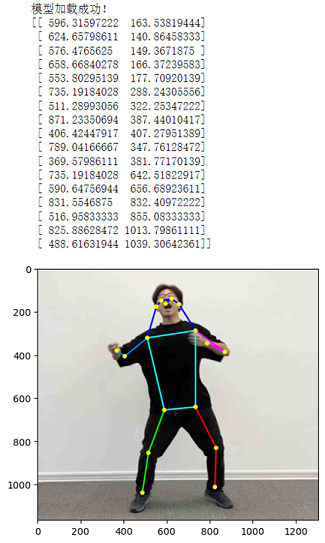
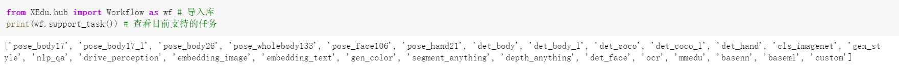
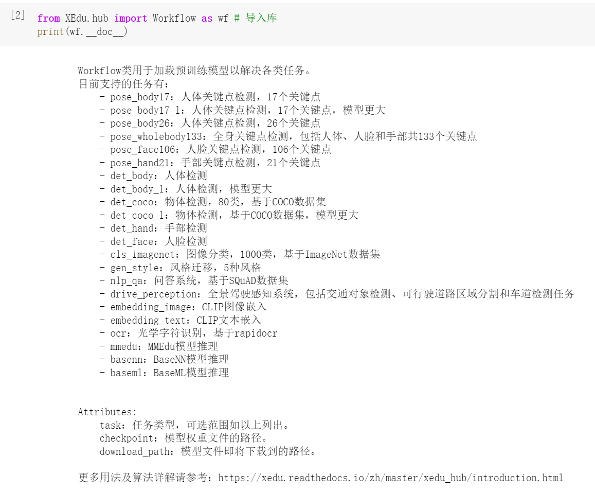

# 快速体验XEduHub

## XEduHub是什么？

XEduHub是一个专为快速、便捷地利用最先进的深度学习模型完成任务而设计的工具库。其设计灵感源自PyTorchHub，旨在以工作流的方式，高效地完成深度学习任务。XEduHub的独特之处在于它内置了大量优质的深度学习SOTA模型，无需用户自行进行繁琐的模型训练。用户根据自己的需求，选择不同的特定任务（task），而不同任务对应了不同的内置模型，拿过来就用，轻松进行AI应用实践。

### XEduHub的特点

- **简单易用**：XEduhub是个工具箱（有各种螺丝刀、扳手、小刀等），不需要专业知识，只要知道工具的名称和作用，你就可以使用这些AI模型。
- **无需训练**：你不需要自己制作工具，里面就已经有很多常用工具了（为你准备好多AI模型），当然你也可以自己做个新工具放进去。
- **节省时间**：不需要等待，使用XEduHub，选取你需要的模型，然后就可以开始你的AI之旅。


## XEduHub的安装和使用

### 安装方法

`pip install XEdu-python`或`pip install xedu-python`

库文件源代码可以从[PyPi](https://pypi.org/project/xedu-python/#files)下载，选择tar.gz格式下载，可用常见解压软件查看源码。

以识别图像中的人体关键点为例，参考代码如下：

```python
# 步骤一：导入库
from XEdu.hub import Workflow as wf
# 步骤二：选择你的AI工具
body = wf(task='pose_body17') # 实例化pose模型
# 步骤三：使用你的AI工具
img = 'body.jpg'
# 进行推理，同时返回结果和带标注的图片
result,new_img = body.inference(data=img,img_type='cv2')
print(result) # 输出推理结果
body.show(new_img) # 显示带标注图片
```



是不是很简单？一般使用步骤是：

步骤1：安装并导入XEduHub库

步骤2：选择你的推理任务

步骤3：输入数据进行推理并得到结果

一旦你安装好XEduHub并导入到代码中后，你就可以查看里面所有的AI模型。看看哪一个是你想要的，然后选择它！查看hub中目前支持的任务代码如下：

```python
from XEdu.hub import Workflow as wf
# 目前支持的任务
wf.support_task()
```



此外我们还可以通过"print(wf.__doc__ )"语句查看各类任务的文档。注意doc前后是两个下划线。



## 体验XEduhub的更多功能

体验XEduhub的最快速方式是通过OpenInnoLab平台。

OpenInnoLab平台为上海人工智能实验室推出的青少年AI学习平台，满足青少年的AI学习和创作需求，支持在线编程。在“项目”中查看更多，查找“XEduHub”即可找到所有XEduHub相关的体验项目。

XEduHub实例代码合集：[https://www.openinnolab.org.cn/pjlab/project?id=65518e1ae79a38197e449843&sc=635638d69ed68060c638f979#public](https://www.openinnolab.org.cn/pjlab/project?id=65518e1ae79a38197e449843&sc=635638d69ed68060c638f979#public)

（用Chrome浏览器打开效果最佳）

## 用XEduHub玩第一个AI项目！

第一步：导入XEduHub库

```
from XEdu.hub import Workflow as wf
```

第二步：选择你的AI工具

你可以查看里面所有的AI模型。看看哪一个是你想要的，然后选择它！可使用如下代码查看目前支持的任务：

```
# 查看目前支持的任务
wf.support_task()
```

现在以提取人体关键点任务为例。此时我们可以选择它！

```
body = wf(task='pose_body17') # 实例化pose模型
```

第三步：使用AI工具

有了模型，你就可以使用它来完成你的任务啦！继续上面的例子，可以用图片识别模型来完成推理：

```
img = 'body.jpg' # 指定进行推理的图片路径
result,new_img = body.inference(data=img,img_type='cv2',show=True) # 进行推理
```


是不是觉得XEduHub很酷呢？现在，你可以轻松地使用各种AI模型，就像玩玩具一样简单。希望你在AI的世界里有个愉快的旅程！
