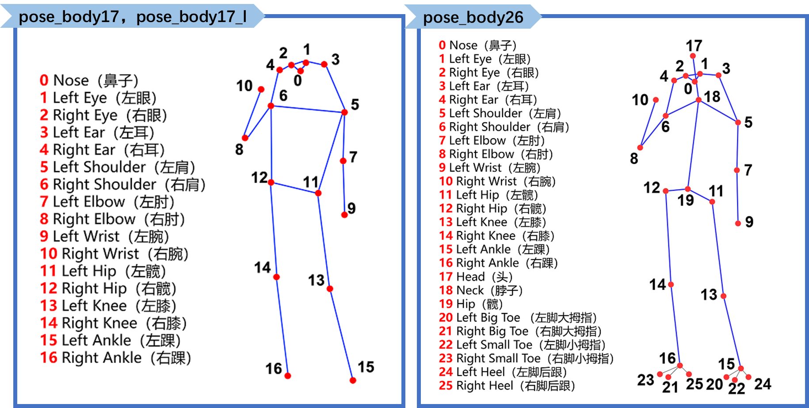

# 快速体验XEduHub

## 简介

XEduHub是一个集合了各种各样深度学习工具的模块，可以让用户高效地完成深度学习任务。使用XEduHub可以让我们轻松使用先进的AI模型，就像玩玩具一样简单！

## 安装

`pip install XEdu-python`或`pip install xedu-python`

## 体验

体验XEduhub的最快速方式是通过OpenInnoLab平台。

OpenInnoLab平台为上海人工智能实验室推出的青少年AI学习平台，满足青少年的AI学习和创作需求，支持在线编程。在“项目”中查看更多，查找“workflow”即可找到所有XEdu-hub相关的体验项目。

非正式demo：[https://www.openinnolab.org.cn/pjlab/project?id=65083f0ae8de1d02739c9192&backpath=/pjedu/userprofile?slideKey=project&type=EDITOR#public](https://www.openinnolab.org.cn/pjlab/project?id=65083f0ae8de1d02739c9192&backpath=/pjedu/userprofile?slideKey=project&type=EDITOR#public)

（用Chorme浏览器打开效果最佳）

## 用XEduHub玩第一个AI项目！

第一步：导入XEduHub库

```
from XEdu.hub import Workflow as wf
```

第二步：选择你的AI玩具

你可以查看里面所有的AI模型。看看哪一个是你想要的，然后选择它！可使用如下代码查看目前支持的任务：

```
# 查看目前支持的任务
wf.support_task()
```

现在以提取人体关键点任务为例。此时我们可以选择它！

```
body = wf(task='body') # 实例化pose模型
```

第三步：使用AI玩具

有了模型，你就可以使用它来完成你的任务啦！继续上面的例子，可以用图片识别模型来完成推理：

```
img = 'body.jpg' # 指定进行推理的图片路径
result,new_img = body.inference(data=img,img_type='cv2',show=True) # 进行推理
```



是不是觉得XEduHub很酷呢？现在，你可以轻松地使用各种AI模型，就像玩玩具一样简单。希望你在AI的世界里有个愉快的旅程！
