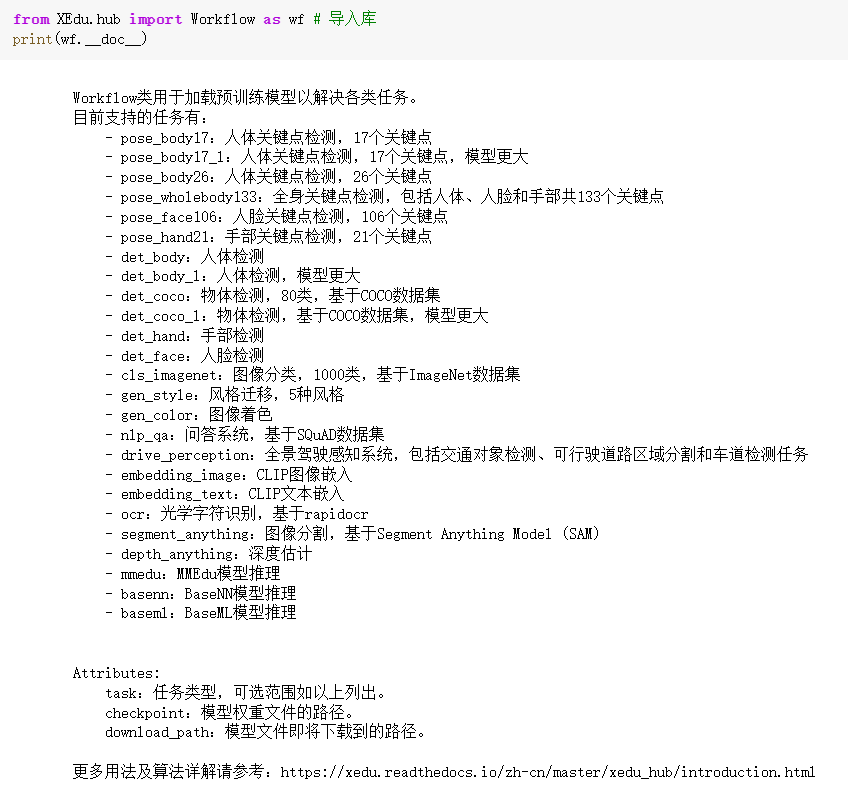

# 快速体验XEduHub

## XEduHub是什么？

XEduHub是一个专为快速、便捷地利用最先进的深度学习模型完成任务而设计的工具库。其设计灵感源自PyTorchHub，旨在以工作流的方式，高效地完成深度学习任务。XEduHub的独特之处在于它内置了大量优质的深度学习SOTA模型，无需用户自行进行繁琐的模型训练。用户根据自己的需求，选择不同的特定任务（task），而不同任务对应了不同的内置模型，拿过来就用，轻松进行AI应用实践。

### XEduHub的特点

- **简单易用**：XEduhub是个工具箱（有各种螺丝刀、扳手、小刀等），不需要专业知识，只要知道工具的名称和作用，你就可以使用这些AI模型。
- **无需训练**：你不需要自己制作工具，里面就已经有很多常用工具了（为你准备好多AI模型），当然你也可以自己做个新工具放进去。
- **节省时间**：不需要等待，使用XEduHub，选取你需要的模型，然后就可以开始你的AI之旅。


## XEduHub的安装和使用

### 安装方法

`pip install XEdu-python`或`pip install xedu-python`

库文件源代码可以从[PyPi](https://pypi.org/project/xedu-python/#files)下载，选择tar.gz格式下载，可用常见解压软件查看源码。

以识别图像中的人体关键点为例，参考代码如下：

```python
# 步骤一：导入库
from XEdu.hub import Workflow as wf
# 步骤二：选择你的AI工具
body = wf(task='pose_body17') # 实例化pose模型
# 步骤三：使用你的AI工具
img = 'body.jpg'
# 进行推理，同时返回结果和带标注的图片
result,new_img = body.inference(data=img,img_type='cv2')
print(result) # 输出推理结果
body.show(new_img) # 显示带标注图片
```

输出结果：图片加列表，列表如下：

```
[[ 596.31597222  163.53819444]
 [ 624.65798611  140.86458333]
 [ 576.4765625   149.3671875 ]
 [ 658.66840278  166.37239583]
 [ 553.80295139  177.70920139]
 [ 735.19184028  288.24305556]
 [ 511.28993056  322.25347222]
 [ 871.23350694  387.44010417]
 [ 406.42447917  407.27951389]
 [ 789.04166667  347.76128472]
 [ 369.57986111  381.77170139]
 [ 735.19184028  642.51822917]
 [ 590.64756944  656.68923611]
 [ 831.5546875   832.40972222]
 [ 516.95833333  855.08333333]
 [ 825.88628472 1013.79861111]
 [ 488.61631944 1039.30642361]]
```


是不是很简单？一般使用步骤是：

步骤1：安装并导入XEduHub库

步骤2：选择你的推理任务

步骤3：输入数据进行推理并得到结果

一旦你安装好XEduHub并导入到代码中后，你就可以查看里面所有的AI模型。看看哪一个是你想要的，然后选择它！查看hub中目前支持的任务代码如下：

```python
from XEdu.hub import Workflow as wf
# 目前支持的任务
wf.support_task()
```

输出结果：

```
['pose_body17', 'pose_body17_l', 'pose_body26', 'pose_wholebody133', 'pose_face106', 'pose_hand21', 'det_body', 'det_body_l', 'det_coco', 'det_coco_l', 'det_hand', 'cls_imagenet', 'gen_style', 'nlp_qa', 'drive_perception', 'embedding_image', 'embedding_text', 'gen_color', 'det_face', 'ocr', 'mmedu', 'basenn', 'baseml']
```


此外我们还可以通过如下语句查看各类任务的文档。注意doc前后是两个下划线。

```python
from XEdu.hub import Workflow as wf
# 目前支持的任务文档
print(wf.__doc__)
```

输出结果：

```
Workflow类用于加载预训练模型以解决各类任务。
        目前支持的任务有：
            - pose_body17：人体关键点检测，17个关键点
            - pose_body17_l：人体关键点检测，17个关键点，模型更大
            - pose_body26：人体关键点检测，26个关键点
            - pose_wholebody133：全身关键点检测，包括人体、人脸和手部共133个关键点
            - pose_face106：人脸关键点检测，106个关键点
            - pose_hand21：手部关键点检测，21个关键点
            - det_body：人体检测
            - det_body_l：人体检测，模型更大
            - det_coco：物体检测，80类，基于COCO数据集
            - det_coco_l：物体检测，基于COCO数据集，模型更大
            - det_hand：手部检测
            - det_face：人脸检测
            - cls_imagenet：图像分类，1000类，基于ImageNet数据集
            - gen_style：风格迁移，5种风格
            - nlp_qa：问答系统，基于SQuAD数据集
            - drive_perception：全景驾驶感知系统，包括交通对象检测、可行驶道路区域分割和车道检测任务
            - embedding_image：CLIP图像嵌入
            - embedding_text：CLIP文本嵌入   
            - ocr：光学字符识别，基于rapidocr
            - mmedu：MMEdu模型推理
            - basenn：BaseNN模型推理
            - baseml：BaseML模型推理


        Attributes:
            task：任务类型，可选范围如以上列出。    
            checkpoint：模型权重文件的路径。
            download_path：模型文件即将下载到的路径。

        更多用法及算法详解请参考：https://xedu.readthedocs.io/zh/master/xedu_hub/introduction.html    
```



## 体验XEduhub的更多功能

体验XEduhub的最快速方式是通过OpenInnoLab平台。

OpenInnoLab平台为上海人工智能实验室推出的青少年AI学习平台，满足青少年的AI学习和创作需求，支持在线编程。在“项目”中查看更多，查找“XEduHub”即可找到所有XEduHub相关的体验项目。

XEduHub实例代码合集：[https://www.openinnolab.org.cn/pjlab/project?id=65518e1ae79a38197e449843&sc=635638d69ed68060c638f979#public](https://www.openinnolab.org.cn/pjlab/project?id=65518e1ae79a38197e449843&sc=635638d69ed68060c638f979#public)

（用Chrome浏览器打开效果最佳）

## 用XEduHub玩第一个AI项目！

第一步：导入XEduHub库

```
from XEdu.hub import Workflow as wf
```

第二步：选择你的AI工具

你可以查看里面所有的AI模型。看看哪一个是你想要的，然后选择它！可使用如下代码查看目前支持的任务：

```
# 查看目前支持的任务
wf.support_task()
```

现在以提取人体关键点任务为例。此时我们可以选择它！

```
body = wf(task='pose_body17') # 实例化pose模型
```

第三步：使用AI工具

有了模型，你就可以使用它来完成你的任务啦！继续上面的例子，可以用图片识别模型来完成推理：

```
img = 'body.jpg' # 指定进行推理的图片路径
result,new_img = body.inference(data=img,img_type='cv2',show=True) # 进行推理
```


是不是觉得XEduHub很酷呢？现在，你可以轻松地使用各种AI模型，就像玩玩具一样简单。希望你在AI的世界里有个愉快的旅程！
