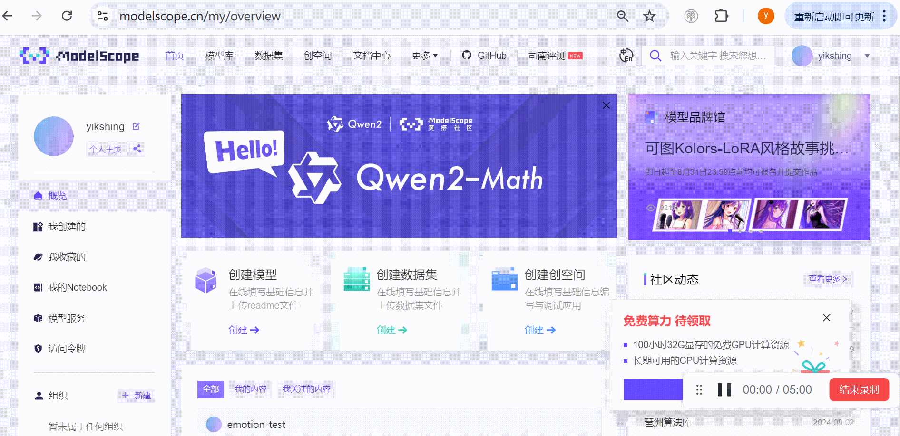
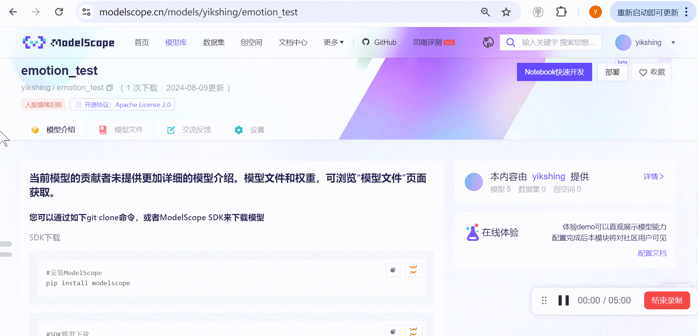
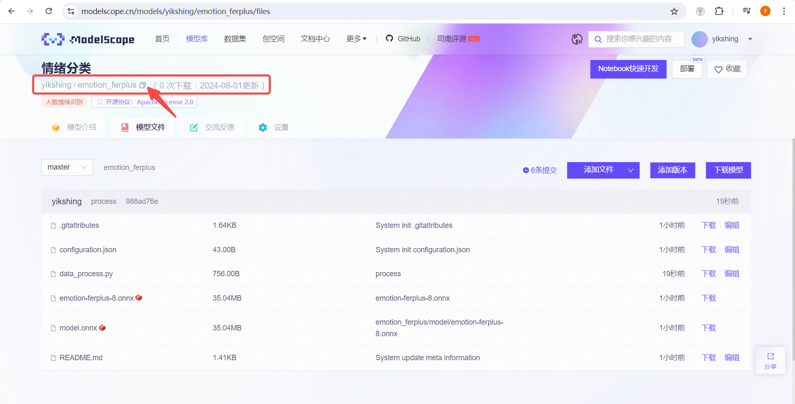
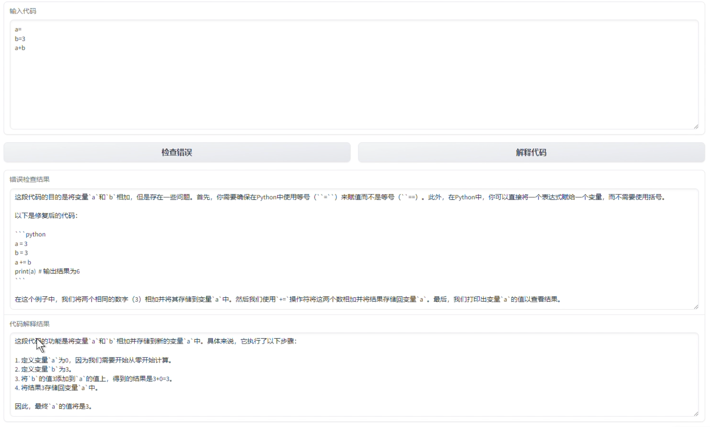

# 生态共建：体验社区模型和分享模型

相信你已经领略到XEduHub的统一代码格式带来的便利了。但是这里的模型数量毕竟还是有限的，AI的爆发性发展让模型变得越来越多，我们能不能加入AI生态中，快速体验社区里其他开源模型呢？如果我们有自己发现的好玩的模型，能不能也运行在XEduHub之上呢？答案是“必须可以”！

[魔搭社区](https://modelscope.cn/home)是一个国内开源AI社区，上面有数不胜数的模型和应用可供体验，但是对于我们小白来说，体验起来还是不太熟悉，能否用XEduHub的模型来运行平台上的模型呢？或者我能不能把我的模型上传之后与我的好友分享呢？当然可以，我们只要分享模型的仓库名称（注意，是模型仓库），好友就可以简单快速体验到社区里的模型啦！

为了让更多人知道XEduHub支持的好玩的模型，我们建立了一个[生态共建模型仓库](https://p6bm2if73b.feishu.cn/share/base/query/shrcnHJ0F4VJFpGcTvySTiwgcCg)，在这儿您可以快速查阅生态伙伴自制的模型，直接在XEduHub中调用。如果您愿意成为生态贡献者，我们诚邀您在上传模型之后，在这里填写[问卷](https://p6bm2if73b.feishu.cn/share/base/form/shrcnzOFptyxP4wkwvlidiwHyxb)登记您的模型，这样，就可以让您的模型加入到[生态共建模型仓库](https://p6bm2if73b.feishu.cn/share/base/query/shrcnHJ0F4VJFpGcTvySTiwgcCg)中，让更多人看到并用上您的模型！

## 体验社区贡献者的模型

查阅[生态共建模型仓库（点这里）](https://p6bm2if73b.feishu.cn/share/base/query/shrcnHJ0F4VJFpGcTvySTiwgcCg)，现在里面已经有许多可用的模型方案了，这里我们按照输入类别对模型方案进行了划分，这里先以“音频输入”中的语音识别模型为例介绍如何使用吧！

模型名称为`语音识别-离线-轻量`，顾名思义，这个模型可以实现语音识别。下方还有一些详细信息。

可以看到这段参考代码，可以调用本地算力实现语音转文字的功能：

```python
from XEdu.hub import Workflow as wf
model = wf(repo='yikshing/funasr-onnx-small')
res = model.inference('1.mp3') # 音频下载地址：https://modelscope.cn/models/yikshing/funasr-onnx-small/file/view/master?fileName=examples%252F1.mp3&status=0
print(res)
```

运行这段参考代码，首次运行会从云端同步模型文件，默认的保存路径为`./repo/`，你也可以指定本地保存路径，例如`model = wf(repo='xxx', download_path='D:/my_models/')`。模型同步完成后，就会将数据送入模型推理，并返回语音识别的结果。如果提示缺少音频文件，那你可以从上面提供的链接中下载该文件，或者你可以修改`model.inference('1.mp3')`中的文件路径为实际存在你电脑上文件路径，即某段需要识别为文字的音频的文件路径。

这段代码的关键是`wf(repo='yikshing/funasr-onnx-small')`指定了云端模型的仓库名称。我们替换为`yikshing/emotion_ferplus`即可替换为人脸情绪识别模型，具体信息同样可以在[生态共建模型仓库（点这里）](https://p6bm2if73b.feishu.cn/share/base/query/shrcnHJ0F4VJFpGcTvySTiwgcCg)中查找。参考代码如下：

```python
from XEdu.hub import Workflow as wf
model = wf(repo='yikshing/emotion_ferplus')
res = model.inference('./Lenna_400x400.jpg') # 图片下载地址：https://modelscope.cn/models/yikshing/emotion_ferplus/file/view/master?fileName=Lenna_400x400.jpg&status=1
print(res)
```

我们将人脸图像送入模型，模型即可将识别到的情绪返回给我们。如果考虑工作流的思路，用`task='det_face'`先提取人脸画面，再输入到这个模型中进行情绪识别，即可进一步优化这个功能。

总的来说，社区模型的加入丰富了XEduHub的应用边界，我们可以用简洁的语法调用更多的模型，实现更丰富的创意，同时通过`repo='contributor/project'`体现了社区贡献者的价值。


## repo寻址优先级

repo指向了一个地址，代码运行时，如果没有特别指定，会优先查找本地是否已经存在了该文件，先以绝对路径尝试查找，如果失败则以`'./repo/'+地址`为相对路径尝试查找。如果在本地这两个路径都不存在同名文件夹，则会启动联网同步。优先尝试从魔搭社区同步，如果魔搭不存在该仓库，则尝试以git clone的形式拉取文件。

- 寻址过程仅查找同名文件夹，不对内部文件做校验。故本地文件缺失时，可以删除整个文件夹，再次运行即可重新同步云端版本。

## 仓库（repo）规范

```plain
仓库目录要求至少包含下面两个文件
├── model.onnx
├── data_process.py
```
- model.onnx 是一个模型权重文件的通用表达文件，我们强烈建议使用这类推理框架而不是训练框架来分享模型文件。
- data_process.py 是与模型文件相关的处理函数定义代码。有两种编写方式：①前后处理定义；②自定义推理。

### 方式一：前后处理定义
```python
# data_process.py

# 导入库
# 定义全局变量
# 自定义函数

# 定义前处理函数
def preprocess(data):
  # 在这里定义模型推理前需要对数据做的处理
  # 通常需要从路径读取文件到变量中，或者对变量类型和尺寸做调整
  return result
# 定义后处理函数
def postprocess(data):
  # 在这里定义模型推理后需要对结果做的处理
  # 通常需要美化输出的结果，将列表转换为结构化表达等。
  return result
```
这种方式中，使用的是默认的推理函数（inference），执行流程为：data -> preprocess -> inference -> postprocess -> return，最终的结果会返回给用户。
```python
# 默认的inference（参考）
def inference(data):
  model = ort.InferenceSession('model.onnx', None)
  input_name = model.get_inputs()[0].name
  output_name = model.get_outputs()[0].name

  ort_inputs = {input_name: data}
  result = model.run([output_name], ort_inputs)
  return result
```
### 方式二：自定义推理
```python
# data_process.py

# 导入库
# 定义全局变量
# 自定义函数

# 自定义推理函数
def inference(data, **kwarg):
  # 这里允许传入多个变量，且变量名也可以自定义
  # 所有的实现逻辑都在这里定义
  # 用下面的代码获取model.onnx所在路径
  import os
  path = os.path.dirname(os.path.abspath(__file__))
  model_path = os.path.join(path,'model.onnx')
  # 载入模型并处理，建议这部分参考前面默认的inference实现方式
  # 返回最终结果
  return result
```
这种方式中，使用的是自定义的推理函数（inference），执行流程为：data -> inference -> return，最终的结果会返回给用户。

## 分享我的模型

我们已经体验到了社区模型的乐趣，那么如何贡献我自己训练的模型，或者是我的实现方案呢？就跟随继续往下看吧！

### 如何分享模型

我有一个好的idea，并且完成了模型训练，最终也导出了ONNX格式的模型。我也希望把这个快乐分享给伙伴，或者是我发现网络上有一个很棒的onnx模型，我想简化使用的代码量，都可以借助这一方式实现模型方案的分享。

对于教学场景而言，不同模型的实现方式各不相同，要想把模型跑通，总是需要额外写很多代码，这样的模型让不少学生甚至是老师打起了退堂鼓。如果我已经调通了这样的一个模型，把这样的处理流程分享出来，帮助其他学生更快地用上这个功能，何乐而不为呢？

而你所要做的就只有一件事：把模型权重文件和处理函数代码上传到开源AI社区，并且满足仓库规范！下面就以几个典型案例展示如何分享模型。

#### 视频讲解
视频讲解：即将上线！

### 第一步：准备模型和配套代码

#### 案例一：分享XEdu系列训练的模型

[参考链接:车牌目标检测](https://modelscope.cn/models/yikshing/det_plate_ssd)

在此之前，相信你已经体验过XEdu系列工具来进行模型推理或模型训练了，假设我们自己训练了一个基于MMEdu的车牌检测模型，原先我们可能会用这样的一段代码来实现这个功能：
```python
from XEdu.hub import Workflow as wf
mmedudet = wf(task='mmedu',checkpoint='plate.onnx')# 指定使用的onnx模型
result, result_img =  mmedudet.inference(data='data/car.png',img_type='pil')# 进行模型推理(车牌检测)
format_result = mmedudet.format_output(lang='zh') # 推理结果格式化输出
mmedudet.show(result_img) # 展示推理结果图片
```
但是这个代码需要配合模型才能运行，代码可以很方便地以文本形式传播（如微信推文、技术博客），但模型文件很难一同附带，这时repo就能大显神通了。

我们只需要两步：①重命名plate.onnx为model.onnx；②编写data_process.py，代码如下。
```python
from XEdu.hub import Workflow as wf
def get_model_path():
    import os
    path = os.path.dirname(os.path.abspath(__file__))
    model_path = os.path.join(path,'model.onnx')
    return model_path

mmedudet = wf(task='mmedu',checkpoint=get_model_path())# 指定使用的onnx模型

def inference(data,img_type1=None):
    result, result_img =  mmedudet.inference(data='data/car.png',img_type='pil')# 进行模型推理(车牌检测)
    format_result = mmedudet.format_output(lang='zh') # 推理结果格式化输出
    return format_result,result_img
```
这段代码与原来的版本有两点不同，一是有一个get_model_path()的函数。由于仓库与主函数分离，模型文件的路径会产生变化，这里已经帮大家定义好了这个函数，可以直接帮助确定模型所在的本地实际路径。二是`img_type1`参数，该参数避开了与原来`Workflow(img_type)`参数的冲突，这里要自定义一个传参的参数名。这样，分享模型的第一步就完成了。

#### 案例二：分享ONNX模型+完整推理函数

[参考链接：人脸特征提取（128维）](https://modelscope.cn/models/yikshing/face_recognition_sface)

这里以opencv官方提供的人脸特征提取模型为例，我们下载这个模型，并为它编写推理代码，先让模型能够在本地跑通。
- 模型下载地址：[face_recognition_sface_2021dec.onnx](https://github.com/opencv/opencv_zoo/blob/main/models/face_recognition_sface/face_recognition_sface_2021dec.onnx)
- 模型前后处理参考资料：[sface.py](https://github.com/opencv/opencv_zoo/blob/main/models/face_recognition_sface/sface.py)


参考模型资料，应该使用自定义inference函数方式调用模型的方法编写data_process.py的代码。推理函数编写如下：
```python
import cv2,os
import numpy as np

path = os.path.dirname(os.path.abspath(__file__))
model_dir = os.path.join(path,'model.onnx')
model_dir = model_dir.replace('\\','/')
print('模型所在路径：',model_dir)

class SFace:
    def __init__(self, modelPath, disType=0, backendId=0, targetId=0):
        self._modelPath = modelPath
        self._model = cv2.FaceRecognizerSF.create(
            model=self._modelPath,
            config="")

    def infer(self, image):
        # Forward
        features = self._model.feature(image)
        return features
try:
    recognizer = SFace(modelPath=model_dir)
except:
    print('即将升级opencv-contrib-python==4.5.4.58，请稍等')
    os.system('pip install opencv-contrib-python==4.5.4.58')
    print('******升级完成，请重新运行程序******')
    
def inference(pic,box=None):
    if isinstance(pic,str):
        pic = cv2.imread(pic) # 如果是文件路径，则用cv2读取
    if box is not None: # 如果有检测框范围，则裁切画面
        box_str = box.strip('[]').strip()
        box_list = [int(num) for num in box_str.split()]
        x1, y1, x2, y2 = map(int, box_list)
        pic = pic[y1:y2, x1:x2]
    res = recognizer.infer(pic)
    return res
```

将这段代码保存为`data_process.py`，并重命名下载的`face_recognition_sface_2021dec.onnx`为`model.onnx`，假设这两个文件保存在`D:/my_model`文件夹，那我们可以编写这样一段代码来调用这个模型。
```python
from XEdu.hub import Workflow as wf
model = wf(repo='D:/my_model') # 注意这里的路径要使用绝对路径
res = model.inference('./Lenna_400x400.jpg',box=None)
print(res)
```

#### 案例三：仅分享一个第三方ONNX模型
我们的仓库中要求有model.onnx和data_process.py两个文件。如果这个模型不需要额外的数据处理，我们可以将其留空，也就是准备一个第三方ONNX模型和一个空白的data_process.py文件。

下面以以onnx官方提供的情绪分类模型为例，我们下载这个模型，让模型能够在本地跑通。
- 模型下载地址：[emotion-ferplus-8.onnx](https://github.com/onnx/models/blob/main/validated/vision/body_analysis/emotion_ferplus/model/emotion-ferplus-8.onnx)
- 参考资料：[README.md](https://github.com/onnx/models/tree/main/validated/vision/body_analysis/emotion_ferplus)

我们重命名下载的`emotion-ferplus-8.onnx`为`model.onnx`，假设这两个文件保存在`D:/my_model`文件夹，那我们可以编写这样一段代码来调用这个模型。如前所示，如果data_process.py留空，会调用默认的inference函数尝试推理。
```python
from XEdu.hub import Workflow as wf
model = wf(repo='D:/my_model') # 注意这里的路径要使用绝对路径
data = './Lenna_400x400.jpg'
res = model.inference(data)
print(res)
```
然而运行这段代码，会发现数据格式有一些问题，我们可以修改这段主函数，修改如下：
```python
from XEdu.hub import Workflow as wf
import numpy as np
from PIL import Image

def preprocess(image_path):
    input_shape = (1, 1, 64, 64)
    img = Image.open(image_path)
    img = img.resize((64, 64), Image.ANTIALIAS)
    img_data = np.array(img)
    img_data = np.resize(img_data, input_shape)
    img_data = img_data.astype(np.float32)
    return img_data
def postprocess(scores):
    prob = np.squeeze(scores)
    classes = np.argsort(prob)[::-1]
    return classes

model = wf(repo='D:/my_model') # 注意这里的路径要使用绝对路径
data = './Lenna_400x400.jpg'
pre = preprocess(data)
res = model.inference(pre)
post = postprocess(res)
print(post)
```
再次运行这段函数，即可完整调用模型。

#### 案例四：分享ONNX模型+前后数据处理策略

[参考项目：情绪分类](https://modelscope.cn/models/yikshing/emotion_ferplus)

与案例二类似，我们使用第三方ONNX模型，但是主程序中需要做一些额外的数据处理工作，如果把这些工作也打包放入仓库（repo）中，用户使用起来就轻松多了。

这里以onnx官方提供的情绪分类模型为例，我们下载这个模型，并为它编写前后处理代码，让模型能够在本地跑通。
- 模型下载地址：[emotion-ferplus-8.onnx](https://github.com/onnx/models/blob/main/validated/vision/body_analysis/emotion_ferplus/model/emotion-ferplus-8.onnx)
- 模型前后处理参考资料：[README.md](https://github.com/onnx/models/tree/main/validated/vision/body_analysis/emotion_ferplus)

参考模型资料，原始的前后处理如下：
```python
import numpy as np
from PIL import Image

def preprocess(image_path):
    input_shape = (1, 1, 64, 64)
    img = Image.open(image_path)
    img = img.resize((64, 64), Image.ANTIALIAS)
    img_data = np.array(img)
    img_data = np.resize(img_data, input_shape)
    return img_data

def softmax(scores):
    # your softmax function
    return scores

def postprocess(scores):
    '''
    This function takes the scores generated by the network and returns the class IDs in decreasing
    order of probability.
    '''
    prob = softmax(scores)
    prob = np.squeeze(prob)
    classes = np.argsort(prob)[::-1]
    return classes
```
将这段代码保存为`data_process.py`，并重命名下载的`emotion-ferplus-8.onnx`为`model.onnx`，假设这两个文件保存在`D:/my_model`文件夹，那我们可以编写这样一段代码来调用这个模型。
```python
from XEdu.hub import Workflow as wf
model = wf(repo='D:/my_model') # 注意这里的路径要使用绝对路径
res = model.inference('./Lenna_400x400.jpg')
print(res)
```
这里运行报错为`onnxruntime.capi.onnxruntime_pybind11_state.InvalidArgument: [ONNXRuntimeError] : 2 : INVALID_ARGUMENT : Unexpected input data type. Actual: (tensor(uint8)) , expected: (tensor(float))` ，为此我们需要在前处理中添加一行`img_data = img_data.astype(np.float32)` 。前处理代码修缮如下：
```python
def preprocess(image_path):
    input_shape = (1, 1, 64, 64)
    img = Image.open(image_path)
    img = img.resize((64, 64), Image.ANTIALIAS)
    img_data = np.array(img)
    img_data = np.resize(img_data, input_shape)
    img_data = img_data.astype(np.float32)
    return img_data
```
#### 步骤一结语
这样我们就把上述ONNX模型跑通了，但是要想分享这个模型和代码，还是比较复杂，需要同时把模型文件和代码文件发送给其他人，而且传播范围有限。因此，我们可以借助社区来实现网络传播和生态建设。

### 第二步：上传模型仓库

这里以[魔搭社区](https://modelscope.cn/home)为例，首先需要通过网页注册/登录，然后点击[创建模型](https://modelscope.cn/models/create)，填写相关信息，其中`是否公开`选择“`公开模型`”。点击创建后再上传其他文件。


点击“模型文件”，点击“添加文件”，然后上传模型文件，文件名为`model.onnx`（上传位置选择“根目录”，且需要填写“文件信息”）。

点击“添加文件”，继续添加文件，上传刚才的`data_process.py` 文件。

### 第三步：测试模型
接下来，我们测试一个模型是否可以顺利运行。根据步骤一，大部分模型的调用代码就只需要如下四句，除个别比较特殊。将下面代码中的`XXXXXXXXXX`替换为你的仓库名称即可。

```python
from XEdu.hub import Workflow as wf
model = wf(repo='XXXXXXXXXX')
res = model.inference('./Lenna_400x400.jpg')
print(res)
```
仓库名称可以点击箭头指向的复制按钮来获取。


如果运行一切正常，那么就ok啦！如果有问题的话，我们就需要调整一下代码，确保可以运行后，再分享出来。

运行代码之后，模型会自动下载到这段代码同级目录的repo文件夹中。

### 第四步：填写生态共建问卷登记模型
为了让更多人知道你贡献的好玩的模型，我们诚邀您在上传模型之后，在这里填写[问卷](https://p6bm2if73b.feishu.cn/share/base/form/shrcnzOFptyxP4wkwvlidiwHyxb)登记您的模型，这样，就可以让您的模型加入[生态共建模型仓库](https://p6bm2if73b.feishu.cn/share/base/query/shrcnHJ0F4VJFpGcTvySTiwgcCg)，让更多人看到并用上您的模型！

## 高级用法
### 1）绕开文件检测
由于仓库规范要求必须有model.onnx文件，而有的模型名称可能不一致，或者类型不一致。可以上传时改为这个名字上传，然后下载完成后使用data_process.py中的代码对其进行重命名。
参考代码：
```python
import os
os.rename(old_file_name, new_file_name)
```
### 2）获取仓库其他文件路径
由于程序执行时相对路径是相对main程序而言的相对路径，而仓库中文件路径与main之间的相对路径关系并不明确，建议用下面的代码获取仓库所在文件夹的名称，然后再拼接路径。
参考代码：
```python
import os
path = os.path.dirname(os.path.abspath(__file__))
model_dir = os.path.join(path,'model.onnx') # 这里以仓库中根目录下model.onnx为例
model_dir = model_dir.replace('\\','/')
print('模型所在路径：',model_dir)
```
### 3）自动安装依赖库
如果代码执行中，由于缺乏库或库版本问题导致无法执行，建议参考下面的代码：
```python
import os
try:
    recognizer = SFace(modelPath=path)
except:
    print('即将升级opencv-contrib-python==4.5.4.58，请稍等')
    os.system('pip install opencv-contrib-python==4.5.4.58')
    print('******升级完成，请重新运行程序******')
```
### 4）数据在多个模型之间流通
Workflow最初的设计思路即工作流的意识，我们希望每个模型做好自己分内的事，模型之间结合，即可完成完整的AI应用。

例如在一个语音交互的智能作品中，我们可以将其划分为“语音识别+智能问答+语音合成”的模型组合，借助XEduLLM和两个repo的配合，即可实现语音交互的完整应用。

参考代码：
```python
from XEdu.hub import Workflow as wf
from XEdu.LLM import Client

model1 = wf(repo='yikshing/funasr-onnx-small') # 语音识别模型
model2 = Client(xedu_url='http://192.168.31.251:7860')# 智能问答
model3 = wf(repo=r'yikshing/edge-tts-zh') # 语音合成

res1 = model1.inference('a.mp3',record_seconds=5)
print('语音识别为：',res1) # 第一个模型的结果，作为第二个模型的输入
res2 = model2.inference(res1[0]['preds'][0])
print('大模型答复：',res2) # 第二个模型的结果，作为第三个模型的输入
res3 = model3.inference(res2,output='audio.mp3',gender='male')
print('音频保存至：',res3) # 第三个模型的结果，作为最终展示效果
```
### 5）复杂功能的实现
在data_process.py文件中，可以定义更加复杂的inference函数，例如你可以设计一个图形化的交互界面，用gradio来实现一个网页端的编程助手。

参见：[https://modelscope.cn/models/yikshing/code_helper/files](https://modelscope.cn/models/yikshing/code_helper/files)

```python
import gradio as gr
from XEdu.LLM import Client
chatbot = None
def check_code_errors(code):
    # 调用推理接口，检查代码中的错误
    prompt = f'你是我的编程助手，请帮我检查以下代码，并给出修改建议。\n{code}'
    res = chatbot.inference(prompt)
    return res
def explain_code(code):
    # 调用推理接口，解释代码
    global chatbot
    prompt = f'你是我的编程助手，请帮我解释以下代码的功能：\n{code}'
    res = chatbot.inference(prompt)
    return res
def inference(url,port=9000):
    global chatbot
    chatbot = Client(xedu_url=url) 
    with gr.Blocks() as demo:
        gr.Markdown("# 编程助手")
        gr.Markdown("输入你的代码，检查其中的错误并获取建议，或获取代码的功能解释。")
        with gr.Row():
            code_input = gr.Textbox(lines=10, label="输入代码")
        with gr.Row():
            error_button = gr.Button("检查错误")
            explain_button = gr.Button("解释代码")
        error_output = gr.Textbox(label="错误检查结果")
        explain_output = gr.Textbox(label="代码解释结果")
        error_button.click(check_code_errors, inputs=code_input, outputs=error_output)
        explain_button.click(explain_code, inputs=code_input, outputs=explain_output)
    demo.launch(server_port=int(port))
```
用户在使用时，只需要下面三行代码即可启动：
```python
from XEdu.hub import Workflow as wf
model = wf(repo='yikshing/code_helper')
model.inference('your_xedu_url',port=9000)
```
