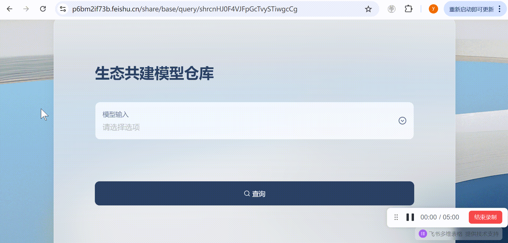

# 生态共建：体验社区模型和分享模型
相信你已经领略到XEduHub的统一代码格式带来的便利了。但是这里的模型数量毕竟还是有限的，AI的爆发性发展让模型变得越来越多，我们能不能加入AI生态中，快速体验社区里其他开源模型呢？如果我们有自己发现的好玩的模型，能不能也运行在XEduHub之上呢？答案是“必须可以”！

[魔搭社区](https://modelscope.cn/home)是一个国内开源AI社区，上面有数不胜数的模型和应用可供体验，但是对于我们小白来说，体验起来还是不太熟悉，能否用XEduHub的模型来运行平台上的模型呢？或者我能不能把我的模型上传之后与我的好友分享呢？当然可以，我们只要分享模型的仓库名称，好友就可以简单快速体验到社区里的模型啦！

为了让更多人知道XEduHub支持的好玩的模型，我们建立了一个[生态共建模型仓库](https://p6bm2if73b.feishu.cn/share/base/query/shrcnHJ0F4VJFpGcTvySTiwgcCg)，在这儿您可以快速查阅生态伙伴自制的模型，直接在XEduHub中调用。如果您愿意成为生态贡献者，我们诚邀您在上传模型之后，在这里填写[问卷](https://p6bm2if73b.feishu.cn/share/base/form/shrcnzOFptyxP4wkwvlidiwHyxb)登记您的模型，这样，就可以让您的模型加入到[生态共建模型仓库](https://p6bm2if73b.feishu.cn/share/base/query/shrcnHJ0F4VJFpGcTvySTiwgcCg)中，让更多人看到并用上您的模型！

## 体验社区贡献者的模型
查阅[生态共建模型仓库（点这里）](https://p6bm2if73b.feishu.cn/share/base/query/shrcnHJ0F4VJFpGcTvySTiwgcCg)，现在里面已经有许多可用的模型方案了，这里我们按照输入类别对模型方案进行了划分，这里先以“音频输入”中的语音识别模型为例介绍如何使用吧！

模型名称为`语音识别-离线-轻量`，下方还有一些详细信息。

可以看到这段参考代码：
```python
from XEdu.hub import Workflow as wf
model = wf(repo='yikshing/funasr-onnx-small')
res = model.inference('1.mp3') # 音频下载地址：https://modelscope.cn/models/yikshing/funasr-onnx-small/file/view/master?fileName=examples%252F1.mp3&status=0
print(res)
```

运行这段参考代码，首次运行会从云端同步模型文件，默认的同步保存路径为`./repo/`，你也可以指定本地保存路径，例如`model = wf(repo='xxx', download_path='D:/my_models/')`。模型同步完成后，就会将数据送入模型推理，并返回语音识别的结果。如果提示缺少音频文件，那你在提供的链接中下载，或者修改`model.inference('1.mp3')`中的文件名称为实际你电脑上某段需要识别为文字的音频的文件路径。

这里的关键是`wf(repo='yikshing/funasr-onnx-small')`指定了云端模型的仓库名称。我们替换为`yikshing/emotion_ferplus`即可替换为人脸情绪识别模型，具体信息同样可以在[生态共建模型仓库（点这里）](https://p6bm2if73b.feishu.cn/share/base/query/shrcnHJ0F4VJFpGcTvySTiwgcCg)中查找。参考代码如下：
```python
from XEdu.hub import Workflow as wf
model = wf(repo='yikshing/emotion_ferplus')
res = model.inference('./Lenna_400x400.jpg') # 图片下载地址：https://modelscope.cn/models/yikshing/emotion_ferplus/file/view/master?fileName=Lenna_400x400.jpg&status=1
print(res)
```

我们将人脸图像送入模型，模型即可将识别到的情绪返回给我们。如果考虑工作流的思路，用`task='det_face'`先提取人脸画面，再输入到这个模型中进行情绪识别，即可进一步优化这个功能。

总的来说，社区模型的加入丰富了XEduHub的应用边界，我们可以用简洁的语法调用更多的模型，实现更丰富的创意，同时通过`repo='contributor/project'`体现了社区贡献者的价值。

## 仓库（repo）规范

```plain
仓库目录要求至少包含下面两个文件
├── model.onnx
├── data_process.py
```
- model.onnx 是一个模型权重文件的通用表达文件，我们强烈建议使用这类推理框架而不是训练框架来分享模型文件。
- data_process.py 是与模型文件相关的处理函数定义代码。有两种编写方式：①前后处理定义；②自定义推理。

### 方式一：前后处理定义
```python
# data_process.py

# 导入库
# 定义全局变量
# 自定义函数

# 定义前处理函数
def preprocess(data):
  # 在这里定义模型推理前需要对数据做的处理
  # 通常需要从路径读取文件到变量中，或者对变量类型和尺寸做调整
  return result
# 定义后处理函数
def postprocess(data):
  # 在这里定义模型推理后需要对结果做的处理
  # 通常需要美化输出的结果，将列表转换为结构化表达等。
  return result
```
这种方式中，使用的是默认的推理函数（inference），执行流程为：data -> preprocess -> inference -> postprocess -> return，最终的结果会返回给用户。
```python
# 默认的inference（参考）
def inference(data):
  model = ort.InferenceSession('model.onnx', None)
  input_name = model.get_inputs()[0].name
  output_name = model.get_outputs()[0].name

  ort_inputs = {input_name: data}
  result = model.run([output_name], ort_inputs)
  return result
```
### 方式二：自定义推理
```python
# data_process.py

# 导入库
# 定义全局变量
# 自定义函数

# 自定义推理函数
def inference(data, **kwarg):
  # 这里允许传入多个变量，且变量名也可以自定义
  # 所有的实现逻辑都在这里定义
  # 用下面的代码获取model.onnx所在路径
  import os
  path = os.path.dirname(os.path.abspath(__file__))
  model_path = os.path.join(path,'model.onnx')
  # 载入模型并处理，建议这部分参考前面默认的inference实现方式
  # 返回最终结果
  return result
```
这种方式中，使用的是自定义的推理函数（inference），执行流程为：data -> inference -> return，最终的结果会返回给用户。

## 分享我的模型

我们已经体验到了社区模型的乐趣，那么如何贡献我自己训练的模型，或者是我的实现方案呢？就跟随继续往下看吧！

### 如何分享模型

我有一个好的idea，并且完成了模型训练，最终也导出了ONNX格式的模型，我自己用的不亦乐乎的同时，我也希望把这个快乐分享给伙伴，或者是我发现网络上有一个很棒的onnx模型，我想简化使用的代码量，都可以借助这一方式实现模型方案的分享。

对于教学场景而言，不同模型的实现方式各不相同，要想把模型跑通，总是需要额外写很多代码，这样的模型让不少学生甚至是老师打起了退堂鼓。如果我已经调通了这样的一个模型，把这样的处理流程分享出来，帮助其他学生更快地用上这个功能，何乐而不为呢？

而你所要做的就只有一件事：把模型权重文件和处理函数代码上传到开源AI社区！下面就以两个案例展示如何分享模型。

### 视频讲解
视频讲解：即将上线！

### 案例展示

##### 第一步：准备模型和配套代码

#### 案例一：ONNX模型+前后处理
我们的XEduHub支持`task='custom'（其他ONNX模型推理）`的[用法](https://xedu.readthedocs.io/zh-cn/master/xedu_hub/general_task.html#onnx)，其中就使用了前处理和后处理函数来支撑ONNX模型推理，这里的做法几乎一致。

这里以onnx官方提供的情绪分类模型为例，我们下载这个模型，并为它编写前后处理代码，让模型能够在本地跑通。
- 模型下载地址：[emotion-ferplus-8.onnx](https://github.com/onnx/models/blob/main/validated/vision/body_analysis/emotion_ferplus/model/emotion-ferplus-8.onnx)
- 模型前后处理参考资料：[README.md](https://github.com/onnx/models/tree/main/validated/vision/body_analysis/emotion_ferplus)

参考模型资料，原始的前后处理如下：
```python
import numpy as np
from PIL import Image

def preprocess(image_path):
  input_shape = (1, 1, 64, 64)
  img = Image.open(image_path)
  img = img.resize((64, 64), Image.ANTIALIAS)
  img_data = np.array(img)
  img_data = np.resize(img_data, input_shape)
  return img_data

def softmax(scores):
  # your softmax function
  return scores

def postprocess(scores):
  '''
  This function takes the scores generated by the network and returns the class IDs in decreasing
  order of probability.
  '''
  prob = softmax(scores)
  prob = np.squeeze(prob)
  classes = np.argsort(prob)[::-1]
  return classes
```
将这段代码保存为`data_process.py`，并重命名下载的`emotion-ferplus-8.onnx`为`model.onnx`，假设这两个文件保存在`D:/my_model`文件夹，那我们可以编写这样一段代码来调用这个模型。
```python
from XEdu.hub import Workflow as wf
model = wf(repo='D:/my_model') # 注意这里的路径要使用绝对路径
res = model.inference('./Lenna_400x400.jpg')
print(res)
```
这里运行报错为`onnxruntime.capi.onnxruntime_pybind11_state.InvalidArgument: [ONNXRuntimeError] : 2 : INVALID_ARGUMENT : Unexpected input data type. Actual: (tensor(uint8)) , expected: (tensor(float))` ，为此我们需要在前处理中添加一行`img_data = img_data.astype(np.float32)` 。前处理代码修缮如下：
```python
def preprocess(image_path):
  input_shape = (1, 1, 64, 64)
  img = Image.open(image_path)
  img = img.resize((64, 64), Image.ANTIALIAS)
  img_data = np.array(img)
  img_data = np.resize(img_data, input_shape)
  img_data = img_data.astype(np.float32)
  return img_data
```

#### 案例二：ONNX模型+推理函数
我们再展示用inference函数方式调用模型的方法。

这里以opencv官方提供的人脸特征提取模型为例，我们下载这个模型，并为它编写推理代码，先让模型能够在本地跑通。
- 模型下载地址：[face_recognition_sface_2021dec.onnx](https://github.com/opencv/opencv_zoo/blob/main/models/face_recognition_sface/face_recognition_sface_2021dec.onnx)
- 模型前后处理参考资料：[sface.py](https://github.com/opencv/opencv_zoo/blob/main/models/face_recognition_sface/sface.py)


参考模型资料，推理函数编写如下：
```python
import cv2,os
import numpy as np

path = os.path.dirname(os.path.abspath(__file__))
model_dir = os.path.join(path,'model.onnx')
model_dir = model_dir.replace('\\','/')
print('模型所在路径：',model_dir)

class SFace:
    def __init__(self, modelPath, disType=0, backendId=0, targetId=0):
        self._modelPath = modelPath
        self._model = cv2.FaceRecognizerSF.create(
            model=self._modelPath,
            config="")

    def infer(self, image):
        # Forward
        features = self._model.feature(image)
        return features
try:
    recognizer = SFace(modelPath=model_dir)
except:
    print('即将升级opencv-contrib-python==4.5.4.58，请稍等')
    os.system('pip install opencv-contrib-python==4.5.4.58')
    print('******升级完成，请重新运行程序******')
    
def inference(pic,box=None):
    if isinstance(pic,str):
        pic = cv2.imread(pic) # 如果是文件路径，则用cv2读取
    if box is not None: # 如果有检测框范围，则裁切画面
        box_str = box.strip('[]').strip()
        box_list = [int(num) for num in box_str.split()]
        x1, y1, x2, y2 = map(int, box_list)
        pic = pic[y1:y2, x1:x2]
    res = recognizer.infer(pic)
    return res
```

将这段代码保存为`data_process.py`，并重命名下载的`face_recognition_sface_2021dec.onnx`为`model.onnx`，假设这两个文件保存在`D:/my_model`文件夹，那我们可以编写这样一段代码来调用这个模型。
```python
from XEdu.hub import Workflow as wf
model = wf(repo='D:/my_model') # 注意这里的路径要使用绝对路径
res = model.inference('./Lenna_400x400.jpg',box=None)
print(res)
```
这样我们就把上述ONNX模型跑通了，但是要想分享这个模型和代码，还是比较复杂，需要同时把模型文件和代码文件发送给其他人，而且传播范围有限。因此，我们可以借助社区来实现网络传播和生态建设。

##### 第二步：上传模型仓库

这里以[魔搭社区](https://modelscope.cn/home)为例，首先需要通过网页注册/登录，然后点击[创建模型](https://modelscope.cn/models/create)，填写相关信息，其中`是否公开`选择“`公开模型`”。点击创建后再上传其他文件。


点击“模型文件”，点击“添加文件”，然后上传模型文件，文件名为`model.onnx`（上传位置选择“根目录”，且需要填写“文件信息”）。

点击“添加文件”，继续添加文件，上传刚才的`data_process.py` 文件。

##### 第三步：测试模型
接下来，我们测试一个模型是否可以顺利运行。下面代码中的`XXXXXXXXXX`替换为你的仓库名称。

仓库名称可以点击箭头指向的复制按钮来获取。

```python
from XEdu.hub import Workflow as wf
model = wf(repo='XXXXXXXXXX')
res = model.inference('./Lenna_400x400.jpg')
print(res)
```
看起来运行一切正常，那么就ok啦！如果有问题的话，我们就需要调整一下代码，确保可以运行后，再分享出来。

运行代码之后，模型会自动下载到这段代码同级目录的repo文件夹中。

##### 第四步：填写生态共建问卷登记模型
为了让更多人知道你贡献的好玩的模型，我们诚邀您在上传模型之后，在这里填写[问卷](https://p6bm2if73b.feishu.cn/share/base/form/shrcnzOFptyxP4wkwvlidiwHyxb)登记您的模型，这样，就可以让您的模型加入[生态共建模型仓库](https://p6bm2if73b.feishu.cn/share/base/query/shrcnHJ0F4VJFpGcTvySTiwgcCg)，让更多人看到并用上您的模型！

## 高级用法
### 1）绕开文件检测
由于仓库规范要求必须有model.onnx文件，而有的模型名称可能不一致，或者类型不一致。可以上传时改为这个名字上传，然后下载完成后使用data_process.py中的代码对其进行重命名。
参考代码：
```python
import os
os.rename(old_file_name, new_file_name)
```
### 2）获取仓库其他文件路径
由于程序执行时相对路径存在不确定性，建议用下面的代码获取仓库所在文件夹的名称，然后再拼接路径。
参考代码：
```python
import os
path = os.path.dirname(os.path.abspath(__file__))
model_dir = os.path.join(path,'model.onnx')
model_dir = model_dir.replace('\\','/')
print('模型所在路径：',model_dir)
```
### 3）自动安装依赖库
如果代码执行中，由于缺乏库或库版本问题导致无法执行，建议参考下面的代码：
```python
import os
try:
    recognizer = SFace(modelPath=path)
except:
    print('即将升级opencv-contrib-python==4.5.4.58，请稍等')
    os.system('pip install opencv-contrib-python==4.5.4.58')
    print('******升级完成，请重新运行程序******')
```