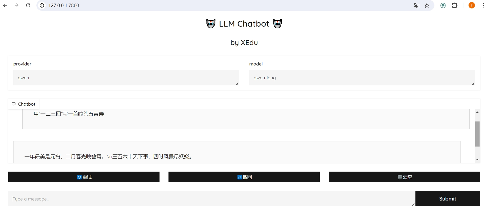

# XEduLLM功能详解

XEduLLM是一个大语言模型工具库，为开发者提供了简便统一的方式来与大语言模型进行交互和微调。该工具库可以基于各类大语言模型API构建，未来也支持创作自己的语言模型。XEduLLM的出现让开发者可以便捷地在自己的应用程序中加入大模型对话的功能，特别是在教学场景中老师可以利用XEduLLM提供一个API“二次分发”能力。

## 通用接口访问工具Client 

Client是一个通过API（应用程序编程接口）与最先进的大语言模型交流而设计的通用接口访问工具。通过几行代码就可以通过API调用各种优秀的大语言模型，发送请求经过API服务器上的大模型的处理，返回响应消息。
目前自己电脑上运行大模型比较困难，可以先借助市面API进行体验。市面上的大语言模型接口通常需要注册使用，一般通过API密钥（API key）来识别用户身份。API密钥是用户的一项唯一标识符，用于跟踪和控制API的使用情况，确保只有授权用户才能访问模型的服务。API密钥的获取请参考<a href="https://xedu.readthedocs.io/zh-cn/master/xedu_llm/how_to_get_API_key.html">API与密钥获取</a>。

### 功能一：向大模型API提问

XEduLLM支持多种大语言模型服务提供商，可以通过support_provider()来查看，代码如下：

```python
from XEdu.LLM import Client
print(chatbot.support_provider()) # 查看XEduLLM中目前提供的大语言模型服务提供商
# 输出：['openrouter', 'moonshot', 'deepseek', 'glm', 'ernie', 'qwen']
print(chatbot.support_provider(lang = 'zh') ) # 查看XEduLLM中目前提供的大语言模型服务提供商中文名
# 输出：['openrouter', '月之暗面-Kimi', '幻方-深度求索', '智谱-智谱清言', '百度-文心一言', '阿里-通义千问']
```

support_provider可以设置参数lang，表示语言，支持['en','zh']，默认'en'。

#### 向 openrouter 服务商发送提问示例

可以选择上述服务商来使用大模型，在完成对应用户注册后，运行下面的代码，即可实现对话：

```python
from XEdu.LLM import Client # 导入库
chatbot = Client(provider='openrouter',
               api_key='sk-or-v1-6d7672a58c3c837f2……c0f30a3b1c3') # 实例化客户端，api_key替换为你自己的密钥
res = chatbot.inference('用“一二三四”写一首藏头五言诗') # 输入请求，执行推理并得到结果
print(res) # 结果输出
```

输出示例：
```
一年最美是元宵，二月春光映碧霄。三百六十天下事，四时风景尽妖娆。
```

接下来对示例代码进行详细说明。

#### 1. 客户端声明

```python
from XEdu.LLM import Client # 导入库
chatbot = Client(provider='openrouter',
               api_key='sk-or-v1-6d7672a58c3c837f2……c0f30a3b1c3') # 实例化客户端
```
这里我们创建了一个“对话机器人”客户端来为我们提供服务。客户端声明函数Client()中有六个参数可以设置，本功能中使用的参数是`provider`和`api_key`，部分服务商还需要提供`secret_key`，根据具体要求设置即可。

##### 参数说明

- `base_url`(str):API的服务器地址。
- `provider`(str):指定服务提供商的名称。可以通过Client.support_provider()语句来查看支持哪些服务提供商。声明时，支持多种不同provider书写格式，英文/中文/公司/产品，如'deepseek'，'幻方-深度求索'，'幻方'，'深度求索'。
- `api_key`(str):访问密钥（Access Key），用于验证用户身份并授权访问API服务。
- `secret_key`(str):秘密密钥（Secret Key），与API密钥一起使用，提供更高级别的安全性。在文心一言ernie中，需要同时提供API密钥和秘密密钥来进行身份验证，其他的服务商不需要。
- `model`(str):这个参数用于指定使用的具体模型。在一个API中，可能有多个不同的模型可供选择，可以通过设置这个参数来选择需要的模型。此外可以通过`print(chatbot.support_model())`语句来查看该chatbot支持哪些模型。下文对此参数使用有详细说明。

#### 2. 模型推理

刚才我们已经创建了“对话机器人”客户端，接下来可以利用它进行简单的对话，将其加入到应用案例开发中，就可以让项目具有对话能力。

推理方式一：单句对话
```python
res = chatbot.inference("你好，用中文介绍一下你自己")
```
推理方式二：多句对话
```python
talk = [
    {'role':'user'     ,'content':'用一段话介绍数组'},
    {'role':'assistant','content':'数组是一种数据结构，用于存储具有相同数据类型的多个值。它们允许使用一个变量来存储多个元素，并可以通过下标（index）快速访问这些元素。数组可以是固定大小的或动态大小的，而且可以在数组中添加、删除和修改元素。在许多编程语言中，数组是非常重要的数据结构，并广泛用于数据处理和算法实现中。'},
    {'role':'user'     ,'content':'除此之外还有什么'},
]
res = chatbot.inference(talk)
```

##### 参数说明

- `input` (str|list): 对话机器人处理的输入。它可以是单个字符串，也可以是一个列表，列表中的每个元素是一个包含role和content键的字典，分别表示角色的类型（如"user"或"assistant"）和对话内容。
- `temperature` (float): 控制输出的随机性。它的值介于0和1之间。较高的值（如0.7）会使输出更加随机和创造性，而较低的值（如0.2）会使输出更加稳定和确定性。不同模型默认值不同。
- `top_p (float)`: 指定模型考虑的概率质量。它的值介于0和1之间，表示考虑概率质量最高的标记的结果的百分比。例如，0.1意味着只考虑概率质量最高的10%的标记。不同模型默认值不同。
- `stream` (bool): 是否返回一个生成器对象，默认为False。当stream为True时，client.inference函数将返回一个生成器对象。生成器对象是一个迭代器，它会在每次迭代时返回一部分输出结果，而不是一次性返回所有结果。这使得您可以按需获取输出，而不是等待整个结果集生成后再处理。

#### 3. 推理结果输出

推理结果输出方式一：直接输出（默认方式）
```python
res = chatbot.inference("你好,用中文介绍一下你自己",stream=False)
print(res)
```
当推理函数的参数`stream`为False时，返回的结果的是字符串，默认`stream`为False。允许输出各种格式文本，比如表格、代码等格式，参考代码如下。

```python
# 带格式的输出
res1 = chatbot.inference('给出一段代码，实现猜数字小游戏')
print(res1)
# 输出表格
res2 = chatbot.inference('给出一个表格，可以存储学生姓名、学号、选课课程、学分、成绩')
print(res2)
```


推理结果输出方式二：流式输出（缩短响应等待时间，但结果会分多次返回）
```python
res = chatbot.inference("你好,用中文介绍一下你自己",stream=True)
for i in res:
    print(i, flush=True, end='')
```

当参数`stream`为True时，返回一个生成器对象。生成器对象是一个迭代器，它会在每次迭代时返回一部分输出结果，而不是一次性返回所有结果，所以不能直接使用print(res)输出，可以使用for循环来迭代生成器并打印生成器中的每个元素。这种输出方式配合一些语音库，可以生成一个字就先转语音播报，不需要全部生成再转语音。

#### 举一反三，尝试使用不同的服务商
完成了向openrouter服务商发送请求的代码学习，我们可以举一反三向其他服务商发送请求。

```python
chatbot1 = Client(provider='qwen', # 选择模型为阿里-通义千问
               api_key='xxx')
chatbot2 = Client(provider='glm', # 选择模型服务提供商为智谱-智谱清言
               api_key='xxx')
```
输出：
```
|| Selected provider: qwen || Current model: qwen-long ||
|| Selected provider: glm || Current model: glm-4 ||
```

### 功能二：指定使用模型

一个服务商中可以有多个不同的大语言模型，每个模型都有不同性能特点。我们可以指定服务商中包含的模型，来处理请求，并返回相应的结果。

步骤一：查看该服务商支持哪些大语言模型

可以通过`print(chatbot.support_model())`语句来查看该chatbot支持哪些模型，代码如下所示：

```python
from XEdu.LLM import Client # 导入库
chatbot = Client(provider='qwen',
               api_key='xxx') # 实例化客户端
print(chatbot.support_model()) # 查看该chatbot支持哪些模型
```

输出示例：
```
|| Selected provider: qwen || Current model: qwen-long ||
['qwen-turbo', 'qwen-plus', 'qwen-max', 'qwen-max-0403', 'qwen-max-0107', 'qwen-max-1201', 'qwen-max-longcontext', 'qwen1.5-72b-chat', 'qwen1.5-32b-chat', 'qwen1.5-14b-chat', 'qqwen1.5-7b-chat', 'qwen1.5-1.8b-chat', 'qwen1.5-0.5b-chat', 'codeqwen1.5-7b-chat', 'qwen-72b-chat', 'qwen-14b-chat', 'qwen-7b-chat', 'qwen-1.8b-longcontext-chat', 'qwen-1.8b-chat', 'qwen1.5-110b-chat', 'qwen-max-0428', 'qwen-vl-plus', 'qwen-vl-max', 'qwen-long', 'qwen2-72b-instruct', 'qwen2-7b-instruct', 'qwen2-0.5b-instruct', 'qwen2-1.5b-instruct', 'qwen2-57b-a14b-instruct']
```
上面我们查询了阿里qwen支持的模型，其中不同模型有不同的计费模式，我们可以在[阿里云](https://dashscope.console.aliyun.com/billing)查看详细计费规则，目前限时免费的有qwen1.5-0.5b-chat和qwen-1.8b-chat。

步骤二：指定使用的大语言模型

指定chatbot使用接口中查询到的某个模型，例如前面查询到的模型`mistralai/mistral-7b-instruct:free`，示例代码如下所示：
```python
from XEdu.LLM import Client # 导入库
chatbot = Client(provider='qwen',
               api_key='sk-or-v1-6d7672a58c3c837……f30a3b1c3',
               model='qwen-1.8b-chat') # 实例化客户端
res = chatbot.inference('你好，用中文介绍一下你自己') # 输入请求，执行推理并得到结果
print(res) 
# 结果输出：你好！我是一个大型语言模型，名叫通义千问。我是由阿里云开发的，具有强大的自然语言处理能力。我可以回答各种问题，提供信息和与用户进行对话。无论是学术知识、实用技巧还是娱乐咨询，我都能尽力帮助你。尽管我是一个人工智能，但我一直在不断学习和进步，努力更好地理解和回应用户的需求。如果你有任何问题，不要犹豫，尽管问我吧！
```
本功能示例代码中声明函数Client()新增使用`model`(str)，这个参数用于指定使用的具体模型。在一个API中，可能有多个不同的模型可供选择，可以通过设置这个参数来选择需要的模型。此外可以通过`print(chatbot.support_model())`语句来查看该chatbot支持哪些模型。

后续模型推理和推理结果输出与功能一一致，不再重复。

### 功能三：通过大模型API的服务器地址发送请求

目前已经兼容了上述的服务商，但是如果你知道其他服务商的API地址（base_url）的话，你也可以通过向服务器地址发送请求的方式使用。以向openrouter服务器地址发送请求为例，完整代码如下：

```python
from XEdu.LLM import Client # 导入库
chatbot = Client(base_url='https://openrouter.ai/api/v1',
               api_key='sk-or-v1-62a32...a1539',
               model="mistralai/mistral-7b-instruct:free") # 实例化客户端
res = chatbot.inference('你好，用中文介绍一下你自己') # 输入请求，执行推理并得到结果
print(res)
```

本功能示例代码中声明函数Client()新增使用的参数是`base_url`(str)，为API的服务器地址。

通过阅读各家大模型服务提供商的官方文档，可以找到该模型所对应的服务器地址（`base_url`）。下面列举了部分服务商的base_url，仅供参考。

<table class="docutils align-default">
    <thead>
        <tr class="row-odd">
            <th class="head">名称</th>
            <th class="head">base_url</th>
        </tr>
    </thead>
    <tbody>
        <tr class="row-even">
            <td>openrouter</td>
            <td>https://openrouter.ai/api/v1</td>
        </tr>
    </tbody>
    <tbody>
        <tr class="row-even">
            <td>moonshot（月之暗面）</td>
            <td>https://api.moonshot.cn/v1</td>
        </tr>
    </tbody>
    <tbody>
        <tr class="row-even">
            <td>deepseek（深度求索）</td>
            <td>https://api.deepseek.com</td>
        </tr>
    </tbody>
    <tbody>
        <tr class="row-even">
            <td>glm（智谱清言）</td>
            <td>https://open.bigmodel.cn/api/paas/v4/</td>
        </tr>
    </tbody>
        <tbody>
        <tr class="row-even">
            <td>qwen（通义千问）</td>
            <td>https://dashscope.aliyuncs.com/api/v1/services/aigc/text-generation/generation</td>
        </tr>
    </tbody>
</table>
我们可以举一反三向其他大模型API的服务器地址发送请求。

### 功能四：启动基于网页的聊天机器人服务

使用`run` 方法可启动一个基于网页的聊天机器人服务，使用户可以通过网页界面与聊天机器人进行对话。

```python
chatbot.run()
```
输出内容：
```
Running on local URL:  http://192.168.1.123:7860
Running on local URL:  http://127.0.0.1:7860
Running on local URL:  http://0.0.0.0:7860

To create a public link, set `share=True` in `launch()`.
```

这个方法将会本机上启动一个 Web 服务，并提供一个用户界面，方便用户进行实时对话。Web服务地址已输出，几个网址不一定都能打开，可以逐一尝试，例如 http://127.0.0.1:7860，可以通过本机浏览器访问，如果想通过其他局域网设备访问，可以通过访问本机局域网IP地址+端口号（如http://192.168.1.123:7860）访问。需要注意的是，如果其他设备访问失败，可以检查是否是电脑防火墙对访问进行了拦截。



网页中下方为文本输入框，输入完成后按回车，或者“Submit”都可以提交，对回答不满意，可以点击“重试”，想要删除这条记录，可以点击“撤回”，想要清空历史聊天记录重新开始会话，可以刷新页面，或者点击“清空”。

##### 参数说明

- `host` (str): 指定 Web 服务器的主机地址。默认值为 `'0.0.0.0'`，表示开放所有外部IP访问，你也可以将其设置为其他 IP 。
- `port` (int): 指定 Web 服务器的端口号，默认值为 `7860`，可以修改为本机上空闲的任意端口号。

##### 如何限制访问

- **仅允许本机访问**：127.0.0.1表示本地回环地址，仅能本机访问。这样可以避免来自其他设备的网络攻击。

  ```python
  chatbot.run(host='127.0.0.1')
  ```
  
- **仅限特定局域网内设备访问**：如果希望对特定局域网的设备访问，可将 `host` 做修改，例如 `'192.168.1.123'`，表示仅向本机该 IP 所在局域网的设备开放访问，这种方法通常在本机接入了多个局域网时适用。例如：

  ```python
  chatbot.run(host='192.168.1.123', port=7860)
  ```
  
  这样，该局域网内的设备可以通过本机的 IP 地址+端口号 进行访问。但其他局域网的设备就无法访问。

#### 直接启动网页功能的完整代码

```python
from XEdu.LLM import Client
chatbot = Client(provider='moonshot',
               api_key="sk-cjCzE5Oo***K53EVAZTnln") # 密钥省略
# 启动基于网页的聊天机器人服务
chatbot.run(host='127.0.0.1', port=7860)
```

此方法默认方式只能本机访问，不适合需要在局域网或互联网中共享的场景。且并发处理能力有限，依赖于 Gradio 库的性能。

### 功能五：聊天机器人的二次分发

前面的功能中，都必须要获取api_key才能使用，但是在教学等场景中，可能无法每个学生都注册自己的api_key，老师也不希望自己的api_key直接告诉学生，怎么让学生体会到大模型的魅力呢？一种方式是让学生访问网页体验对话，但是如果要开发应用呢？还有一种更加灵活的用法，使用二次分发功能，通过将聊天机器人的服务部署在教师机上，学生就可以在不同的终端或应用中通过该地址进行访问和调用。这种方式通常需要先获取教师机服务的 IP 地址和端口，然后在学生端使用该地址进行推理或其他操作。

使用示例如下：

1.教师端启动服务

```python
from XEdu.LLM import Client

# 创建一个聊天机器人客户端
chatbot = Client(provider='moonshot',
               api_key="sk-cjCzE5Oo***K53EVAZTnln") # 密钥省略

# 启动基于网页的聊天机器人服务，并指定局域网 IP 地址和端口
chatbot.run()
```

输出示例：

```
Running on local URL: http://10.1.48.23:7863
```

2.在其他设备或应用中访问该服务

刚才的输出中，我们可以看到服务的 IP 地址和端口。在其他设备上就可以通过上述获取的 IP 地址和端口访问聊天机器人服务：
```python
from XEdu.LLM import Client

# 使用固定的 IP 地址和端口号，使用获取的ip
stu_chatbot = Client(xedu_url='http://10.1.48.23:7863')

# 进行推理或其他操作
res = stu_chatbot.inference("今天天气怎么样？")
# 返回：今天阳光明媚，xxx...
```

这样，只需在Client中指定xedu_url为刚才获取的地址，无需再设定api_key，就可以借助教师机二次分发大模型对话能力，实现了共享聊天机器人服务的同时避免了密钥的暴露。学生可以借此在课堂上完成应用案例开发。


## 应用案例
### 案例一：流式对话
默认对话需要等服务计算完整回答后反馈，会有很长的等待时间，让人感觉很不流畅。如果开启stream流式对话，就会好很多。（缩短响应等待时间，但结果会分多次返回）

下面是一个流式输出+语音合成的示例：
```python
from XEdu.LLM import Client
import pyttsx3
chatbot = Client(provider='qwen', # 选择模型为阿里-通义千问
               api_key='sk-946498b7c00b423badfb96046dd32ae4') # 引号内为用户密钥，用于确定身份，若失效，请自行注册：https://dashscope.console.aliyun.com/apiKey 
res = chatbot.inference("你好,用中文介绍一下你自己",stream=True)
for i in res:
    print(i, flush=True, end='')
    pyttsx3.speak(i)
```

### 案例二：气象专家
大模型是一个很厉害的角色，我可以通过pinpong、siot等读取当前的传感器参数，让大模型帮我分析，这样，我就不用自己训练模型来分析啦！
```python
# 省略导入库和获取传感器信息的过程，传感器数据已经存储在变量value中。
res = chatbot.inference("请你作为气象专家，帮我分析："+ value + "这些变量代表当前气象如何？可以帮我分析一下吗？")
print(res)
pyttsx3.speak(res)
```
### 案例三：历史上的今天
根据日期回顾历史上这个日期发生的重要事迹。
```python
from XEdu.LLM import Client
import datetime,pyttsx3
print(datetime.date.today())
question = '请问历史上的今天（'+ str(datetime.date.today())[5:] + '）发生过什么？'
print('问题：', question)
chatbot = Client(provider='qwen', # 选择模型为阿里-通义千问
               api_key='sk-946...2ae4') # 引号内为用户密钥，用于确定身份，若失效，请自行注册：https://dashscope.console.aliyun.com/apiKey 
res = chatbot.inference(question)
print('回答：', res)
pyttsx3.speak(res)
```
输出：
```
2024-06-27
问题： 请问历史上的今天（06-27）发生过什么？
|| Selected provider: qwen || Current model: qwen-long ||
回答： 以下是历史上的今天（06-27）发生的一些重要事件：
1. 1950年：...
...
5. 2015年：...

这些事件只是其中的一部分，历史上的每一天都有许多不同的事件发生。
```
### 案例四：Prompt定制
模型微调是一个很有趣的事情，我们可以定义自己的模型能力，然后让他帮我们完成设定好的特定任务。其中一种最简单的方式是Prompt定制，网上有很多好玩的Prompt示例，例如[这里](https://gitee.com/aixiali/wonderful-prompts)就有很多很棒的例子。我们可以利用多轮对话的方式，实现类似的效果。
```python
from XEdu.LLM import Client
chatbot = Client(provider='qwen', # 选择模型为阿里-通义千问
               api_key='sk-94x...ae4') # 引号内为用户密钥，用于确定身份，若失效，请自行注册：https://dashscope.console.aliyun.com/apiKey 
talk = [
    {'role':'system'   ,'content':'你将作为一位善于在两种事物中建立因果联系的智者去构建事物“此物”到“彼物”的因果链，以 “此物->事物A->事物B->事物C...等事物->彼物”这样的形式输出，中间事物数量不限。举个例子 “此物：祖父， 彼物：我”，输出为“祖父->爷爷->爸爸->我”，然后解释其因果联系。'},
    {'role':'user'     ,'content':'现在请告诉我 “此物：Transformer，彼物：GPT” 的因果联系。'},
]
res = chatbot.inference(talk)
print(res)
```
输出：
```
Transformer->自注意力机制->序列建模改进->预训练模型发展->GPT
解释如下：
1. Transformer：2017年，Google的研究人员提出了Transformer架构，这是一种基于自注意力机制的深度学习模型，用于解决序列数据的处理问题，如自然语言处理。
2. 自注意力机制：Transformer的核心创新是自注意力（Self-Attention）机制，它允许模型在处理序列数据时同时考虑所有元素，而不是传统的递归或滑动窗口方法，这提高了模型并行化能力和理解上下文的能力。
3. 序列建模改进：Transformer的自注意力机制显著改进了序列建模，使得模型能够更好地理解和生成复杂的语言结构，这对于自然语言生成和理解任务至关重要。
4. 预训练模型发展：Transformer的成功推动了预训练模型的发展，即在大规模无标注文本上预先训练模型，然后在特定任务上进行微调。这种范式降低了对大量标注数据的依赖，提高了模型的泛化能力。
5. GPT：OpenAI的GPT（Generative Pre-trained Transformer）系列是基于Transformer架构的预训练模型，它使用自注意力机制进行语言建模，展示了强大的语言生成和理解能力，如GPT-3更是成为了预训练模型领域的里程碑式作品。
```