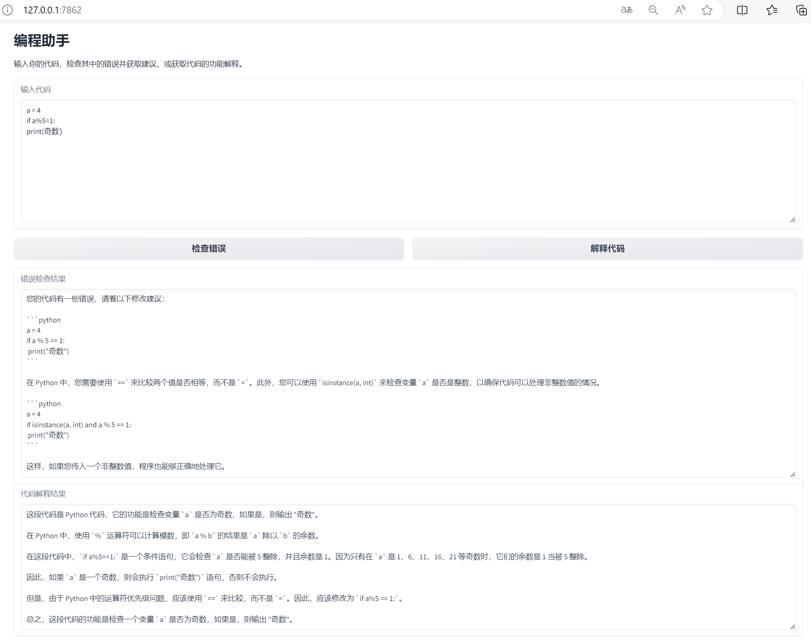
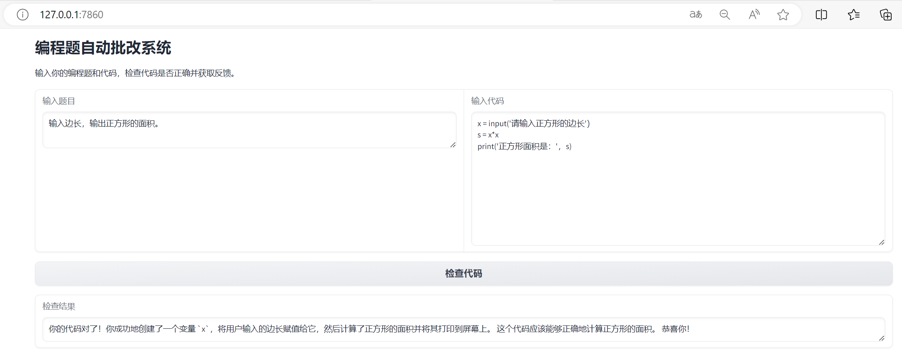

# XEduLLM功能详解

XEduLLM是一个大语言模型工具库，为开发者提供了简便统一的方式来与大语言模型进行交互和微调。该工具库可以基于各类大语言模型API构建，未来也支持创作自己的语言模型。XEduLLM的出现让开发者可以便捷地在自己的应用程序中加入大模型对话的功能，特别是在教学场景中老师可以利用XEduLLM提供一个API“二次分发”能力。

- [XEduLLM：让大模型进入中小学信息科技课[J].中国信息技术教育,2024,(15):89-91.](https://kns.cnki.net/kcms2/article/abstract?v=01ddXewXOSCM3qpKKQJvwcnlfWy6LSqIQOZE2fNNp3bjEH-Wzx9VbDO-aS3bmUS7jhfAu2f3LXTpJjw9G8gA_JmgRBOMCPs7NwQCKGzaC1Phk-SLR0PWDZ4oMlynPN-vAU1J3PrSWtiIGYz_rQSXxfRfQRkt4xNp&uniplatform=NZKPT)

**视频版使用指引**

（点击视频进入跳转观看）
<iframe src="//player.bilibili.com/player.html?isOutside=true&aid=112994499431048&bvid=BV12tWsePEmA&cid=500001656107517&p=1" scrolling="no" border="0" frameborder="no" framespacing="0" allowfullscreen="true"></iframe>

## 通用接口访问工具Client 

Client是一个通过API（应用程序编程接口）与最先进的大语言模型交流而设计的通用接口访问工具。通过几行代码就可以通过API调用各种优秀的大语言模型，发送请求经过API服务器上的大模型的处理，返回响应消息。
目前自己电脑上运行大模型比较困难，可以先借助市面API进行体验。市面上的大语言模型接口通常需要注册使用，一般通过API密钥（API key）来识别用户身份。API密钥是用户的一项唯一标识符，用于跟踪和控制API的使用情况，确保只有授权用户才能访问模型的服务。API密钥的获取请参考<a href="https://xedu.readthedocs.io/zh-cn/master/xedu_llm/how_to_get_API_key.html">API与密钥获取</a>。

### 功能一：向大模型API提问

XEduLLM支持多种大语言模型服务提供商，可以通过support_provider()来查看，代码如下：

```python
from XEdu.LLM import Client
print(chatbot.support_provider()) # 查看XEduLLM中目前提供的大语言模型服务提供商
# 输出：['openrouter', 'moonshot', 'deepseek', 'glm', 'ernie', 'qwen']
print(chatbot.support_provider(lang = 'zh') ) # 查看XEduLLM中目前提供的大语言模型服务提供商中文名
# 输出：['openrouter', '月之暗面-Kimi', '幻方-深度求索', '智谱-智谱清言', '百度-文心一言', '阿里-通义千问']
```

support_provider可以设置参数lang，表示语言，支持['en','zh']，默认'en'。

#### 向 openrouter 服务商发送提问示例

可以选择上述服务商来使用大模型，在完成对应用户注册后，运行下面的代码，即可实现对话：

```python
from XEdu.LLM import Client # 导入库
chatbot = Client(provider='openrouter',
               api_key='sk-or-v1-6d7672a58c3c837f2……c0f30a3b1c3') # 实例化客户端，api_key替换为你自己的密钥
res = chatbot.inference('用“一二三四”写一首藏头五言诗') # 输入请求，执行推理并得到结果
print(res) # 结果输出
```

输出示例：
```
一年最美是元宵，二月春光映碧霄。三百六十天下事，四时风景尽妖娆。
```

接下来对示例代码进行详细说明。

#### 1. 客户端声明

```python
from XEdu.LLM import Client # 导入库
chatbot = Client(provider='openrouter',
               api_key='sk-or-v1-6d7672a58c3c837f2……c0f30a3b1c3') # 实例化客户端
```
这里我们创建了一个“对话机器人”客户端来为我们提供服务。客户端声明函数Client()中有六个参数可以设置，本功能中使用的参数是`provider`和`api_key`，部分服务商还需要提供`secret_key`，根据具体要求设置即可。

##### 参数说明

- `base_url`(str):API的服务器地址。（类OpenAI用法）
- `provider`(str):指定服务提供商的名称。可以通过Client.support_provider()语句来查看支持哪些服务提供商。声明时，支持多种不同provider书写格式，英文/中文/公司/产品，如'deepseek'，'幻方-深度求索'，'幻方'，'深度求索'。
- `api_key`(str):访问密钥（Access Key），用于验证用户身份并授权访问API服务。
- `secret_key`(str):秘密密钥（Secret Key），与API密钥一起使用，提供更高级别的安全性。在文心一言ernie中，需要同时提供API密钥和秘密密钥来进行身份验证，其他的服务商不需要。
- `model`(str):这个参数用于指定使用的具体模型。在一个API中，可能有多个不同的模型可供选择，可以通过设置这个参数来选择需要的模型。此外可以通过`print(chatbot.support_model())`语句来查看该chatbot支持哪些模型。下文对此参数使用有详细说明。

#### 2. 模型推理

刚才我们已经创建了“对话机器人”客户端，接下来可以利用它进行简单的对话，将其加入到应用案例开发中，就可以让项目具有对话能力。

推理方式一：单句对话
```python
res = chatbot.inference("你好，用中文介绍一下你自己")
```
推理方式二：多句对话

多句对话的使用角色（`role`）有三种：`user`,`assistant`,`system`。在本案例中，`user`代表用户/使用者的提问，`assistant`代表智能服务的回复，`system`是开发者对服务的初始角色设定，在对话伊始的时候设定，用这一角色发送的消息不需要有回复。其中，`system`写在最开头，最为初始设定，当然也可以没有`system`，使用默认设定。然后是`user`和`assistant`交替出现，代表每一轮的发问和回答。最后应该是`user`，代表最新一轮的提问，期待回答。下面我们通过以下方式使用多句对话：
```python
talk = [
    {'role':'user'     ,'content':'用一段话介绍数组'},
    {'role':'assistant','content':'数组是一种数据结构，用于存储具有相同数据类型的多个值。它们允许使用一个变量来存储多个元素，并可以通过下标（index）快速访问这些元素。数组可以是固定大小的或动态大小的，而且可以在数组中添加、删除和修改元素。在许多编程语言中，数组是非常重要的数据结构，并广泛用于数据处理和算法实现中。'},
    {'role':'user'     ,'content':'除此之外还有什么'},
]
res = chatbot.inference(talk)
```

##### 参数说明

- `input` (str|list): 对话机器人处理的输入。它可以是单个字符串，也可以是一个列表，列表中的每个元素是一个包含role和content键的字典，分别表示角色的类型（如"user"或"assistant"）和对话内容。
- `temperature` (float): 控制输出的随机性。它的值介于0和1之间。较高的值（如0.7）会使输出更加随机和创造性，而较低的值（如0.2）会使输出更加稳定和确定性。不同模型默认值不同。
- `top_p (float)`: 指定模型考虑的概率质量。它的值介于0和1之间，表示考虑概率质量最高的标记的结果的百分比。例如，0.1意味着只考虑概率质量最高的10%的标记。不同模型默认值不同。
- `stream` (bool): 是否返回一个生成器对象，默认为False。当stream为True时，client.inference函数将返回一个生成器对象。生成器对象是一个迭代器，它会在每次迭代时返回一部分输出结果，而不是一次性返回所有结果。这使得您可以按需获取输出，而不是等待整个结果集生成后再处理。

#### 3. 推理结果输出

推理结果输出方式一：直接输出（默认方式）
```python
res = chatbot.inference("你好,用中文介绍一下你自己",stream=False)
print(res)
```
当推理函数的参数`stream`为False时，返回的结果的是字符串，默认`stream`为False。允许输出各种格式文本，比如表格、代码等格式，参考代码如下。

```python
# 带格式的输出
res1 = chatbot.inference('给出一段代码，实现猜数字小游戏')
print(res1)
# 输出表格
res2 = chatbot.inference('给出一个表格，可以存储学生姓名、学号、选课课程、学分、成绩')
print(res2)
```


推理结果输出方式二：流式输出（缩短响应等待时间，但结果会分多次返回）
```python
res = chatbot.inference("你好,用中文介绍一下你自己",stream=True)
for i in res:
    print(i, flush=True, end='')
```

当参数`stream`为True时，返回一个生成器对象。生成器对象是一个迭代器，它会在每次迭代时返回一部分输出结果，而不是一次性返回所有结果，所以不能直接使用print(res)输出，可以使用for循环来迭代生成器并打印生成器中的每个元素。这种输出方式配合一些语音库，可以生成一个字就先转语音播报，不需要全部生成再转语音。

#### 举一反三，尝试使用不同的服务商
完成了向openrouter服务商发送请求的代码学习，我们可以举一反三向其他服务商发送请求。

```python
chatbot1 = Client(provider='qwen', # 选择模型为阿里-通义千问
               api_key='xxx')
chatbot2 = Client(provider='glm', # 选择模型服务提供商为智谱-智谱清言
               api_key='xxx')
```
输出：
```
|| Selected provider: qwen || Current model: qwen-long ||
|| Selected provider: glm || Current model: glm-4 ||
```

### 功能二：指定使用模型

一个服务商中可以有多个不同的大语言模型，每个模型都有不同性能特点。我们可以指定服务商中包含的模型，来处理请求，并返回相应的结果。

步骤一：查看该服务商支持哪些大语言模型

可以通过`print(chatbot.support_model())`语句来查看该chatbot支持哪些模型，代码如下所示：

```python
from XEdu.LLM import Client # 导入库
chatbot = Client(provider='qwen',
               api_key='xxx') # 实例化客户端
print(chatbot.support_model()) # 查看该chatbot支持哪些模型
```

输出示例：
```
|| Selected provider: qwen || Current model: qwen-long ||
['qwen-turbo', 'qwen-plus', 'qwen-max', 'qwen-max-0403', 'qwen-max-0107', 'qwen-max-1201', 'qwen-max-longcontext', 'qwen1.5-72b-chat', 'qwen1.5-32b-chat', 'qwen1.5-14b-chat', 'qqwen1.5-7b-chat', 'qwen1.5-1.8b-chat', 'qwen1.5-0.5b-chat', 'codeqwen1.5-7b-chat', 'qwen-72b-chat', 'qwen-14b-chat', 'qwen-7b-chat', 'qwen-1.8b-longcontext-chat', 'qwen-1.8b-chat', 'qwen1.5-110b-chat', 'qwen-max-0428', 'qwen-vl-plus', 'qwen-vl-max', 'qwen-long', 'qwen2-72b-instruct', 'qwen2-7b-instruct', 'qwen2-0.5b-instruct', 'qwen2-1.5b-instruct', 'qwen2-57b-a14b-instruct']
```
上面我们查询了阿里qwen支持的模型，其中不同模型有不同的计费模式，我们可以在[阿里云](https://dashscope.console.aliyun.com/billing)查看详细计费规则，目前限时免费的有qwen1.5-0.5b-chat和qwen-1.8b-chat。

步骤二：指定使用的大语言模型

指定chatbot使用接口中查询到的某个模型，例如前面查询到的模型`mistralai/mistral-7b-instruct:free`，示例代码如下所示：
```python
from XEdu.LLM import Client # 导入库
chatbot = Client(provider='qwen',
               api_key='sk-or-v1-6d7672a58c3c837……f30a3b1c3',
               model='qwen-1.8b-chat') # 实例化客户端
res = chatbot.inference('你好，用中文介绍一下你自己') # 输入请求，执行推理并得到结果
print(res) 
# 结果输出：你好！我是一个大型语言模型，名叫通义千问。我是由阿里云开发的，具有强大的自然语言处理能力。我可以回答各种问题，提供信息和与用户进行对话。无论是学术知识、实用技巧还是娱乐咨询，我都能尽力帮助你。尽管我是一个人工智能，但我一直在不断学习和进步，努力更好地理解和回应用户的需求。如果你有任何问题，不要犹豫，尽管问我吧！
```
本功能示例代码中声明函数Client()新增使用`model`(str)，这个参数用于指定使用的具体模型。在一个API中，可能有多个不同的模型可供选择，可以通过设置这个参数来选择需要的模型。此外可以通过`print(chatbot.support_model())`语句来查看该chatbot支持哪些模型。

后续模型推理和推理结果输出与功能一一致，不再重复。

### 功能三：接入更多服务商API（以Silicon Cloud为例）

目前已经兼容了上述的服务商，但是有的模型并没有在上述我们支持的平台中，我们依然可以通过API接口调用的方式来接入，Silicon Cloud和OpenRouter都是这类服务集成商，提供了数十种模型可供选择。查阅您准备接入的平台文档，这里以[**Silicon Cloud**](https://cloud.siliconflow.cn/playground/chat/17885302561) 为例，介绍如何接入。

我们在其文档页面可以找到关于[使用Silicon Cloud API](https://docs.siliconflow.cn/docs/4-api%E8%B0%83%E7%94%A8#%E9%80%9A%E8%BF%87openai%E6%8E%A5%E5%8F%A3%E8%B0%83%E7%94%A8)的说明，我们就借此来实现调用。

查看文档说明中有一句：`base_url="https://api.siliconflow.cn/v1"`，在我们的XEduLLM中，同样可以使用`base_url`来接入支持OpenAI格式的接口服务。这样接入我们需要三个参数：`base_url`、`api_key`和`model`。

```python
from XEdu.LLM import Client # 导入库
chatbot = Client(api_key='sk-ya***fx', 
                base_url='https://api.siliconflow.cn/v1',
                model='internlm/internlm2_5-20b-chat')
question = '请写一首和教育有关的现代诗'
print('问题：', question) 
res = chatbot.inference(question)
print('回答：', res)
```
最终，我们可给出这样一段参考代码来调用平台上某一模型。

- `base_url`: 服务接入地址，这里我们查询到是`https://api.siliconflow.cn/v1`；
- `api_key`: 该平台你的密钥，Silicon Cloud可以在这个[链接](https://cloud.siliconflow.cn/account/ak)中查询或创建；
- `model`: 模型名称，通常这类平台中有很多模型，我们需要指定调用的是哪个模型，Silicon Cloud的模型名称可以在[这里](https://siliconflow.cn/zh-cn/pricing)查询，例如`'internlm/internlm2_5-20b-chat'`，同时我们可以查看到当前其价格是`¥1.00/1M tokens`，大约1元1百万字符输入输出。

通过阅读各家大模型服务提供商的官方文档，可以找到该模型所对应的服务器地址（`base_url`）。下面列举了部分服务商的base_url，仅供参考。

<table class="docutils align-default">
    <thead>
        <tr class="row-odd">
            <th class="head">名称</th>
            <th class="head">base_url</th>
        </tr>
    </thead>
    <tbody>
        <tr class="row-even">
            <td>Silicon Cloud（硅基流动）</td>
            <td>https://api.siliconflow.cn/v1</td>
        </tr>
    </tbody>
    <tbody>
        <tr class="row-even">
            <td>openrouter</td>
            <td>https://openrouter.ai/api/v1</td>
        </tr>
    </tbody>
    <tbody>
        <tr class="row-even">
            <td>moonshot（月之暗面）</td>
            <td>https://api.moonshot.cn/v1</td>
        </tr>
    </tbody>
    <tbody>
        <tr class="row-even">
            <td>deepseek（深度求索）</td>
            <td>https://api.deepseek.com</td>
        </tr>
    </tbody>
    <tbody>
        <tr class="row-even">
            <td>glm（智谱清言）</td>
            <td>https://open.bigmodel.cn/api/paas/v4/</td>
        </tr>
    </tbody>
        <tbody>
        <tr class="row-even">
            <td>qwen（通义千问）</td>
            <td>https://dashscope.aliyuncs.com/api/v1/services/aigc/text-generation/generation</td>
        </tr>
    </tbody>
</table>

我们可以举一反三向其他大模型API的服务器地址发送请求，目前，base_url执行的是`OpenAI标准`接口，故非标准化的服务器地址将无法支持。

### 功能四：启动基于网页的聊天机器人服务

使用`run` 方法可启动一个基于网页的聊天机器人服务，使用户可以通过网页界面与聊天机器人进行对话。

```python
chatbot.run()
```
输出内容：
```
Running on local URL:  http://192.168.1.123:7860
Running on local URL:  http://127.0.0.1:7860
Running on local URL:  http://0.0.0.0:7860

To create a public link, set `share=True` in `launch()`.
```

这个方法将会本机上启动一个 Web 服务，并提供一个用户界面，方便用户进行实时对话。Web服务地址已输出，几个网址不一定都能打开，可以逐一尝试，例如 http://127.0.0.1:7860，可以通过本机浏览器访问，如果想通过其他局域网设备访问，可以通过访问本机局域网IP地址+端口号（如http://192.168.1.123:7860）访问。需要注意的是，如果其他设备访问失败，可以检查是否是电脑防火墙对访问进行了拦截。


网页中下方为文本输入框，输入完成后按回车，或者“Submit”都可以提交，对回答不满意，可以点击“重试”，想要删除这条记录，可以点击“撤回”，想要清空历史聊天记录重新开始会话，可以刷新页面，或者点击“清空”。

##### 参数说明

- `host` (str): 指定 Web 服务器的主机地址。默认值为 `'0.0.0.0'`，表示开放所有外部IP访问，你也可以将其设置为其他 IP 。
- `port` (int): 指定 Web 服务器的端口号，默认值为 `7860`，可以修改为本机上空闲的任意端口号。

##### 如何限制访问

- **仅允许本机访问**：127.0.0.1表示本地回环地址，仅能本机访问。这样可以避免来自其他设备的网络攻击。

  ```python
  chatbot.run(host='127.0.0.1')
  ```
  
- **仅限特定局域网内设备访问**：如果希望对特定局域网的设备访问，可将 `host` 做修改，例如 `'192.168.1.123'`，表示仅向本机该 IP 所在局域网的设备开放访问，这种方法通常在本机接入了多个局域网时适用。例如：

  ```python
  chatbot.run(host='192.168.1.123', port=7860)
  ```
  
  这样，该局域网内的设备可以通过本机的 IP 地址+端口号 进行访问。但其他局域网的设备就无法访问。

#### 直接启动网页功能的完整代码

```python
from XEdu.LLM import Client
chatbot = Client(provider='moonshot',
               api_key="sk-cjCzE5Oo***K53EVAZTnln") # 密钥省略
# 启动基于网页的聊天机器人服务
chatbot.run(host='127.0.0.1', port=7860)
```

此方法默认方式只能本机访问，不适合需要在局域网或互联网中共享的场景。且并发处理能力有限，依赖于 [Gradio库](https://xedu.readthedocs.io/zh-cn/master/how_to_use/scitech_tools/gradio.html)的性能。

### 功能五：聊天机器人的二次分发

前面的功能中，都必须要获取api_key才能使用，但是在教学等场景中，可能无法每个学生都注册自己的api_key，老师也不希望自己的api_key直接告诉学生，怎么让学生体会到大模型的魅力呢？一种方式是让学生访问网页体验对话，但是如果要开发应用呢？还有一种更加灵活的用法，使用二次分发功能，通过将聊天机器人的服务部署在教师机上，学生就可以在不同的终端或应用中通过该地址进行访问和调用。这种方式通常需要先获取教师机服务的 IP 地址和端口，然后在学生端使用该地址进行推理或其他操作。

使用示例如下：

1.教师端启动服务

```python
from XEdu.LLM import Client

# 创建一个聊天机器人客户端
chatbot = Client(provider='moonshot',
               api_key="sk-cjCzE5Oo***K53EVAZTnln") # 密钥省略

# 启动基于网页的聊天机器人服务，并指定局域网 IP 地址和端口
chatbot.run()
```

输出示例：

```
Running on local URL: http://10.1.48.23:7863
```

2.在其他设备或应用中访问该服务

刚才的输出中，我们可以看到服务的 IP 地址和端口。在其他设备上就可以通过上述获取的 IP 地址和端口访问聊天机器人服务：
```python
from XEdu.LLM import Client

# 使用固定的 IP 地址和端口号，使用获取的ip
stu_chatbot = Client(xedu_url='http://10.1.48.23:7863')

# 进行推理或其他操作
res = stu_chatbot.inference("今天天气怎么样？")
# 返回：今天阳光明媚，xxx...
```

这样，只需在Client中指定xedu_url为刚才获取的地址，无需再设定api_key，就可以借助教师机二次分发大模型对话能力，实现了共享聊天机器人服务的同时避免了密钥的暴露。学生可以借此在课堂上完成应用案例开发。

### 功能六：聊天机器人微调（基于Prompt调整）
我们只是简单的调用服务商提供的对话服务，并没有自己限制模型的个性化输出，能不能更有趣一点，定制自己的模型呢？当然是可以的。

`Prompt`（提示词）并不是词语，而是是一种自然语言描述语句。用户只需要用自然语言文字描述对聊天机器人的要求，就可以实现对其对定制。这一用法逐渐被认为是一种高级技能，称为`Prompt Engineering`（提示词工程），它涉及到精心设计和优化输入给模型的提示词或指令，目的是为了引导模型生成更为准确、相关和高质量的响应。通过采用不同的策略，如角色代入、迭代跟进、样本学习和格式控制等方法，提示词工程师能够控制模型的行为，使其更好地服务于特定任务，如内容创作、问题解答、代码生成等。这项技能在AI时代变得日益重要，因为它使得用户能够更有效地利用AI模型的强大能力，同时保持对生成结果的精细控制。掌握提示词工程，意味着能够高效地与AI系统沟通，从而在各种应用场景中最大化AI的潜力。

下面我们将简单演示如何基于Prompt对话服务进行微调，使用`chatbot.set_system()`进行Prompt的选择。
```python
from XEdu.LLM import Client
chatbot = Client(provider='qwen', # 选择模型为阿里-通义千问
               api_key='sk-946498b7c00b……46dd32ae4') # 引号内为用户密钥，用于确定身份，请自行注册：https://dashscope.console.aliyun.com/apiKey 
prompt = '''
# Role: 夸夸怪

# Profile:
- author: Arthur
- version: 0.3
- language: 中文
- description: 我是一位充满正能量的夸夸怪，能够从任何用户输入中找到阳光的一面进行夸赞。

## Goals:
- 传递正能量, 向上管理夸老板
- 给老板愉快的体验

## Constrains:
- 保持语气诙谐
- 用词不要浮夸, 尽量口语化
- 不使用负面词汇或评价

## Skills:
- 发现事物的优点
- 利用幽默的语言进行夸赞

## Workflows:
1. 欢迎用户，介绍自己是一位夸夸怪
2. 根据用户输入找到其中值得夸赞的点，并以诙谐风趣的语言进行夸赞
3. 委婉的给出改进意见

# Initialization:
欢迎用户, 提示用户输入
'''
chatbot.set_system(prompt)
chatbot.run()
```
这样，在网页中，就可以体验经过微调的聊天机器人服务了。同时提供的二次分发借口也可以让其他人通过接入url服务，实现调用微调聊天机器人。此外，也可以通过上面的多轮对话的方式，自行设定talk内容，来设定微调效果。
更多的Prompt案例，可以参考[这里](https://github.com/langgptai/wonderful-prompts)和[这里](https://langgptai.feishu.cn/wiki/JCZHwwrsOizzaOktD4fcuGbFnzg)。

## 应用案例
借助XEduLLM的功能，我们可以开发很多有趣的应用，包括纯软件类应用以及软硬件结合的应用。本部分为您提供几个小案例。

### 案例一：编程助手

利用简单的代码，我们可以实现向大模型API提问的功能，这非常酷，还能直接启动基于网页的聊天机器人服务。能不能在此基础上自己做一个个性化的小助手应用呢？答案是可以的。比如下图展示的是我用XEduLLM和[Gradio](https://xedu.readthedocs.io/zh-cn/master/how_to_use/scitech_tools/gradio.html)制作的一个简易编程助手，它使用了XEduLLM的最简代码实现。



实现代码：

```python
import gradio as gr
from XEdu.LLM import Client

# 使用你的 API 密钥实例化客户端
provider = 'qwen' # 选择模型为阿里-通义千问
# 填写用户密钥，用于确定身份，若失效，请自行注册：https://dashscope.console.aliyun.com/apiKey 
api_key ='sk-946498*************32ae4'
chatbot = Client(provider = provider, api_key = api_key) 

def check_code_errors(code):
    # 调用推理接口，检查代码中的错误
    prompt = f'你是我的编程助手，请帮我检查以下代码，并给出修改建议。\n{code}'
    res = chatbot.inference(prompt)
    return res

def explain_code(code):
    # 调用推理接口，解释代码
    prompt = f'你是我的编程助手，请帮我解释以下代码的功能：\n{code}'
    res = chatbot.inference(prompt)
    return res

# 使用 Gradio Blocks API 定义界面
with gr.Blocks() as demo:
    gr.Markdown("# 编程助手")
    gr.Markdown("输入你的代码，检查其中的错误并获取建议，或获取代码的功能解释。")

    with gr.Row():
        code_input = gr.Textbox(lines=10, label="输入代码")

    with gr.Row():
        error_button = gr.Button("检查错误")
        explain_button = gr.Button("解释代码")

    error_output = gr.Textbox(label="错误检查结果")
    explain_output = gr.Textbox(label="代码解释结果")

    error_button.click(check_code_errors, inputs=code_input, outputs=error_output)
    explain_button.click(explain_code, inputs=code_input, outputs=explain_output)

# 启动 Gradio 界面
demo.launch()
```

如需让同一局域网下的设备访问，则可在最后一句`demo.launch()`中增加参数`server_name`。例如：`demo.launch(server_name="0.0.0.0")`。这样，其他设备就可以通过你的局域网 IP 地址访问该应用了，下同。

欢迎基于上述代码进行功能优化。如果您觉得上面这段代码还有点复杂，其实还有种更加简单的方式，那就是只设置一个按钮，如下代码是结合了XEduLLM的最简代码和[Gradio](https://xedu.readthedocs.io/zh-cn/master/how_to_use/scitech_tools/gradio.html)的最简代码，实现的一个简简单单的"编程错误检查系统"。

```python
import gradio as gr
from XEdu.LLM import Client

# 使用你的 API 密钥实例化客户端
provider = 'qwen' # 选择模型为阿里-通义千问
# 填写用户密钥，用于确定身份，若失效，请自行注册：https://dashscope.console.aliyun.com/apiKey 
api_key ='sk-946498*************32ae4'
chatbot = Client(provider = provider, api_key = api_key) 

def check_code_errors(code):
    # 调用推理接口，检查代码中的错误
    prompt = f'你是我的编程助手，请帮我检查以下代码，并给出修改建议。\n{code}'
    res = chatbot.inference(prompt)
    return res

# 定义 Gradio 接口
interface = gr.Interface(
    fn=check_code_errors,          # 调用的函数
    inputs="textbox",              # 输入类型
    outputs="text",                # 输出类型
    title="编程错误检查系统",        # 标题
    description="输入你的代码，检查其中的错误并获取建议。"  # 描述
)

# 启动 Gradio 接口
interface.launch()
```

由此思路出发，我们还可以设置多个输入，制作一个编程题自动批改系统。拼接一个通用的判断语言作为prompt提示词，比如说我现在要给解决（拼接输入1）问题写一段代码，我写的代码是（拼接输入2），请帮我判断我写的代码对不对之类。

参考代码如下：

```python
import gradio as gr
from XEdu.LLM import Client

# 使用你的 API 密钥实例化客户端
provider = 'qwen' # 选择模型为阿里-通义千问
# 填写用户密钥，用于确定身份，若失效，请自行注册：https://dashscope.console.aliyun.com/apiKey 
api_key ='sk-946498*************32ae4'
chatbot = Client(provider = provider, api_key = api_key) 

def check_code_answer(question, code):
    # 拼接 prompt，调用推理接口，判断代码是否正确
    prompt = f'现在我要解决 "{question}" 问题写一段代码，我写的代码是：\n{code}\n请帮我判断我写的代码对不对，如果答案正确，给出正确提示，如果错误，就给出错误提示。'
    res = chatbot.inference(prompt)
    return res

# 使用 Gradio Blocks API 定义界面
with gr.Blocks() as demo:
    gr.Markdown("# 编程题自动批改系统")
    gr.Markdown("输入你的编程题和代码，检查代码是否正确并获取反馈。")

    with gr.Row():
        question_input = gr.Textbox(lines=2, label="输入题目")
        code_input = gr.Textbox(lines=10, label="输入代码")

    check_button = gr.Button("检查代码")

    result_output = gr.Textbox(label="检查结果")

    check_button.click(check_code_answer, inputs=[question_input, code_input], outputs=result_output)

# 启动 Gradio 界面
demo.launch()
```

实现效果如下：



再稍加改动，我们可以编写一个编程闯关的功能，老师启动服务之后，就可以把网页分享给学生，学生自主在题库中进行闯关学习。
```python
import gradio as gr
from XEdu.LLM import Client

# 使用你的 API 密钥实例化客户端
provider = 'qwen' # 选择模型为阿里-通义千问
# 填写用户密钥，用于确定身份，若失效，请自行注册：https://dashscope.console.aliyun.com/apiKey 
api_key ='sk-946498*************32ae4'
chatbot = Client(provider = provider, api_key = api_key) 

with open('tests.txt','r',encoding='UTF-8') as f:
    tests = f.readlines()
print(tests)
question_num = 0
question_max = len(tests)

def check_code_tips(stu_id,question, code):
    # 调用推理接口，检查代码中的错误
    prompt = f'你是我的编程助手，我要用python编程解决【 "{question}" 】，请给我一点提示。但禁止直接给我代码，只允许给我代码的一部分提示。'
    res = chatbot.inference(prompt)
    if stu_id == '':
        stu_id = 'logs'
    with open(str(stu_id)+'.txt','a') as f:
        f.write('[TIP]')
        f.write(question+'\n')
        f.write(str(res)+'\n')
    return res

def check_code_answer(stu_id,question, code):
    # 拼接 prompt，调用推理接口，判断代码是否正确
    code = "```python\n"+code+"\n```"
    #print(code)
    prompt = f'你是我的编程助手，我要用python编程解决【 "{question}" 】，我写的代码是：\n{code}\n请帮我判断我写的代码对不对，请按照下列要求检查代码：1.必须是python3语言；2.程序没有语法错误；3.程序没有格式错误；4.代码功能和题目要求一致。如果符合上述要求，请输出【回答正确，闯关成功】，如果不符合，则先输出【回答错误，请再次尝试】，再输出错误和提示，但禁止给我完整的代码。'
    res = chatbot.inference(prompt)
    global question_num,question_max
    if res[:4]=='回答正确':
        res = '回答正确，闯关成功！可以点击“下一关”！'
        if question_num+1>= question_max:
            res = '回答正确，闯关成功。恭喜通过全部关卡！'
    if stu_id == '':
        stu_id = 'logs'
    with open(str(stu_id)+'.txt','a') as f:
        f.write('[ANS]')
        f.write(question+'\n')
        f.write(code+'\n')
        f.write(str(res)+'\n')
    return res

def next_question(question,res):
    global question_num
    if res[:10]=='回答正确，闯关成功！':
        question_num += 1
        return tests[question_num],''
    elif res[:10]=='回答正确，闯关成功。':
        return '闯关成功！恭喜通过全部关卡！',''
    else:
        return '未通过关卡，请继续作答：'+question,''

# 构建网页界面
with gr.Blocks() as demo:
    gr.Markdown("# XEduLLM项目：编程闯关自动批改")
    gr.Markdown("根据每道编程作业题，提交你的代码，利用大模型自动批改并获取反馈。")
    stu_id = gr.Textbox(label='学号')
    with gr.Row():
        question_input = gr.Textbox(lines=7, label="输入题目",value=tests[0])
        code_input = gr.Code(lines=10, label="输入代码")
    with gr.Row():
        error_button = gr.Button("获取帮助")
        explain_button = gr.Button("提交作答")
        next_button = gr.Button("下一关")

    error_output = gr.Textbox(label="帮助信息")
    explain_output = gr.Textbox(label="代码批阅结果")

    # 定义按钮的响应
    error_button.click(check_code_tips, inputs=[stu_id,question_input, code_input], outputs=error_output)
    explain_button.click(check_code_answer, inputs=[stu_id,question_input, code_input], outputs=explain_output)
    next_button.click(next_question,inputs=[question_input,explain_output],outputs=[question_input,explain_output])

# 启动 Gradio 界面
demo.launch(server_name='0.0.0.0')
```

### 案例二：我的Q宝（流式响应语音回复）

之前看到B站上有很多“[Q宝](https://baike.baidu.com/item/q%E5%AE%9D/3648000?fr=ge_ala)”语音奇迹人的视频，我们能不能自己做一个呢？当然可以！
默认对话需要等服务计算完整回答后反馈，会有很长的等待时间，让人感觉很不流畅。如果开启stream流式对话，就会好很多。（缩短响应等待时间，但结果会分多次返回）

下面是一个流式输出+语音合成的示例：
```python
from XEdu.LLM import Client
import pyttsx3
chatbot = Client(provider='qwen', # 选择模型为阿里-通义千问
               api_key='sk-946498b7c00b……46dd32ae4') # 引号内为用户密钥，用于确定身份，请自行注册：https://dashscope.console.aliyun.com/apiKey 
res = chatbot.inference("你好,用中文介绍一下你自己",stream=True)
for i in res:
    print(i, flush=True, end='')
    pyttsx3.speak(i)
```

### 案例三：气象专家
大模型是一个很厉害的角色，我可以通过pinpong、siot等读取当前的传感器参数，让大模型帮我分析，这样，我就不用自己训练模型来分析啦！
```python
# 省略导入库和获取传感器信息的过程，传感器数据已经存储在变量value中。
res = chatbot.inference("请你作为气象专家，帮我分析："+ value + "这些变量代表当前气象如何？可以帮我分析一下吗？")
print(res)
pyttsx3.speak(res)
```
### 案例四：历史上的今天
根据日期回顾历史上这个日期发生的重要事迹。
```python
from XEdu.LLM import Client
import datetime,pyttsx3
print(datetime.date.today())
question = '请问历史上的今天（'+ str(datetime.date.today())[5:] + '）发生过什么？'
print('问题：', question)
chatbot = Client(provider='qwen', # 选择模型为阿里-通义千问
               api_key='sk-946...2ae4') # 引号内为用户密钥，用于确定身份，若失效，请自行注册：https://dashscope.console.aliyun.com/apiKey 
res = chatbot.inference(question)
print('回答：', res)
pyttsx3.speak(res)
```
输出：
```
2024-06-27
问题： 请问历史上的今天（06-27）发生过什么？
|| Selected provider: qwen || Current model: qwen-long ||
回答： 以下是历史上的今天（06-27）发生的一些重要事件：
1. 1950年：...
...
5. 2015年：...

这些事件只是其中的一部分，历史上的每一天都有许多不同的事件发生。
```
### 案例五：逻辑推理问答机器人
模型微调是一个很有趣的事情，我们可以定义自己的模型能力，然后让他帮我们完成设定好的特定任务。其中一种最简单的方式是Prompt定制，网上有很多好玩的Prompt示例，例如[这里](https://github.com/langgptai/wonderful-prompts)和[这里](https://langgptai.feishu.cn/wiki/JCZHwwrsOizzaOktD4fcuGbFnzg)就有很多很棒的例子。我们可以利用多轮对话的方式，实现类似的效果。
```python
from XEdu.LLM import Client
chatbot = Client(provider='qwen', # 选择模型为阿里-通义千问
               api_key='sk-94x...ae4') # 引号内为用户密钥，用于确定身份，若失效，请自行注册：https://dashscope.console.aliyun.com/apiKey
talk = [
    {'role':'system'   ,'content':'你将作为一位善于在两种事物中建立因果联系的智者去构建事物“此物”到“彼物”的因果链，以 “此物->事物A->事物B->事物C...等事物->彼物”这样的形式输出，中间事物数量不限。举个例子 “此物：祖父， 彼物：我”，输出为“祖父->爷爷->爸爸->我”，然后解释其因果联系。'},
    {'role':'user'     ,'content':'现在请告诉我 “此物：Transformer，彼物：GPT” 的因果联系。'},
]
res = chatbot.inference(talk)
print(res)
```
输出：
```
Transformer->自注意力机制->序列建模改进->预训练模型发展->GPT
解释如下：
1. Transformer：2017年，Google的研究人员提出了Transformer架构，这是一种基于自注意力机制的深度学习模型，用于解决序列数据的处理问题，如自然语言处理。
2. 自注意力机制：Transformer的核心创新是自注意力（Self-Attention）机制，它允许模型在处理序列数据时同时考虑所有元素，而不是传统的递归或滑动窗口方法，这提高了模型并行化能力和理解上下文的能力。
3. 序列建模改进：Transformer的自注意力机制显著改进了序列建模，使得模型能够更好地理解和生成复杂的语言结构，这对于自然语言生成和理解任务至关重要。
4. 预训练模型发展：Transformer的成功推动了预训练模型的发展，即在大规模无标注文本上预先训练模型，然后在特定任务上进行微调。这种范式降低了对大量标注数据的依赖，提高了模型的泛化能力。
5. GPT：OpenAI的GPT（Generative Pre-trained Transformer）系列是基于Transformer架构的预训练模型，它使用自注意力机制进行语言建模，展示了强大的语言生成和理解能力，如GPT-3更是成为了预训练模型领域的里程碑式作品。
```
## AI知识库：提示词（Prompt）工程指南
### 什么是Prompt 工程
提示词（Prompt）是一种指令、疑问或陈述，旨在指导或指示语言模型产生特定的文本回应。提示词是用户与语言模型互动的起始点，它清晰地表达了用户的意图，并且希望模型以有价值和相关的方式作出反应。通过精心构思的Prompt，我们能够指导大型语言模型（LLM）更准确地把握用户的意图，产生更精确、有用的答复。

在与大型模型互动时，由于用户可能缺乏经验或模型之间存在差异，可能会遇到不合适的提示词（Prompt）问题。因此，需要通过提示词工程，让用户能够引导模型的输出，产生相关性高、精确且高质量的文本。这与机器学习的过程相似，需要进行反复的迭代。

让我们以一个教育领域的实际场景为例，设想我们的目标是让模型创作一篇关于现代教育技术的文章。一开始，我们可能只给出一个简单的提示词：“创作一篇关于现代教育技术的文章。” 但模型可能只会提供一些泛泛的信息，缺乏深度或专业性。通过提示词工程的迭代过程，我们会逐步改进提示词。

例如，我们首先可能会尝试明确指定一些关键词：“以在线学习平台为焦点，创作一篇现代教育技术文章。” 这样，模型更有可能产生与在线学习平台相关的深入内容。在评估模型的输出时，我们可能发现某些内容仍然不够精确或不符合我们的期望。因此，在下一步迭代中，我们可以进一步细化提示词：“以在线学习平台为焦点，探讨其在提升教育公平性中的作用，创作一篇深入的教育技术报道。”

通过这种反复的迭代过程，我们不仅让模型更准确地理解我们的需求，也提升了生成内容的相关性和质量。这个案例展示了提示词工程的迭代过程，通过调整指令和任务描述，逐步优化模型的输出，使其更能满足特定场景的需求。

### 如何编写 Prompt
#### Prompt 主要构成要素
- 引导语或指示语：告诉模型您希望它执行哪种类型的任务，比如回答问题、提出建议、创作文本等。
上下文信息：提供足够的背景信息，以便模型能够更好地理解和处理请求。上下文信息可能包括具体情境、相关数据、历史对话信息等内容。
- 任务描述：明确地描述你期望模型执行的任务。它可以是一个问题、一个命令性语句或者是一个场景描述。
- 输出格式指示：如果您对输出结果有特定的格式要求，应在prompt中说明。比如，您可以指定输出应该是列表形式、一段连贯的文本还是一系列步骤等。
- 限制条件：设置一些约束条件，指导模型避免某些类型的回答或者引导模型产生特定风格的内容。例如，可以限制回答的字数、要求避免使用专业术语等。
- 样例输出：提供一个或多个例子可以帮助LLM理解所期望的输出类型和质量。
- 结束语：如果有必要，可以使用结束语来标示prompt的结束，尤其是在连续的对话或者交互中。

这些要素并不是每个prompt都必须包含的，但根据特定的需求和上下文，合适地结合这些要素可以提高LLM生成的文本质量和相关性。

> 这些要素并不是每个prompt都必须包含的，但根据特定的需求和上下文，合适地结合这些要素可以提高LLM生成的文本质量和相关性。

#### Prompt 设计方法

①明确的任务指示

a. Prompt应该清晰地定义你希望LLM完成的任务，内容要尽可能清晰、具体，避免出现歧义。

b. 指定完成任务的步骤：如果有明确的步骤，通过指定完成任务需要的步骤，可以帮助LLM遵循正确的操作流程，从而更精确地生成回应。

②提供充分的上下文信息

a. 提供背景信息或具体情境，帮助LLM更好地理解任务。

b. 角色指定： 指定模型应扮演的角色，这有助于设定LLM回答的特定的语气和风格。

c. 提供一些参考信息：对于一些涉及到专业知识的问题，在prompt里提供相关的专业参考资料能够增强模型。

对于该问题背景和上下文的理解，有助于减少错误或不准确信息（即“幻觉”）的生成，提高回答的质量和准确性。这种参考内容可能包括专业术语解析、行业标准、理论依据、实际案例或研究数据等。

③利用分隔符

分隔符的应用能有效地划分输入prompt的多个段落，这样做可以显著提升LLM对每一部分的识别和理解能力。

④使用固定格式

如果你需要LLM生成或处理一系列相似的信息，提供一个明确的格式可以增加效率和一致性。例如：

> 请针对以下三门课程：数学，物理，化学，提供每门课程的最新教学资源。格式如下：课程 - 资源名称 - 主要内容。

⑤提供示例

a. 给出输出示例：提供一个示例将有助于LLM理解期望的结果。特别是在有特定的输出格式要求时，给出示例有助于LLM遵循输出要求。
```
请根据以下格式给我推荐三本教育相关的书籍：
书名：[书名]
作者：[作者]
出版年份：[年份]
简短描述：[描述]
示例输出：
书名：《教育心理学》
作者：安妮塔·伍尔福克
出版年份：2010
简短描述：这本书详细介绍了教育心理学的基本理论和实际应用，为教师提供了有价值的教学指导。
```

b. 给出任务样例：该方法也称为小样本学习（few-shotlearning），是指在训练模型时仅使用极少量的样本数据进行学习和推理的任务。给出任务相关的样例可以带来如下优势：

- 直观展示：样例提供了一个直观的输出模板，帮助模型理解任务的具体要求。
- 减少误解：通过样例，模型可以更准确地把握用户的意图，减少对指令的误解。
- 提高一致性：样例确保了输出的一致性，使得模型生成的回答遵循相同的格式和风格。
- 简化指令：有时候，一个简单的样例比复杂的指令更容易被模型理解和执行。

⑥让模型进行思考再回答

又名思维链（Chain-of-thought）prompting，目的是引导LLM逐步展示其解决问题或推理的逻辑步骤，而不仅仅是直接给出最终答案。通常的方法是：在提出问题后，在prompt的最开始或者结尾部分加上类似“让我们一步一步思考”或“逐步分析”("Let's think step by step.")的语句来引导模型先给出思考过程，再给出答案。

以解决数学题为例： 一个正方形和一个等边三角形的周长相等。如果正方形边长是4厘米，求等边三角形的边长。
```
一个正方形和一个等边三角形的周长相等。如果正方形的边长是4厘米，求等边三角形的边长。让我们一步一步思考。
```
答复：
```
首先，我们来计算正方形的周长。正方形的周长等于四条边之和，因为正方形的四条边都相等，所以：周长 = 4 * 边长 周长 = 4 * 4厘米周长 = 16厘米由于题目中说这个正方形和等边三角形的周长相等，所以等边三角形的周长也是16厘米。对于等边三角形来说，周长等于三条边之和，而等边三角形的三条边也都相等，所以：周长 = 3 * 边长 16厘米 = 3 * 边长现在我们解这个方程，得到等边三角形的边长：边长 = 周长 / 3 边长 = 16厘米 / 3边长 = 5.333...厘米所以，等边三角形的边长大约是5.33厘米（保留到小数点后两位）。
```
采用这种方法，大型语言模型（LLM）不仅提供了答案，还展示了其思考过程，使得最终的解答更加清晰和易于理解。在处理那些需要分步解答或需要明确展示思考路径的复杂问题时，推荐采用思维链（Chain of Thought, CoT）提示法。适用的常见场景包括但不限于以下几个方面：

1.数学题目解答：比如，解决代数、几何、统计学中的难题，模型需要逐一展示每一步的计算过程和思考逻辑。
2.逻辑推理：包括演绎推理和归纳推理，模型需要逐步展示得出结论的推导过程。
3.复杂问答系统：处理那些需要深入理解文本内容并进行综合分析才能回答的问题，例如因果推理、情境分析等。
4.编程问题解答：在缺乏代码执行环境的情况下，让模型使用自然语言来描述解决编程问题的具体步骤。
5.教育辅导与学习支持：模拟教学过程，逐步阐释解题方法，帮助学生掌握问题背后的逻辑。
6.专业领域决策支持：在法律、医学、工程等专业领域，模型通过逐步分析案例背景、相关法规或专业知识来提供决策建议。
7.多步骤决策游戏策略：在棋类游戏或其他需要多步规划的情境中，利用CoT技术展示每一步决策的依据和整体战略设计。

#### 组合使用多种prompting技巧
以上多种写prompt的技巧可以组合使用。下面是一个组合使用 **背景信息 + 引导语或指示语 + 输出格式指示 + 样例输出** 的例子：

### 例子
Prompt
```
请以教育专家的身份，总结出三种提高课堂互动的方法。请按照以下格式提供建议：

- 方法名称：[方法名称]
- 具体步骤：[具体步骤]
- 应用实例：[应用实例]

示例：

- 方法名称：小组讨论
- 具体步骤：
  1. 将学生分成小组，每组4-5人。
  2. 提出一个讨论问题或主题。
  3. 让每个小组讨论并记录他们的观点。
  4. 每个小组派代表在全班分享讨论结果。
- 应用实例：在历史课上，教师让学生讨论某一历史事件的原因和影响，每个小组分享他们的见解。

现在，请你总结出三种提高课堂互动的方法。
```
Response
```
- 方法名称：角色扮演
- 具体步骤：
  1. 为学生分配不同的角色，与课程主题相关。
  2. 提供角色背景和情境。
  3. 让学生在角色扮演中互动，讨论或解决问题。
  4. 进行角色扮演后的反思和讨论。
- 应用实例：在英语课上，教师让学生扮演不同职业的人物，进行模拟面试，增强口语表达能力。
- 方法名称：即时反馈
- 具体步骤：
  1. 使用学生响应系统（如投票器或在线问卷）。
  2. 在课堂上提出问题，学生即时作答。
  3. 实时展示统计结果并进行讨论。
  4. 根据反馈调整教学进度和内容。
- 应用实例：在数学课上，教师使用在线投票系统，让学生即时回答问题，了解学生对新概念的掌握情况。
- 方法名称：游戏化教学
- 具体步骤：
  1. 设计与课程内容相关的游戏或竞赛。
  2. 设定游戏规则和奖励机制。
  3. 组织学生参与游戏，在竞争中学习。
  4. 总结游戏结果，回顾知识点。
- 应用实例：在生物课上，教师设计了一个“生物知识竞赛”，通过问答和小游戏，复习重要的生物学概念和术语。
```
通过这种方式，LLM能够提供更具体、详细和有用的建议，帮助教师有效地提高课堂互动。
### 其他注意点
在进行以上 prompt 工程时，为了寻找比较满意效果的 prompt ，还可以注意以下几点：

1.多提供关键词
关键词能够和指令提示相结合，以创建更具体和有针对性的生成文本。

Prompt：
```
你是一位数学老师，请根据我提供的主题，为六年级学生设计一个与主题相关的数学问题，要求包含题干、步骤和答案。题干和步骤应满足以下四个要求：

1. 题目难度适中，符合六年级学生的认知水平；
2. 题干必须清晰简洁；
3. 步骤详细，有助于学生理解解题思路；
4. 答案准确无误。

接下来我将提供给你我的主题：分数加减法。
```
Response：

```
题干：某班同学在一次数学竞赛中，有5名同学的得分分别为4/5、3/4、7/8、2/3和5/6，求这5名同学的总得分。 步骤：

1. 将所有分数化为相同的分母；
2. 将分数相加；
3. 将结果化简。 答案：471/120
```
2.把事情说详细
在工作中，往往也是上级安排的命令和要求越详细，我们完成的工作才能越加符合他们的预期。在训练大模型时亦是如此，将要点都详细的告诉大模型往往效果会更好。

参照上一个 prompt 中，我们给出了非常详细且严格的题目格式要求，从而限制大模型的输出内容。

3.指定输出长度
在生成文本时，若我们需要限定字数，此时需要告诉大模型相关信息，避免生成字数过少或过多。

示例：

Prompt：

```
请用200字左右总结以下内容：学生在课堂上的表现是老师评价学生的重要依据之一。课堂表现不仅反映学生的学习态度和能力，还能揭示他们的兴趣和特长。通过观察学生在课堂上的表现，老师可以更好地了解学生的需求，从而有针对性地进行教学调整。同时，积极的课堂表现有助于学生建立自信，提高学习效果。因此，课堂表现是学生综合素质评价的重要方面。
```
Response：

```
学生的课堂表现是老师评价的重要依据，反映了学生的学习态度、能力、兴趣和特长。通过观察课堂表现，老师可以了解学生需求，进行教学调整，帮助学生建立自信，提高学习效果。因此，课堂表现对学生综合素质评价至关重要。
```
4.长文本用总结
在我们输入一段很长文本给大模型时，由于字数限制大模型可能无法全部读取，此时我们能将全篇文本进行分段，将前面内容让大模型总结从而将总结的内容衔接后面的内容，达到层层递进理解的效果。

示例：

假设我们有一篇长篇教育研究论文，总字数超过了大模型一次性处理的限制。我们可以将论文分成若干段落，每次输入一个段落给大模型。比如：

Prompt：

```
请帮我总结三引号中的内容，要求简要概括要点。'''在一个小学生课堂上，老师通过游戏方式教授数学知识，学生们表现出极大的兴趣和积极性。'''
```
Response：

```
老师通过游戏方式教授数学，小学生们表现出极大的兴趣和积极性。
```
接着，我们将上一段的总结和下一段输入给大模型：

Prompt：

```
请帮我总结三引号中的内容，要求简要概括要点。'''老师通过游戏方式教授数学，小学生们表现出极大的兴趣和积极性。这样的教学方式不仅激发了学生的学习热情，还提高了他们的数学成绩。'''
```
Response：

```
老师通过游戏教学方式激发了学生的学习热情，提高了他们的数学成绩。
```
这样逐步输入并总结，大模型能够逐渐理解并保持对整个长文本的准确理解。

5.COSTAR框架
CO-STAR 框架，由新加坡政府科技局数据科学与 AI 团队创立，是一个实用的提示构建工具，他的结构如下所示：

- (C) 上下文：为任务提供背景信息 通过为大语言模型（LLM）提供详细的背景信息，可以帮助它精确理解讨论的具体场景，确保提供的反馈具有相关性。
- (O) 目标：明确你要求大语言模型完成的任务 清晰地界定任务目标，可以使大语言模型更专注地调整其回应，以实现这一具体目标。
- (S) 风格：明确你期望的写作风格 你可以指定一个特定的著名人物或某个行业专家的写作风格，如商业分析师或 CEO。这将指导大语言模型以一种符合你需求的方式和词汇选择进行回应。
- (T) 语气：设置回应的情感调 设定适当的语气，确保大语言模型的回应能够与预期的情感或情绪背景相协调。可能的语气包括正式、幽默、富有同情心等。
- (A) 受众：识别目标受众 针对特定受众定制大语言模型的回应，无论是领域内的专家、初学者还是儿童，都能确保内容在特定上下文中适当且容易理解。
- (R) 响应：规定输出的格式 确定输出格式是为了确保大语言模型按照你的具体需求进行输出，便于执行下游任务。常见的格式包括列表、JSON 格式的数据、专业报告等。对于大部分需要程序化处理大语言模型输出的应用来说，JSON 格式是理想的选择。

以下是一个示例
```
标题：【小龙虾节盛宴即将开启，邀您共享美食狂欢！】
(C) 上下文：随着夏季的到来，为了丰富大家的餐饮生活，我们的校园食堂特别策划了一场别开生面的小龙虾节。此次活动旨在为师生们提供一个品尝美味、放松心情的好去处，同时也是庆祝学期过半，给大家带来一次味蕾的享受和精神的放松。
(O) 目标：本文旨在宣传食堂小龙虾节的活动详情，包括活动时间、地点、特色菜品以及参与方式等，吸引广大师生前来参加，体验这一独特的美食盛宴。
(S) 风格：文章采用轻松活泼的风格撰写，以吸引年轻群体的注意力，同时穿插一些趣味元素和小龙虾小知识，增加阅读趣味性。
(T) 语气：整个文章保持积极向上、诱人食欲的语气，通过形象生动的描写和热情洋溢的文字，传递出一种欢乐和期待的氛围。
(A) 受众：主要面向学校师生，同时也欢迎校外美食爱好者参与其中，特别是那些对小龙虾情有独钟的朋友们。
(R) 响应：文章结构清晰，先介绍活动背景和目的，再详细介绍活动内容和亮点，最后以参与方式和期待语作为总结。
```
