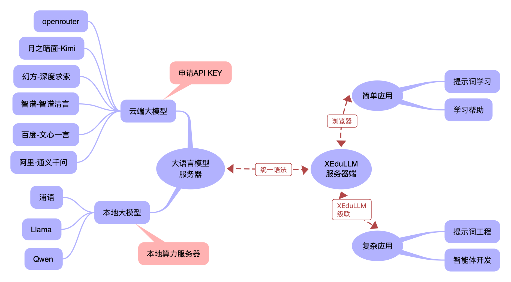

# 快速体验XEduLLM

[XEduLLM：让大模型进入中小学信息科技课[J].中国信息技术教育,2024,(15):89-91.](https://kns.cnki.net/kcms2/article/abstract?v=01ddXewXOSCM3qpKKQJvwcnlfWy6LSqIQOZE2fNNp3bjEH-Wzx9VbDO-aS3bmUS7jhfAu2f3LXTpJjw9G8gA_JmgRBOMCPs7NwQCKGzaC1Phk-SLR0PWDZ4oMlynPN-vAU1J3PrSWtiIGYz_rQSXxfRfQRkt4xNp&uniplatform=NZKPT)

## XEduLLM是什么？

XEduLLM是一个方便初学者应用各种大语言模型的模块，用统一的语法即可访问不同的大模型服务商，用简短的代码实现工作流并开发智能体应用。XEduLLM为中小学的教学场景做了优化，教师能够将个人的API Key“共享”给一个班级的学生使用，化解了学生因为不能带手机而无法使用大模型的尴尬。

XEduLLM的工作原理如图所示。XEduLLM使用统一语法访问不同的大模型，包括云端和本地服务。教师配置好大模型的信息（注册API-Key），即可连接大模型，启动服务。学生可以通过浏览器，学习各种提示词，体验大模型的能力，也可以直接通过教师的“学习助手”（使用特定的提示词）得到学习帮助。具备代码编写能力的学生还可以使用Python代码，用XEduLLM“级联”上层服务器，学习更加复杂的提示词工程，也可以通过工作流设计一个智能体。



XEduLLM的Client模块利用几行代码就可以创建一个新的Web服务，通过API调用各种优秀的大语言模型的能力。Web页面中将显示调用的是哪一个服务，提示词将发送到远程服务器处理，然后返回响应，实现与大语言模型交流的目的。


核心功能：大模型学生免登录

在课堂教学中，学生可以通过局域网访问的方式来进行体验。假设前面的程序运行在教师机上，并且学生机与教师机在同一个局域网内，学生就可以通过服务地址进行在线体验。整个过程学生无需注册登录，不同网页之间的聊天记录相互独立，互不干扰。

<iframe src="//player.bilibili.com/player.html?isOutside=true&aid=112994499431048&bvid=BV12tWsePEmA&cid=500001656107517&p=1" scrolling="no" border="0" frameborder="no" framespacing="0" allowfullscreen="true"></iframe>


## XEduLLM的安装和使用

### 安装方法

`pip install xedu-python -U`

库文件源代码可以从[PyPi](https://pypi.org/project/xedu-python/#files)下载，选择tar.gz格式下载，可用常见解压软件查看源码。

同时为了满足广大中小学教师的需求，上线了XEduLLM安装包版，下载方式见[安装说明](https://xedu.readthedocs.io/zh-cn/master/xedu_llm/installation.html#id3)。

### 创建本地大模型对话页面

XEduLLM提供了通用接口访问工具Client，使用这个工具我们可以几行代码通过API调用各种优秀的大语言模型，发送问题并获得响应，详细步骤如下。当然，如果直接使用XEduLLM安装包版，无需代码，即可实现，然而强烈建议先通过下文了解此过程及[XEduLLM的功能详解](https://xedu.readthedocs.io/zh-cn/master/xedu_llm/introduction.html)再使用XEduLLM安装包版。

#### 1.配置大模型服务器信息

一般来说，绝大多数的中小学都没有算力服务器，教师需要先申请大模型服务商的API。目前XEduLLM已经支持如下服务商：'openrouter', '月之暗面-Kimi', '幻方-深度求索', '智谱-智谱清言', '百度-文心一言', '阿里-通义千问'等。这些服务商都API价格都很便宜，有些还直接赠送了免费的额度。只要利用这些额度，就足够支撑好多节课的教学了。

下面以openrouter服务商提供的免费大语言模型提问为例：

**1）创建个人账号**

首先，进入[openrouter网页](https://openrouter.ai)（https://openrouter.ai ），创建一个openrouter帐户或登录。点击右上角个人头像-Keys-Create Key，命名密钥并获取密钥。

确保将密钥保存在安全的地方，不要随意与他人共享。


**2）将账号填入代码**

创建大模型对话页面，基础代码仅仅三行。参考如下：（直接复制代码运行会报错，需要更换自己的账号api_key）

```python
from XEdu.LLM import Client
chatbot = Client(provider='openrouter',
               api_key='sk-or-v1-6d7672a58c3c83……8241c0f30a3b1c3') # 引号内的密钥需要替换为自己的
chatbot.run()
```

#### 2.通过浏览器访问Web服务

运行代码后，将输出对应的ip地址。将地址复制到浏览器打开，即可看到像服务商提供的原生体验网页一样的对话界面。经过进一步的学习，你可以在此基础上做模型微调等好玩的事情，让模型更合你的心意。然后，就可以将这个链接分享给你的好伙伴一同体验，属于你独一无二的界面，同时，这个网址也可以用代码调用，直接嵌入应用程序使用。


3.通过代码调用大模型服务

前面我们已经生成了一个自己的模型对话网页，如果想把这个服务提供给其他应用或者其他学生使用（其他设备单独使用），快来试试下面的代码吧：
```python
from XEdu.LLM import Client
chatbot = Client(xedu_url='127.0.0.1:7860') # 引号内的网址替换为你前面生成的网址
res = chatbot.inference('请问上海有什么好吃的？')
print(res)
```
这段代码嵌入任何python应用中，就可以快速调用大模型的能力。如果这段代码需要部署在其他环境中（即不使用本地中转的Web服务），只需要修改Client的参数即可。因此在教学中使用非常方便。

下面是一些应用案例：

- 气象分析专家：根据传感器识别的气象数据，给出专业分析；
- 历史上的今天：根据日期回顾历史上这个日期发生的重要事迹；
- 阅读理解专家：通过OCR文字识别，将文本输入大模型，给出相关分析。

当我们安装好XEduLLM并导入库后，你就可以使用`Client.support_provider()`语句查看目前提供的大语言模型服务提供商。看看哪一个是你想要的，然后选择它！查看XEduLLM中目前提供的大语言模型服务提供商代码如下：

```python
from XEdu.LLM import Client # 导入库
print(chatbot.support_provider()) # 查看XEduLLM中目前提供的大语言模型服务提供商
print(chatbot.support_provider(lang = 'zh') ) # 查看XEduLLM中目前提供的大语言模型服务提供商中文名
```

输出结果：

```
['openrouter', 'moonshot', 'deepseek', 'glm', 'ernie', 'qwen']
['openrouter', '月之暗面-Kimi', '幻方-深度求索', '智谱-智谱清言', '百度-文心一言', '阿里-通义千问']
```

获取大语言模型API密钥的流程通常包括在各平台网页上进行用户注册，注册完成后获取相应的算力资源，详细步骤请参考<a href="https://xedu.readthedocs.io/zh-cn/master/xedu_llm/how_to_get_API_key.html">API与密钥获取</a>。


XEduLLM已增加一键启动本地模型的功能，及[XEduLLM安装包版](https://xedu.readthedocs.io/zh-cn/master/xedu_llm/installation.html#id3)，可前往体验。
