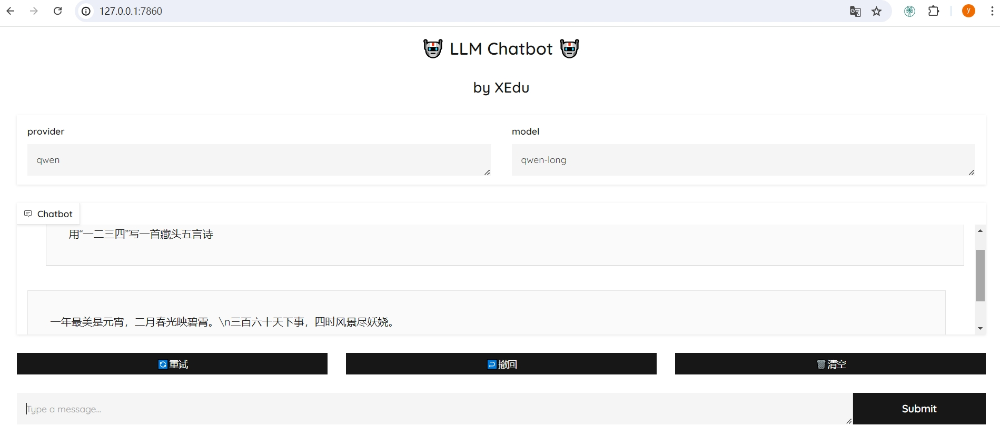

# 快速体验XEduLLM

## XEduLLM是什么？

XEduLLM是一个大语言模型工具库，为开发者提供了简便统一的方式来与大语言模型进行交互和微调。该工具库可以基于各类大语言模型API构建，未来也支持创作自己的语言模型。XEduLLM的出现让开发者可以便捷地在自己的应用程序中加入大模型对话的功能，特别是在教学场景中老师可以利用XEduLLM提供一个API“二次分发”能力。

XEduLLM的Client模块利用几行代码就可以通过API调用各种优秀的大语言模型。通过编程方式发送请求到模型所在的服务器，远程服务器会处理请求，并返回响应，实现与大语言模型交流的功能。




## XEduLLM的安装和使用

### 安装方法

`pip install xedu-python -U`

库文件源代码可以从[PyPi](https://pypi.org/project/xedu-python/#files)下载，选择tar.gz格式下载，可用常见解压软件查看源码。

### 创建自己的大模型对话页面

XEduLLM提供了通用接口访问工具Client，使用这个工具我们可以几行代码通过API调用各种优秀的大语言模型，发送问题并获得响应。

下面以openrouter服务商提供的免费大语言模型提问为例：

1.创建个人账号

首先，进入[openrouter网页](https://openrouter.ai)（https://openrouter.ai ），创建一个openrouter帐户或登录。点击右上角个人头像-Keys-Create Key，命名密钥并获取密钥。

确保将密钥保存在安全的地方，不要随意与他人共享。


2.将账号填入代码

创建大模型对话页面，参考代码如下：（直接复制代码运行会报错，需要更换自己的账号api_key）

```python
from XEdu.LLM import Client
chatbot = Client(provider='openrouter',
               api_key='sk-or-v1-6d7672a58c3c83……8241c0f30a3b1c3') # 引号内的密钥需要替换为自己的
chatbot.run()
```

3.打开网页尽情享受

运行代码后输出对应的ip地址，你将地址复制到浏览器打开，即可看到像服务商提供的原生体验网页一样的对话界面。经过进一步的学习，你可以在此基础上做模型微调等好玩的事情，让模型更合你的心意。然后，就可以将这个链接分享给你的好伙伴一同体验，属于你独一无二的界面，同时，这个网址也可以用代码调用，直接嵌入应用程序使用。


4.嵌入应用程序使用

前面我们已经生成了一个自己的模型对话网页，如果想把这个服务提供给其他应用使用（其他设备单独使用），快来试试下面的代码吧：
```python
from XEdu.LLM import Client
chatbot = Client(xedu_url='127.0.0.1:7860') # 引号内的网址替换为你前面生成的网址，就可以调用自己的模型，如果模型没有改动，则依然可以用provider参数
res = chatbot.inference('请问上海有什么好吃的？')
print(res)
```
这段代码可以嵌入任何python应用中，帮助你提升项目的可玩性。下面是一些应用案例：

- 气象分析专家：根据传感器识别的气象数据，给出专业分析；
- 历史上的今天：根据日期回顾历史上这个日期发生的重要事迹；
- 阅读理解专家：通过OCR文字识别，将文本输入大模型，给出相关分析。

除了openrouter服务商，XEduLLM允许用户使用统一的语法向不同的大模型提问。当我们安装好XEduLLM并导入库后，你就可以使用`Client.support_provider()`语句查看目前提供的大语言模型服务提供商。看看哪一个是你想要的，然后选择它！查看XEduLLM中目前提供的大语言模型服务提供商代码如下：

```python
from XEdu.LLM import Client # 导入库
print(chatbot.support_provider()) # 查看XEduLLM中目前提供的大语言模型服务提供商
print(chatbot.support_provider(lang = 'zh') ) # 查看XEduLLM中目前提供的大语言模型服务提供商中文名
```

输出结果：

```
['openrouter', 'moonshot', 'deepseek', 'glm', 'ernie', 'qwen']
['openrouter', '月之暗面-Kimi', '幻方-深度求索', '智谱-智谱清言', '百度-文心一言', '阿里-通义千问']
```

获取大语言模型API密钥的流程通常包括在各平台网页上进行用户注册，注册完成后获取相应的算力资源，详细步骤请参考<a href="https://xedu.readthedocs.io/zh-cn/master/xedu_llm/how_to_get_API_key.html">API与密钥获取</a>。
